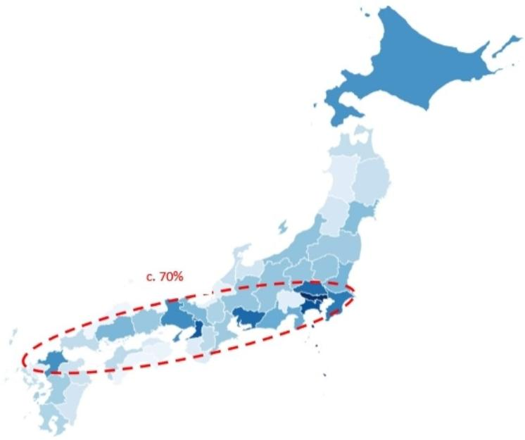
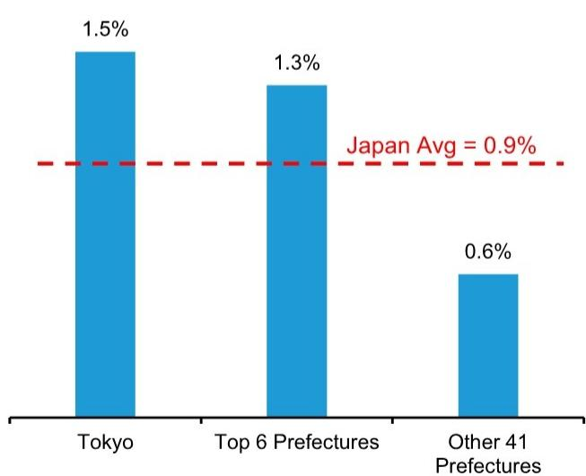
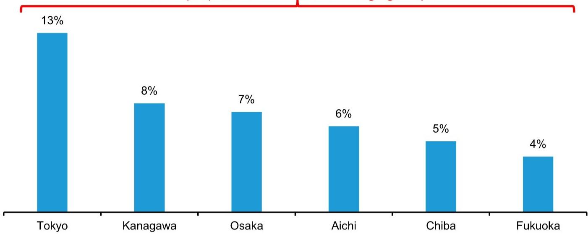
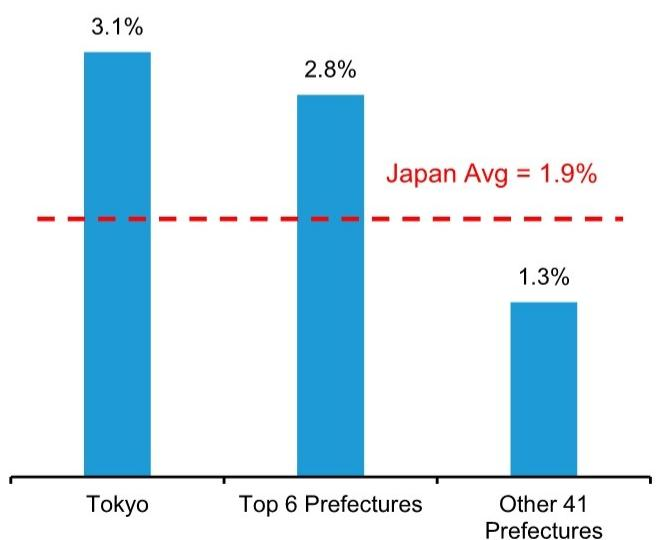
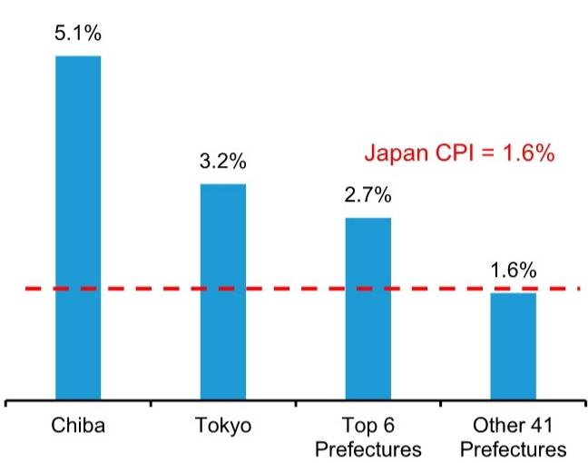
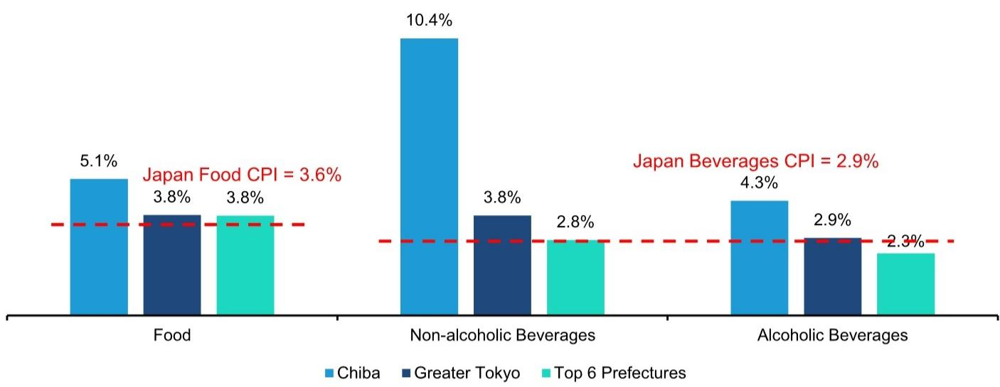
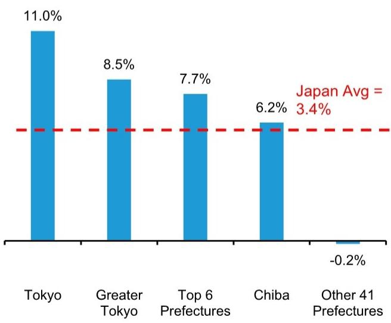
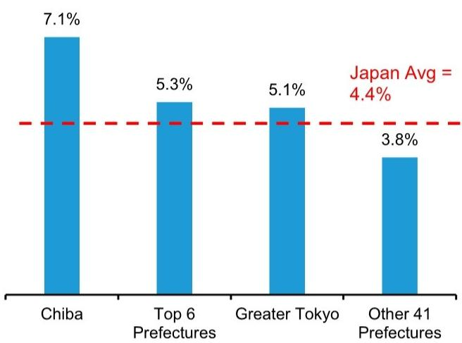
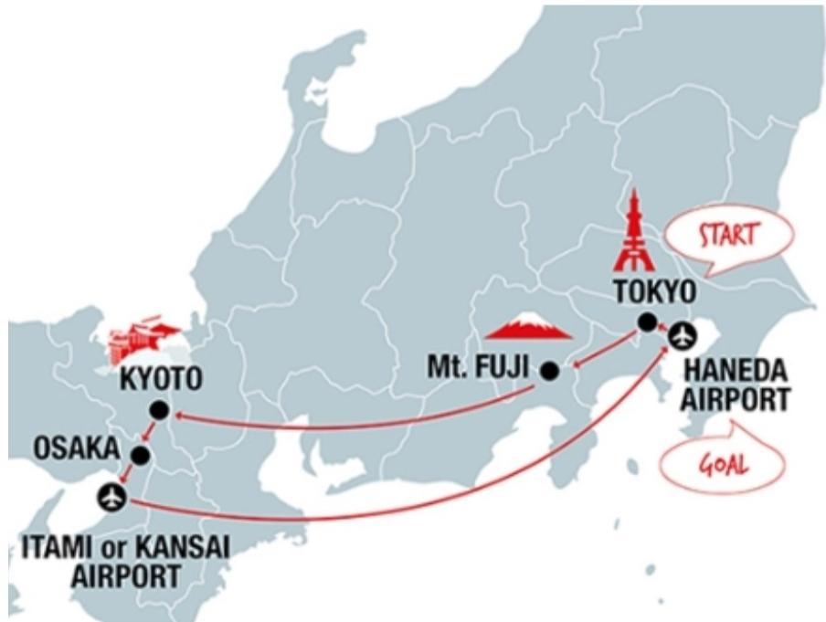

# 周末消费观察：日本，区域市场的管理启示

## 区域选择：消费策略的基础

区域选择是消费品策略的重要基础。日本各区域差异显著，为市场管理者提供了丰富的观察样本。

虽然许多消费品管理者将日本的47个都道府县一视同仁，但那些愿意进行差异化分析的人会发现，只需聚焦六个核心区域，就能有效参与这个与韩国市场规模相当的市场。

采取这种精准区域选择策略的品牌，其消费支出增速可比其他地区高出约30%。

**图表1：日本约70%的人口居住在从东京到福冈的狭长地带**

数据截至2024年10月
来源：日本统计局，Bernstein分析

日本约70%的人口（约8700万人）居住在从东京到福冈的狭长地带。虽然日本其他地区风景优美，但人口稀少、老龄化加速，经济活动相对有限。

在这条人口密集带上，有六个都道府县尤为突出。东京都、千叶县和神奈川县形成了东部消费集群，拥有3700万消费者。大阪府位于日本中部，与爱知县相邻，合计人口1600万。福冈县则位于日本西端，构成了这个椭圆区域的另一端。

这些区域合计占日本劳动年龄人口的44%，是日本消费经济的重要引擎。

**图表2：东京都家庭数量以1.5%的年复合增长率增长，六大区域为1.3%，其余41个都道府县为0.6%**

日本家庭数量增长年复合增长率（2019-2024年）

六大区域：东京都、千叶县、神奈川县、爱知县、大阪府、福冈县
来源：日本统计局，Bernstein分析

**图表3：日本44%的劳动年龄人口居住在六个核心区域，构成日本消费经济的重要引擎**

六大区域劳动年龄人口占全国比例
3000万人，占全国劳动年龄人口的44%

来源：日本统计局，Bernstein分析

**图表4：六大区域的收入增长也显著领先，2019-2024年年复合增长率为2.8%，其余地区为1.3%，东京都表现突出，达3.1%**

这六个区域的家庭数量在2019-2024年间以1.3%的年复合增长率增长，是其余41个都道府县0.6%的两倍多。

这些区域的收入增长也显著领先，2019-2024年年复合增长率为2.8%，其余地区为1.3%。东京都表现突出，达3.1%。

在消费方面，千叶县的表现尤为亮眼，其5.1%的年复合增长率明显超过东京都的3.2%、六大区域平均的2.7%和其余地区的1.6%。

日本收入增长年复合增长率（2019-2024年）

六大区域：东京都、千叶县、神奈川县、爱知县、大阪府、福冈县
来源：日本统计局，Bernstein分析

千叶县以海滩和冲浪闻名，氛围比东京都更为轻松。该县吸引了更多年轻居民，他们常通勤至东京都工作。同时，入境旅游也为千叶县带来活力，游客前往迪士尼乐园和徒步路线。

**图表5：千叶县消费支出以5.1%的年复合增长率领先，明显超过东京都的3.2%、六大区域平均的2.7%和其余地区的1.6%**

日本消费支出增长年复合增长率（2019-2024年）

六大区域：东京都、千叶县、神奈川县、爱知县、大阪府、福冈县
来源：日本统计局，Bernstein分析

千叶县居民在饮食消费上表现活跃。自2019年以来，非酒精饮料支出以10.4%的年复合增长率增长，几乎是六大区域平均水平的4倍。酒精饮料支出以4.3%的年复合增长率增长，是平均水平的1.9倍。食品支出以5.1%的年复合增长率增长，比平均水平快30%。

**图表6：千叶县食品饮料支出增长明显快于六大区域平均水平**
日本食品饮料支出增长年复合增长率（2019-2024年）

大东京区域：东京都、千叶县、神奈川县、埼玉县；六大区域：东京都、千叶县、神奈川县、爱知县、大阪府、福冈县
来源：日本统计局，Bernstein分析

**图表7：东京都外出就餐支出以11%的年复合增长率增长，六大区域平均为7.7%，其余41个都道府县为-0.2%**

在千叶县之外，其他区域的食品饮料消费支出增长与CPI基本一致。

外出就餐方面，东京都表现突出。东京都外出就餐支出以11%的年复合增长率增长，六大区域平均为7.7%，其余41个都道府县为-0.2%。

这一增长可能受益于旅游业，部分反映了外国游客沿着"黄金路线"从东京经富士山/箱根、名古屋、京都到大阪的旅行热情。

日本外出就餐支出增长年复合增长率（2019-2024年）

大东京区域：东京都、千叶县、神奈川县、埼玉县；六大区域：东京都、千叶县、神奈川县、爱知县、大阪府、福冈县
来源：日本统计局，Bernstein分析

基于东京都外出就餐的普及，化妆品和个人护理支出增长也可能表现较好。虽然5.1%的年复合增长率相对于全国平均的4.4%已属可观，但千叶县居民在个人形象方面的支出更为突出，自2019年以来以7.1%的年复合增长率增长。

**图表8：化妆品和个人护理支出方面，大东京区域5.1%的年复合增长率明显高于其他地区的3.8%，千叶县再次以7.1%领先**

日本个人护理和化妆品支出增长年复合增长率（2019-2024年）

大东京区域：东京都、千叶县、神奈川县、埼玉县；六大区域：东京都、千叶县、神奈川县、爱知县、大阪府、福冈县
来源：日本统计局，Bernstein分析

**图表9：旅游业仍高度集中在日本的"黄金路线"**

来源：日本国家旅游局网站

---

*本文为研究笔记，仅供学习参考。*
