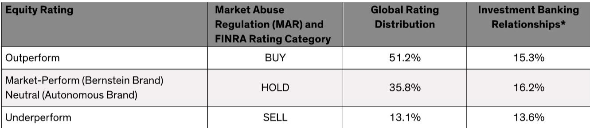

# Bernstein：日本消费市场真相，一条黄金走廊贡献七成增长

多数全球消费品公司高管对待日本市场的47个都道府县，态度像对待自己的孩子——每个都爱得一样深。但Bernstein一份最新研报给出了一个反常识的判断：日本消费市场的增长动力，并非均匀分布，而是高度集中在一条狭长地带上的六个县。愿意做出取舍的公司，可以在一个与韩国规模相当的市场里，获得比竞争对手快约30%的消费支出增长。

这份报告的核心洞察，不是日本宏观环境整体在变好或变坏，而是“在哪里竞争”这个战略选择，正在成为消费品公司成败的分水岭。日本人口结构的深层分化，已经让“全国一盘棋”的打法失效。对于试图理解日本消费真相的决策者而言，忽视地理维度的差异，代价正变得越来越大。

## 1. 从东京到福冈的“黄金走廊”才是真正的日本市场

报告指出，约70%的日本人口（约8700万人）居住在东起东京、西至福冈的一条狭窄带状区域。这条“走廊”之外的地区，虽然风景优美，但人口稀疏、老龄化加速、宏观环境活动持续调整。

真正值得关注的，是这条走廊上的六个核心县：东京、千叶、神奈川、爱知、大阪和福冈。它们构成了日本消费宏观环境的引擎。这六个县聚集了日本44%的劳动年龄人口（约3000万人），家庭数量增速（2019-2024年复合增长率1.3%）是其余41个县的两倍多。收入增长同样分化：六个核心县收入复合增长率为2.8%，而其余地区仅为1.3%。

> **KC评论：** 这张图的价值不在于告诉你东京很重要，而在于它量化了“集中度”。对于任何打算在日本做渠道铺货、营销投放或新品测试的团队，把资源从47个县缩减到6个，理论上可以覆盖近一半的购买力，同时避免在调整市场里做无效投入。报告里的展品1-4提供了精确的地域分布数据，值得细看。

## 2. 千叶县是消费增长的“意外明星”

在六个核心县中，表现最亮眼的并非东京，而是常被低估的千叶县。报告数据显示，千叶县的消费支出复合增长率达到5.1%，显著高于东京的3.2%和六个县平均的2.7%，更是其他地区1.6%增速的三倍以上。

千叶的增长逻辑清晰且具解释力：它吸引了大量在东京工作的年轻通勤者，同时受益于入境旅游（迪士尼乐园和徒步路线是主要驱动力）。具体到品类，千叶人在非酒精饮料上的支出增速（10.4%）是六个县平均的近四倍；在酒精饮料上增速（4.3%）是平均的近两倍；在食品上的增速（5.1%）比平均快30%。而在个人护理和化妆品领域，千叶的支出增速（7.1%）同样领跑。

这揭示了一个被许多宏观报告忽略的微观事实：日本消费增长的“毛细血管”不在银座或涩谷，而在通勤圈内的新兴居住区。这些区域的居民收入不低、消费意愿强、且对便捷和体验型消费有更高需求。

## 3. 东京的餐饮与旅游红利，以及报告没有完全回答的问题

东京并非在所有维度上都落后。在外出就餐领域，东京的支出复合增长率高达11%，六个县平均为7.7%，而其余41个县竟然为-0.2%。报告指出，这背后是入境旅游沿着“黄金路线”（东京-箱根/富士山-名古屋-京都-大阪）的强力拉动。

但这份报告也留下了一些值得追问的缺口。例如，千叶的消费增长在多大程度上是可复制的？它是否过度依赖特定的人口流入和旅游热点？报告展示了千叶在食品饮料和个护品类的亮眼数据，但并未深入分析这些增长背后的渠道结构变化（如便利店、折扣店、电商的渗透率差异）。对于希望据此制定策略的读者，这些细节恰恰是决定落地效果的关键。

> **KC评论：** Bernstein这份报告的价值在于提供了一个清晰的“Where to Play”框架。但它刻意没有回答“How to Win”。千叶的增长模式能否被其他县复制？东京的外出就餐高增长是否可持续（若旅游退潮）？这些未解问题，恰恰是完整报告里更精细的消费行为数据可以回答的。读者不应止步于“六个县”这个结论，而应进一步追问：在每个县内部，增长的品类和渠道到底是什么。

## 4. 对消费品决策者的观察框架

这份报告的实际意义，不在于给出一个研究交流，而在于提供一套可操作的筛选标准。对于任何关注日本市场的消费品公司，以下三个问题值得纳入年度战略复盘：

第一，你的资源分配是否与人口和收入增长的地理分布一致？如果公司在41个低增长县的投入占比过高，可能需要重新审视。

第二，你是否针对“千叶型”市场设计了差异化的产品组合和渠道策略？这些快速增长的县，其消费偏好（如对饮料、个护的高增速）可能与全国平均水平显著不同。

第三，你是否真正理解了“黄金路线”旅游红利对餐饮和体验消费的拉动机制？这种拉动是暂时的还是结构性的，将决定品牌是应该加大投入还是保持谨慎。

日本市场的分化，不是周期性的波动，而是人口结构变化的长期结果。忽视这一点的公司，可能会在越来越昂贵的全国性铺货中，错失真正增长的局部市场。

For informational purposes only. Portions may be generated,translated,summarized,or edited with AI assistance based on source materials and may contain omissions or errors. Please verify independently. This is not investment,legal,tax,accounting,or other professional advice.

For informational purposes only. Portions may be generated,translated,summarized,or edited with AI assistance based on source materials and may contain omissions or errors. Please verify independently. This is not investment,legal,tax,accounting,or other professional advice.

