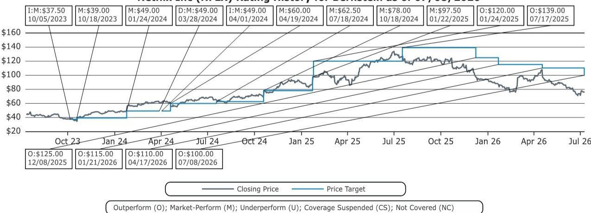
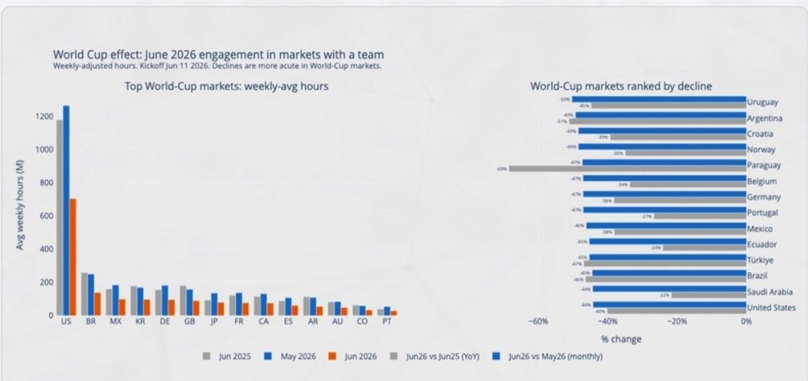
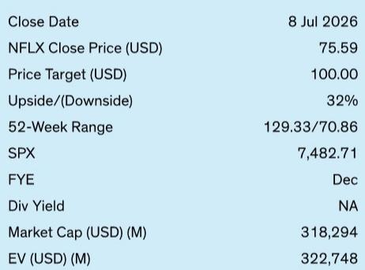

# Netflix's Engagement Engine Is Slowing: The World Cup Exposed Why 2H26 Revenue Targets Depend on Advertising, Not Content

The streaming giant's first half of 2026 has revealed a structural vulnerability that goes deeper than a single sporting event. Netflix's engagement hours for the first half of the year are tracking below 96 billion, landing in a no-growth zone between a weak 1H25 and a strong 2H25. This flatness is not merely seasonal noise. It is a signal that the company's core growth engine—subscriber acquisition driven by must-watch content—is losing torque precisely when the 2026 revenue guidance assumes acceleration.

The World Cup provided the clearest stress test yet of Netflix's ability to hold attention against live-event competition. Unlike the typical spring-to-summer engagement upswing, Netflix saw hours decline steadily through Q2 and then drop sharply into June as the expanded 48-team tournament pulled eyeballs away. This was not a one-quarter blip. The pattern reveals something more fundamental: Netflix's engagement is becoming more elastic to external events, which means its content moat is narrower than the market previously priced.

The implications for full-year guidance are direct and uncomfortable. The top end of Netflix's 12-14% revenue growth guidance implicitly assumes roughly 20 million net adds for the year, alongside the March price increases and approximately $3 billion in advertising revenue. After a first half that delivered only 3-4 million net adds, the required second-half reacceleration is steep. And the content slate for 2H26—headlined by returning seasons of Lupin, Emily in Paris, and Avatar: The Last Airbender—screens weaker on projected engagement than the franchise hits that powered 2H25 and 2H24.

This is not a call to abandon the thesis. Netflix remains the clear engagement leader at roughly 51 hours per subscriber per month versus Disney's 13 hours. But the trajectory matters more than the level. And the trajectory says that the next leg of growth will depend less on subscriber momentum and more on how quickly advertising revenue can fill the gap left by a content cycle that has not yet produced its next breakout.

## The World Cup Was Not the Problem; It Was the Diagnostic

The most important insight from Q2 is not that the World Cup hurt Netflix engagement. It is that Netflix engagement now bends to live events in ways that break long-standing seasonal patterns. Historically, streaming engagement rises in summer as school schedules shift. In June 2026, the opposite happened. Weekly hours watched fell below 3.6 billion, a level that would normally signal a weak content slate rather than external competition.

This pattern matters because it validates the strategic pivot Netflix has already begun. The company's reported interest in 2030 World Cup rights is not a defensive move. It is an acknowledgment that live sports and event programming provide the one type of content that does not suffer from the engagement decay affecting everything else in the library. Scripted series, even hit franchises, follow a predictable curve: each new season lands below the prior one. Live events, by contrast, offer non-substitutable appointment viewing that resets the engagement baseline every cycle.

The question the report leaves open is whether Netflix can afford to compete for top-tier sports rights at scale. The company's content spend is already rising, and the economics of sports rights are structurally different from original programming. Acquiring the World Cup would mean committing billions to a single quadrennial event that drives engagement in concentrated bursts rather than sustaining daily viewing. That is a very different capital allocation problem from financing a season of Stranger Things.

## Subscriber Growth Is Becoming a Function of Content Catalysts That Are Not Arriving in 2H26

The arithmetic of Netflix's 2026 guidance is unforgiving. With 3-4 million net adds in the first half, the company needs roughly 16-18 million in the second half to hit the high end of the implied subscriber target. That would require a reacceleration that no data point in the report supports.

The 2H26 content slate is the clearest evidence. Comparing projected first-90-day views for the coming lineup against the prior-year equivalents reveals a meaningful gap. The returning seasons that drove 2H25—Wednesday, Stranger Things, Squid Game—were cultural events with multi-generational reach. The 2H26 slate, while not weak on its own terms, lacks that tentpole gravity. Lupin is a strong regional franchise. Emily in Paris has a dedicated but narrower audience. Avatar: The Last Airbender is a known property but not a proven engagement driver at the scale of the top-tier hits.

This does not mean Netflix cannot grow in 2H26. It means the growth will need to come from non-content levers: price increases, advertising revenue, and the continued benefit of the password-sharing crackdown that is now largely annualized. The crackdown was a one-time structural catalyst. Price increases work incrementally but face elasticity limits. That leaves advertising as the swing factor.

The report estimates approximately $3 billion in advertising revenue embedded in the 2026 guidance. Reaching that number, or exceeding it, would require ad-tier subscriber growth and yield improvements that are not yet visible in the public data. The advertising business is still young, and its contribution to revenue is more sensitive to macro advertising cycles and platform execution than to content hits. That is both an opportunity and a risk.

## Engagement Per Subscriber Is Flat, and That Changes the Research Calculus

Netflix leads the industry in total engagement hours, but the per-subscriber trend has been roughly flat to slightly declining for several years. That flatness is not a crisis. It is a structural reality that forces the company to spend more on content just to maintain current engagement levels, let alone grow them.

The data on library content decay is particularly revealing. Library titles now account for roughly 63% of total hours, up from about 50% in early 2023. But successive additions of library content are decaying faster than prior cohorts. Each new batch of licensed or owned content drives engagement for a shorter period, which means Netflix must add more volume just to keep library hours stable. This is a treadmill, not a flywheel.

Returning seasons, while predictable and reliable, face their own erosion. Data across recent franchise sequels consistently shows new seasons landing below the predecessor's first-90-day engagement. This is not a Netflix-specific problem. It is the natural arc of serialized entertainment. But it means that the company's reliance on returning seasons—which make up the majority of the 2026 TV slate—will deliver diminishing returns per dollar spent.

International content, once a cost-effective lever, is also becoming more expensive. As non-English titles prove they can travel across markets, licensing costs rise. The "cheap international content" strategy that helped Netflix scale in earlier years is converging toward the cost structure of domestic production. The margin advantage is shrinking.

## The Report Does Not Fully Answer Whether Advertising Can Scale Fast Enough to Offset Content Cycle Risk

The most important unresolved question is whether Netflix's advertising business can grow from roughly $3 billion in 2026 toward a materially larger contribution in 2027-2028 without a step-change in ad-tier subscriber penetration or yield. The report provides the revenue target but does not break down the assumptions behind it.

The question matters because advertising revenue has different economics than subscription revenue. It is more cyclical, more dependent on measurement and targeting infrastructure, and more exposed to competition from YouTube, Amazon, and connected TV platforms that are also scaling their ad businesses. Netflix has advantages in premium inventory and engaged audiences, but it is entering a market with established players and sophisticated buyers.

The second-order implication is that Netflix's valuation multiple may need to reflect a different mix of revenue streams. If advertising becomes a larger share of total revenue, the appropriate valuation framework shifts from a subscriber-growth multiple toward a media-and-advertising multiple. That could compress or expand the multiple depending on how the market prices advertising versus subscription cash flows. The report does not explore this valuation transition, but it is the logical next question for long-term holders.

## A Decision Framework for Evaluating Netflix's Next 12 Months

For those trying to position around the Q2 data and the 2H26 outlook, the analytical task is to separate what is cyclical from what is structural. The following framework organizes the key variables.

First, assess the content cycle independently of the World Cup effect. The 2H26 slate may not match 2H25, but that comparison is distorted by the exceptional strength of last year's lineup. The relevant benchmark is not the prior year's peak but the long-term average engagement per title. If the 2H26 slate delivers engagement in line with the 2023-2024 average, then the subscriber shortfall is manageable.

Second, monitor advertising revenue trajectory as the primary swing factor. The $3 billion target is the difference between hitting the high end and the low end of revenue guidance. The key leading indicators are ad-tier subscriber growth, average revenue per ad subscriber, and advertiser commitment data from upfront negotiations. Any signal that ad revenue is tracking above or below the embedded assumption will have outsized impact on the stock.

Third, watch for content cost inflation trends. The report shows that returning seasons are getting more expensive and international content is losing its cost advantage. If content spend growth outpaces revenue growth in 2027, margin expansion slows. The key metric is content amortization as a percentage of revenue, which the report's financial forecasts show improving modestly but not dramatically.

Fourth, evaluate the live sports strategy as a long-term structural hedge. The World Cup data proves that live events can disrupt Netflix's engagement baseline. The logical response is to own those events rather than compete against them. The 2030 World Cup rights negotiations will be a signal of how seriously Netflix is committing to this strategy and at what cost.

## Join the Community to Read the Full Report and Review the Original Charts

The analysis above only scratches the surface of the engagement data, content decay curves, and financial projections embedded in the full report. The original exhibits—including the weekly hours trend, country-level World Cup impact, and library decay analysis—contain granular insights that are impossible to convey in summary form. Subscribers to the full research platform can access the complete deck, the replay of the expert webinar, and the ongoing model updates that track these variables in real time. Join the community to read the full report and review the original charts.

*For informational purposes only. Portions may be generated, translated, summarized, or edited with AI assistance based on source materials and may contain omissions or errors. Please verify independently. This is not professional advice.*

For informational purposes only. Portions may be generated, translated, summarized, or edited with AI assistance based on source materials and may contain omissions or errors. Please verify independently. This is not professional advice.

