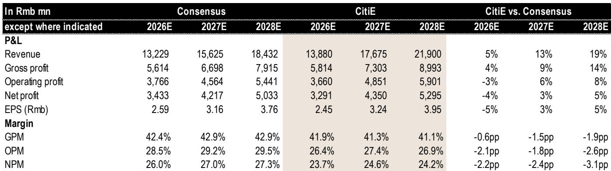
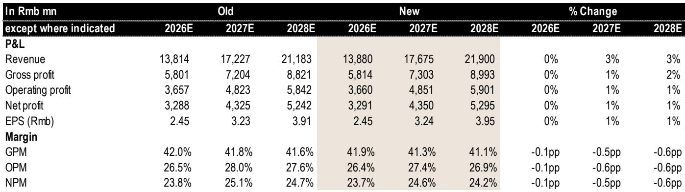
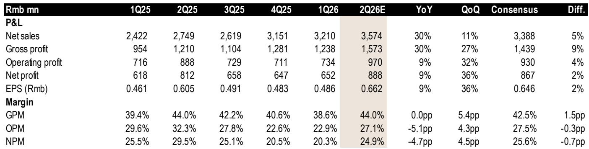

# Citi：人形机器人产量预估从千台到20万台，恒立液压的供应链角色待验证

一份来自Citi的最新报告，把市场目光重新拉回到一家中国液压件制造商身上。核心判断不是关于挖掘机，而是人形机器人。报告指出，恒立液压正在为其美国客户批量供应行星滚柱丝杠，以支持每周约100台人形机器人的生产。这个数字在2026年三季度和四季度可能分别跃升至约1000台和约1.9万台，2027年更可能达到20万台。

这意味着，恒立的人形机器人业务收入占比，将从2026年的约1%急速攀升至2027年的约8%。对于一家以工程机械液压件为核心业务的公司，这个结构性变化值得认真对待。报告同时提示，2026年二季度公司可能因汇率波动产生约2亿元人民币的汇兑损失，但这被Citi视为可以利用的窗口。

## 1. 核心业务仍强劲，但汇率波动正在制造短期噪音

报告预计，恒立2026年二季度营收将同比增长约30%，主要受挖掘机部件需求拉动。毛利率预计维持在44%左右，与去年同期持平。墨西哥工厂和滚珠丝杠及直线导轨工厂在规模化前，仍对整体毛利率形成轻微影响。

净利润预计为8.88亿元人民币，同比仅增长约9%。增速远低于营收的原因，是约2亿元的汇兑损失——而2025年同期还有约2600万元的汇兑收益。Citi认为，这部分损失是短期资金流动和汇率波动所致，并不反映经营基本面。

> **KC评论：** 汇兑损失是这家公司近年来常见的“季度噪音”。读者真正需要关注的，是核心业务的毛利率趋势和人形机器人业务的放量节奏。报告中的图4（财务成本与美元兑人民币汇率关系）值得细看，它揭示了恒立对汇率波动的暴露程度。

## 2. 竞争格局正在发生有利于恒立的转移

报告提到一个容易被忽视的结构性变化：下游主机厂整合已经结束，但零部件制造商的市场份额洗牌仍在进行。Citi在2024年就指出，川崎重工通过与艾迪精密成立合资公司，正在逐步退出中国工程机械部件市场。这为恒立留出了市场份额空间。

报告中的图7（恒立挖掘机油缸产量与中国挖掘机总出货量同比变化）进一步印证了这个判断——恒立的增速正在持续跑赢行业整体。这不是简单的贝塔，而是阿尔法。

## 3. 人形机器人业务：从期权到收入的转折点

这是报告最核心的增量信息。恒立通过收购欧洲领先轴承公司的线性运动研发团队，结合自身在滚珠丝杠和直线导轨领域的积累，已经具备了向美国头部人形机器人公司供货的能力。目前主要产品是行星滚柱丝杠，同时也在争取微型电机和微型丝杠订单。

Citi基于供应链调研给出的产量预估是：2026年三季度约1000台，四季度约1.9万台，2027年达20万台。如果这一路径成立，恒立的人形机器人业务收入将从2026年的约1%跃升至2027年的约8%。报告中的图5和图6分别展示了产量预估和收入占比变化，是理解这一逻辑的关键。

> **KC评论：** 20万台的产量假设是否过于乐观？报告本身没有完全展开论证。读者需要关注的是：恒立目前每周100台的供应量是否稳定，以及美国客户的实际订单能见度。图5中的产量预估来自供应链调研，而非客户官方指引，这是一个需要自己判断的不确定性点。

## 4. 报告尚未完全回答的关键问题

尽管报告给出了清晰的增长路径，但有几个问题值得进一步追问。第一，恒立在微型电机和微型丝杠领域的竞争力如何？报告提到公司正在争取相关订单，但没有给出具体进展或技术对比。第二，人形机器人业务的利润率是否高于核心液压业务？如果毛利率更低，那么8%的收入占比对利润的贡献可能有限。第三，墨西哥工厂的投产进度和成本控制能力，将如何影响2026-2027年的整体毛利率？报告只是提示了谨慎影响，但未给出量化评估。

对于产业决策者来说，恒立的案例提供了一个观察窗口：一家传统制造企业如何通过技术积累和产业链整合，切入新兴赛道。对于关注产业链变化的研究者，报告中的竞争格局分析（图7）和机器人业务拆解（图5、图6）是值得反复研读的部分。

For informational purposes only. Portions may be generated,translated,summarized,or edited with AI assistance based on source materials and may contain omissions or errors. Please verify independently. This is not investment,legal,tax,accounting,or other professional advice.

For informational purposes only. Portions may be generated,translated,summarized,or edited with AI assistance based on source materials and may contain omissions or errors. Please verify independently. This is not investment,legal,tax,accounting,or other professional advice.

