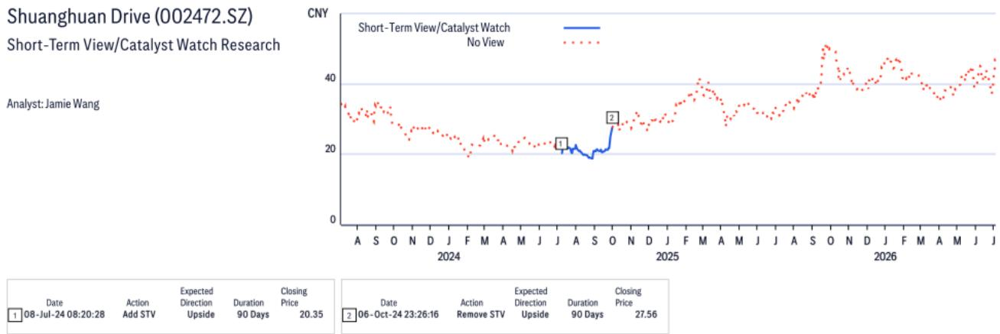
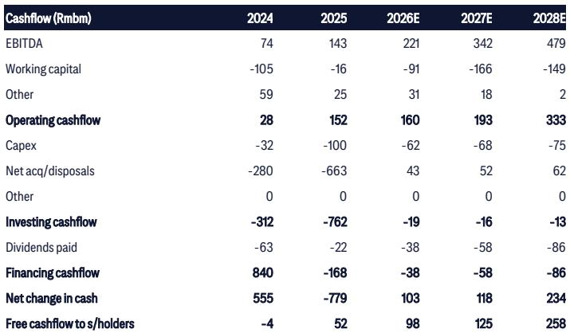
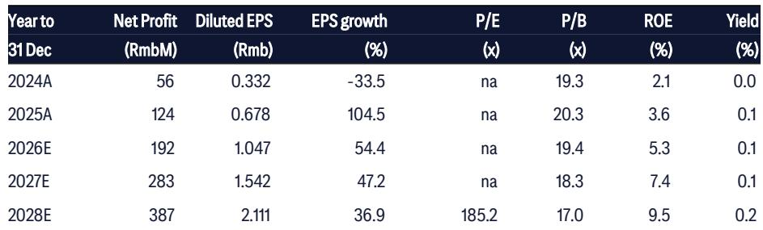

# 从工业机器人到人形机器人：一家精密制造企业的战略转型

一家精密工程公司最重要的战略决策，不是选择制造什么零件，而是选择加入谁的供应链。一家中国谐波减速器与精密运动部件制造商已经做出了选择。该公司正系统性地将业务重心从工业机器人市场——它曾在那里力争成为国内龙头企业的最大供应商——转向人形机器人供应链，并与全球工业巨头建立合资企业，将自己定位为可能一年内实现十倍产能扩张的关键推动者。这不是多元化布局，而是对公司竞争身份和可触达市场的根本性重新定义。

这一论点直截了当，但其影响却并不简单。根据一份全球研究机构的报告，该公司来自人形机器人的收入预计将从2025年约占销售额的20%上升到2026年的40%至50%。这一转变意味着总营收在两年内可能增长近三倍，从2025年的5.71亿元人民币增至2026年预估的9.8亿元。背后的驱动力并非自动化需求的普遍复苏，而是一个具体的、客户驱动的生产计划：一家主要的美国人形机器人制造商预计将在2026年第三季度将产量从约1000台提升至第四季度的约19000台，而中国供应商预计到2027年将进一步增长十倍，达到20万台。如果这些数据得以实现，这家公司将有效地将其增长轨迹与自智能手机以来扩展最快的硬件平台绑定。

但更有趣的问题是，这一转型揭示了精密制造领域的竞争结构。这家公司并非简单地增加一条产品线，而是在改变其业务逻辑——从以产量驱动的工业零部件供应商，转变为一个新兴生态系统中的战略合作伙伴。在这个生态系统中，设计复杂性、客户集中度和合资企业治理创造了完全不同的风险与回报特征。用传统工业指标来评估这家公司的人，将无法抓住要点。真正的分析挑战在于理解这家公司正在成为什么，而不是它曾经是什么。

## 合资企业战略揭示的是对供应链架构的精心布局，而非单纯的零部件销售

该公司在2026年宣布的两家合资企业，是其战略意图最清晰的信号。2月，该公司与敏实集团在美国成立了一家人形机器人合资企业。7月，它与斯凯孚在中国成立了一家人形机器人精密部件合资企业。这些并非普通的供应商协议，而是基于股权的承诺，锁定了新兴人形机器人供应链中两个最重要节点的技术开发、产能和客户渠道。

与斯凯孚的合资企业尤其具有启发性。斯凯孚是轴承技术的全球领导者，该合资企业将生产一系列专为人形机器人设计的轴承：用于髋关节和肩关节的交叉滚子轴承、用于谐波减速器柔轮的柔性轴承，以及四点接触球轴承等。根据报告，单台人形机器人可能使用60至70个轴承单元，根据设计不同，占机器人物料清单的5%至15%。通过与斯凯孚合作，该公司获得了世界级的轴承工程和制造能力，这是它在有竞争力的时间表内无法内部复制的。作为回报，斯凯孚获得了进入中国人形机器人供应链的渠道，以及一个与最重要潜在客户已有关系的合作伙伴。

这是一个在企业层面执行的经典的“制造还是购买”决策。该公司选择通过合资企业获取关键的互补技术，而不是自行建造，同时保留对系统集成和客户关系的控制。这一战略逻辑是合理的：人形机器人市场发展如此迅速，垂直整合将过于缓慢且风险过高。合资企业结构使该公司能够参与价值链，而无需承担全部技术开发成本或全部需求不确定性风险。但这也意味着，公司未来的盈利能力将取决于其有效管理这些合作关系的能力，包括应对知识产权、生产分配和利润分享方面的潜在冲突。

## 美国客户的生产爬坡创造了定义研究前景的二元结果

该公司近期前景中最重要的单一变量是其潜在美国客户——普遍被认为是特斯拉Optimus——的生产爬坡。报告显示，产量可能在2026年第三季度达到约1000台，第四季度达到约19000台，这一时间表比之前的行业调查稍晚，但规模仍然惊人。更重要的是，中国供应商估计，如果美国客户在2026年达到2万台，产量可能在2027年增长十倍，达到约20万台。

对于一个三年前还没有商业产量的硬件产品来说，这些数字是惊人的。20万台的产量将使机器人本身成为一个有意义的工业类别，可与电动汽车或工业无人机的早期产量相媲美。对于该公司而言，影响是直接的：如果爬坡实现，根据每台机器人内容量的合理假设，其人形机器人收入可能从2025年的约2亿元人民币增长到2026年的近5亿元，并在2027年可能超过10亿元。

但爬坡并非板上钉钉。报告明确指出，时间表比之前的预期稍晚，这表明客户在扩大生产规模时面临了工程或供应链方面的挑战。进一步的延迟或产量目标的削减，将直接影响该公司的收入轨迹，并可能压缩其估值倍数——报告将其设定为2027年预估收益的322倍。仅凭该公司的工业机器人业务无法支撑这一倍数。这是一个机器人溢价，它取决于美国客户能否按计划生产。

这造成了一个令人不安的分析现实：对该公司而言，在很大程度上，这是一个对单一客户运营执行的押注。随着时间的推移，客户和应用场景的多元化将会出现，但在2026年和2027年，该公司的命运与一家美国制造商的产能紧密相连。观察者需要评估的不仅是机器人的需求论点，还有该客户爬坡计划的具体执行风险。

## 退出工业机器人市场是深思熟虑的战略选择，而非疲弱的信号

很容易将该公司从工业机器人市场的转移误解为竞争压力下的撤退。报告指出，该公司已不再是国内最大工业机器人制造商埃斯顿的最大谐波减速器供应商，现在它瞄准的是“四大”全球机器人制造商和对价格不那么敏感的客户。这听起来像是市场份额的丧失。实际上，这是资源的战略性重新配置。

中国的工业机器人减速器市场已经变得商品化。国内竞争对手增加了产能，价格竞争压缩了利润率。该公司的毛利率从2024年的37.5%下降到2025年的36.9%，报告预计在2026年将进一步压缩至35.4%，之后才会温和回升。在这种环境下，成为对价格敏感的国内客户的最大供应商并不一定有利可图。通过退出这一细分市场，该公司为机器人机会腾出了工程能力、生产能力和管理注意力，而在这个领域，利润率可能更高，竞争目前也有限。

这是一个战略聚焦的教科书式案例。该公司选择在其拥有差异化能力、且客户重视精度和可靠性而非价格的领域竞争。“四大”全球机器人制造商——包括发那科、ABB、库卡和安川电机——规格要求苛刻，并愿意为质量付费。通过服务他们，该公司在维持工业机器人收入的同时改善了利润率状况，并建立了可能对机器人应用也相关的合作关系。

战略问题在于这种撤退是否可持续。如果中国的工业机器人市场继续增长，并且国内竞争对手利用其规模来提升精度和质量，该公司可能会发现自己被夹在低成本国内供应商和高端全球供应商之间。向机器人的转型可能不仅是一个机会，更是一种必要。

## 报告未完全回答的问题：合资企业模式的治理与竞争风险

尽管分析严谨，报告仍留下几个重要问题未予探讨。最显著的是合资企业的治理结构，以及它们将如何影响该公司的长期战略自主权。合资企业历来难以管理，尤其是当涉及来自不同国家、拥有不同企业文化和战略目标的合作伙伴时。

与敏实集团的合资企业设在美国，这引入了监管和地缘政治的复杂性。美中技术转让限制、出口管制和投资审查机制可能影响合资企业的运营能力，特别是如果机器人技术被认为涉及国家安全敏感问题。与斯凯孚的合资企业设在中国，这引发了不同但同样具有挑战性的问题，涉及知识产权保护、技术泄露以及中国和瑞典合作伙伴之间的控制权平衡。

报告没有说明这些治理风险如何被缓解。合资企业协议是否包含关于技术所有权、争议解决和退出机制的明确条款？利润和亏损如何分配？谁控制生产计划以及向不同客户分配产出？这些并非细枝末节。它们是理解该公司机器人战略风险状况的核心。

另一个未回答的问题是竞争反应。该公司并非相对少见瞄准机器人市场的中国精密工程公司。报告提到恒立液压是另一个机器人选择性的受益者，而双环传动和优必选等公司也在相邻领域进行布局。如果机器人市场如预期般快速增长，它将吸引激烈的竞争。如果竞争对手复制其合资企业战略，或者客户决定开发内部零部件能力，该公司当前的先发优势可能会迅速削弱。

## 评估该公司战略转型的决策框架

对于试图评估这一机会的观察者而言，一个结构化的决策框架比简单的“买入”或“卖出”更有用。以下问题有助于评估关键不确定性及其影响。

第一，美国客户实现其生产爬坡目标的概率有多大？这是最重要的变量。在2026年达到2万台、2027年达到20万台的爬坡，将支撑当前的估值倍数。延迟六个月或减少到1万台，将显著压缩上行空间。观察者应监控客户的生产公告、供应链订单和工程里程碑，作为领先指标。

第二，该公司的收入中有多少是真正可重复的，而非基于项目的？2026年和2027年的机器人收入与单一客户的生产计划挂钩。如果该客户更换供应商或开发内部能力，该公司的收入可能崩溃。公司需要证明它能够赢得多个客户，并且其组件设计足够标准化，可以用于不同的机器人平台。

第三，合资企业的利润率结构如何？报告提供了该公司整体的收入和利润预测，但没有分解合资企业的贡献。如果合资企业是50-50的合作伙伴关系，该公司将仅确认一半的合资企业利润。如果合资企业需要大量前期资本投入，投入资本回报率可能低于独立业务。

第四，未来12至18个月竞争格局如何演变？如果其他中国供应商宣布类似的合资企业，或者美国客户决定采用双源采购，该公司的定价能力可能会减弱。公司维持市场份额和利润率的能力，将取决于其产品的技术优越性和客户关系的强度。

## 完整报告包含使这些问题可操作的图表和数据

以上分析借鉴了一份详细研究报告的关键论点和数据点，但无法复制原始报告的全部分析深度。该报告包含详细的财务预测、估值比较、竞争分析和行业背景，这些对于做出明智的决策至关重要。显示价格表现、牛市和熊市情景以及历史估值倍数的图表，提供了一个文本无法传达的风险-回报视觉框架。

对于那些希望以与撰写报告的分析师同样严谨的态度来评估该公司战略转型的人而言，原始文件是不可或缺的。它包含了基本假设、敏感性分析和可比公司数据，使读者能够对论点进行压力测试并形成自己的结论。该报告还包含详细的财务报表和估值方法，这是构建独立财务模型所必需的。

加入社区阅读完整报告并查看原始图表。

*仅供参考。部分内容可能基于源材料通过AI辅助生成、翻译、总结或编辑，可能存在遗漏或错误。请独立核实。这不构成任何专业建议。*

仅供参考。部分内容可能基于源材料通过AI辅助生成、翻译、总结或编辑，可能存在遗漏或错误。请独立核实。这不构成任何专业建议。

