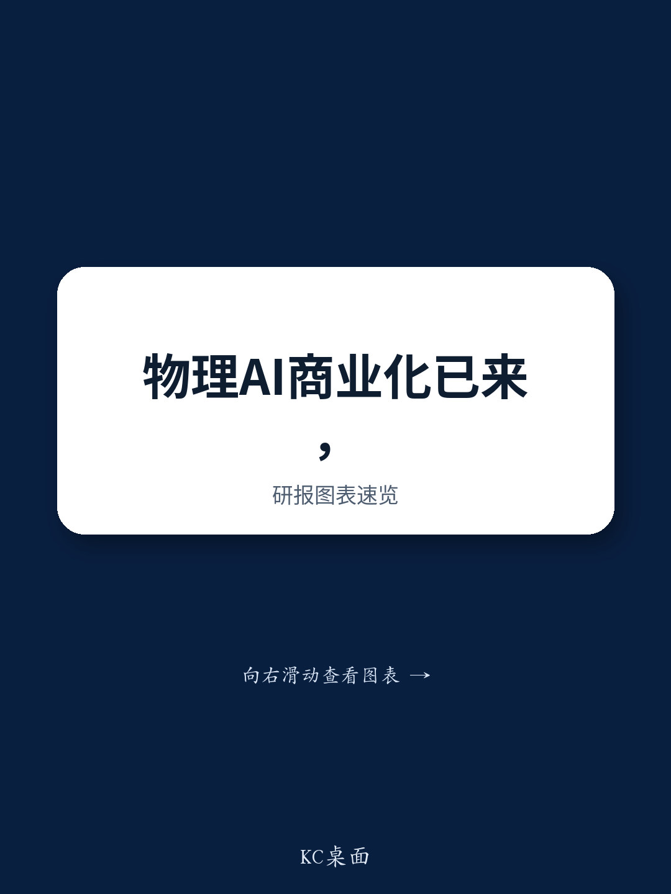

# Physical AI 已进入商业现实，但只有解决数据与部署瓶颈的公司才能抓住长达十年的建设周期

第四届Citi机器人与物理AI领导力大会传递了一个超越炒作的信息：物理AI不再是实验室里的新奇事物。真正的公司正在产生真实的收入，拥有真实的回报周期和真实的客户采纳。Dexterity 在连续三年增长三倍后，年经常性收入接近3亿美元。Gatik 拥有6亿美元的合同自动驾驶卡车收入。Locus Robotics 在600个站点每秒处理200个单位。这些不是预测，而是运营事实。

然而，大会也揭示了一些更值得深思的内容。从概念验证到规模化部署的道路，远比数字AI的类比所暗示的要艰难。与大型语言模型不同，物理AI需要在实际环境中收集的专有数据、专门构建的硬件，以及无法简化的安全认证。成功的公司并非那些拥有最先进模型的公司，而是那些首先解决了最困难运营问题的公司。

这是观察者必须理解的核心张力。商业化已经到来，但规模化仍然困难。那些将在未来十年创造持久价值的公司，是那些拥有数据飞轮、解决实际部署问题并满足最高安全标准的公司。其他一切都是噪音。

## 商业基础比多数人假设的更高，但规模化天花板更低

大会关于商业牵引力的数据点令人瞩目，不是因为它们展示了爆发式增长，而是因为它们表明物理AI已经在特定、高价值的应用场景中产生了可衡量的回报。人形机器人的定价已低于人力成本，回报周期约为一年。机器人即服务模式正在降低中小企业的采用门槛，这些企业无法承担大额前期资本支出。在仓储和物流领域，专用自主移动机器人正在提供直接转化为客户损益表的吞吐量改进。

这些数据点的重要性不在于它们的相对规模，而在于它们的模式。商业上最先进的公司具有共同的特征。它们从一个特定的、高痛点的劳动力问题开始。它们采用了RaaS模式以降低客户风险。它们将安全性和可靠性置于模型复杂性之上。它们没有首先尝试构建通用智能，而是构建了在受限环境中可靠运行的专用解决方案，然后从那里扩展。

但规模化天花板是真实存在的。Instawork 指出，即使2026年收集的数千万小时的数据，可能也只代表实现高水平机器人性能所需数据的基点，而非百分比。在受控仓库中有效的方法与在非结构化建筑工地或繁忙医院走廊中有效的方法之间的差距仍然巨大。成功规模化的公司是在运营参数相对可预测的环境中做到的。超越这些环境需要解决行业尚未完全定义、更不用说解决的问题。

## 数据稀缺，而非模型架构，是创造竞争护城河的关键约束

大会一致认为数据稀缺是物理AI规模化最重要的瓶颈。这不是一个可以通过更多计算或更好算法解决的暂时性问题。这是结构性的。大型语言模型存在的Transformer架构和预训练与后训练共识，尚未出现在控制机器人的模型中。视觉-语言-动作模型、世界模型和各种组合仍在积极讨论中。行业尚未就需要什么样的数据达成一致，这意味着它无法有效收集所需的数据。

这创造了一种强大的竞争动态。已经拥有大量已部署机器人安装基数的公司正在生成专有数据流，新进入者无法复制。Locus 在其网络中已接近80亿次拣选，建立了一个每次交易都在改进的数据网络效应。Dexterity 将“专家令牌”——生产中应对未预测、未预见真实世界事件的最佳响应——确定为最高质量的数据和模型规模的真正来源。这些数据点无法模拟或购买，必须通过运营部署获得。

对观察者的启示是明确的。在物理AI中获胜的公司是那些已经启动数据飞轮的公司。后来者将面临结构性劣势，这种劣势会随时间扩大而非缩小。物理AI中的数据护城河比数字AI中的数据护城河更深，因为数据本身更难生成、更难复制，并且与特定硬件和部署环境更紧密耦合。

## 硬件重新设计是必要的，因为现有半导体平台是为数据中心而非机器人构建的

大会最被低估的见解之一来自 Velaura AI，它认为物理AI世界需要从头开始进行完整的半导体重新设计。机器人技术栈已经经历了三个时代——纯CPU软件算法、基于CNN的视觉感知模型，以及当前的Transformer生成时代——但这些架构都不是为边缘机器人的独特需求而专门构建的。

为物理AI设计的专用芯片必须优先考虑超低功耗，以在人形机器人中获得最大性能同时避免过热。它们必须实现无需服务器往返的实时推理。它们必须集成能够在本地做出决策且误报率最低的安全模块。现有半导体平台是为数据中心工作负载设计的，而非为在具有严格功耗和热约束的非结构化环境中运行的移动平台设计的。

这为专用进入者创造了结构性机会。为大型同质市场设计的现有参与者将难以满足物理AI应用的分段化、专业化需求。这种竞争动态反映了更广泛的AI芯片市场，其中通用解决方案正受到针对特定工作负载优化的专用架构的挑战。在物理AI中，专业化要求甚至更高，因为硬件必须在故障具有直接物理后果的环境中可靠运行。

国防应用尤其具有说明性。一次性无人机目前的准确率为50%到55%，将其提高到80%到90%构成了国家安全级别的优势。国防是专用物理AI硅片最高价值的近期应用之一，正是因为性能要求如此苛刻，故障后果如此严重。

## 报告未完全回答资本配置周期将如何演变

大会小组成员坦诚地表示，相对于近期基本面，物理AI的估值似乎偏高，过去24个月约有200亿美元投入该领域。这提出了一个报告承认但未完全解决的问题：随着估值与基本面表现之间的差距持续存在，资本配置周期将如何演变？

物理AI的IPO前需求正在扩大，公开市场优先考虑能够展示规模、与主要客户的长期合同以及差异化技术路线的公司。但符合这些标准的公司数量仍然很少。风险在于，资本继续基于未来规模化的承诺而非当前部署的现实流入该领域，造成估值过剩，最终需要通过基本面表现或市场调整来解决。

报告也未完全解决中美公司之间的竞争动态将如何演变。中国在硬件制造方面具有显著优势，人形机器人价格点接近2万美元。美国在软件、数据和安全认证方面具有优势。这些优势在未来五年如何互动将决定哪些公司捕获最大价值，但报告在很大程度上留下了这个开放性问题。

## 观察者的决策框架：区分领导者的四个问题

对于试图驾驭这一领域的观察者，大会提供了一个清晰的框架来评估物理AI公司。将创造持久价值的公司具有四个特征，可以通过具体问题来评估。

第一，公司解决了什么特定的、高痛点的劳动力问题？大会上最成功的公司并非从技术开始寻找问题。它们从问题开始——仓库拣选、酒店服务、饮料准备——并构建了具有可衡量回报的解决方案。无法阐明具有明确经济效益的特定问题的公司，可能在采用方面遇到困难。

第二，公司是否拥有专有数据飞轮？物理AI中的数据护城河是最持久的竞争优势。拥有大量安装基数并生成真实世界运营数据的公司具有结构性优势，无法通过更好的算法或更多计算来克服。依赖模拟数据或第三方数据源的公司面临根本性的规模化挑战。

第三，公司是否已大规模解决安全性和可靠性问题？大会一致强调安全认证和运营可靠性比模型复杂性更重要。已部署数千台设备且具有高正常运行时间和低故障率的公司已经建立了企业采用所必需的信任。仍处于试点阶段的公司尚未证明它们可以大规模运营。

第四，公司是否有明确的硬件优化路径？物理AI所需的半导体重新设计意味着依赖现成硬件的公司将面临结构性劣势。正在投资专用芯片或与专业半导体供应商合作的公司，长期定位更好。

在所有四个问题上得分积极的公司，很可能是长达十年的物理AI建设周期中的价值创造者。在一两个问题上得分积极的公司可能拥有有趣的技术，但面临显著的规模化挑战。在任何一个问题上得分都不积极的公司，不太可能从炒作过渡到现实。

## 加入社区阅读完整报告并查看原始图表

物理AI的机会是真实的，但它并非均匀分布。已经解决了最困难部署问题的公司正在创造持久的竞争优势，这些优势将随时间累积。仍在寻找产品市场契合度的公司面临日益拥挤的领域和不断缩小的差异化窗口。完整报告包含详细的会议摘要、公司特定数据点和原始图表，提供了做出明智研究决策所需的粒度。加入社区以获取完整分析。

*仅供参考。部分内容可能基于源材料通过AI辅助生成、翻译、总结或编辑，可能包含遗漏或错误。请独立核实。这不构成专业建议。*

仅供参考。部分内容可能基于源材料通过AI辅助生成、翻译、总结或编辑，可能包含遗漏或错误。请独立核实。这不构成专业建议。

