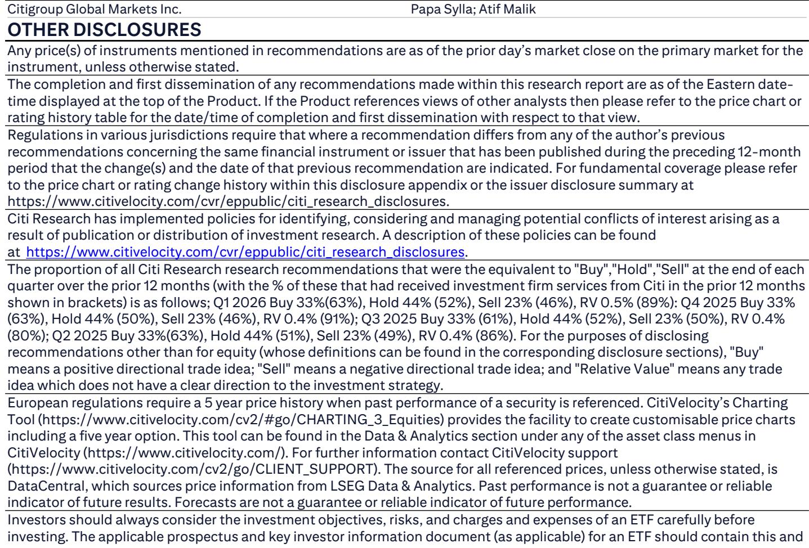
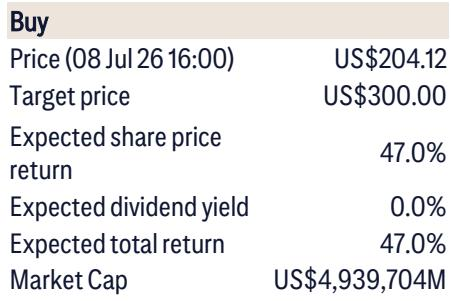
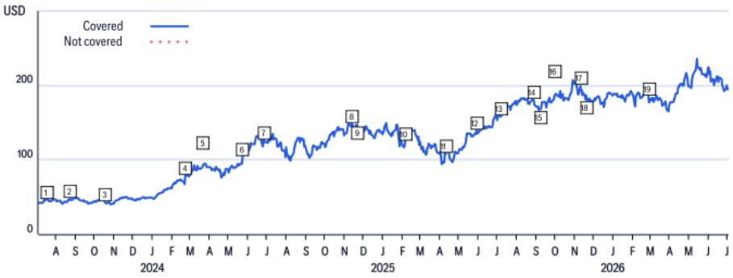

# Citi：英伟达最被低估的护城河，不是芯片，是路线图的确定性

市场对英伟达的讨论一直没有停过。芯片交付节奏、客户自研方案、新架构路线、主权AI需求是否能持续——每一个问题都能引出长篇讨论。但Citi在最新一期与英伟达读者关系团队的交流纪要中，给出了一条清晰的主线：**英伟达的路线图不仅完整，而且正在从“卖芯片”转向“卖能效和系统”。**

这份文件不是传统意义上的深度报告，而是一份问答实录。它没有堆砌模型和远期假设，而是直接回应了市场当前最关注的六个问题。读完之后，一个判断变得清晰：市场对英伟达的定价，可能仍然低估了其“基础设施平台化”带来的需求分散化能力。

## 1. 市场最关心的交付节奏，恰恰是英伟达最坚实的支撑

Kyber Rubin 的交付传闻一度让市场关注。Citi从英伟达管理层得到的回复是直截了当的：路线图完全 intact。不仅芯片本身，连在 Computex 上展示的 NVLink 域架构也没有变化。

这背后其实藏着一个更重要的信号。当一家公司被反复追问“你那个大项目会不会调整”时，真正值得关注的不是那一个项目的时间点，而是**整个产品矩阵的节奏控制力**。英伟达在 Blackwell 上实现了比 Hopper 25 倍的能效提升，并且管理层认为可以维持这个节奏。能效不是锦上添花，它是数据中心建设的核心约束——每 GW 的算力研究正在从 30-40 亿美元向 100 亿美元演进，但单位能耗的算力产出也在大幅提升。这意味着，英伟达的定价权，正在从“算力性能”向“算力效率”迁移。

> **KC评论：** 25倍能效提升这个数字，值得反复看。它不只是技术指标，而是整个云基础设施 CAPEX 逻辑的重写。完整报告里对每 GW 成本框架的澄清，是理解英伟达长期价值锚点的关键。

## 2. 客户结构正在发生一次“静默”的再平衡

市场习惯把英伟达的客户分为 hyperscalers 和 others。但Citi的这份纪要揭示了一个正在发生的结构性变化：**非 hyperscaler 需求正在加速追赶，且管理层认为这一部分最终必须比 hyperscaler 更大。**

逻辑并不复杂。AI 从训练走向推理，从云端走向物理世界，必然需要更多去中心化的算力部署。主权国家、企业 on-prem、AI labs 在过去两年已经显著上量，而物理 AI（机器人、自动驾驶、工业自动化）才刚刚开始。英伟达明确表示，它不会只服务 hyperscalers，而会同时服务 neocloud、主权客户和企业客户。

这意味着，英伟达的客户集中度不确定性正在自然稀释。当市场还在讨论 Meta 会不会自研芯片、微软会不会调整订单时，真正的增量可能来自那些不在华尔街雷达上的主权产品和传统工业企业。

## 3. 关于 CPO、空间数据中心和开源模型：英伟达的“系统”叙事比芯片叙事更值得关注

几个分散的细节值得串联起来。

CPO（共封装光学）已经在 Spectrum-X 中用于 scale-out 网络量产，2028 年的 Feynman 将提供 NVLink 的 CPO 或铜缆选项。空间数据中心虽然工程挑战巨大，但英伟达不认为它不可能。开源模型方面，Nemotron、Cosmos 等不是为了和前沿模型竞争，而是帮助主权和企业客户快速上手。

这些动作指向同一个结论：**英伟达正在构建一个从芯片、互联、网络到软件模型的完整系统栈。** 它的护城河不是单点芯片性能，而是客户一旦采用这个系统，迁移成本会极高。CPO 的早期量产、开源模型的免费提供，本质上都是在降低客户的初始采用门槛，然后通过系统锁定获取长期价值。

## 4. 报告尚未完全回答的关键问题：需求韧性的“拐点”在哪里

Citi的这份问答覆盖了很多，但有一个问题被有意无意地绕开了：**当 AI 研究的 ROI 从“信仰驱动”转向“现金流驱动”时，英伟达的营收曲线会不会出现一个增长减速的拐点？**

管理层提到“随着 AI 的承诺逐渐变成现实，非 hyperscaler 部分最终必须更大”。这句话隐含了一个假设：当前的研究热潮会持续到物理 AI 大规模落地。但如果中间出现资本开支的“断层”（hyperscaler 资本开支增速节奏变化，而企业端尚未完全接棒），英伟达的季度增速可能会出现一段让市场不适应的过渡期。

> **KC评论：** 这份纪要的价值不在于给出答案，而在于列出了市场最应该追问的问题清单。建议读者重点看原文中关于每 GW 成本框架和 neocloud vs hyperscaler 需求对比的那两段，那里藏着对英伟达长期价值最重要的两个变量。

---

For informational purposes only. Portions may be generated,translated,summarized,or edited with AI assistance based on source materials and may contain omissions or errors. Please verify independently. This is not investment,legal,tax,accounting,or other professional advice.

For informational purposes only. Portions may be generated,translated,summarized,or edited with AI assistance based on source materials and may contain omissions or errors. Please verify independently. This is not investment,legal,tax,accounting,or other professional advice.

