我们观察到下半年来自境外读者的资金流出可能持续，但节奏有所放缓。韩国个人读者正在关注海外机会，但整体流出规模仍在可控范围内。

我们对韩国的基本面保持积极看法，预计其增长表现将优于美国，贸易顺差维持稳健，利差也将逐步收窄。

随着企业外汇兑换增加被资金流出所抵消，韩元可能呈现温和升值。在央行加息和宏观环境强劲的背景下，回报表现预计将维持高位。

2026年EXTEL全球固定收益调查现已启动，您的参与对我们至关重要。如果您认为我们的研究对您有帮助，我们非常感谢您能在以下类别中给予支持（请点击此处申请投票）：

• 亚洲（除日本）> 本地市场外汇策略
• 亚洲（除日本）> 本地市场利率策略

请将我加入您的分发名单。

点击此处查看我们的彭博代码手册。

2026 EXTEL全球固定收益调查

MS与报告中涉及的公司存在业务往来并寻求开展业务。因此，读者应知悉，该公司可能存在影响MS客观性的利益冲突。读者应将MS视为其决策的单一因素之一。

有关分析师认证及其他重要披露，请参阅本报告末尾的披露部分。

+= 受雇于非美国关联公司的分析师未在FINRA注册，可能不是该会员的关联人士，且可能不受FINRA关于与主题公司沟通、公开露面以及持有研究分析师账户中交易证券的限制。

## 宏观策略

MS ASIA LIMITED+

Gek Teng Khoo
Gek.Teng.Khoo@morganstanley.com

+852 3963-0303

## 韩元为何表现偏弱？

今年以来，尽管韩国经常账户盈余大幅增长（图表1）、贸易条件显著改善（图表2）、市场表现全球领先、GDP增长高于潜在水平，且随着央行转向加息，利差转为负值的状况有所缓解，韩元仍是亚洲表现偏弱的货币之一。

韩元当前的估值水平与印度卢比和印尼盾相当（图表3），尽管其并未面临类似的国际收支问题（图表4）。事实上，剔除央行储备变动的影响后，韩国国际收支盈余占GDP的1.2%。

图表1：韩国经常账户盈余因出口强劲而大幅增长
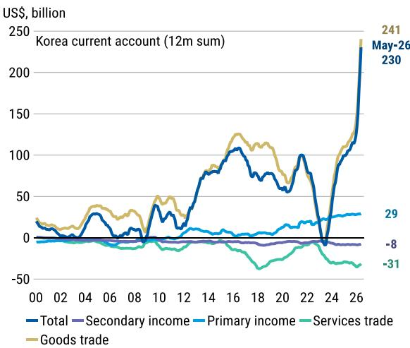
来源：Macrobond, MS

图表2：尽管贸易条件大幅改善，韩元仍走弱
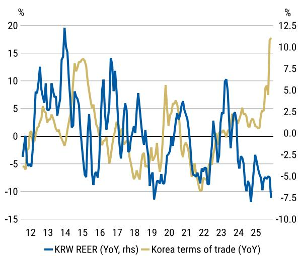
来源：Macrobond, MS

图表3：韩元的低估程度与印度卢比和印尼盾相当...
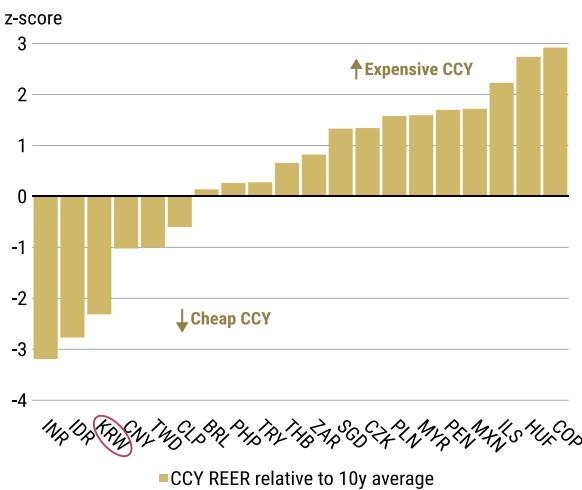
来源：Bloomberg, Macrobond, MS

图表4：...尽管其并未面临类似的国际收支问题
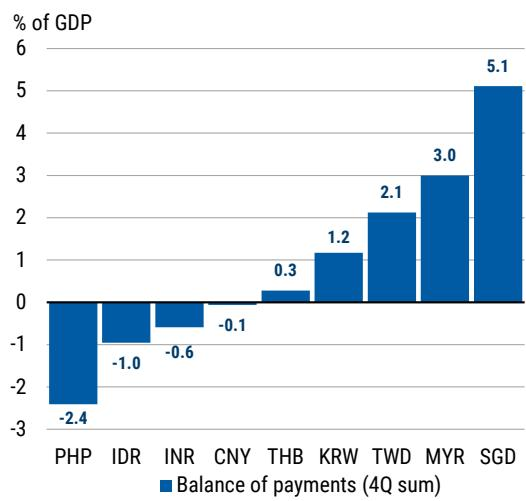
来源：Macrobond, MS

那么，是什么解释了韩元的疲软？我们认为这是外部和本地因素共同作用的结果。外部因素方面，即使油价有所回落，但随着美联储加息预期的鹰派重估，美元整体走强。鉴于韩元的高贝塔值（图表12），其在区域内受到的冲击尤为显著。

国内方面，韩国贸易顺差和市场表现的大幅提升未能有效传导至韩元，可能归因于：

- 2025年底/2026年初外资流入时，境外读者增加了外汇对冲；
- 资本外流增加，尤其是近几个月境外读者卖出韩国股票；
- 企业外汇兑换可能未能跟上贸易顺差激增的步伐。

## 资金流出与外汇对冲增加

尽管韩国拥有可观的经常账户盈余，但其整体国际收支状况并不极端（图表5），因为过剩储蓄通过金融渠道（尤其是股票）流向海外（图表6）。

2025年底，资金流出更多由韩国读者（包括个人读者、资产管理公司和国民年金）的海外投资驱动（图表7）。但自2026年初以来，主要是境外读者卖出韩国股票导致资金从韩国流出，并对汇率构成压力（图表8）。

另一个值得注意的现象是，当2025年9-10月和2025年12月-2026年1月境外读者净买入韩国股票时，韩元并未显著升值。这可能表明境外读者在买入韩国股票时越来越多地采用外汇对冲，从而削弱了资金流入与韩元升值之间的传统关联。

图表5：美元/韩元汇率与国际收支状况密切相关，后者更为均衡
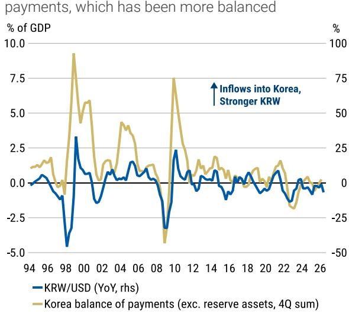
来源：Macrobond, MS

图表6：股票是韩国金融流出的主要来源，其他组成部分保持稳定
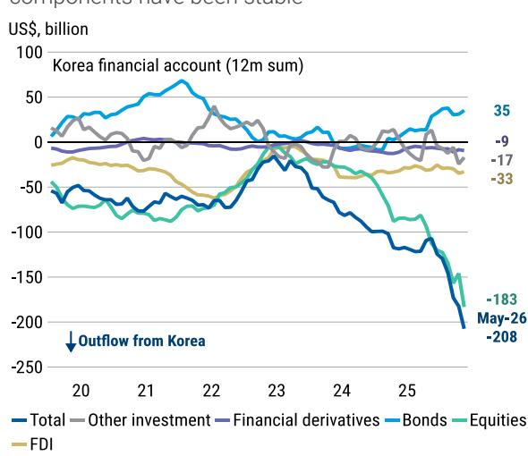
来源：Macrobond, MS

图表7：去年资金流出主要由国内读者驱动，今年则更多来自境外读者
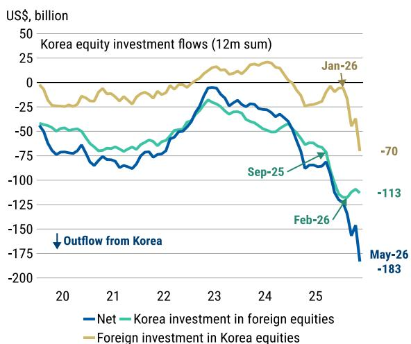
来源：Macrobond, MS

图表8：近几个月美元/韩元汇率与境外读者的资金流出密切相关（单位：十亿美元）
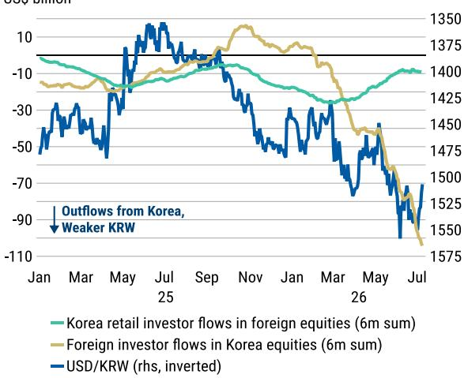
来源：Macrobond, MS

## 韩国出口商的外汇兑换可能未能同步跟上

尽管韩国贸易顺差大幅增长，但出口商可能并未以同样的速度将美元出口收入兑换为韩元。

事实上，随着贸易顺差激增，韩国企业和家庭的离岸外币存款显著增加（图表9）。自2025年3月韩国贸易差额触底以来，韩国企业在岸外汇存款也增加了140亿美元，而企业存款总额增加了340亿美元（图表10）。

其中一个原因可能是韩国企业增加了对美国的投资。自2025年年中以来，韩国对外直接投资中流向美国的比例持续上升，从2025年6月的32%低点升至2025年底的35%（图表10）。2025年，韩国企业对美投资额为250亿美元。

图表9：韩国企业和家庭的离岸存款随贸易顺差激增而增加
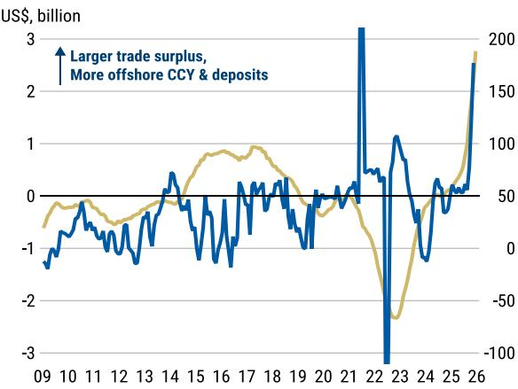
- 韩国企业和家庭的离岸外币及存款（12个月总和）
- 韩国贸易差额（12个月总和，右轴）

图表10：韩国企业在岸外汇存款也有所增加
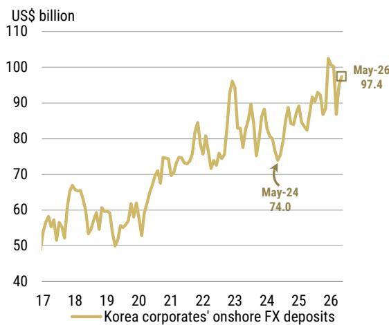
来源：CEIC, MS
来源：Macrobond, MS

图表11：自2025年年中以来，韩国企业增加了对美国的投资
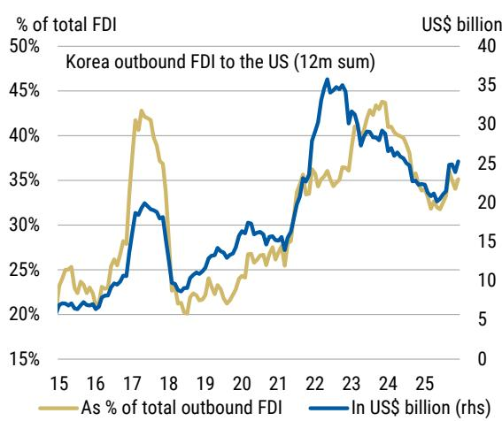
来源：CEIC, MS

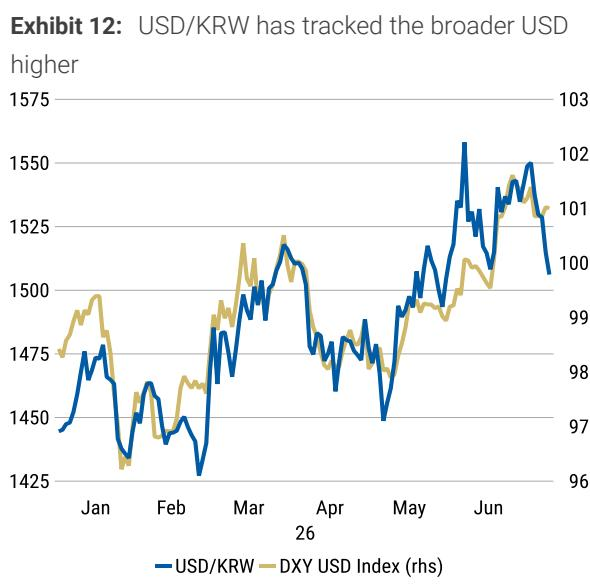
来源：Bloomberg, MS

## 韩元与市场的正相关性正在改变吗？

如果境外读者确实提高了对韩国股票持仓的外汇对冲比率，这是否意味着韩元与市场之间通常的正相关关系正在发生变化？

有理由这样认为：

- 如果股价下跌或境外读者减少股票持仓，他们可能会降低外汇对冲（即卖出美元，买入韩元）。
- 自5月以来，境外读者大规模流出韩国股票的一个驱动因素是，在半导体股价飙升后，读者为遵守单一股票/行业/国家持仓限制而进行的再平衡需求。这意味着，韩国市场的优异表现反而可能导致韩元资金外流。

事实上，在近期KOSPI出现明显回调时（例如7月2日和7日，以及6月23日和26日），韩元兑美元出现了升值。

不过，这是一个相对较新的现象，现在断言韩元与KOSPI之间的相关性已持续转为负相关可能还为时过早。

自2024年底以来，负贝塔值出现的频率明显增加（图表13和图表14），但尚不足以确信贝塔值已决定性地转为负值。在过去十二个月中，贝塔值为正（即韩元/美元与KOSPI同向下跌）的时间略超过一半（57%）。

图表13：近几个月KOSPI下跌时，韩元对KOSPI的贝塔值出现波动
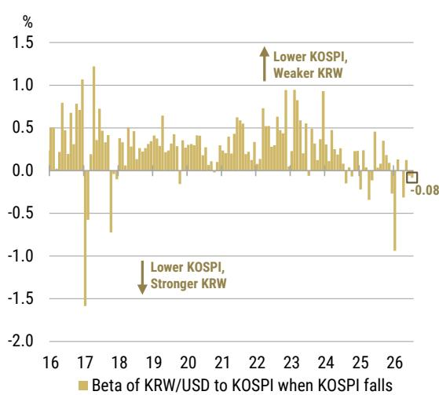
来源：Bloomberg, MS

图表14：同样，韩元也未能像以往那样因KOSPI上涨而持续升值
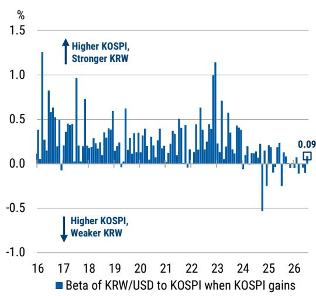
来源：Bloomberg, MS

决定韩元与KOSPI相关性的另一个因素是境外读者的外汇对冲比率。较高的外汇对冲比率可能会增加出现更持续负相关性的概率，因为如果市场下跌或读者减少持仓，境外读者降低外汇对冲的空间更大。

以美元/韩元与境外读者在韩国市场的资金流动之间的相关性作为参考，这表明境外读者的外汇对冲比率近期有所下降，目前处于长期平均水平附近（图表15）。这并不强烈指向韩元与KOSPI之间存在持续的负相关关系。

图表15：韩元与市场的相关性回到长期平均水平
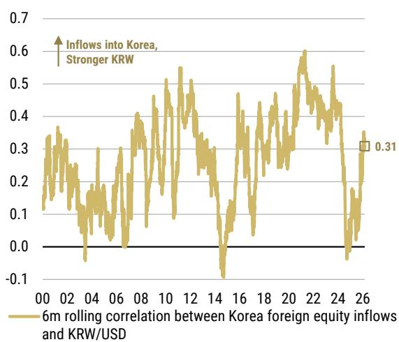
来源：Bloomberg, MS

图表16：韩元与KOSPI的相对和相对表现仍呈正相关
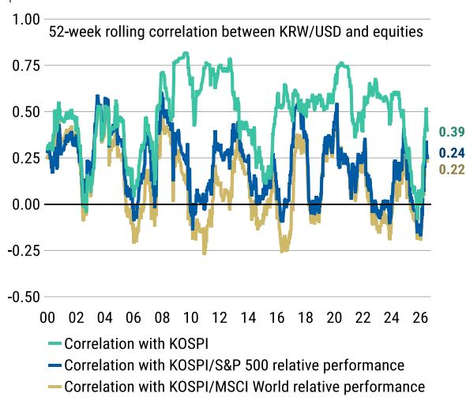
来源：Bloomberg, MS

市场波动的幅度可能很重要。如图表17和图表18所示，当市场波动较为温和时，贝塔值更有可能偏离通常的正值。当KOSPI出现大幅回调时，近几个月韩元兑美元平均而言有所升值，但贝塔值较小。相反，当KOSPI大幅上涨时，韩元通常按照通常的关系升值。

市场波动的驱动因素也很重要。如果KOSPI因外部因素与其他全球市场一同下跌，韩元也可能因美元整体买盘而走弱。

图表17：近几个月KOSPI回调期间，韩元通常升值
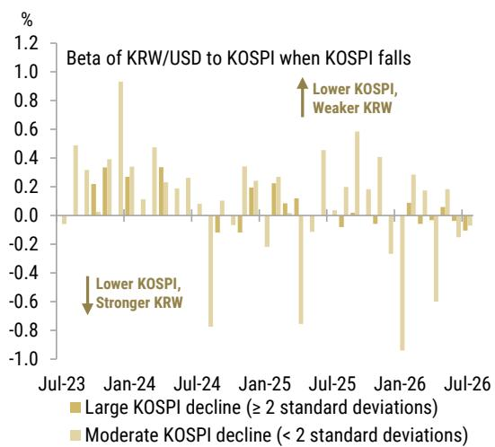
来源：Bloomberg, MS

图表18：韩元受KOSPI大幅上涨提振，但在KOSPI温和上涨时走弱
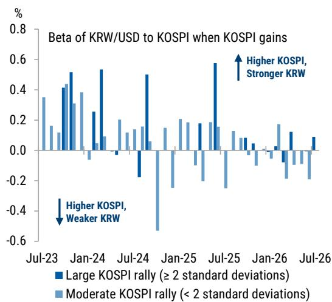
来源：Bloomberg, MS

## 韩元汇率/利率前景如何？

## 短期内，存在一些对韩元有利的资金流动动态：

- 一家大型半导体公司的美国上市可能带来一些韩元流入，因为该公司已表示，部分股票发行的美元收益将用于韩国国内的资本支出。媒体报道称，外汇兑换可能从7月15日开始，持续到8月。
- 企业可能需要为8月份的企业税缴纳增加外汇兑换。韩国企业通常每年在3月和8月缴纳税款。2026年3月，韩国企业在岸外汇存款大幅减少130亿美元，部分原因就在于此。

总体而言，出口商的外汇兑换前景有所改善。从更长的时间跨度来看，韩国半导体公司近期宣布的大规模国内资本支出也对韩元有利，这不仅是从增长角度，也是从资金流动角度，因为企业可能需要将更多美元收入兑换为韩元用于支出。

图表19：韩国个人读者在6月和7月以小规模恢复购买外国股票
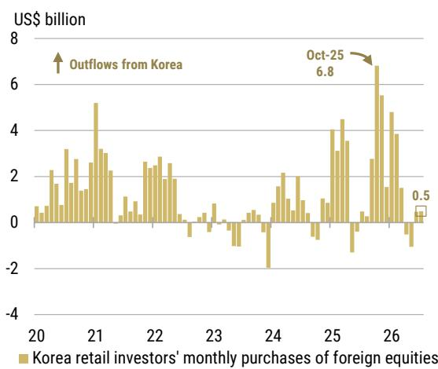
来源：Haver Analytics, MS
图表20：国民年金对外国股票和另类资产的配置在其2026年目标的缓冲范围内

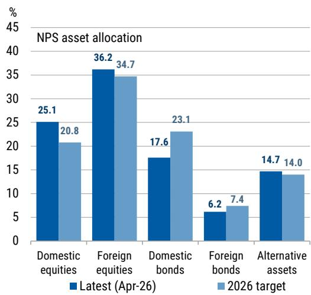
来源：Haver Analytics, MS

## 尽管如此，资金流动可能继续对韩元构成压力：

- 境外读者流出可能持续：正如我们在《境外资金流出何时平息？》中讨论的那样，我们预计境外读者的资金流出压力将持续，但规模应小于2026年上半年，因为KOSPI的上涨将由更多股票推动，指数走势将更加震荡。
- 国内读者方面，个人读者的海外股票投资可能增加：在2026年4月和5月转为净卖出外国股票后，韩国个人读者在6月和7月迄今已恢复购买外国股票。随着“回流投资账户”税收优惠减少以及存储类股可能短期走弱，风险可能倾向于韩国个人读者从当前低水平增加股票资金流出（图表19）。

国民年金的资金流动对韩元的压力应小于往年。根据截至2026年4月的最新数据，国民年金当前对外国股票和另类资产（其中很大部分投资于海外）的配置已高于其2026年底的目标，但仍处于+/-2%的战术资产配置缓冲范围内。同时，其对海外债券的配置偏低。

因此，我们估计，假设国民年金进行再平衡以达到其2026年配置目标，今年剩余时间可能会有约50亿美元的温和流出。其战略性外汇对冲比率的提高甚至可能有助于限制韩元的下行空间，因为对冲操作可能在美元/韩元汇率处于高位时触发。

总体而言，鉴于我们全球团队对美元持看空倾向，以及出口商外汇兑换前景改善，我们倾向于认为韩元将温和升值。然而，任何潜在升值的幅度可能受到境外读者（尽管速度放缓）和韩国个人读者持续资金流出的限制。

这表明，在美元没有整体走弱的情况下，美元/韩元可能维持在约1,490-1,560的区间。要使美元/韩元有更大的下行空间，可能需要跌破约1,485的水平。

图表21：我们的超额期限溢价模型表明，2s10s KTB曲线处于公允价值附近
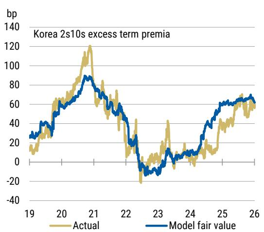
来源：Bloomberg, MS

图表22：市场对央行加息的定价处于高位，但尚未达到2022年的高点
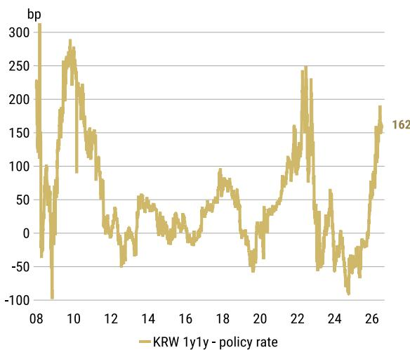
来源：Bloomberg, MS

在利率方面，我们在当前水平持中性看法。韩国回报表现已大幅上升，接近2022年的高点，尽管本轮央行加息周期可能较浅，且通胀并未那么高。尽管如此，我们的超额期限溢价模型（基于政策利率差距、通胀波动性和美国期限溢价）表明，2s10s曲线处于公允价值附近（图表21）。

基本面因素也继续支持回报表现维持高位，韩国增长可能保持强劲，通胀可能仍高于目标，首尔房价依然高企，韩元相对偏弱。我们的经济学家预计央行将在7月16日的会议上加息并发表鹰派言论，这应能维持市场对加息的定价。

计划于8月底公布的2027年预算提案可能继续显示扩张性的财政立场，尽管由于税收收入强劲，可能无需额外发行KTB。这可能使其成为对回报表现的中性事件，但这取决于临近日期时市场对KTB发行量的估计。

MS ASIA LIMITED+

Kathleen Oh
Kathleen.Oh@morganstanley.com

+852 2848-7340

## 支撑韩元的基本面因素

虽然近期美元/韩元的波动更多由资金流动动态而非基本经济因素驱动，但我们仍对韩元升值的基本面理由持建设性看法。以下因素支撑了我们的观点：

- 强劲的增长复苏，运行速度大多高于潜在水平；我们对2026年GDP增长的预测为2.8%，风险偏向上行。
- 2026年上半年出口同比增长47%（海关口径），导致经常账户盈余以有史以来最快的速度积累，1-5月达到1410亿美元。
- 央行明确转向加息周期，首次加息预计在7月——我们预计2026年加息两次，2027年再加息两次。

这些结构性因素已在2026年转为顺风，并较此前构成韩元压力的逆风状况显著改善。

## (1) 与美国相比，增长强劲反弹

今年，韩国的增长相对于美国将发生戏剧性的逆转，从2025年的表现不佳转为2026年的表现优异。2025年，韩国相对于美国经济的疲弱增长基本面可能对汇率构成了压力。由于国内需求疲软、建筑投资萎缩以及美国关税对出口的冲击，当年经济增长率为1.1%，低于潜在水平。相比之下，美国经济在消费者支出韧性和财政刺激的支持下，增长率约为2.2%。

图表23：在2025年增长乏力之后，强劲的反弹为韩元提供了支撑
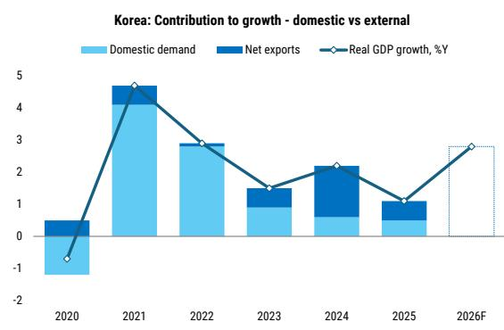
来源：韩国央行, MS预测

图表24：从2026年第一季度起，韩国季度GDP增长轨迹可能超过美国
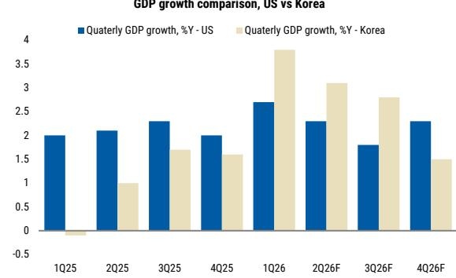
来源：韩国央行, 美国经济分析局, MS预测

2026年，增长差异正在逆转。韩国第一季度GDP同比增长3.8%（环比增长1.8%），大幅超出3.6%的共识预期，创下多年来最快增速。基于这一势头，我们将2026年增长预测上调至2.8%，明显高于韩国约1.8%的潜在增长率。韩国央行也将其2026年官方增长预测上调至2.6%，理由是半导体繁荣，强劲的出口预计将为主要增长贡献0.7个百分点。

与此同时，美国第一季度增长2.0%（年化），低于2.3%的预期，个人消费支出放缓至1.6%。我们的美国团队预测2026年实际GDP增长2.3%，能源价格上涨对消费构成逆风。韩国这种相对增长的优异表现应开始在今年对韩元施加结构性升值压力。

## (2) 出口反弹和创纪录的经常账户余额

2025年，韩国出口增长部分受到关税担忧的下行压力，增速从2024年的6.6%放缓至仅3.6%，全年贸易顺差为770亿美元。复苏从2025年第四季度开始显现，并在2026年上半年急剧加速，在强劲的半导体需求和AI超级周期的推动下，出口同比增长47.7%。

6月份的贸易数据再次印证了我们对韩国出口前景的积极看法。出口同比增长70.9%，达到创纪录的1023亿美元，高于5月份的53.4%。该报告进一步证明，AI驱动的半导体需求和存储芯片基本面改善继续支撑韩国的出口上升周期，同时非科技制造业的广泛改善减轻了对需求过于集中的担忧（参见《韩国：6月贸易：再创历史新高》）。

我们对今年剩余时间的前景保持建设性看法，据我们估计，全年出口增长可能保持在50%以上。仅2026年上半年的1380亿美元贸易顺差就表明全年数字将超过2000亿美元——是2025年水平的两倍多——这一发展从结构上强化了韩元升值的理由。

图表25：得益于半导体超级周期，出口已出现好转
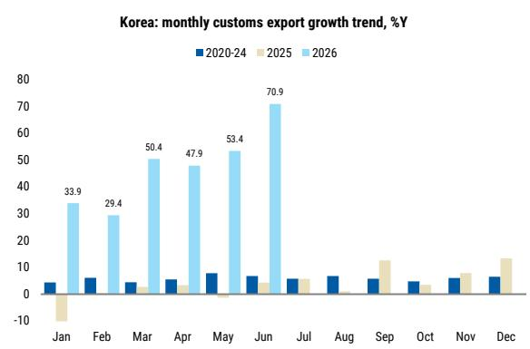
来源：KITA, MS

图表26：创纪录的贸易顺差为韩元提供了潜在升值压力
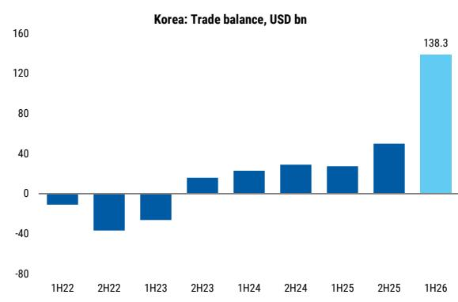
来源：KITA, MS

## (3) 央行转向加息周期

在潜在通胀压力积聚和国内需求复苏扩大的背景下，韩国央行在5月政策会议上大幅逆转了利率路径，暗示最早可能在7月加息（参见《韩国央行评估：所有迹象都指向加息路径》）。我们将首次加息预期提前至7月，并将终端利率预测上调至3.5%。鉴于我们的美国团队维持美联储今年剩余时间将保持利率不变的看法，韩国与美国利差的收窄为韩元升值提供了额外的基本面支撑，进一步巩固了已有的结构性升值力量。

韩国央行的鹰派转向不仅在于其时机，还在于其决心。央行对韩国增长复苏以及需求驱动型价格压力持续存在的信心表明，加息周期可能比此前预期的更快、更长。这与2025年大部分时间韩国央行立场的特点——宽松倾向——形成鲜明对比，代表着货币政策背景的重大转变。随着韩国与美国利差收窄，此前对韩元构成压力的利差动态将变得越来越有利，这强化了我们的外汇团队对韩元走强更广泛基本面理由的看法。

图表27：韩国央行在利率路径上出现急剧转向，暗示最早可能在7月加息
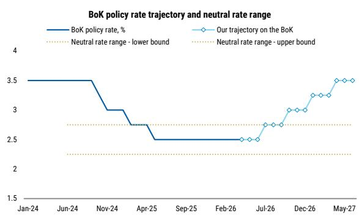
来源：韩国央行, MS预测

图表28：利差收窄应会为韩元反弹增添另一个有利的基本面背景
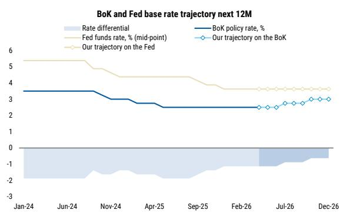
来源：韩国央行, 美联储, MS预测

## 国际收支动态变化：储备资产压缩增加了韩元的贬值压力

从中期角度来看，我们识别出国际收支中的结构性动态，这些动态自2022年以来导致了韩元贬值的非对称压力。尽管韩国自1997年以来每年都保持经常账户盈余，但在盈余持续积累的同时，我们也观察到金融账户资产创纪录地增加。金融账户资产的增加导致储备资产被压缩，后者在2022年转为负值。这是自2008年（-560亿美元）以来韩国首次出现赤字，并且赤字持续了四年，直至2025年。

储备资产代表经常账户与金融账户之间的剩余差额，我们将其用作缓冲国际收支失衡的指标。就储备资产动态而言，头寸越大，抵御汇率波动的缓冲就越大，对贸易条件稳定的支撑就越强。我们注意到，当储备资产在2022年转为负值时，出现了负债头寸，相当一部分美元持有量留在在岸。

从历史上看，储备资产与美元/韩元的走势表现出显著的相关性，可作为衡量抵御汇率压力程度的指标。换句话说，尽管韩国通过贸易渠道积累了大量的美元收入，但对美元需求的增加，加上美元流出增加和储备资产缓冲减少，已转化为结构上更弱的汇率背景。这种由资金流动驱动的贬值压力持续存在，即使韩国的基本经济基本面依然稳健，这突显出汇率走弱日益成为资本账户动态的函数，而非贸易表现恶化。

图表29：近期金融账户资产的增加导致储备资产被压缩
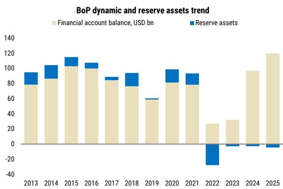
来源：韩国央行, MS

图表30：储备资产缓冲减少已转化为韩元结构上更弱的汇率背景
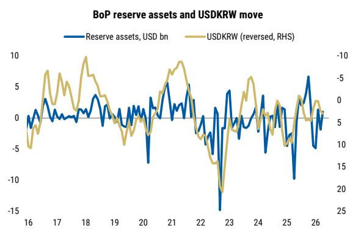
来源：Bloomberg, 韩国央行, MS

## 股票策略

<table><tr><td rowspan="3">MS & CO. INTERNATIONAL PLC, 首尔分行+</td><td>Joon SeokJoon.Seok@morganstanley.com</td><td>+82 2 399-4934</td></tr><tr><td>Heewon ChoiHeewon.Choi@morganstanley.com</td><td>+82 2 399-4836</td></tr><tr><td>Minseo KangMinseo.Kang@morganstanley.com</td><td>+82 2 399-4816</td></tr><tr><td>MS ASIA (SINGAPORE) PTE.+</td><td>Kristal JiKristal.Ji@morganstanley.com</td><td>+65 6834-6949</td></tr></table>

## 预计2026年下半年市场仍将面临一定波动

KOSPI在2026年上半年上涨了101%，其中芯片制造商在此期间涨幅超过200%，占市值增长的79%。我们对KOSPI的看法一直是上半年较强，下半年较为震荡，我们的KOSPI目标为9,000点，但仍更倾向于我们的牛市情景（10,500点）而非熊市情景（6,500点）。决定我们观点的关键因素是：

(1) 2026年上半年共识盈利的变化率强劲，下半年难以维持同样的变化斜率；
(2) 国内流动性状况依然充裕，但贷款和信贷工具的收紧将使个人读者可获得的杠杆减少；
(3) 外部不确定性，包括美联储货币政策方向和地缘政治风险。《2026年韩国年中展望：驾驭风浪的毅力》（2026年5月12日）

图表31：KOSPI目标及牛市/熊市情景
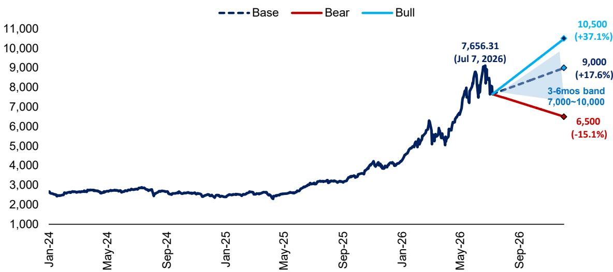
来源：MS估计

图表32：KOSPI vs. KOSPI周期指标
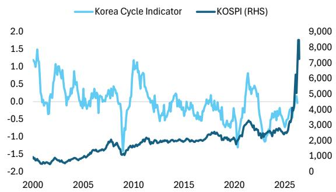
来源：WiseFN, Bloomberg, 韩国央行, MS

图表33：KOSPI vs. 汇率
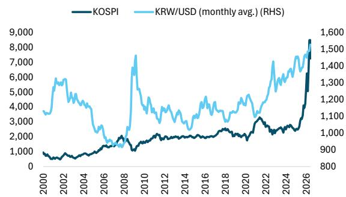
来源：韩国央行, WiseFN, MS

## 图表34：

2026年年初至今按读者类型划分的资金流动及价格表现

<table><tr><td>(%, 十亿韩元)</td><td>KOSPI</td><td>IT</td><td>材料</td><td>工业</td><td>能源</td><td>可选消费</td><td>金融</td><td>医疗保健</td><td>通信服务</td><td>必需消费</td><td>公用事业</td></tr><tr><td>指数权重</td><td>100%</td><td>65%</td><td>2%</td><td>12%</td><td>2%</td><td>5%</td><td>7%</td><td>2%</td><td>2%</td><td>1%</td><td>1%</td></tr><tr><td>2026年年初至今表现</td><td>91.1%</td><td>194.5%</td><td>-5.8%</td><td>44.4%</td><td>58.2%</td><td>35.6%</td><td>35.6%</td><td>-14.5%</td><td>-12.9%</td><td>5.3%</td><td>-12.4%</td></tr><tr><td>2025年表现</td><td>75.6%</td><td>142.7%</td><td>26.5%</td><td>106.1%</td><td>46.1%</td><td>35.3%</td><td>53.6%</td><td>21.1%</td><td>20.5%</td><td>21.8%</td><td>87.6%</td></tr><tr><td>境外读者净买入</td><td>-157,879</td><td>-142,805</td><td>1,361</td><td>956</td><td>1,696</td><td>-13,455</td><td>-3,206</td><td>1,777</td><td>-1,400</td><td>518</td><td>-444</td></tr><tr><td>国内个人读者净买入</td><td>107,541</td><td>97,720</td><td>-1,482</td><td>-2,188</td><td>-1,598</td><td>11,676</td><td>-403</td><td>-658</td><td>1,794</td><td>-428</td><td>1,083</td></tr><tr><td>国内机构净买入</td><td>35,839</td><td>30,165</td><td>-453</td><td>3,271</td><td>514</td><td>624</td><td>3,749</td><td>-1,349</td><td>-611</td><td>-101</td><td>-596</td></tr><tr><td>养老基金净买入</td><td>-8,977</td><td>-4,016</td><td>-100</td><td>-1,730</td><td>253</td><td>-23</td><td>-1,459</td><td>-1,022</td><td>-451</td><td>-173</td><td>-374</td></tr></table>

来源：WiseFN, MS, 数据截至2026年7月6日。

## 境外读者对韩国股票的看法和持仓

## 整体对韩国股票持建设性看法

根据我们与境外读者的讨论，我们认为他们对韩国市场持建设性看法，但对市场波动性增加感到担忧。这已对情绪产生不利影响，但并未动摇韩国仍是一个相对有吸引力的市场的观点。

- 我们重申，产品和读者范围的扩大是一把双刃剑；虽然它提高了流动性，但也增加了波动性。我们继续看到KOSPI的涨跌幅度相当大。
- 科技板块，尤其是芯片制造商，仍然吸引着读者最多的兴趣，但与AI相关的消息流起伏导致波动加大，尤其是芯片制造商约占KOSPI市值的一半。我们的科技分析师Shawn Kim对芯片制造商仍持积极看法；请参阅《科技简报：存储芯片——潮汐变化》（2026年7月6日）。
- 与AI相关的子行业/股票也获得了读者的关注，尤其是代理控股公司，如SK Square、三星生命和三星物产。
- 最近，我们看到兴趣扩大到能源安全、国防、财富效应和改革等主题。

图表35：2026年年初至今子行业表现

<table><tr><td>2026年年初至今(%, 万亿韩元)</td><td>年初至今表现</td><td>2025年表现</td><td>年初至今境外</td><td>年初至今个人</td><td>年初至今国内机构</td></tr><tr><td>KOSPI</td><td>91.1%</td><td>75.6%</td><td>(157.9)</td><td>107.5</td><td>35.8</td></tr><tr><td>硬件</td><td>304.1%</td><td>91.6%</td><td>0.1</td><td>(0.5)</td><td>0.5</td></tr><tr><td>半导体</td><td>202.5%</td><td>165.8%</td><td>(142.9)</td><td>97.6</td><td>28.7</td></tr><tr><td>贸易公司、资本品</td><td>88.6%</td><td>139.2%</td><td>(0.2)</td><td>(3.0)</td><td>3.1</td></tr><tr><td>保险</td><td>68.5%</td><td>44.4%</td><td>0.1</td><td>(0.5)</td><td>0.3</td></tr><tr><td>零售</td><td>64.3%</td><td>33.4%</td><td>0.9</td><td>(1.1)</td><td>0.1</td></tr><tr><td>能源</td><td>58.2%</td><td>46.1%</td><td>1.7</td><td>(1.6)</td><td>0.5</td></tr><tr><td>建筑、建材</td><td>51.6%</td><td>48.0%</td><td>0.0</td><td>0.9</td><td>(0.9)</td></tr><tr><td>家电</td><td>48.2%</td><td>9.3%</td><td>0.2</td><td>(0.0)</td><td>1.2</td></tr><tr><td>汽车</td><td>41.8%</td><td>36.3%</td><td>(15.8)</td><td>14.8</td><td>(0.1)</td></tr><tr><td>证券</td><td>40.8%</td><td>70.3%</td><td>(1.9)</td><td>1.2</td><td>0.7</td></tr><tr><td>机械</td><td>36.1%</td><td>171.8%</td><td>0.7</td><td>(0.4)</td><td>0.8</td></tr><tr><td>银行</td><td>26.7%</td><td>55.0%</td><td>(1.4)</td><td>(1.1)</td><td>2.7</td></tr><tr><td>电信服务</td><td>24.4%</td><td>13.2%</td><td>(0.0)</td><td>(0.3)</td><td>0.3</td></tr><tr><td>化妆品、服装、玩具</td><td>18.2%</td><td>33.2%</td><td>1.7</td><td>(2.2)</td><td>0.5</td></tr><tr><td>必需消费品</td><td>5.3%</td><td>21.8%</td><td>0.5</td><td>(0.4)</td><td>(0.1)</td></tr><tr><td>交通运输</td><td>4.1%</td><td>20.5%</td><td>(0.0)</td><td>0.0</td><td>(0.1)</td></tr><tr><td>钢铁</td><td>1.5%</td><td>21.3%</td><td>0.4</td><td>(0.4)</td><td>0.1</td></tr><tr><td>造船</td><td>0.9%</td><td>98.9%</td><td>0.5</td><td>0.3</td><td>0.3</td></tr><tr><td>化工</td><td>-5.2%</td><td>29.4%</td><td>2.0</td><td>(1.5)</td><td>(0.6)</td></tr><tr><td>显示器</td><td>-9.0%</td><td>21.4%</td><td>0.3</td><td>(0.1)</td><td>(0.2)</td></tr><tr><td>公用事业</td><td>-12.4%</td><td>87.6%</td><td>(0.4)</td><td>1.1</td><td>(0.6)</td></tr><tr><td>软件</td><td>-13.9
