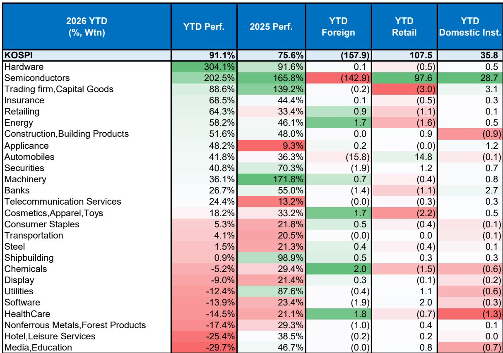
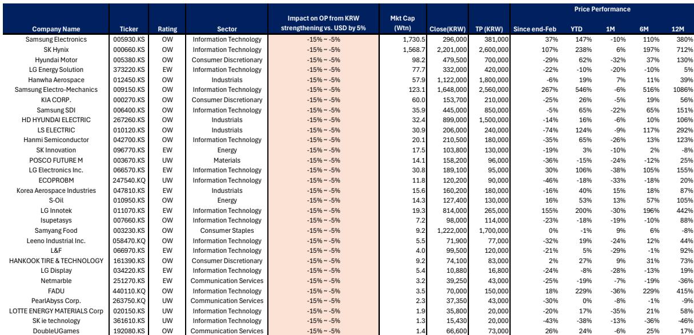
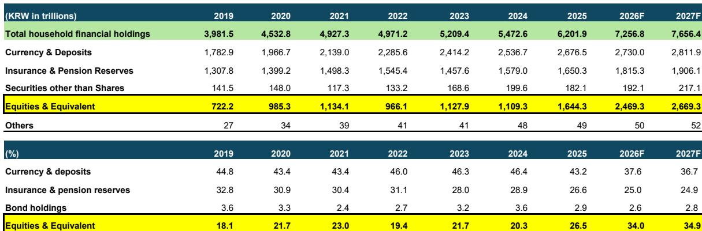

# 韩国汇率观察：当结构性资金流动超越基本面

韩元在亚洲货币中按常规指标衡量处于较低水平，但近期仍呈现一定波动。这并非矛盾，而是表明传统的汇率分析框架正在发生变化。一份全球研究机构的报告指出：韩国正录得创纪录的经常项目顺差，经济增长高于潜在水平，贸易条件显著改善，且权益市场表现强劲。韩国央行正考虑调整利率。按照传统指标，韩元应有所走强，但实际情况并非如此。

这种背离值得关注，因为它促使研究者重新思考在资金流动日益主导贸易流动的背景下，汇率变动的驱动因素。报告认为，韩元的走势受到外部和国内因素的综合影响：美元整体强势、外国读者对权益头寸的对冲增加、持续的权益资金流出，以及韩国企业处理出口收入方式的转变。这些并非暂时现象，可能代表着韩国经济基本面与汇率之间关系的潜在变化。

理解这一变化，对于关注亚洲货币、韩国债券或与出口周期相关的权益资产的观察者而言至关重要。报告提供了一个分析框架，但也留下了一些有待进一步探讨的问题。

## 贸易顺差与汇率走强之间的传统关联减弱

长期以来，观察新兴市场货币的一个常用思路是：持续增长的经常项目顺差对货币形成支撑。韩国曾是一个典型案例。受出口两位数增长（尤其是半导体领域）推动，其经常项目顺差在2025年和2026年初升至历史高位，贸易条件也显著改善。然而，韩元兑美元并未同步走强。

报告指出了解释这一现象的三种国内机制。首先，外国权益读者增加了外汇对冲操作。当他们于2025年底和2026年初买入韩国权益时，同时卖出了韩元远期，抵消了资金流入对汇率的影响。其次，韩国近期出现较大规模的资金外流，尤其是外国读者卖出韩国权益。第三，也是最具结构性意义的一点，韩国出口商将美元收入兑换为韩元的节奏有所放缓。

最后一点值得特别关注。报告指出，随着贸易顺差的扩大，韩国企业和家庭的离岸货币及存款也显著增加。自2025年3月韩国贸易平衡触底以来，企业持有的在岸外汇存款增加了约140亿美元。这表明企业选择持有美元而非兑换为韩元。报告认为，这可能与对美直接投资增加有关——对美投资占韩国对外直接投资总额的比例，从2025年中的32%升至年底的35%。

这一变化的战略含义深远。如果企业改变了外汇兑换行为，那么即使贸易顺差持续，其对韩元的支撑作用也可能不如以往。观察者不能简单假设强劲的出口数据会直接转化为汇率走强。

## 权益资金流出是主导力量，但来源已从国内转向国外读者

报告梳理了韩国权益资金流出驱动因素的演变。2025年底，流出主要由韩国读者——包括散户、资产管理公司和国民年金公团——的海外投资驱动。这些是投资组合多元化流动，反映了韩国储蓄者对更高回报和降低本土偏好的追求。

然而，自2026年初以来，主导因素已转变为外国读者卖出韩国权益。这是一种不同的现象，含义也有所不同。国内资金流出代表一种结构性趋势，可能持续存在；而外国资金流出则更具周期性，存在逆转可能。

报告强调了一个具体机制：半导体股价的上涨导致外国读者需要调整持仓，以遵守对单一股票、行业或国家持有比例的限制。这意味着韩国权益市场的相对强势表现——理论上应吸引外国资金并支撑韩元——反而在某种程度上促成了资金流出。当某只股票涨幅过大以致超出投资组合集中度限制时，自然反应是减持，而非增持。

这形成了一种看似矛盾的动态。看好韩国权益的读者可能需要考虑其持仓对汇率的影响。如果外国读者继续对冲外汇风险，或进一步调整持仓引发更多资金流出，韩元可能面临一定压力，即使权益市场表现良好。

## 韩元与韩国权益的相关性可能正在变化，但尚未形成定论

报告中最具分析价值的部分之一，是探讨韩元与KOSPI指数的相关性是否已从正相关转为负相关。正相关意味着权益上涨时汇率走强；负相关则意味着权益上涨导致汇率走弱，这将不同寻常，并促使人们重新评估如何观察韩国市场。

证据指向一种混合但值得注意的情况。报告指出，近期当KOSPI出现明显回调时，韩元兑美元反而有所走强。这与以下观点一致：持有对冲头寸的外国读者在权益下跌时会减少对冲操作，从而买入韩元。反之，当权益上涨时，韩元的走强程度不如以往。

然而，报告提醒不宜过早下结论。过去十二个月中，韩元与KOSPI的贝塔系数有57%的时间为正。负相关出现的频率高于以往，但尚未成为主导。权益波动的幅度和驱动因素也很重要。当KOSPI因外部因素随全球市场下跌时，韩元可能因美元整体走强而走弱，而非走强。

报告还利用美元/韩元与外国读者权益资金流动的相关性，估算当前的外汇对冲比率。该比率近期有所下降，目前接近长期平均水平。这并未强烈指向持续的反向关系。问题仍然存在：这是暂时现象，还是结构性变化的开端？观察者需密切关注这一相关性，因为它对对冲策略和跨资产配置具有直接影响。

## 短期展望取决于正面资金动态与持续流出之间的博弈

报告指出了几个可能在短期内对韩元形成支撑的因素。一家大型半导体公司计划在美国上市，预计将带来韩元资金流入，因为该公司表示部分美元收益将用于在韩国的资本支出。媒体报道称，外汇兑换可能于7月中旬开始，持续至8月。此外，韩国企业通常在8月增加外汇兑换以缴纳企业所得税，这一模式在2026年3月曾出现，当时在岸外汇存款大幅下降。

从更长期看，韩国半导体公司近期宣布的大规模国内资本支出计划也构成积极因素。这些投资需要以韩元计价的支出，应会鼓励企业将更多美元收入兑换为韩元。

抵消这些积极因素的是，权益资金流出可能持续。报告预计，2026年下半年外国读者资金流出将继续，但速度较上半年放缓。韩国散户读者在4月和5月成为外国权益的净卖出者后，于6月和7月恢复买入。由于“回流投资账户”的税收优惠减少，以及内存股可能出现的短期波动，散户资金流出可能从当前低位增加。

国民年金公团的影响相对较小。其当前对外国权益和另类资产的配置已高于2026年底目标，但在战术缓冲范围内。报告估计，今年剩余时间其资金流出规模约为50亿美元，且其提高战略性外汇对冲比率的做法，甚至可能有助于限制韩元的下行空间。

综合评估，韩元可能温和走强，但幅度有限。在美元未出现整体走弱的情况下，美元/韩元可能维持在1,490-1,560区间。若跌破1,485水平，则可能预示进一步下行空间。

## 报告留下的待解问题值得进一步探讨

尽管报告提供了全面分析，但仍有一些重要问题有待解答。首先，报告未完全解释韩国企业为何改变外汇兑换行为。这是对美贸易政策不确定性的反应？与美元计价资产吸引力上升有关？还是企业资金管理方式的更永久性转变？理解其动机对于预测这一行为是否会持续至关重要。

其次，报告提出了韩元-KOSPI相关性是否已发生结构性变化的问题，但未给出定论。证据显示负相关频率增加，但并非决定性的。需要满足哪些条件，持续的负相关才会出现？是否需要外国读者永久性地提高外汇对冲比率，还是可能由其他因素驱动？

第三，报告提到韩国央行预计将调整利率，但未充分探讨对利差交易的影响。如果韩国央行如报告经济学家预期的那样，在2026年加息两次、2027年再加息两次，与美国的利差将收窄。市场对此已定价多少？如果市场开始怀疑韩国央行进一步收紧的承诺，会发生什么？

第四，报告提到2027年预算提案可能成为影响回报表现的因素，但也承认这取决于市场对韩国国债发行量的估计。哪些情景可能改变这一评估？超出预期的财政扩张可能推高回报表现，而出人意料的财政紧缩则可能带来缓解。

这些并非报告分析的缺陷，而是任何单一研究都必须尊重的自然边界。它们也为希望深入研究的观察者创造了明确的机会。

## 观察韩国资产的分析框架

对于希望将上述分析转化为具体观察思路的读者，以下框架可供参考。

第一，区分周期性与结构性驱动因素。贸易顺差和出口增长是韩元的结构性积极因素，但其影响已被企业外汇兑换行为和投资组合资金流出的结构性变化所削弱。在汇率预测中，不宜简单依据贸易数据。

第二，关注外国读者的权益资金流动和对冲比率。报告显示，这些是目前美元/韩元的短期主导驱动因素。如果外国读者减少对冲，或权益资金流出放缓，韩元可能比基本面模型所暗示的更快速走强。

第三，将1,485水平作为关键观察点。报告认为，跌破该水平可能预示美元/韩元更持续的下行。在此之前，1,490-1,560区间可能维持。

第四，对于固定收益观察者，报告对当前水平下韩国回报表现的看法值得注意。回报表现已显著上升，接近2022年高点，但预计本轮韩国央行的加息周期将较浅。超额期限溢价模型显示，2年期与10年期回报表现曲线接近公允价值。这并不意味着回报表现不会进一步上升，但表明最明显的变动可能已经发生。

第五，考虑权益与汇率持仓之间的互动。如果看好韩国权益，需注意若外国读者继续对冲，汇率走弱可能部分抵消权益收益。反之，如果不看好权益，若负相关持续，汇率对冲的必要性可能降低。

## 加入社区阅读完整报告及原始图表

以上分析基于一份包含23张图表的详细报告，每张图表均包含无法在摘要中完全呈现的细致数据。原始图表展示了经常项目顺差的演变、按读者类型划分的权益资金流出构成、韩元与KOSPI相关性的变化，以及韩国回报表现的超额期限溢价模型。这些可视化内容对于理解所讨论趋势的幅度和时机至关重要。

报告还包含对韩元、韩国债券回报表现及韩国央行政策路径的前瞻性展望，此处未完全展开。对于需要做出具体配置决策的读者，完整报告提供了所需的细节。

加入社区阅读完整报告及原始图表。

*仅供参考。部分内容可能基于原始资料通过AI辅助生成、翻译、摘要或编辑，可能存在遗漏或错误。请独立核实。本文不构成专业建议。*

仅供参考。部分内容可能基于原始资料通过AI辅助生成、翻译、摘要或编辑，可能存在遗漏或错误。请独立核实。本文不构成专业建议。

