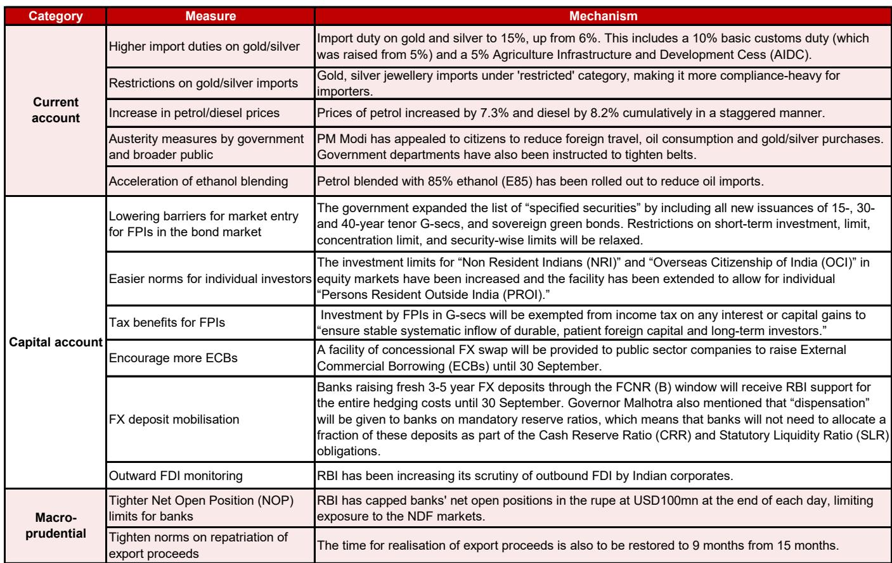
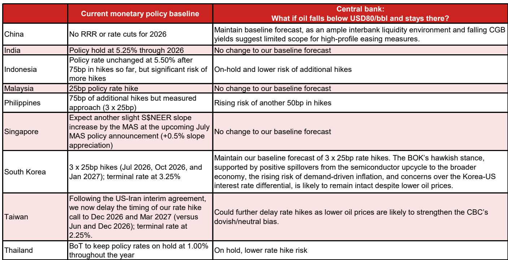
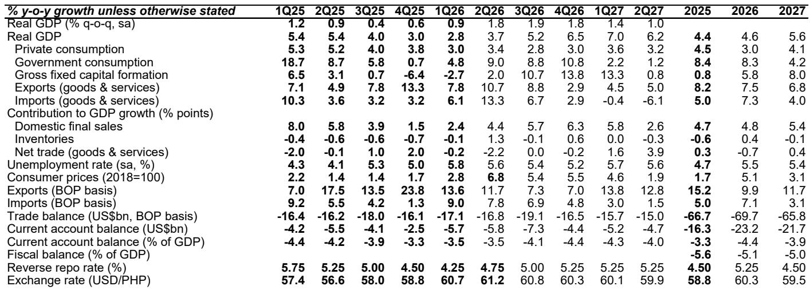

# 厄尔尼诺对亚洲的最大威胁并非食品通胀，而是需求侧增长冲击

围绕厄尔尼诺对亚洲影响的主流叙事，往往聚焦于食品价格上涨和央行政策收紧。这种叙事可能并不完整，甚至存在误导。在分析了过去25年间七次厄尔尼诺事件后，证据指向一个反直觉的结论：在严重的厄尔尼诺事件期间，新兴亚洲地区的食品通胀实际上平均有所下降，而真正的冲击在于农业产出的显著收缩。需求侧的增长冲击被广泛低估，其对财政政策、贸易动态和市场观察的影响，比单纯的通胀故事更为深远。

这一点之所以重要，是因为厄尔尼诺现象已正式形成。今年6月，南方涛动指数降至-24.9，为二十多年来的最低水平之一。美国国家海洋和大气管理局预测，从8月开始，情况将从中等强度过渡到强至非常强，峰值可能出现在今年晚些时候。“超级厄尔尼诺”是一种可能的情景。对于那些依赖传统应对策略、因感知到的通胀压力而收紧政策的观察者和决策者而言，风险不仅在于判断错误，更在于方向性错误。

本分析的核心论点是，亚洲对厄尔尼诺引发的食品通胀的韧性已得到结构性改善，但其对农业产出冲击及由此带来的增长层面影响的脆弱性并未降低。从25年数据中得出的八条经验表明，油价、灌溉基础设施和积极的政府政策有时比降雨量更为关键。真正需要思考的战略问题，并非食品价格是否会上涨，而是农业收入下降带来的需求侧后果，是否会引发当前预测尚未充分计入的更广泛的经济放缓。

## 通胀与食品价格之间的关联已被三个结构性因素打破，历史模式难以作为可靠参考

数据中最引人注目的发现是，在严重的厄尔尼诺年份，新兴亚洲地区的食品通胀实际上平均下降了1.5个百分点，而整体通胀也以类似幅度下降。这与传统认知的预期相反。农业产出下降了2.4个百分点，但对消费者价格的传导却微乎其微，甚至为负。三个因素解释了这一看似矛盾的现象。

首先，油价在塑造食品通胀动态方面扮演着主导角色，其影响往往超过天气冲击的直接作用。2015-16年和2023-24年的严重厄尔尼诺事件，恰逢油价下跌时期，这降低了整个食品供应链中的运输和化肥成本。当油价下跌时，食品生产和分销的成本结构得到改善，抵消了供应减少带来的上行压力。反之亦然：如果严重的厄尔尼诺伴随油价上涨，将会产生截然不同的通胀结果。当前的预测假设油价温和，这提供了一定的缓冲，但这一假设远非确定。

其次，农业韧性的结构性改善降低了食品价格对天气冲击的敏感度。灌溉覆盖面的扩大、种子质量的提升、仓储基础设施的改进以及更高效的供应链，都降低了生产短缺向消费者价格的传导。印度等国家在过去二十年中对灌溉进行了大量投入，减少了依赖雨养农业的比例。这虽然不能消除产出冲击，但通过平滑供应，确实抑制了价格冲击。

第三，积极且主动的政府政策已成为常态。亚洲各国政府从过去的经验中学习，现在部署了一系列工具：主粮的缓冲库存、进口关税减免、价格控制以及对农民和消费者的直接补贴。这些政策旨在防止食品价格飙升演变为政治不稳定因素。这些政策缓冲的存在意味着，通胀渠道现在在一定程度上是可控的，而非纯粹由市场驱动。

结论很明确：任何仅基于降雨模式或历史相关性来预测食品通胀的人，都忽略了已经削弱两者关联的结构性变化。通胀风险并非不存在，但它取决于那些常常被忽视的因素。

## 菲律宾和印度面临最高风险敞口，但根本原因不同

并非所有亚洲经济体都同等程度地暴露于厄尔尼诺风险之下，且风险敞口的性质也各不相同，这对市场观察具有重要意义。报告指出，菲律宾和印度最为脆弱，其次是印度尼西亚和泰国。但它们的脆弱性特征截然不同。

菲律宾面临独特的风险，因为它是一个食品净进口国，食品进口约占其GDP的2%。主粮大米占其消费者价格指数篮子的8.9%，为区域内最高。这意味着任何全球大米价格的上涨都会直接传导至国内通胀。菲律宾无法像较大的生产国那样依赖国内缓冲库存，其政策选择也更为有限。这里的风险主要是通胀性的，并可能对家庭消费和政治稳定产生次级影响。

印度的风险则不同。印度是一个农业大国，主要风险在于产出而非价格。在当前季风季节，6月1日至7月8日的降雨量比正常水平低15%，夏季作物播种量同比下降20.8%，其中大米和油籽降幅居前。农业部门雇佣了印度近一半的劳动力，显著的产出冲击会减少农村收入，进而抑制对消费品、两轮车、化肥及其他农村敏感行业的需求。通胀渠道通过政府采购和缓冲库存得到部分控制，但需求侧的增长冲击是真实存在的，且常常被低估。

印度尼西亚和泰国面临中等风险敞口，风险分别集中在棕榈油和大米等特定商品上。对泰国而言，经常账户是一个特别值得关注的领域：报告指出，泰国的经常账户在厄尔尼诺期间可能转为赤字，这一重大变化将削弱泰铢并使货币政策复杂化。

战略性的洞察在于，观察者需要区分通胀脆弱型经济体和增长脆弱型经济体。政策应对会有所不同，对资产价格的影响也将各异。

## 央行不应自动收紧，真正的政策应对应是财政和供给侧措施

市场对厄尔尼诺预警的传统反应是预期货币政策收紧，尤其是在新兴亚洲地区。这是一个误区。数据显示，在严重的厄尔尼诺事件期间，该地区的央行并未一致加息。事实上，整体通胀下降与增长疲软相结合，往往导致政策宽松或维持观望。

原因很简单：如果厄尔尼诺并未导致食品通胀持续上升，并且产出冲击减少了总需求，那么收紧政策将适得其反。冲击的供给侧性质意味着货币政策是一种粗放的工具。加息以应对蔬菜价格的暂时上涨，只会加剧需求侧疲软，而无法解决根本问题。

第一道防线是财政和供给侧政策。政府释放缓冲库存、降低进口关税、提供补贴并实施价格控制。这些措施在控制通胀方面行之有效，且具有政治上的受欢迎度。风险不在于央行反应过度，而在于那些已经面临高额赤字国家的财政能力将受到压力。报告指出，亚洲各国的财政平衡已面临压力，多个国家的赤字超过GDP的4%。厄尔尼诺冲击增加了这一负担，可能挤占其他支出优先事项。

次级影响是，贸易保护主义成为一个主要风险。当国内食品供应受到威胁时，政府倾向于实施出口禁令或进口限制。这在2008年粮食危机期间以及2022-23年食品价格高企期间都曾出现。此类措施会加剧全球价格波动并引发外交紧张。报告明确指出，贸易保护主义是未来几个月的一个主要风险，其宏观影响可能比直接的天气效应更大。

## 报告未完全解答的问题：厄尔尼诺与全球AI驱动的出口周期之间的相互作用

报告为理解厄尔尼诺对农业、通胀和增长的影响提供了一个全面的框架。但它留下了一些重要的未解问题，特别是关于厄尔尼诺与亚洲更广泛经济周期之间的相互作用。

最关键的未解问题之一是，厄尔尼诺将如何与当前由全球人工智能繁荣驱动的出口上升周期相互作用。报告单独分析了亚洲芯片出口周期是否已见顶，但并未将这一分析与厄尔尼诺框架完全整合。如果AI驱动的出口繁荣持续，它可能抵消台湾、韩国和中国部分地区农业领域的需求侧疲软。但如果出口周期恰好在农业冲击到来时见顶，那么两者叠加的影响可能非常严重。

另一个未解问题是对能源市场的影响。厄尔尼诺通常会减少东南亚的水力发电，增加对煤炭和天然气的需求。这可能在该地区已经应对能源转型成本之际推高能源价格。报告假设油价温和，但厄尔尼诺、水电短缺和能源需求之间的相互作用并未得到充分探讨。

最后，报告并未完全阐述对货币市场的影响。如果厄尔尼诺削弱了泰国、印度和菲律宾的经常账户，同时加强了印度尼西亚和马来西亚等能源出口经济体的经常账户，由此产生的货币分化可能创造显著的跨境市场机会和风险。报告提供了进行此类分析的要素，但未进行综合。

## 观察者的决策框架：三个问题判断您的厄尔尼诺风险敞口

对于希望将这一分析付诸实践的观察者，三个问题提供了一个评估风险敞口和进行定位的结构化框架。

首先，您面临的是通胀渠道还是增长渠道的风险？如果您的关注点集中在日常消费品、食品加工或零售领域，那么通胀渠道更为重要。应关注缓冲库存低、食品进口依赖度高的国家，特别是菲律宾。如果您的关注点偏向农村消费、汽车或化肥领域，那么增长渠道更为重要。应关注印度和泰国，这些国家的农业产出冲击会直接减少农村需求。

其次，您对油价的假设是什么？报告发现油价可以覆盖厄尔尼诺的直接影响，这意味着您对厄尔尼诺的看法取决于您对油价的看法。如果您预期油价保持温和，通胀风险是可控的。如果您预期油价上涨，通胀风险将重新显著出现，政策应对可能从财政宽松转向货币收紧。这是与天气无直接关系的最重要变量。

第三，厄尔尼诺如何与国内政策周期相互作用？几个亚洲国家即将迎来选举，或政府财政空间有限。对厄尔尼诺的政策应对将受到政治激励的塑造，而不仅仅是经济逻辑。财政状况强劲、缓冲库存充足的国家，如中国和印度尼西亚，有更多空间吸收冲击。财政状况疲弱、通胀高企的国家，如菲律宾和泰国，可能面临更艰难的政策权衡。理解每个国家的政治经济状况对于预测政策结果至关重要。

## 完整报告包含做出这些判断所需的数据和图表

本分析借鉴了一份关于亚洲厄尔尼诺应对策略的综合研究报告的关键发现，该报告涵盖了十个经济体25年的数据。完整报告包括详细的国别影响评估、截至2027年的GDP、通胀、经常账户和政策利率预测表，以及说明历史模式和当前风险的原创图表。显示南方涛动指数、ENSO强度概率以及2026年食品和化肥价格变化的图表，对于理解当前趋势尤为有价值。

报告还包含一个详细附录，列出了每次厄尔尼诺事件对每个国家的影响，使观察者能够构建自己的情景和压力测试。对于任何管理亚洲股票、固定收益或货币风险敞口的人来说，这种精细程度对于做出明智判断至关重要。

加入社区以阅读完整报告并查看原始图表。

*仅供参考。部分内容可能基于源材料通过AI辅助生成、翻译、总结或编辑，可能存在遗漏或错误。请独立核实。这不构成专业建议。*

仅供参考。部分内容可能基于源材料通过AI辅助生成、翻译、总结或编辑，可能存在遗漏或错误。请独立核实。这不构成专业建议。

