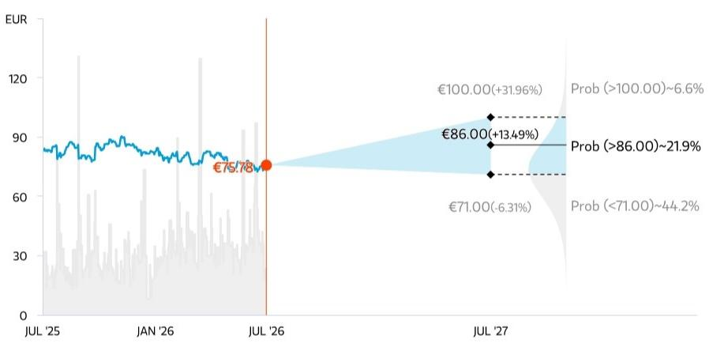
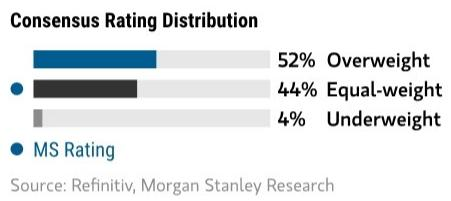
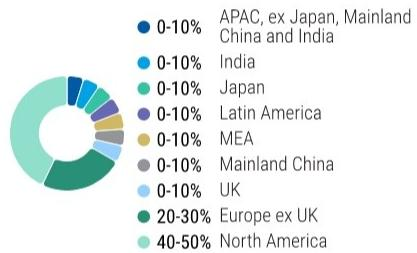
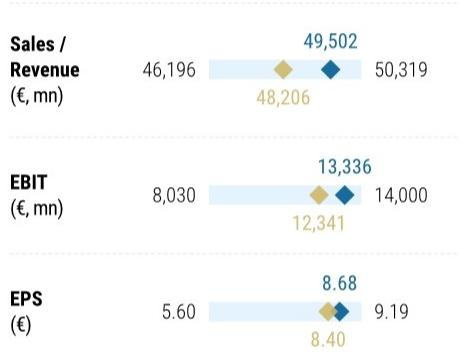
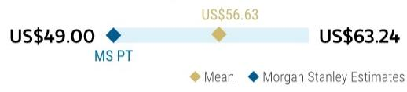
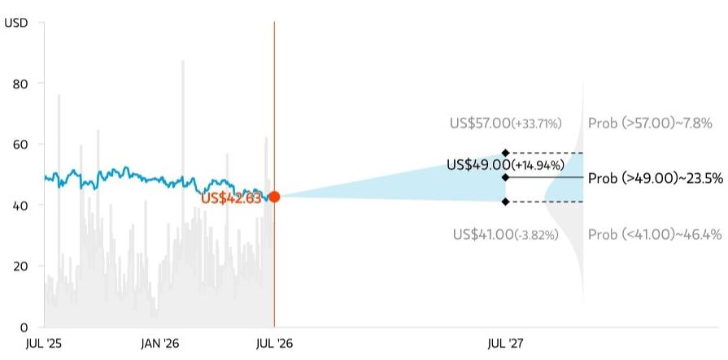
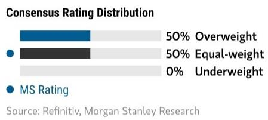
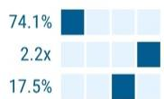
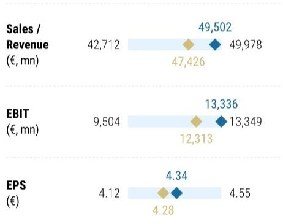

July 8, 2026 03:00 AM GMT

Sanofi SA | Europe

## Q2'26 Preview: 业绩前瞻

<table><tr><td colspan="3">WHAT&#x27;S CHANGED</td></tr><tr><td>Sanofi SA (SASY.PA)</td><td>From</td><td>To</td></tr><tr><td>Price Target</td><td>€90.00</td><td>€86.00</td></tr><tr><td>Sanofi SA (SNY.N)</td><td></td><td></td></tr><tr><td>Price Target</td><td>US$52.00</td><td>US$49.00</td></tr></table>

Sanofi looks set for a solid Q2, with in-line sales and lower R&D driving EPS upside. We see scope for an EPS guidance upgrade while pipeline catalysts remain muted. M&A and new CEO messaging should be the key 2H focus.

Continued Q2 numbers execution ... On our estimates, the quarter looks strong, with sales broadly in line with Street, R&D ~5% below consensus with no major Phase 3 starts, driving ~4% EPS upside and a path to an EPS guidance raise. We estimate Dupixent Q2 sales of €4.4bn (in-line with consensus) and Lantus sales of €413m (4% ahead of street).

... potential for a FY'26 guidance raise. Sanofi have guided for FY'26 group sales to grow by HSD% and EPS to grow slightly ahead of sales (pre the buyback), both at CER. For FY26, we still forecast ~9% CER group revenue growth and ~13.5% CER EPS growth, though continued Dupixent momentum could drive sales growth higher. We expect Sanofi to reiterate sales guidance of HSD% growth YoY and raise EPS growth to low teens % YoY (MSe share buyback is ~1% accretive to business EPS).

Little left in 2026 on pipeline newsflow, with expectations muted. We expect the new CEO, Belén Garijo, to message around continuity, highlighting tighter execution, clearer guidance, more decisive capital allocation and explicit therapeutic area priorities with the leadership change in R&D. Upcoming newsflow includes detailed lunsekimig asthma data at ERS on 5-9 September, where the bar is broadly Tezspire-like exacerbation reduction (60-70%) plus ~0.2L FEV1 benefit to show real differentiation. Amlitelimab ESTUARY / AQUA is more about durability and safety reassurance after the Kaposi's Sarcoma overhang than a clean re-rating event, while expectations on itepekimab' go / no-go decision remain low given a third COPD Phase 3 is required for registration following FDA discussions.

M&A remains the key 2H lever. With pipeline newsflow thin and the next meaningful innovation catalysts largely 2027-weighted, M&A strategy remains in focus. Management has discussed ~€15bn capacity for earlier-stage deals and €20-25bn+ for late-stage / commercial assets. While the Regeneron alliance and whether new assets could be included (e.g. amlitelimab, lunsekimig and the long acting IL-4 / IL-13 bispecifics) remains a lever, alliance alignment makes timing uncertain.

Numbers de-risked, re-rating catalyst unclear. Remain Equal-weight, PT €86 (from €90). With this note, we reduce FY'30-35e revenue by 1-2% and EPS by 1-5% to reflect updated FX assumptions and the removal of riliprubart following

<table><tr><td colspan="2">MS & CO. INTERNATIONAL PLC+</td></tr><tr><td colspan="2">Sarita Kapila</td></tr><tr><td colspan="2">Equity Analyst</td></tr><tr><td>Sarita.Kapila@morganstanley.com</td><td>+44 20 7425-1320</td></tr><tr><td colspan="2">Thibault Boutherin</td></tr><tr><td colspan="2">Equity Analyst</td></tr><tr><td>Thibault.Boutherin@morganstanley.com</td><td>+44 20 7425-9688</td></tr><tr><td colspan="2">Adithya Venkat</td></tr><tr><td colspan="2">Research Associate</td></tr><tr><td>Adithya.Venkat@morganstanley.com</td><td>+44 20 7425-2216</td></tr></table>

<table><tr><td>Stock Rating</td><td>Equal-weight</td></tr><tr><td>Industry View</td><td>In-Line</td></tr><tr><td>Shr price, close (Jul 7, 2026)</td><td>€75.78</td></tr><tr><td>Price target</td><td>€86.00</td></tr><tr><td>52-Week Range</td><td>€91.15-71.25</td></tr><tr><td>Mkt cap, curr (mn)</td><td>€91,905</td></tr></table>

<table><tr><td>Fiscal Year Ending</td><td>12/25</td><td>12/26e</td><td>12/27e</td><td>12/28e</td></tr><tr><td>Sales / Revenue (€mn)**</td><td>46,716</td><td>49,502</td><td>52,063</td><td>54,501</td></tr><tr><td>EBITDA (€mn)**</td><td>13,810</td><td>15,114</td><td>15,689</td><td>17,008</td></tr><tr><td>EBIT (€mn)**</td><td>12,149</td><td>13,336</td><td>13,959</td><td>15,191</td></tr><tr><td>EPS (€)**</td><td>7.83</td><td>8.68</td><td>9.13</td><td>10.04</td></tr><tr><td>ModelWare EPS (€)</td><td>7.80</td><td>8.65</td><td>9.10</td><td>9.99</td></tr><tr><td>Prior EPS (€)**</td><td>-</td><td>8.61</td><td>9.05</td><td>9.98</td></tr><tr><td>EPS (€)§</td><td>7.77</td><td>8.40</td><td>8.94</td><td>9.80</td></tr></table>

Unless otherwise noted, all metrics are based on MS ModelWare framework  
\*\* = Based on consensus methodology  
§ = Consensus data is provided by Refinitiv Estimates  
e = MS estimates

MS does and seeks to do business with companies covered in MS. As a result, investors should be aware that the firm may have a conflict of interest that could affect the objectivity of MS. Investors should consider MS as only a single factor in making their investment decision.

For analyst certification and other important disclosures, refer to the Disclosure Section, located at the end of this report.

+= Analysts employed by non-U.S. affiliates are not registered with FINRA, may not be associated persons of the member and may not be subject to FINRA restrictions on communications with a subject company, public appearances and trading securities held by a research analyst account.

termination of the Phase 3 MOBILIZE study in SOC-refractory CIDP. This drives a ~5% reduction in our price target. Our FY'26 revenue forecast remains consistent with management's high-single-digit CER growth guidance (~9% YoY), while our ~14% CER EPS forecast remains above guidance, which we view as conservative given embedded M&A-related R&D and financing costs that appear unlikely to fully materialize.

Exhibit 1: Q2'26 MSe sales vs Vara consensus

<table><tr><td>EURm</td><td>2Q26E</td><td>2Q26 cons</td><td>MS vs Cons (%)</td><td>MS vs Cons (abs)</td></tr><tr><td>Group sales</td><td>10,800</td><td>10,823</td><td>-0%</td><td>-23</td></tr><tr><td>Biopharma sales</td><td>10,800</td><td>10,823</td><td>-0%</td><td>-23</td></tr><tr><td>Pharma sales</td><td>9,542</td><td>9,578</td><td>-0%</td><td>-36</td></tr><tr><td>Dupixent</td><td>4,427</td><td>4,413</td><td>+0%</td><td>+14</td></tr><tr><td>Pharma launches</td><td>1,225</td><td>1,271</td><td>-4%</td><td>-46</td></tr><tr><td>Nexviazyme</td><td>204</td><td>216</td><td>-6%</td><td>-12</td></tr><tr><td>Sarclisa</td><td>167</td><td>169</td><td>-1%</td><td>-2</td></tr><tr><td>Altuviiio</td><td>370</td><td>380</td><td>-3%</td><td>-10</td></tr><tr><td>Rezurock</td><td>143</td><td>142</td><td>+1%</td><td>+1</td></tr><tr><td>Cablivi</td><td>71</td><td>72</td><td>-2%</td><td>-1</td></tr><tr><td>Xenpozyme</td><td>66</td><td>65</td><td>+1%</td><td>+1</td></tr><tr><td>Tzield</td><td>23</td><td>25</td><td>-8%</td><td>-2</td></tr><tr><td>Ayvakit</td><td>182</td><td>202</td><td>-10%</td><td>-20</td></tr><tr><td>Other products</td><td>3,890</td><td>3,894</td><td>-0%</td><td>-4</td></tr><tr><td>Lantus</td><td>413</td><td>399</td><td>+4%</td><td>+14</td></tr><tr><td>Toujeo</td><td>343</td><td>349</td><td>-2%</td><td>-6</td></tr><tr><td>Lovenox</td><td>176</td><td>186</td><td>-5%</td><td>-10</td></tr><tr><td>Plavix</td><td>227</td><td>222</td><td>+2%</td><td>+5</td></tr><tr><td>Fabrazyme</td><td>267</td><td>263</td><td>+2%</td><td>+4</td></tr><tr><td>Myozyme</td><td>115</td><td>120</td><td>-4%</td><td>-5</td></tr><tr><td>Cerezyme</td><td>162</td><td>168</td><td>-3%</td><td>-6</td></tr><tr><td>Kevzara</td><td>138</td><td>144</td><td>-4%</td><td>-6</td></tr><tr><td>Eloctate</td><td>57</td><td>54</td><td>+5%</td><td>+3</td></tr><tr><td>Alprolix</td><td>136</td><td>139</td><td>-2%</td><td>-3</td></tr><tr><td>Industrial sales</td><td>138</td><td>138</td><td>-0%</td><td>-0</td></tr><tr><td>Other</td><td>1,719</td><td>1,712</td><td>+0%</td><td>+7</td></tr><tr><td>Vaccines</td><td>1,258</td><td>1,245</td><td>+1%</td><td>+13</td></tr><tr><td>Influenza</td><td>132</td><td>135</td><td>-2%</td><td>-3</td></tr><tr><td>Beyfortus</td><td>79</td><td>83</td><td>-5%</td><td>-4</td></tr><tr><td>PPH & Boosters (incl. Heplisav B)</td><td>749</td><td>727</td><td>+3%</td><td>+22</td></tr><tr><td>Meningitis / Travel and endemic vaccines</td><td>298</td><td>301</td><td>-1%</td><td>-3</td></tr></table>

Source: Company-compiled consensus, company data, MS estimates (E)

Exhibit 2: Q2'26 MSe P&L vs. Vara consensus

<table><tr><td>EURm</td><td>2Q26E</td><td>2Q26 cons</td><td>MS vs Cons (%)</td><td>MS vs Cons (abs)</td></tr><tr><td colspan="5">P&L</td></tr><tr><td>Group Sales</td><td>10,800</td><td>10,823</td><td>-0%</td><td>-23</td></tr><tr><td>Other revenues</td><td>650</td><td>755</td><td>-14%</td><td>-105</td></tr><tr><td>COGS</td><td>-3,023</td><td>-3,136</td><td>-4%</td><td>+113</td></tr><tr><td>% of sales</td><td>28.0%</td><td>29.0%</td><td></td><td></td></tr><tr><td>Gross Profit</td><td>8,427</td><td>8,442</td><td>-0%</td><td>-15</td></tr><tr><td>Gross margin (% of sales)</td><td>78.0%</td><td>78.0%</td><td></td><td></td></tr><tr><td>R&D</td><td>-1,870</td><td>-1,963</td><td>-5%</td><td>+93</td></tr><tr><td>% of sales</td><td>17.3%</td><td>18.1%</td><td></td><td></td></tr><tr><td>SG&A</td><td>-2,380</td><td>-2,374</td><td>+0%</td><td>-6</td></tr><tr><td>% of sales</td><td>22.0%</td><td>21.9%</td><td></td><td></td></tr><tr><td>Other operating income/expenses</td><td>-1,194</td><td>-1,212</td><td>-1%</td><td>+18</td></tr><tr><td>Share of profit/loss of associates</td><td>38</td><td>35</td><td>+8%</td><td>+3</td></tr><tr><td>Minorities</td><td>-4</td><td>-3</td><td>+17%</td><td>-1</td></tr><tr><td>Business Operating Income</td><td>3,016</td><td>2,923</td><td>+3%</td><td>+93</td></tr><tr><td>Operating margin</td><td>27.9%</td><td>27.0%</td><td></td><td></td></tr><tr><td>Financial income & expense</td><td>-115</td><td>-106</td><td>+8%</td><td>-9</td></tr><tr><td>Income Tax</td><td>-574</td><td>-569</td><td>+1%</td><td>-5</td></tr><tr><td>Core tax rate</td><td>20.0%</td><td>20.2%</td><td></td><td></td></tr><tr><td>Business EPS</td><td>1.95</td><td>1.88</td><td>+4%</td><td>+0.07</td></tr></table>

Source: Company-compiled consensus, company data, MS estimates (E)

Preview to earnings

<table><tr><td>Focus KPI</td><td>Focus KPI Surprise</td><td>Likely impact to consensus EPS*</td></tr><tr><td colspan="3">Sanofi SA SASY.PA</td></tr><tr><td>EPS</td><td>↑ Likely upside surprise</td><td>↑ Modest revision higher</td></tr><tr><td colspan="3">*Likely impact to consensus EPS is for the next 12 monthsSource: Company data, MS</td></tr></table>

## Risk Reward – Sanofi SA (SASY.PA)

Looking for the Next Chapter

## PRICE TARGET €86.00

We value Sanofi using a DCF analysis with a WACC of $7.4\%$ and a terminal growth rate of $1\%$ .

Consensus Price Target Distribution Source: Refinitiv, MS

## RISK REWARD CHART AND OPTIONS IMPLIED PROBABILITIES (12M)

  
Key: — Historical Stock Performance ● Current Stock Price ◆ Price Target

Source: Refinitiv, MS, MS Institutional Equities Division. The probabilities of our Bull, Base, and Bear case scenarios playing out were estimated with implied volatility data from the options market as of 7 Jul 2026. All figures are approximate risk-neutral probabilities of the stock reaching beyond the scenario price in either three-months' or one-years' time. View explanation of Options Probabilities methodology here

## EQUAL-WEIGHT THESIS

Q1 supports upside to 2026 numbers and scope for a Q2 guidance raise, but the equity story remains catalyst-light. With key pipeline readouts now in 2027 and CEO/M&A actions likely back-end loaded, the cheap valuation alone may not close the discount. Equal-weight; PT €86.

## Risk Reward Themes

Secular Growth: Positive View descriptions of Risk Rewards Themes here

## BULL CASE

## €100.00 BASE CASE

## ~12x 2026e bull case EPS

~+7% revenue / ~+11% EPS CAGR 2026-29. Pivotal pipeline delivers unlocking ~€9bn of peak sales by 2035. In this scenario, we expect Sanofi to partially close the valuation gap to peers, with pipeline uncertainty lifting.

## ~10x 2026e base case EPS

~+5% revenue / ~+8% EPS CAGR 2026-29. We assume +70bps of operating margin expansion in 2026 and the pipeline contributes ~€6bn to group sales by 2035.

## €86.00 BEAR CASE

€71.00

## ~9x 2026e bear case EPS

~+2% revenue / ~+5% EPS CAGR 2026-29. We assume flat operating margins in 2026 and 70bps of decline in 2027 based on greater internal R&D spend to bolster the pipeline. We assume the pipeline contributes ~€5bn to sales by 2035.

## Risk Reward – Sanofi SA (SASY.PA)

## KEY EARNINGS INPUTS

<table><tr><td>Drivers</td><td>2025</td><td>2026e</td><td>2027e</td><td>2028e</td></tr><tr><td>Group sales growth at CER (%)</td><td>9.9</td><td>9.1</td><td>5.7</td><td>5.0</td></tr><tr><td>Pharma sales growth at CER (%)</td><td>12.2</td><td>10.6</td><td>6.1</td><td>5.2</td></tr><tr><td>Core group gross margin (%)</td><td>77.5</td><td>77.9</td><td>78.7</td><td>79.4</td></tr><tr><td>Core group operating margin (%)</td><td>27.8</td><td>28.5</td><td>28.2</td><td>29.3</td></tr><tr><td>Core EPS growth at CER (%)</td><td>15.0</td><td>13.5</td><td>5.3</td><td>9.9</td></tr></table>

## INVESTMENT DRIVERS

• Dupixent & Vaccines growth

\- New launches momentum & royalty contributions

\- Success of pharma and the emerging vaccines pipeline

GLOBAL REVENUE EXPOSURE  
  
Source: MS Estimate View explanation of regional hierarchies here  
- Dupixent continues to outperform expectations driven by indication expansion and LCM  
• Positive data from pipeline assets  
- Value creative M&A

## MS ALPHA MODELS

Source: Refinitiv, FactSet, MS; 1 is the highest favored Quintile and 5 is the least favored Quintile

## RISKS TO PT/RATING

## RISKS TO UPSIDE

## RISKS TO DOWNSIDE

\- New competition across immunology indications creates pricing pressure

\- Greater disruption of the vaccine franchise (e.g. flu and RSV competition)

• Further pipeline setbacks create concentration risk

## OWNERSHIP POSITIONING

<table><tr><td>Inst. Owners, % Active</td><td>58.5%</td></tr><tr><td>HF Sector Long/Short Ratio</td><td>2.6x</td></tr><tr><td>HF Sector Net Exposure</td><td>13.1%</td></tr></table>

Refinitiv; MSPB Content. Includes certain hedge fund exposures held with MSPB. Information may be inconsistent with or may not reflect broader market trends. Long/Short Ratio = Long Exposure / Short exposure. Sector % of Total Net Exposure = (For a particular sector: Long Exposure - Short Exposure) / (Across all sectors: Long Exposure – Short Exposure).

MS ESTIMATES VS. CONSENSUS FY Dec 2026e  
  
◆ Mean ◆ MS Estimates
Source: Refinitiv, MS

## Risk Reward – Sanofi SA (SNY.N)

Looking for the Next Chapter

## PRICE TARGET US$49.00

We value Sanofi using a DCF analysis with a WACC of 7.4% and a terminal growth rate of 1%. The ADR ratio is 1:2 and using EUR:USD of 1.15 leads to an ADR price target of $49.

Consensus Price Target Distribution

Source: Refinitiv, MS

## RISK REWARD CHART AND OPTIONS IMPLIED PROBABILITIES (12M)

  
Key: — Historical Stock Performance ● Current Stock Price ◆ Price Target

Source: Refinitiv, MS, MS Institutional Equities Division. The probabilities of our Bull, Base, and Bear case scenarios playing out were estimated with implied volatility data from the options market as of 6 Jul 2026. All figures are approximate risk-neutral probabilities of the stock reaching beyond the scenario price in either three-months' or one-years' time. View explanation of Options Probabilities methodology here

## EQUAL-WEIGHT THESIS

Q1 supports upside to 2026 numbers and scope for a Q2 guidance raise, but the equity story remains catalyst-light. With key pipeline readouts now in 2027 and CEO/M&A actions likely back-end loaded, the cheap valuation alone may not close the discount. Downgrade to Equal-weight; PT $49.

Risk Reward Themes Secular Growth: Positive View descriptions of Risk Rewards Themes here

## BULL CASE

## US$57.00 BASE CASE

## ~12x 2026e bull case EPS

~+7% revenue / ~+11% EPS CAGR 2026-29. Pivotal pipeline delivers unlocking ~€9bn of peak sales by 2035. In this scenario, we expect Sanofi to partially close the valuation gap to peers, with pipeline uncertainty lifting.

## ~10x 2026e base case EPS

## US$49.00 BEAR CASE

~+5% revenue / ~+8% EPS CAGR 2026-29. We assume +50bps of operating margin expansion in 2026 and the pipeline contributes ~€6bn to group sales by 2035.

US$41.00

## ~9x 2026e bear case EPS

~+2% revenue / ~+5% EPS CAGR 2026-29. We assume flat operating margins in 2026 and 70bps of decline in 2027 based on greater internal R&D spend to bolster the pipeline. We assume the pipeline contributes ~€5bn to sales by 2035.

  
◆ Mean ◆ MS Estimates
Source: Refinitiv, MS

## Risk Reward – Sanofi SA (SNY.N)

KEY EARNINGS INPUTS

<table><tr><td>Drivers</td><td>2025</td><td>2026e</td><td>2027e</td><td>2028e</td></tr><tr><td>Group sales growth at CER (%)</td><td>9.9</td><td>9.1</td><td>5.7</td><td>5.0</td></tr><tr><td>Pharma sales growth at CER (%)</td><td>12.2</td><td>10.6</td><td>6.1</td><td>5.2</td></tr><tr><td>Core group gross margin (%)</td><td>77.5</td><td>77.9</td><td>78.7</td><td>79.4</td></tr><tr><td>Core group operating margin (%)</td><td>27.8</td><td>28.5</td><td>28.2</td><td>29.3</td></tr><tr><td>Core EPS growth at CER (%)</td><td>15.0</td><td>13.5</td><td>5.3</td><td>9.9</td></tr></table>

## INVESTMENT DRIVERS

• Dupixent & Vaccines growth

\- New launches momentum & royalty contributions

\- Success of pharma and the emerging vaccines pipeline

GLOBAL REVENUE EXPOSURE  
  
Source: MS Estimate View explanation of regional hierarchies here  
- Dupixent continues to outperform expectations driven by indication expansion and LCM  
• Positive data from pipeline assets  
• Stronger new launch + Amvuttra momentum than expected  
- Value creative M&A

## RISKS TO PT/RATING

## RISKS TO UPSIDE

## RISKS TO DOWNSIDE

\- New competition across immunology indications creates pricing pressure

\- Greater disruption of the vaccine franchise (e.g. flu and RSV competition)

• Further pipeline setbacks create concentration risk

## OWNERSHIP POSITIONING

<table><tr><td>Inst. Owners, % Active</td><td>74.1%</td></tr><tr><td>HF Sector Long/Short Ratio</td><td>2.2x</td></tr><tr><td>HF Sector Net Exposure</td><td>17.5%</td></tr></table>

Refinitiv; MSPB Content. Includes certain hedge fund exposures held with MSPB. Information may be inconsistent with or may not reflect broader market trends. Long/Short Ratio = Long Exposure / Short exposure. Sector % of Total Net Exposure = (For a particular sector: Long Exposure - Short Exposure) / (Across all sectors: Long Exposure – Short Exposure).

MS ESTIMATES VS. CONSENSUS FY Dec 2026e  

## Risk Reward Reference links

1. View explanation of Options Probabilities methodology -

Options\_Probabilities\_Exhibit\_Link.pdf

2. View descriptions of Risk Rewards Themes - RR\_Themes\_Exhibit\_Link.pdf

3. View explanation of regional hierarchies - GEG\_Exhibit\_Link.pdf

4. View explanation of Theme/Exposure methodology -

ESG\_Sustainable\_Solutions\_External\_Link.pdf

5. View explanation of HERS methodology - ESG\_HERS\_External\_Link.pdf

## Disclosure Section

The information and opinions in MS were prepared or are disseminated by MS Europe S.E., regulated by Bundesanstalt fuer Finanzdienstleistungsaufsicht (BaFin) and/or MS & Co. International plc, authorized by the Prudential Regulation Authority and regulated by the Financial Conduct Authority and the Prudential Regulation Authority. MS & Co. International plc disseminates in the UK research that it has prepared, and which has been prepared by any of its affiliates, only to persons who (i) are investment professionals falling within Article 19(5) of the Financial Services and Markets Act 2000 (Financial Promotion) Order 2005 (as amended, the "Order"); (ii) are persons who are high net worth entities falling within Article 49(2)(a) to (d) of the Order; or (iii) are persons to whom an invitation or inducement to engage in investment activity (within the meaning of section 21 of the Financial Services and Markets Act 2000, as amended) may otherwise lawfully be communicated or caused to be communicated. As used in this disclosure section, MS includes RMB MS Proprietary Limited, MS Europe S.E., MS & Co International plc and its affiliates.

For important disclosures, stock price charts and equity rating histories regarding companies that are the subject of this report, please see the MS Disclosure Website at www.morganstanley.com/eqr/disclosures/webapp/generalresearch, or contact your investment representative or MS at 1585 Broadway, (Attention: Research Management), New York, NY, 10036 USA.

For valuation methodology and risks associated with any recommendation, rating or price target referenced in this research report, please contact the Client Support Team as follows: US/Canada +1 800 303-2495; Hong Kong +852 2848-5999; Latin America +1 718 754-5444 (U.S.); London +44 (0)20-7425-8169; Singapore +65 6834-6860; Sydney +61 (0)2-9770-1505; Tokyo +81 (0)3-6836-9000. Alternatively you may contact your investment representative or MS at 1585 Broadway, (Attention: Research Management), New York, NY 10036 USA.

## Analyst Certification

The following analysts hereby certify that their views about the companies and their securities discussed in this report are accurately expressed and that they have not received and will not receive direct or indirect compensation in exchange for expressing specific recommendations or views in this report: Thibault Boutherin; Sarita Kapila; Adithya Venkat.

## Global Research Conflict Management Policy

MS has been published in accordance with our conflict management policy, which is available at www.morganstanley.com/institutional/research/conflictpolicies. A Portuguese version of the policy can be found at www.morganstanley.com.br

## Important Regulatory Disclosures on Subject Companies

As of May 29, 2026, MS beneficially owned 1% or more of a class of common equity securities of the following companies covered in MS: AstraZeneca Plc, Bayer AG, Galderma Group AG, Grifols SA, Lonza Group AG, Novo Nordisk A/S, Sanofi SA, Sartorius Stedim Biotech SA.

Within the last 12 months, MS managed or co-managed a public offering (or 144A offering) of securities of AstraZeneca Plc, Galderma Group AG, Sanofi SA.

Within the last 12 months, MS has received compensation for investment banking services from AstraZeneca Plc, Bayer AG, Grifols SA, GSK plc, Novo Nordisk A/S, Sanofi SA. In the next 3 months, MS expects to receive or intends to seek compensation for investment banking services from Alvotech SA, AstraZeneca Plc, Bayer AG, Galderma Group AG, Grifols SA, GSK plc, Lonza Group AG, Merck KGaA, Novartis AG, Novo Nordisk A/S, Roche Holding AG, Sandoz Group AG, Sanofi SA, Sartorius AG, Teva Pharmaceutical Industries Ltd., UCB S.A..

Within the last 12 months, MS has received compensation for products and services other than investment banking services from Alvotech SA, AstraZeneca Plc, Bayer AG, Galderma Group AG, Grifols SA, GSK plc, Lonza Group AG, Merck KGaA, Novartis AG, Novo Nordisk A/S, Roche Holding AG, Sanofi SA, Teva Pharmaceutical Industries Ltd., UCB S.A..

Within the last 12 months, MS has provided or is providing investment banking services to, or has an investment banking client relationship with, the following company: Alvotech SA, AstraZeneca Plc, Bayer AG, Galderma Group AG, Grifols SA, GSK plc, Lonza Group AG, Merck KGaA, Novartis AG, Novo Nordisk A/S, Roche Holding AG, Sandoz Group AG, Sanofi SA, Sartorius AG, Teva Pharmaceutical Industries Ltd., UCB S.A..

Within the last 12 months, MS has either provided or is providing non-investment banking, securities-related services to and/or in the past has entered into an agreement to provide services or has a client relationship with the following company: Alvotech SA, AstraZeneca Plc, Bayer AG, Galderma Group AG, Grifols SA, GSK plc, Lonza Group AG, Merck KGaA, Novartis AG, Novo Nordisk A/S, Roche Holding AG, Sanofi SA, Teva Pharmaceutical Industries Ltd., UCB S.A..

MS & Co. LLC makes a market in the securities of Alvotech SA.

MS & Co. International plc is a corporate broker
