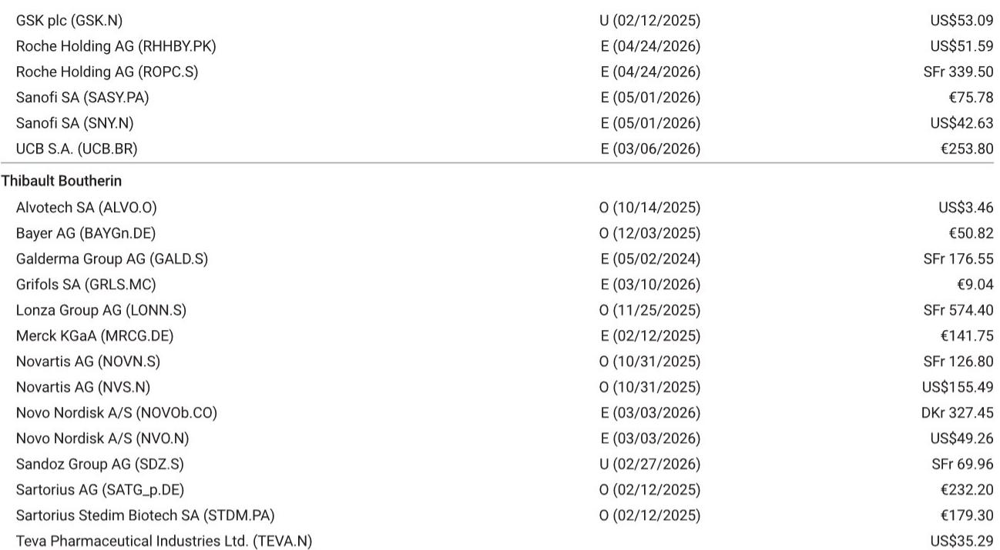
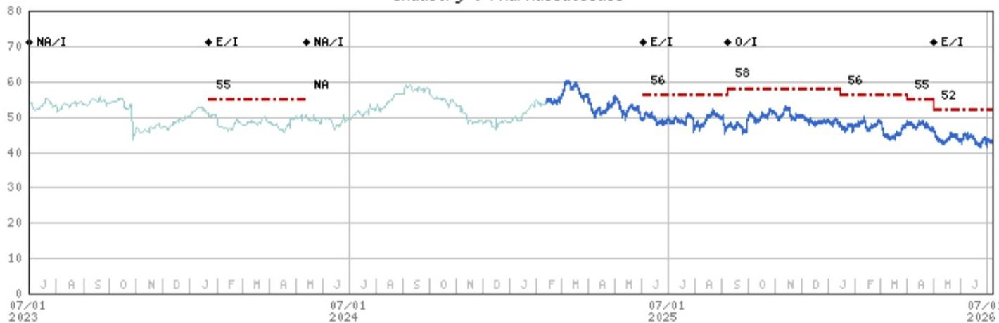
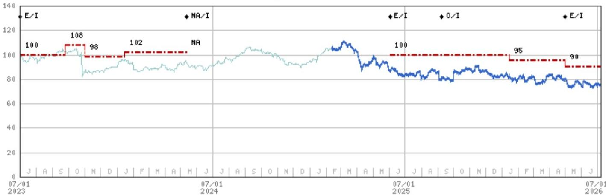

# Sanofi Q2'26 业绩前瞻：执行稳健，但市场需要更多信号

第二季度业绩预计将符合市场对Sanofi的普遍预期：扎实的执行力、温和的业绩超预期以及指引上调。根据详细的研究分析，Sanofi Q2'26 销售额预计基本符合市场共识，约为108亿欧元，而研发支出比市场预期低约5%，这将推动业务每股收益比预期高出约4%。核心产品Dupixent持续表现良好，预计销售额为44亿欧元，与市场预期一致；甚至老牌产品Lantus也展现出韧性，销售额为4.13亿欧元，比市场预期高出4%。

当前的核心问题并非Sanofi能否交出满意的季度答卷，而是好于预期的业绩和上调的全年展望，是否足以推动一家远期市盈率约为10倍、相对于欧洲同行持续折价的公司股价上行。基于分析，答案比简单的“业绩超预期并上调指引”更为复杂。

这一观察之所以重要，是因为Sanofi正进入一个关键的过渡期。公司在新CEO Belen Garijo的领导下，2026年剩余时间内的研发管线新闻流较为稀疏，且管理层已表示资产负债表已准备好进行部署。第二季度业绩将为下半年定下基调，但真正推动估值重估的催化剂在于季度业绩周期之外。仅关注Q2数据的观察者可能忽略战略全貌：Sanofi的短期财务状况风险较低，但其中期估值催化剂尚不明确。

核心论点很直接：Sanofi的盈利能力真实且正在改善，但其股权故事仍处于强劲的运营基础与不确定的管线未来之间。仅凭业绩超预期无法推动估值重估。它需要要么能改变增长轨迹的管线数据，要么能说服市场管理层可以明智部署资产负债表的资本配置策略。Q2前瞻厘清了等式的前半部分，后半部分仍有待解答。

## 研发纪律与Dupixent势头为EPS指引上调铺平道路

Q2前瞻最重要的洞察并非收入数字，而是成本结构。预计本季度研发支出为18.7亿欧元，比市场共识低约9300万欧元。这并非投资不足的信号，而是反映了该时期缺乏大型三期临床研究的启动，这是临床周期中的自然间歇期，创造了暂时的利润率顺风。

这种研发纪律，加上稳定的营收表现，直接转化为运营杠杆。分析估计Q2业务营业收入为30.2亿欧元，比市场共识高出约3%，营业利润率为27.9%，而市场预期为27.0%。这90个基点的利润率超预期表现是预计EPS超预期背后的驱动力。

对全年指引的影响是显著的。Sanofi此前指引为高个位数CER销售增长，以及略高于销售增长的EPS增长（回购前）。分析预测全年CER收入增长约9%，CER EPS增长约13.5%。鉴于Q2表现优于计划且Dupixent势头持续，最可能的结果是管理层重申销售指引，并将EPS指引上调至低两位数百分比同比增长。约1%的温和回购增厚提供了进一步支撑。

战略要点是，Sanofi的财务引擎正全速运转。Dupixent仍是支柱，但更广泛的产品组合也在贡献力量。Lantus表现好于预期。疫苗板块，特别是PPH和加强针，比市场共识高出3%。成本基础控制良好。对于未来六到十二个月，盈利轨迹是多年来最为清晰的。

## 2026年管线日程近乎空白，并购成为近期相对少见估值重估催化剂

如果说业绩故事清晰，那么管线故事则明显沉寂。分析指出，“2026年管线新闻流所剩无几，市场预期低迷。”这是一个关键观察，因为Sanofi相对于同行的估值折价历来是由管线不确定性所证明的。缺乏数据催化剂来弥合这一差距，公司报价将保持停滞。

最值得关注的近期数据点是9月初欧洲呼吸学会大会上公布的lunsekimig哮喘详细数据。差异化门槛很高：读者将寻找类似Tezspire的60-70%范围内急性加重减少，以及约0.2L FEV1的获益。达到这一门槛将是积极的，但已部分被市场定价。超出预期将是真正的催化剂，但分析并未预示高期望。

对于amlitelimab，ESTUARY和AQUA数据解读并非作为重估事件，而是在卡波西肉瘤事件后作为“耐久性和安全性 reassurance”的练习。市场需要看到该安全信号是异常现象，而非类别效应。这对于该资产保持其期权价值是必要的，但不太可能单独推动估值倍数扩张。

Itepekimab面临更高的门槛。分析指出，对其继续或终止决策的期望仍然较低，因为在与FDA讨论后，需要进行COPD的第三个三期临床才能注册。积极的解读将是一个有意义的惊喜，但监管路径仍然漫长。

最终结果是，Sanofi的下一个有意义管线催化剂主要指向2027年。在2026年剩余时间内，公司必须依靠战略行动而非临床数据来改变叙事。这给并购讨论带来了巨大压力。

## Sanofi拥有资产负债表火力，但部署时机与结构仍不确定

管理层已明确表达了其进行交易的能力，讨论了约150亿欧元用于早期资产，以及200-250亿欧元或更多用于晚期或商业化阶段资产。这些是庞大的数字，如果明智地部署，可能重塑增长格局并缩小估值差距。

分析将再生元联盟确定为一个关键杠杆。该合作已包含Dupixent，问题在于新资产如amlitelimab、lunsekimig或长效IL-4/IL-13双特异性抗体是否可能被纳入合作。这在战略上是合理的，因为它将协调激励措施并可能加速开发。然而，分析指出，“联盟协调使得时机不确定。”再生元关系复杂，任何重组都需要双方同意。

在再生元之外，更广泛的并购市场活跃但竞争激烈。Sanofi拥有追求重大交易的资产负债表，但市场正在为高质量的免疫学和罕见病资产定价溢价。风险在于Sanofi要么支付过高，稀释自身管线的价值，要么未能找到合适的目标，导致资产负债表部署不足。

对观察者而言的战略问题是，仅靠并购能否推动估值重估。历史表明，制药行业的大规模收购往往在缺乏明确成本协同目标或管线加速的情况下破坏价值。Sanofi管理层已表示在新CEO领导下将采取更果断的资本配置，但市场在看到交易的具体形态之前不会给予信任。

## Q2前瞻未告知我们的：影响中期前景的未解问题

分析在季度数据和近期展望方面很透彻，但它留下了几个有意义的问题未解答。这些问题将决定Sanofi是保持价值陷阱还是成为重估故事。

首先，新CEO在连续性之外的战略愿景是什么？分析预计Belen Garijo将传达“更严格的执行、更清晰的指引、更果断的资本配置和明确的治疗领域优先级。”但市场需要具体细节。哪些治疗领域将被优先考虑？Sanofi会加倍押注免疫学，还是多元化进入新领域？Q2电话会议及随后的读者活动将受到密切关注以寻找信号。

其次，Sanofi计划如何管理Dupixent专利悬崖？Dupixent是公司最重要的资产，虽然它通过适应症扩展继续增长，但专利保护窗口是有限的。分析未直接解决这个问题，但这是投资论点中最大的长期风险。可能取代Dupixent收入贡献的管线资产距离商业化仍有数年时间。

第三，到2035年管线实现60亿欧元或以上峰值销售额的现实概率是多少？分析将此作为基本情景假设，但单个资产概率未被量化。Lunsekimig、amlitelimab和itepekimab各自面临重大的临床和监管障碍。这些资产中有一两个失败的情景将显著改变长期增长轨迹。

第四，Sanofi会将其资产负债表用于补强型收购还是变革性交易？两者都有能力，但战略影响非常不同。一系列较小的交易将填补管线空白而不改变风险状况。一项大型交易将表明雄心，但带有整合风险。

## Sanofi观察者的决策框架：三种情景及其对定位的意义

对于试图理解当前格局的观察者，基于情景的框架比点预测更有用。分析提供了牛市、基准和熊市情景，但以下决策框架将其转化为可操作的定位。

情景一：执行交易。这是Q2前瞻中嵌入的基准情景。Sanofi交出符合或略高于市场共识的业绩，上调EPS指引，并维持当前战略姿态。公司报价在72欧元至86欧元区间交易，受业绩支撑但受管线不确定性限制。对于满足于12个月内10-15%总回报的观察者，这是一个可行的头寸。风险在于公司报价可能停滞不前，因为估值折价未能缩小。

情景二：催化剂交易。这需要两件事之一发生：要么管线数据点意外向好，要么管理层宣布一项可信的并购交易以加速增长格局。在此情景下，随着与同行折价收窄，公司报价可能重估至90-100欧元区间。分析表明这在短期内是可能的但可能性不大，鉴于管线日程稀疏和并购时机不确定。

情景三：价值陷阱。这是熊市情景。业绩令人失望，管线出现挫折，或并购被视为价值破坏。公司报价向71欧元熊市情景目标靠拢，估值折价进一步扩大。鉴于运营势头，此情景可能性较低，但不能完全排除。

对于大多数观察者，合适的立场是报告观点并倾向于耐心。Q2业绩将是积极的，但它们已部分被市场定价。真正的决策点出现在2026年下半年，届时新CEO的战略将更加清晰，并购图景也将成形。在此之前，公司报价是一个需要证明自己的故事，具有良好但非极佳的近期可见度。

## 社区邀请：更深入的分析需要完整图景

Q2前瞻为Sanofi的近期运营实力提供了清晰的窗口，但完整的投资论点需要更深入地理解管线概率、并购格局以及免疫学和疫苗领域的竞争动态。此处引用的分析包括详细的收入细分、利润率预测以及超出单篇文章所能总结的风险回报情景。

对于希望查看原始图表、市场共识比较以及驱动牛市、基准和熊市情景的完整假设集的观察者，完整报告是值得读材料。关于Dupixent适应症扩展、具体管线时间表以及资产负债表容量分析的数据均可在原始文档中找到。

加入社区以阅读完整报告并查看原始图表。

*仅供参考。部分内容可能基于源材料通过AI辅助生成、翻译、总结或编辑，可能存在遗漏或错误。请独立核实。这不构成专业建议。*

仅供参考。部分内容可能基于源材料通过AI辅助生成、翻译、总结或编辑，可能存在遗漏或错误。请独立核实。这不构成专业建议。

