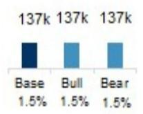
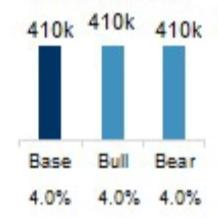
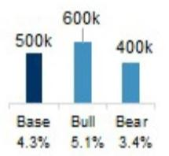
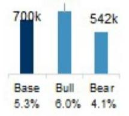
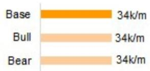
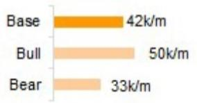
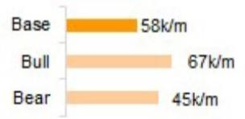
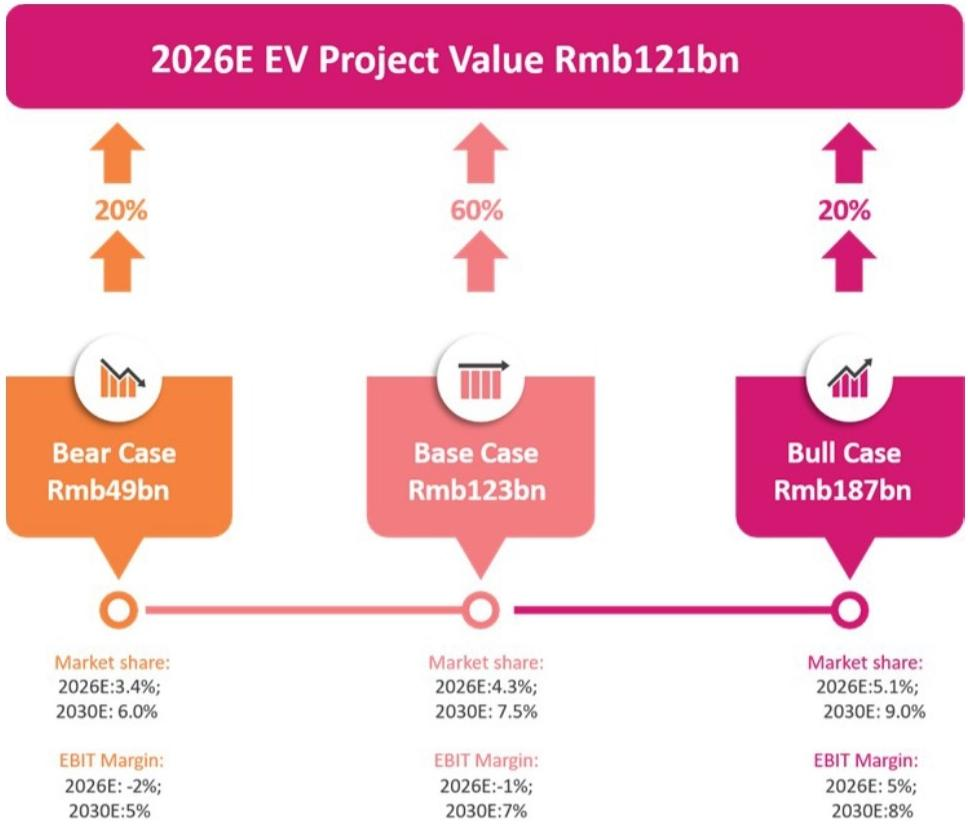

# Xiaomi Corp | Asia Pacific

# 调整目标报价以反映电动汽车交付与芯片成本变化

<table><tr><td colspan="3">调整内容</td></tr><tr><td>Xiaomi Corp (1810.HK)</td><td>此前</td><td>当前</td></tr><tr><td>目标报价</td><td>HK$45.00</td><td>HK$32.00</td></tr></table>

我们注意到小米正面临一些短期挑战。不过，我们维持对小米"人+车+家"生态及持续AI投入的长期积极看法。目标报价从HK$45下调至HK$32，维持增持评级。

## 主要观察

芯片成本上升使得市场对智能手机出货量和利润率持谨慎态度；

国内电动汽车行业销售变化使得小米实现全年交付目标面临挑战；

周期性波动提供了值得关注的观察窗口。

上半年电动汽车交付量预计约18万辆，全年目标实现有难度：我们预计小米2026年第二季度电动汽车交付量约10万辆，上半年合计约18万辆，占全年目标的33%。即使考虑下半年新品推出，我们认为小米实现全年交付目标的可能性不大。因此，我们将2026年电动汽车交付预测从58万辆下调至50万辆，2027年从75万辆下调至70万辆。

芯片成本影响，但AI价值尚未被充分认识：由于存储成本显著上升，读者对小米2026年智能手机出货量和利润率趋势持谨慎态度。然而，即使我们进一步下调智能手机出货量，在我们的分部加总估值中，其对内在价值的影响也有限，仅约210亿元。

同时，我们认为市场完全忽略了小米的AI价值，我们保守估计其价值为320亿元。一旦公司恢复盈利增长，我们认为其AI估值将从当前水平显著提升。

何时关注：对于12-18个月周期的观察者，我们认为当前水平提供了值得关注的窗口。不过，智能手机利润率压力更可能在2026年第四季度显现，电动汽车方面的变化可能导致2026年交付目标被下调。对于仅3-6个月周期的观察者，更好的关注时机可能在2026年第三至第四季度出现。

下调目标报价至HK$32：由于电动汽车交付预测下调，我们将电动汽车估值从3490亿元降至1210亿元。我们还将互联网业务的内在价值从2830亿元下调至1760亿元，以反映智能手机销量减少可能导致月活跃用户增长放缓的担忧，但加入了保守的AI内在价值估值320亿元。新的目标报价HK$32对应2027年预期市盈率约22倍，2028年预期市盈率约15倍。

<table><tr><td colspan="2">MS ASIA LIMITED+</td></tr><tr><td colspan="2">Andy Meng, CFA</td></tr><tr><td colspan="2">Equity Analyst</td></tr><tr><td>Andy.Meng@morganstanley.com</td><td>+852 2239-7689</td></tr><tr><td colspan="2">Betty Chen</td></tr><tr><td colspan="2">Research Associate</td></tr><tr><td>Betty.H.Chen@morganstanley.com</td><td>+852 2239-7213</td></tr><tr><td colspan="2">Lillian Lou</td></tr><tr><td colspan="2">Equity Analyst</td></tr><tr><td>Lillian.Lou@morganstanley.com</td><td>+852 2848-6502</td></tr><tr><td colspan="2">Hildy Ling</td></tr><tr><td colspan="2">Equity Analyst</td></tr><tr><td>Hildy.Ling@morganstanley.com</td><td>+852 2239-7834</td></tr><tr><td colspan="2">Gary Yu</td></tr><tr><td colspan="2">Equity Analyst</td></tr><tr><td>Gary.Yu@morganstanley.com</td><td>+852 2848-6918</td></tr></table>

Greater China Technology Hardware | China

<table><tr><td>Stock Rating</td><td>Overweight</td></tr><tr><td>Industry View</td><td>In-Line</td></tr><tr><td>Price target</td><td>HK$32.00</td></tr><tr><td>Up/downside to price target (%)</td><td>26</td></tr><tr><td>Shr price, close (Jul 8, 2026)</td><td>HK$25.30</td></tr><tr><td>52-Week Range</td><td>HK$59.90-21.30</td></tr><tr><td>Sh out, dil, curr (mn)</td><td>26,695</td></tr><tr><td>Mkt cap, curr (mn)</td><td>US$86,114</td></tr><tr><td>Avg daily trading value (mn)</td><td>US$846</td></tr></table>

<table><tr><td>Fiscal Year Ending</td><td>12/25</td><td>12/26e</td><td>12/27e</td><td>12/28e</td></tr><tr><td>EPS (Rmb)**</td><td>1.47</td><td>0.89</td><td>1.27</td><td>1.85</td></tr><tr><td>Prior EPS (Rmb)**</td><td>-</td><td>1.0</td><td>1.3</td><td>2.2</td></tr><tr><td>Revenue, net (Rmb bn)</td><td>457.3</td><td>438.9</td><td>533.8</td><td>646.2</td></tr><tr><td>EBITDA (Rmb bn)</td><td>38.2</td><td>21.6</td><td>36.6</td><td>56.4</td></tr><tr><td>ModelWare net inc (Rmb bn)</td><td>41.6</td><td>16.2</td><td>25.2</td><td>39.6</td></tr><tr><td>P/E</td><td>22.6</td><td>35.7</td><td>23.0</td><td>14.6</td></tr></table>

Unless otherwise noted, all metrics are based on MS ModelWare framework  
\*\* = Based on consensus methodology  
e = MS estimates

MS does and seeks to do business with companies covered in MS. As a result, investors should be aware that the firm may have a conflict of interest that could affect the objectivity of MS. Investors should consider MS as only a single factor in making their investment decision.

## For analyst certification and other important disclosures, refer to the Disclosure Section, located at the end of this report.

+= Analysts employed by non-U.S. affiliates are not registered with FINRA, may not be associated persons of the member and may not be subject to FINRA restrictions on communications with a subject company, public appearances and trading securities held by a research analyst account.

## 下调2026年电动汽车业务预测

考虑到2026年电动汽车市场增长低于预期，我们做出以下调整：

1. 将2026年电动汽车总销量预测从58万辆下调至50万辆，2027年从75万辆下调至70万辆；

2. 将2026年车辆毛利率假设从20.1%微调至20.0%，2027年维持20.0%不变。

因此，我们对2025-2027年累计车辆毛利润的预测从919亿元降至853亿元。

图表1：小米电动汽车产品路线图及销量预测的基准/乐观/保守情景

2024年总销量及市场份额%

  
2025年实际总销量及市场份额%

  
2026年预测总销量及市场份额%

  
2027年预测总销量及市场份额% 80万辆

  
第二款小米电动汽车

  
第三款小米电动汽车

  
第四款小米电动汽车

  
来源：公司数据，MS（预测）估计。注：市场份额基于国内新能源汽车销量计算。  
基于电动汽车价值下调的内在价值预测：我们继续使用概率加权乐观-基准-保守估值方法（图表2）对小米电动汽车业务进行估值。

图表2：小米电动汽车项目的概率加权乐观-基准-保守估值  
  
来源：MS估计。

如图表3所示，我们在基准、乐观和保守情景下均下调了内在价值估计。我们给予保守情景更高的概率（20%，此前为10%），并降低乐观情景的概率（20%，此前为30%），以反映更为均衡的风险回报特征。虽然小米的长期电动汽车机遇仍然存在，但我们认为近期电动汽车增长放缓将使读者不太可能给予乐观情景更高的概率，因此更均衡的权重应能反映最新的业务发展。我们新的加权内在价值估计为1210亿元，约占小米当前市值的24%。

图表3：我们下调小米电动汽车业务的内在价值预测（人民币十亿元）

<table><tr><td></td><td colspan="2">此前</td><td colspan="2">当前</td><td colspan="2">变化</td></tr><tr><td></td><td>概率</td><td>估值</td><td>概率</td><td>估值</td><td>概率</td><td>估值</td></tr><tr><td>保守</td><td>10%</td><td>93</td><td>20%</td><td>49</td><td>10%</td><td>-47%</td></tr><tr><td>基准</td><td>60%</td><td>327</td><td>60%</td><td>123</td><td>0%</td><td>-62%</td></tr><tr><td>乐观</td><td>30%</td><td>477</td><td>20%</td><td>187</td><td>-10%</td><td>-61%</td></tr><tr><td>电动汽车价值</td><td>100%</td><td>349</td><td>100%</td><td>121</td><td></td><td>-65%</td></tr></table>

来源：MS估计

## 调整盈利预测……

我们基于以下关键假设变化修订预测：

- 收入：2026年和2027年，我们分别下调预测5%和7%，主要由于智能手机和电动汽车交付放缓。智能手机方面，我们下调2026年出货量10%和2027年24%，因预计公司将更积极地提价以转嫁存储成本。我们认为对收入的影响有限，因为更高的平均售价可部分抵消销量下降。

- 毛利率：我们将2026年假设上调0.4个百分点，2027年上调1.3个百分点，以反映2026年第一季度智能手机和AIoT利润率好于预期。

- 非国际财务报告准则调整后净利润：考虑到高于预期的销售费用，我们下调2026年13%和2027年5%，以反映周期性因素。

图表4：小米：盈利预测修订

<table><tr><td rowspan="2">人民币百万元</td><td colspan="3">当前</td><td colspan="3">此前</td><td colspan="3">变化</td></tr><tr><td>2026E</td><td>2027E</td><td>2028E</td><td>2026E</td><td>2027E</td><td>2028E</td><td>2026E</td><td>2027E</td><td>2028E</td></tr><tr><td colspan="10">关键财务数据</td></tr><tr><td>收入</td><td>438,947</td><td>533,769</td><td>646,211</td><td>460,928</td><td>572,269</td><td>711,087</td><td>-5%</td><td>-7%</td><td>-9%</td></tr><tr><td>智能手机</td><td>159,248</td><td>184,279</td><td>229,788</td><td>159,561</td><td>208,403</td><td>217,563</td><td>0%</td><td>-12%</td><td>6%</td></tr><tr><td>IoT及生活消费品</td><td>113,931</td><td>126,276</td><td>140,039</td><td>115,607</td><td>128,152</td><td>142,140</td><td>-1%</td><td>-1%</td><td>-1%</td></tr><tr><td>互联网服务</td><td>38,963</td><td>44,162</td><td>47,334</td><td>38,963</td><td>44,162</td><td>47,334</td><td>0%</td><td>0%</td><td>0%</td></tr><tr><td>电动汽车</td><td>122,500</td><td>175,000</td><td>225,000</td><td>142,492</td><td>187,500</td><td>300,000</td><td>-14%</td><td>-7%</td><td>-25%</td></tr><tr><td>其他</td><td>4,305</td><td>4,051</td><td>4,051</td><td>4,305</td><td>4,051</td><td>4,051</td><td>0%</td><td>0%</td><td>0%</td></tr><tr><td>毛利润</td><td>90,037</td><td>110,299</td><td>139,302</td><td>92,854</td><td>110,830</td><td>154,391</td><td>-3%</td><td>0%</td><td>-10%</td></tr><tr><td>运营费用</td><td>-76,100</td><td>-80,010</td><td>-90,470</td><td>-72,717</td><td>-78,816</td><td>-94,241</td><td>5%</td><td>2%</td><td>-4%</td></tr><tr><td>销售费用</td><td>-33,233</td><td>-31,971</td><td>-35,542</td><td>-28,722</td><td>-31,475</td><td>-39,110</td><td>16%</td><td>2%</td><td>-9%</td></tr><tr><td>管理费用</td><td>-6,727</td><td>-8,007</td><td>-9,693</td><td>-7,057</td><td>-8,584</td><td>-10,666</td><td>-5%</td><td>-7%</td><td>-9%</td></tr><tr><td>研发费用</td><td>-36,139</td><td>-40,033</td><td>-45,235</td><td>-36,939</td><td>-38,757</td><td>-44,465</td><td>-2%</td><td>3%</td><td>2%</td></tr><tr><td>营业利润</td><td>13,938</td><td>30,289</td><td>48,833</td><td>20,136</td><td>32,014</td><td>60,150</td><td>-31%</td><td>-5%</td><td>-19%</td></tr><tr><td>非营业项目合计</td><td>6,180</td><td>2,000</td><td>2,000</td><td>4,028</td><td>2,000</td><td>2,000</td><td>53%</td><td>0%</td><td>0%</td></tr><tr><td>净利润</td><td>16,246</td><td>25,185</td><td>39,650</td><td>19,483</td><td>26,531</td><td>48,477</td><td>-17%</td><td>-5%</td><td>-18%</td></tr><tr><td>非IFRS调整后净利润</td><td>23,631</td><td>33,724</td><td>48,835</td><td>27,143</td><td>35,512</td><td>58,343</td><td>-13%</td><td>-5%</td><td>-16%</td></tr><tr><td>非IFRS每股收益（人民币）</td><td>0.89</td><td>1.27</td><td>1.85</td><td>1.03</td><td>1.34</td><td>2.21</td><td>-13%</td><td>-5%</td><td>-16%</td></tr><tr><td>MW每股收益（IFRS，人民币）</td><td>0.61</td><td>0.95</td><td>1.50</td><td>0.74</td><td>1.00</td><td>1.83</td><td>-17%</td><td>-5%</td><td>-18%</td></tr><tr><td colspan="10">利润率</td></tr><tr><td>毛利率%</td><td>20.5%</td><td>20.7%</td><td>21.6%</td><td>20.1%</td><td>19.4%</td><td>21.7%</td><td>0.4%</td><td>1.3%</td><td>-0.2%</td></tr><tr><td>智能手机</td><td>7.0%</td><td>6.9%</td><td>11.4%</td><td>5.9%</td><td>6.9%</td><td>11.3%</td><td>1.1%</td><td>0.1%</td><td>0.1%</td></tr><tr><td>IoT及生活消费品</td><td>21.9%</td><td>23.0%</td><td>23.0%</td><td>21.8%</td><td>19.9%</td><td>23.8%</td><td>0.0%</td><td>3.1%</td><td>-0.8%</td></tr><tr><td>互联网服务</td><td>76.7%</td><td>76.7%</td><td>76.8%</td><td>76.7%</td><td>76.7%</td><td>76.8%</td><td>0.0%</td><td>0.0%</td><td>0.0%</td></tr><tr><td>电动汽车</td><td>20.0%</td><td>20.0%</td><td>20.0%</td><td>20.1%</td><td>20.0%</td><td>20.0%</td><td>-0.1%</td><td>0.0%</td><td>0.0%</td></tr><tr><td>其他</td><td>-9.9%</td><td>-10.0%</td><td>-10.0%</td><td>-9.9%</td><td>-10.0%</td><td>-10.0%</td><td>0.0%</td><td>0.0%</td><td>0.0%</td></tr><tr><td>运营费用率%</td><td>17.3%</td><td>15.0%</td><td>14.0%</td><td>15.8%</td><td>13.8%</td><td>13.3%</td><td>1.6%</td><td>1.2%</td><td>0.7%</td></tr><tr><td>销售费用率%</td><td>7.6%</td><td>6.0%</td><td>5.5%</td><td>6.2%</td><td>5.5%</td><td>5.5%</td><td>1.3%</td><td>0.5%</td><td>0.0%</td></tr><tr><td>管理费用率%</td><td>1.5%</td><td>1.5%</td><td>1.5%</td><td>1.5%</td><td>1.5%</td><td>1.5%</td><td>0.0%</td><td>0.0%</td><td>0.0%</td></tr><tr><td>研发费用率%</td><td>8.2%</td><td>7.5%</td><td>7.0%</td><td>8.0%</td><td>6.8%</td><td>6.3%</td><td>0.2%</td><td>0.7%</td><td>0.7%</td></tr><tr><td>调整后净利润率%</td><td>5.4%</td><td>6.3%</td><td>7.6%</td><td>5.9%</td><td>6.2%</td><td>8.2%</td><td>-0.5%</td><td>0.1%</td><td>-0.6%</td></tr><tr><td colspan="10">关键运营指标</td></tr><tr><td>智能手机出货量（百万台）</td><td>109.9</td><td>120.3</td><td>149.1</td><td>122.6</td><td>157.4</td><td>161.8</td><td>-10%</td><td>-24%</td><td>-8%</td></tr><tr><td>MIUI月活跃用户（百万）</td><td>754</td><td>778</td><td>802</td><td>754</td><td>778</td><td>802</td><td>0%</td><td>0%</td><td>0%</td></tr><tr><td>国内</td><td>197</td><td>201</td><td>205</td><td>197</td><td>201</td><td>205</td><td>0%</td><td>0%</td><td>0%</td></tr><tr><td>海外</td><td>556</td><td>576</td><td>596</td><td>556</td><td>576</td><td>596</td><td>0%</td><td>0%</td><td>0%</td></tr></table>

来源：MS（预测）估计

## ……及目标报价

我们继续通过分部加总（SOTP）方法推导目标报价（也是我们的基准情景价值），以捕捉小米各业务板块不同的增长特征。我们对其中三个业务使用剩余收益（RI）模型。关键假设不变。我们对智能手机业务应用11%的股权成本，IoT业务11%，互联网服务业务11.4%，终端增长率分别为3%、3%和6%。

对于电动汽车部门的内在价值，我们应用现金流折现（DCF）估值（图表7）。我们将2026年电动汽车总销量预测从58万辆下调至50万辆，2027年从75万辆下调至70万辆。2026年电动汽车毛利率假设从20.1%下调至20.0%，2027年维持20.0%不变。其他假设不变。我们继续对电动汽车业务应用12.2%的加权平均资本成本，终端增长率5%。基准情景估值详情见图表5。我们还继续应用概率加权乐观-基准-保守估值方法对小米电动汽车业务进行估值（乐观20%，基准60%，保守20%），得出内在价值1210亿元（图表21）。

因此，在反映电动汽车放缓的负面影响后，我们的目标报价从HK$45下调至HK$32。乐观情景价值从HK$65调整至HK$50，保守情景价值从HK$25调整至HK$15。

图表5：小米电动汽车DCF估值：基准情景

<table><tr><td>人民币百万元</td><td>2026E</td><td>2027E</td><td>2028E</td><td>2029E</td><td>2030E</td><td>2031E</td><td>2032E</td><td>2033E</td><td>2034E</td><td>2035E</td><td>2036E</td></tr><tr><td colspan="12">车辆估值</td></tr><tr><td>车辆收入</td><td>122,500</td><td>175,000</td><td>225,000</td><td>294,970</td><td>352,207</td><td>374,852</td><td>398,282</td><td>422,504</td><td>447,525</td><td>471,504</td><td>496,104</td></tr><tr><td>同比%</td><td>16%</td><td>43%</td><td>29%</td><td>31%</td><td>19%</td><td>6%</td><td>6%</td><td>6%</td><td>6%</td><td>5%</td><td>5%</td></tr><tr><td>息税前利润</td><td>-1,595</td><td>3,110</td><td>10,780</td><td>21,573</td><td>24,806</td><td>25,678</td><td>25,316</td><td>24,820</td><td>26,355</td><td>23,933</td><td>21,013</td></tr><tr><td>息税前利润率-车辆%</td><td>-1%</td><td>2%</td><td>5%</td><td>7%</td><td>7%</td><td>7%</td><td>6%</td><td>6%</td><td>6%</td><td>5%</td><td>4%</td></tr><tr><td></td><td>-1%</td><td>2%</td><td>5%</td><td>7%</td><td>7%</td><td>7%</td><td>6%</td><td>6%</td><td>6%</td><td>5%</td><td>4%</td></tr><tr><td>净利润</td><td>-1,356</td><td>2,644</td><td>9,163</td><td>18,337</td><td>19,845</td><td>20,543</td><td>20,252</td><td>19,856</td><td>21,084</td><td>19,147</td><td>16,810</td></tr><tr><td>净利润率-车辆%</td><td>-1.1%</td><td>1.5%</td><td>4.1%</td><td>6.2%</td><td>5.6%</td><td>5.5%</td><td>5.1%</td><td>4.7%</td><td>4.7%</td><td>4.1%</td><td>3.4%</td></tr><tr><td>终值</td><td></td><td></td><td></td><td></td><td></td><td></td><td></td><td></td><td></td><td></td><td>213,786</td></tr><tr><td>折现因子</td><td>0.89</td><td>0.79</td><td>0.71</td><td>0.63</td><td>0.56</td><td>0.50</td><td>0.45</td><td>0.40</td><td>0.35</td><td>0.32</td><td>0.28</td></tr><tr><td>企业价值</td><td>119,478</td><td>140,847</td><td>163,284</td><td>180,417</td><td>191,141</td><td>199,606</td><td>203,991</td><td>208,905</td><td>214,897</td><td>220,305</td><td>228,487</td></tr><tr><td>总权益价值</td><td>119,478</td><td>140,847</td><td>163,284</td><td>180,417</td><td>191,141</td><td>199,606</td><td>203,991</td><td>208,905</td><td>214,897</td><td>220,305</td><td>228,487</td></tr><tr><td colspan="12">软件估值</td></tr><tr><td>软件收入</td><td>10</td><td>26</td><td>52</td><td>93</td><td>250</td><td>473</td><td>763</td><td>1,119</td><td>1,282</td><td>1,449</td><td>1,620</td></tr><tr><td>同比%</td><td></td><td>149%</td><td>100%</td><td>79%</td><td>170%</td><td>89%</td><td>61%</td><td>47%</td><td>15%</td><td>13%</td><td>12%</td></tr><tr><td>无杠杆自由现金流</td><td>3</td><td>8</td><td>19</td><td>34</td><td>82</td><td>159</td><td>261</td><td>388</td><td>461</td><td>527</td><td>594</td></tr><tr><td>%利润率</td><td>28.5%</td><td>32.7%</td><td>36.1%</td><td>36.4%</td><td>32.8%</td><td>33.6%</td><td>34.2%</td><td>34.7%</td><td>36.0%</td><td>36.3%</td><td>36.7%</td></tr><tr><td>终值</td><td></td><td></td><td></td><td></td><td></td><td></td><td></td><td></td><td></td><td></td><td>8,643</td></tr><tr><td>折现因子</td><td>0.89</td><td>0.79</td><td>0.71</td><td>0.63</td><td>0.56</td><td>0.50</td><td>0.45</td><td>0.40</td><td>0.35</td><td>0.32</td><td>0.28</td></tr><tr><td>企业价值</td><td>3,781</td><td>4,239</td><td>4,748</td><td>5,307</td><td>5,918</td><td>6,549</td><td>7,171</td><td>7,754</td><td>8,266</td><td>8,759</td><td>9,238</td></tr><tr><td>总权益价值</td><td>3,781</td><td>4,239</td><td>4,748</td><td>5,307</td><td>5,918</td><td>6,549</td><td>7,171</td><td>7,754</td><td>8,266</td><td>8,759</td><td>9,238</td></tr><tr><td colspan="12">DCF估值</td></tr><tr><td>车辆权益价值</td><td>119,478</td><td>140,847</td><td>163,284</td><td>180,417</td><td>191,141</td><td>199,606</td><td>203,991</td><td>208,905</td><td>214,897</td><td>220,305</td><td>228,487</td></tr><tr><td>软件权益价值</td><td>3,781</td><td>4,239</td><td>4,748</td><td>5,307</td><td>5,918</td><td>6,549</td><td>7,171</td><td>7,754
