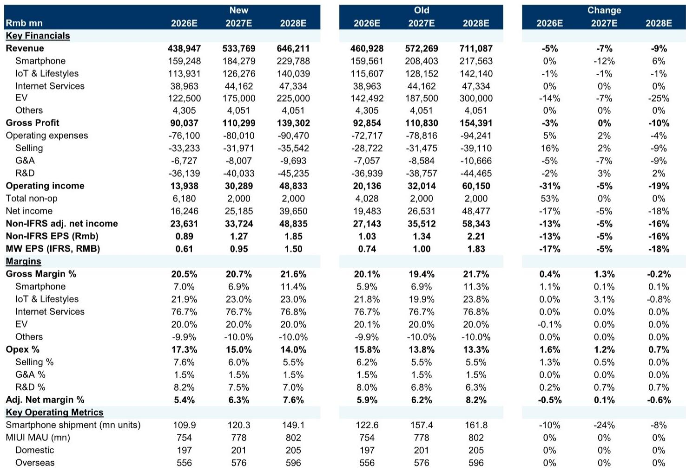
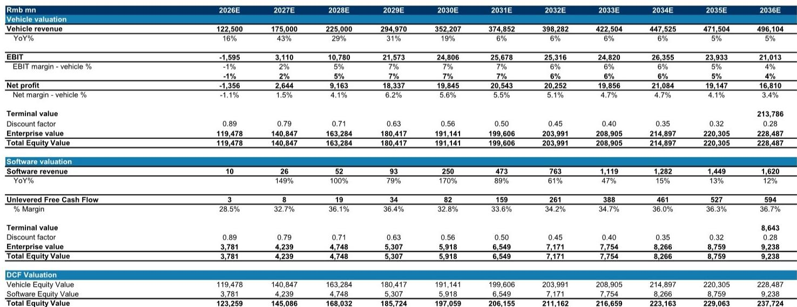
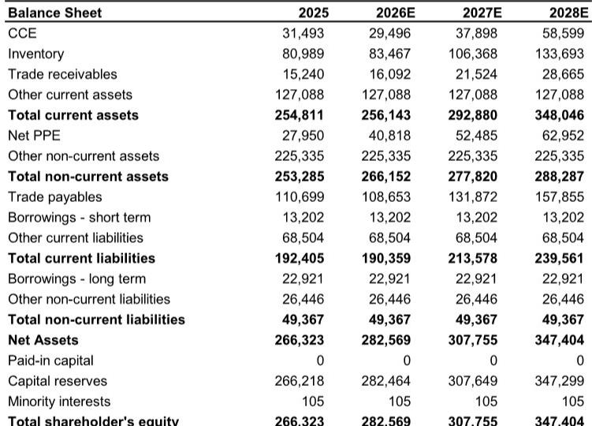

# MS：市场误判小米，AI估值超300亿未被定价

这份MS研报的核心判断，不是市场普遍关注的电动车出货量节奏变化或芯片涨价不确定性，而是一个被完全忽略的变量：小米的AI价值。报告认为，市场对小米的定价中几乎没有反映其AI业务的潜在价值，而这一块保守估值已达320亿元人民币。当市场焦点集中在短期周期性问题时，一个更长期的结构性机会正在被低估。

## 1. 电动车出货量目标难以实现，但影响已部分反映在定价中

报告将2026年电动车出货量预测从58万辆下调至50万辆，2027年从75万辆下调至70万辆。核心原因在于2026年上半年电动车出货量预计仅为18万辆左右，即使考虑下半年新品拉动，全年目标也难以完成。报告还将熊市情景概率从10%上调至20%，以反映更平衡的不确定性回报特征。

> **K，但报告并未否定小米在电动车领域的长期机会。读者值得仔细查看报告中的bull-base-bear三种情景假设和概率分配。

## 2. 芯片涨价冲击智能手机，但AI价值被市场完全忽略

报告指出，因存储芯片成本大幅上升，读者对2026年智能手机出货量和利润率持谨慎态度。但即使进一步下调智能手机出货量预测，对整体内在价值的影响也仅为210亿元人民币。相比之下，报告保守估算小米的AI价值为320亿元，且认为一旦公司恢复盈利增长，这一估值将大幅提升。

这一判断值得注意：市场当前对小米的定价，几乎完全忽略了AI业务的潜在贡献。报告没有详细展开小米AI业务的具体构成，但将其单独估值本身就意味着，这家公司正在从一个硬件制造商向AI生态企业转型。

## 3. 周期性仍在调整提供了入场窗口，但时机选择需要耐心

报告明确表示，对于12-18个月研究视野的读者，当前水平提供了有吸引力的入场点。但同时指出，智能手机利润率不确定性更可能在2026年第四季度显现，而电动车弱势可能导致2026年出货目标进一步下调。对于只有3-6个月视野的读者，报告认为更好的入场时机可能在2026年第三至第四季度。

> **KC评论：** 报告对入场时机的讨论很有层次——它不是简单说“现在可以买”，而是区分了不同时间维度的读者。这里的关键问题是：市场何时会开始重新定价小米的AI价值？这取决于公司能否在2026年下半年展示出盈利增长的拐点。

## 4. 报告尚未完全回答的关键问题：AI价值的实现路径

报告将AI业务估值定为320亿元，但未详细说明这一估值基于哪些具体业务线或收入假设。小米的AI能力主要体现在智能家居生态、手机端AI应用以及可能的自动驾驶技术中，但这些业务的商业化程度和利润率水平，报告并未充分展开。对于读者而言，理解小米AI价值的具体来源和实现路径，是判断这一估值是否合理的关键。

## 5. 读者应关注的三个观察维度

第一，电动车出货量能否在2026年下半年出现环比改善，这将验证报告对全年50万辆预测的合理性。第二，智能手机毛利率变化——报告预计2026年智能手机毛利率为7.0%，如果实际数据高于这一水平，可能意味着小米在芯片涨价环境下的定价能力超出预期。第三，AI相关业务的收入披露或管理层表态，这将直接决定市场是否开始重新定价这部分价值。

报告的核心贡献在于提出了一个市场尚未充分讨论的问题：小米的估值框架是否需要从“硬件+互联网”转向“硬件+互联网+AI”？如果答案是肯定的，那么当前的周期性不确定性反而可能提供了一个重新审视公司长期价值的机会。

For informational purposes only. Portions may be generated,translated,summarized,or edited with AI assistance based on source materials and may contain omissions or errors. Please verify independently. This is not investment,legal,tax,accounting,or other professional advice.

For informational purposes only. Portions may be generated,translated,summarized,or edited with AI assistance based on source materials and may contain omissions or errors. Please verify independently. This is not investment,legal,tax,accounting,or other professional advice.

