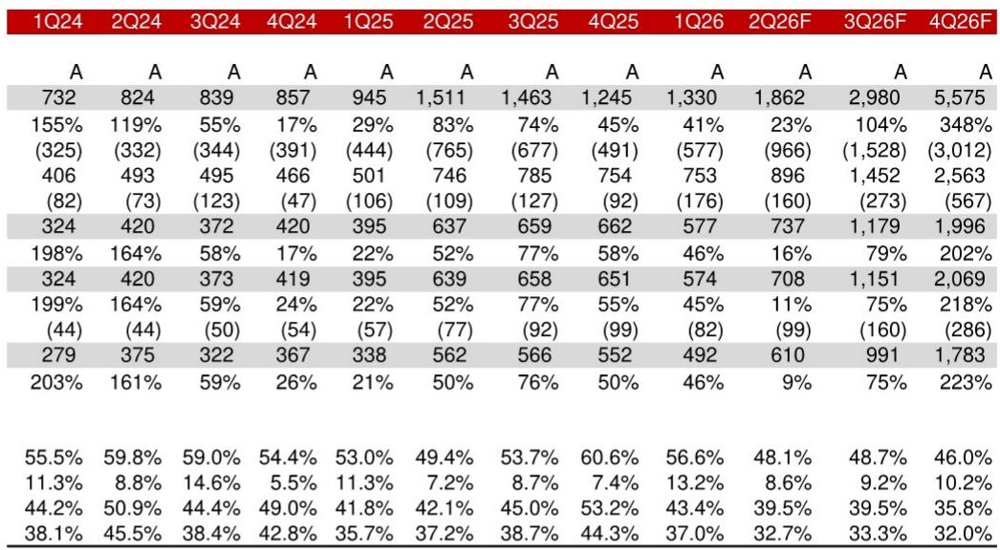
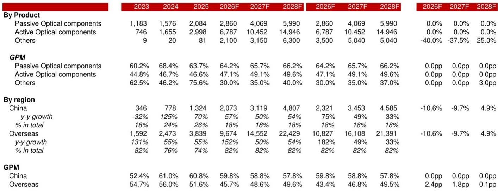
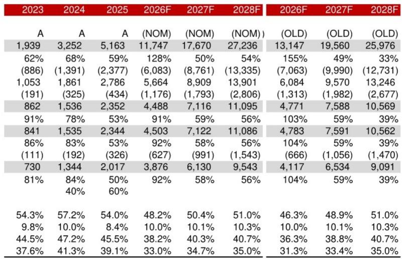

# NOM：天孚通信1.6T光引擎拐点或在2026下半年

这家光器件公司报价一个月跌去三成，但NOM最新研报给出了一个反直觉的判断：市场对两大不确定性的担忧可能已经过头了。

天孚通信过去四周回调幅度达到30%，远超同期创业板指数12%的跌幅。抛售的导火索并不难找——市场担心上游元器件和产能短缺影响业绩，同时担忧玻璃基板等新技术路线可能颠覆公司核心产品FAU（光纤阵列单元）。但NOM在7月9日发布的报告中指出，这两个担忧都可能被过度定价了。

报告的核心判断是：天孚通信的关键收入支柱——1.6T光引擎，可能在2026年下半年和2027年迎来加速增长。支撑这一判断的逻辑来自一个关键变量的变化：一家大型AI客户正在帮助公司获取更多200G EML芯片的供应。如果这个供给瓶颈能在下半年缓解，公司的交付能力将显著改善。

NOM小幅下调了2026-2027财年的收入预测（9.7-10.6%）和利润预测（5.9-6.2%），但同时上调了2028财年的收入预期（4.9%）和利润预期（5%），反映对CPO市场更乐观的展望。

，而是NOM对时间节点的判断——如果200G EML短缺在2026下半年缓解，天孚的业绩拐点可能就在未来两三个季度。完整报告里对供应链细节和客户结构的拆解，值得认真看。

---

## 1. 1.6T光引擎的放量节奏可能比市场预期的更快

NOM认为，2026-2027年1.6T光模块升级将是光器件价值链的主要驱动力。公司1.6T光引擎业务有望在量价齐升的背景下，实现2026-2028财年收入48%的年复合增长率，到2028财年贡献总销售额的55%。

过去几个季度影响公司表现的200G EML短缺问题，随着更多供应商的加入，可能在下半年得到缓解。但NOM也提醒，整体200G EML市场仍然偏紧，公司的执行能力对产品交付至关重要——这是后续需要持续跟踪的变量。

## 2. 新技术颠覆不确定性被高估，但FAU市场竞争在加剧

市场对玻璃基板等新技术的担忧，在NOM看来有些过度。报告的理由很直接：该技术路线在光模块/CPO市场尚未有成熟验证记录，商业化时间表距离对FAU方案构成实质威胁还很远。

但NOM没有回避另一个不确定性：FAU和ELS（外部激光源）市场的竞争正在加剧。作为一家全球领先AI厂商的紧密技术合作伙伴，天孚在NPO/CPO趋势中处于有利位置——公司已经开发出FAU/ELS产品，NOM预计NPO/CPO的收入贡献将从2026财年的12%提升至2028财年的32%。但竞争对手也在加速追赶。

## 3. 报告尚未完全回答的关键问题：模块业务的节奏

NOM下调2026-2027年收入预测的主要原因是“对模块业务增速采取更保守的假设”。这暗示，尽管光引擎业务前景明朗，但公司的模块业务可能面临更复杂的竞争格局或客户策略变化。

报告没有详细展开的是：模块业务的下修幅度有多大？是由客户转单、技术路线切换，还是价格竞争导致的？这些细节对于判断公司整体业绩节奏至关重要，但可能需要从更完整的报告或后续跟踪中寻找答案。

> **KC评论：** 模块业务的调整是这份报告里最值得追问的部分。如果模块业务的下修只是暂时的客户节奏问题，那么整体故事仍然成立；但如果模块业务面临结构性不确定性，即使光引擎放量，利润率的提升空间也会打折扣。完整报告中对模块业务的拆解数据值得细读。

---

对于关注光通信产业链的读者，这份NOM报告提供了一个观察框架：1.6T光引擎的放量节奏取决于200G EML芯片的供给恢复速度；NPO/CPO的长期增长潜力被新技术担忧所掩盖；而模块业务的走向，则是决定公司能否实现“量价齐升”的关键变量。

三个维度中，供应链的恢复信号可能是最先出现的。如果200G EML的供应确实在下半年改善，天孚的交付数据将成为验证报告判断的最直接指标。

For informational purposes only. Portions may be generated,translated,summarized,or edited with AI assistance based on source materials and may contain omissions or errors. Please verify independently. This is not investment,legal,tax,accounting,or other professional advice.

For informational purposes only. Portions may be generated,translated,summarized,or edited with AI assistance based on source materials and may contain omissions or errors. Please verify independently. This is not investment,legal,tax,accounting,or other professional advice.

