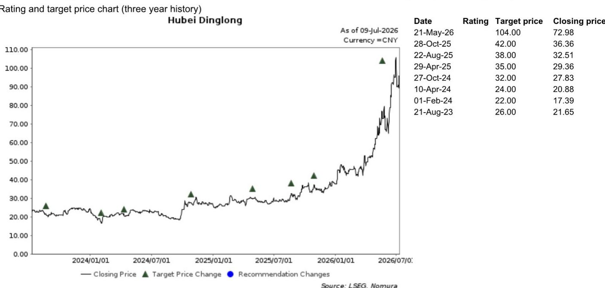

# 鼎龙半导体材料业务已跨过关键节点——问题不再是“能否”，而是“规模化增长的速度”

在半导体供应链研究中，一个最危险的假设是认为国产替代会沿着一条平滑、线性的路径前进。事实并非如此。它是在认证周期、产能瓶颈和价格谈判中曲折前进的，这些环节可能停滞数个季度。在此背景下，湖北鼎龙2026年上半年的业绩预告不仅仅是一个积极的数据点。它表明一个结构性转折已经发生。营业收入同比增长11%，但净利润增长了64%至74%，若剔除已不再合并的打印耗材业务，核心净利润增长超过80%。这些数字反映的不是渐进式的改善。它们反映的是，随着半导体材料从试产验证转向盈利性量产，经营杠杆正在发挥作用。

为什么是现在？过去几年，国内半导体生态系统一直在建设产能、认证材料并消化进入成本。鼎龙通过其CMP抛光液和抛光垫业务，长期以来一直是这一进程的风向标。但2026年上半年的盈利状况有所不同。它表明公司不再以牺牲利润率为代价超前投入。它正在从其核心半导体材料平台上实现规模化盈利，并且是在多个产品线上同时实现。6月份抛光液月销售额突破4000万元、抛光垫出货量达到5万片里程碑、上半年光刻胶采购订单约1000加仑——这些并非孤立的成功。它们是商业模式已从证明能力转向获取市场份额的信号。

对观察者而言，战略启示是明确的。讨论不再是鼎龙能否参与国内半导体材料市场。讨论是它能以多快的速度实现复合增长，以及哪些产品线将驱动下一阶段的增长。本文从战略视角解读这份业绩预告，识别将决定未来轨迹的未解问题，并提供一个在该领域进行决策的框架——在这个领域，容易取得的进展已经完成，规模化扩张的艰苦工作才刚刚开始。

## 转折的广泛性是核心信号，而非单一产品线

一个常见的分析错误是，看待一家多元化材料公司时，将其表现归因于某一产品或某一客户。就鼎龙而言，人们容易聚焦于CMP抛光液——该业务同比增长63%，创造了约4700万元利润。这令人印象深刻，但并非全貌。CMP抛光垫收入增长了57%。光刻胶订单从样品转向了采购承诺。显示材料方面，尽管面板利用率环境偏软，但通过PSPI和TFE-INK材料，已在中国首条G8.6 AMOLED生产线上实现首批供货。而新合并的锂电池功能材料业务——昊飞材料，在3月至6月期间增长了约60%。

这里的模式并非单一产品支撑公司。而是一个平台在多个领域达到了临界规模。这一点很重要，原因有三。第一，它降低了客户集中度风险。如果某个产品线面临认证延迟或价格压力，其他产品可以弥补。第二，它创造了交叉销售机会。认证了鼎龙CMP抛光液的客户，更有可能试用其抛光垫，并最终试用其光刻胶辅助材料。第三，它表明公司的研发和制造流程正在变得可复制。开发超过40种高端晶圆光刻胶SKU、近30种处于客户验证阶段、在测SKU数量同比弹性较高——这些都表明一个创新引擎正在加速，而非减速。

对观察者而言，这意味着盈利转折并非由单一客户拉动驱动的单季度现象。它是多年投资于多个产品线、这些产品线几乎同时达到商业可行性的结果。这比任何单一产品的成功都更能构成更持久的增长基础。

## 抛光液的增长空间比多数人想象的更广阔，下一战场不仅是存储

CMP抛光液通常从国内存储制造商的视角来看待，这有其道理。国内领先的存储晶圆厂一直是销量增长的主要驱动力，鼎龙在这些客户处的认证是近期加速的催化剂。但报告指出了另外三个抛光液机会，它们共同解锁了一个目前由进口主导、超过10亿元的国内潜在市场。这些机会包括：用于12英寸单晶衬底的大硅片精细抛光液、在某领先存储制造商处的氧化铈抛光液，以及用于先进封装的TSV抛光液。

每一个都代表着不同的需求驱动力。大硅片精细抛光液与衬底制造工艺相关，其客户群不同于消耗鼎龙当前大部分产出的逻辑和存储晶圆厂。氧化铈抛光液是一种更高价值的产品，用于对选择性和表面质量有严格要求的特定抛光步骤。而TSV抛光液是一种先进封装材料，这意味着它受益于异构集成和小芯片架构日益增长的需求。共同点是，这三个领域目前都依赖进口，因此替代机会不仅仅是抢占增长蛋糕的一部分。而是取代那些多年来占据这些位置的现有供应商。

战略问题是，鼎龙是否拥有同时推进这三个领域的制造能力和技术支持基础设施。报告显示，公司正在潜江建设第三条软垫生产线，针对玻璃基板和大尺寸垫，这表明产能扩张正在进行中。但抛光液不同于抛光垫，TSV抛光液和氧化铈抛光液的认证周期也不同于传统的氧化物或金属抛光液。观察者应关注这些新领域客户认证的更新，因为它们将决定潜在市场扩张能否在未来12至18个月内实现。

## 光刻胶正在转折，但真正的考验是重复订单，而非初始采购承诺

光刻胶业务一直是鼎龙的长期叙事，2026年上半年标志着报告所称的“规模化量产元年”。三款ArF和KrF产品已进入稳定量产，累计超过40种高端晶圆光刻胶加上BARC和SOC辅助材料，提供了广泛的产品基础。上半年约1000加仑的采购订单，相比此前以样品和验证为特征的阶段，是向前迈出的有意义的一步。

然而，区分初始采购订单和重复批量订单很重要。在半导体材料行业，第一笔订单通常是测试。客户购买少量产品，以验证材料在多个批次中性能一致、供应链可靠、技术支持团队能响应工艺问题。更高数量的重复订单才是材料已被认证用于生产用途的真正信号。报告未披露初始订单和重复订单的划分，也未提供2026年下半年订单量预计增长多快的指引。

国内KrF和ArF光刻胶的国产化率分别约为15%和2%至3%。这意味着巨大的空间，但也意味着现有供应商——主要是日本和韩国供应商——不会轻易让出市场份额。价格压力、技术升级和供应链中断都是风险。乐观的看法是，鼎龙广泛的产品组合和在CMP材料领域建立的客户关系，使其拥有纯光刻胶公司所缺乏的渠道优势。谨慎的看法是，光刻胶认证周期众所周知地漫长，从初始订单到持续量产可能需要比市场预期更长的时间。

## 报告未完全解答的问题：经营杠杆之外的利润率轨迹

业绩预告显示净利润率显著改善，这是由半导体材料收入规模化带来的经营杠杆驱动的。但报告未提供详细的细分业务利润率，也未说明随着产品组合向光刻胶和先进封装材料转变，利润率将如何演变。这些产品通常售价更高，但也需要更密集的研发支持和客户工程服务。对利润率的净影响并不明确。

此外，昊飞材料的合并引入了一个新变量。锂电池功能材料是与半导体材料不同的业务，具有不同的客户动态、不同的利润率特征和不同的竞争格局。报告指出，昊飞正在与国内头部客户开发创新产品，但未披露该业务在细分层面是否盈利，或是否仍处于投入期。观察者应寻求关于昊飞财务贡献的明确信息，以及它是在稀释还是提升整体公司利润率。

另一个未解决的问题是非经常性收益的可持续性。业绩预告包含约2700万元的政府补贴，高于2025年上半年的1700万元。虽然政府对国内半导体材料的支持可能持续，但其规模和时机难以预测。扣除非经常性收益后的经常性净利润是评估核心业务表现的更可靠指标，报告显示经常性净利润同比增长64%至75%。这表现强劲，但随着核心业务规模足够大以吸收补贴收入的波动性，经常性净利润与报告净利润之间的差距应随时间缩小。

## 观察者的决策框架：如何评估鼎龙的下一阶段

对于试图判断当前约89倍2026年预期收益的估值是否合理的观察者而言，关键不是孤立地关注倍数。而是评估公司能否在未来三到五年内维持30%至35%的复合年收益增长率。报告引用2025年至2028年33%的收益复合年增长率作为目标倍数的支撑。这是一个合理的起点，但它取决于观察者应关注的几个变量。

第一，跟踪新抛光液领域的客户认证进度。大硅片精细抛光液、氧化铈抛光液和TSV抛光液的机会合计代表了超过10亿元的潜在市场。如果鼎龙能在未来三年内捕获该市场20%至30%的份额，将在不按比例增加固定成本的情况下增加可观的收入。关键领先指标是每季度完成的认证数量。

第二，监控光刻胶订单轨迹。从2026年上半年的1000加仑过渡到可持续的季度运行率，将是光刻胶论点最重要的信号。如果下半年订单量弹性较高，将表明重复订单正在实现。如果订单量停滞，则表明初始订单是一次性测试。

第三，评估昊飞材料的利润率贡献。观察者应要求在未来的业绩说明会上披露细分业务数据。如果昊飞处于盈亏平衡或更好状态，则是一个积极贡献者。如果它处于亏损状态，则拖累整体利润率故事，整合风险高于市场当前定价。

第四，考虑竞争反应。国内存储制造商并非被锁定的客户。他们将继续评估多个供应商，以确保供应安全和定价杠杆。鼎龙在关键客户处维持或增加钱包份额的能力，取决于其技术支持、交付可靠性和成本竞争力。任何份额流失的迹象都将是警示信号。

## 下一个分析前沿：理解半导体复兴论点如何适用于鼎龙之外

鼎龙是国内最先进的半导体材料公司之一，但并非相对少见。更广泛的论点是，国内半导体材料正进入一个盈利规模化阶段，这适用于CMP材料、光刻胶、湿电子化学品和特种气体等一系列公司。对观察者而言，问题是鼎龙的成功是公司特有的，还是预示着更广泛的行业转变。

如果是公司特有的，那么估值溢价由鼎龙的执行优势所支撑，但上行空间仅限于其自身的市场份额增长。如果是行业性的，那么就有机会投资于其他处于转折周期更早阶段、可能估值更低的国内材料公司。报告未涉及这个问题，但这是该领域任何认真观察者的自然下一步。

完整报告，包括原始图表和详细的财务预测，提供了进行该评估所需的数据。它包括历史收入和利润趋势、细分业务分解以及支持复合增长论点的管理层指引。对于那些希望超越标题数字、基于对公司轨迹的严谨理解来构建立场的观察者而言，这种详细程度至关重要。

加入社区阅读完整报告并查看原始图表。

*仅供参考。部分内容可能基于源材料通过AI辅助生成、翻译、总结或编辑，可能存在遗漏或错误。请独立核实。本文不构成专业建议。*

仅供参考。部分内容可能基于源材料通过AI辅助生成、翻译、总结或编辑，可能存在遗漏或错误。请独立核实。本文不构成专业建议。

