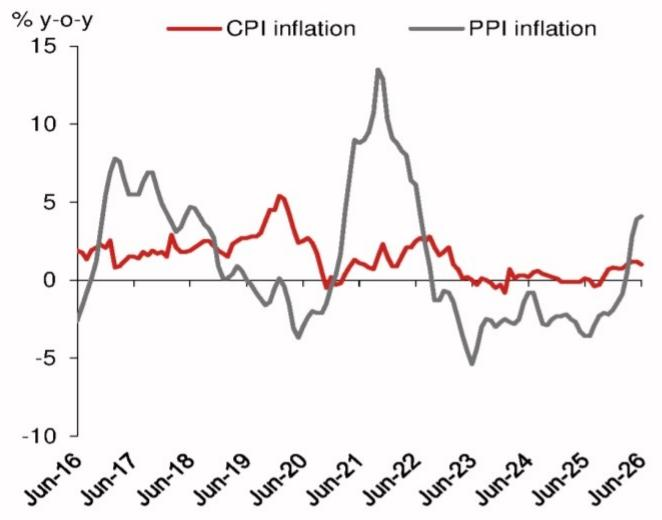
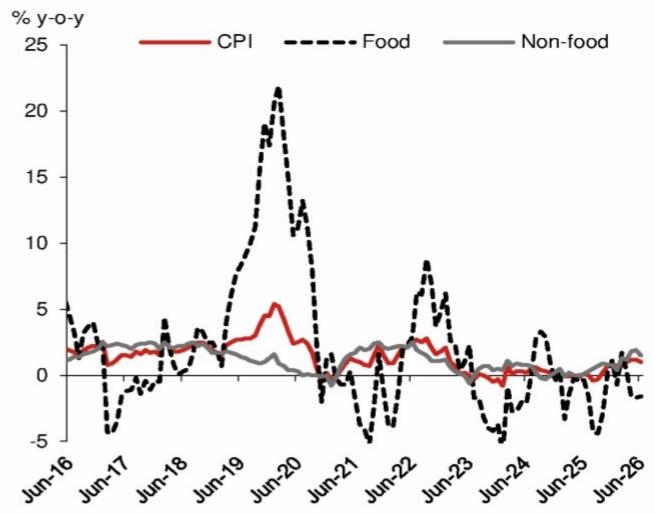
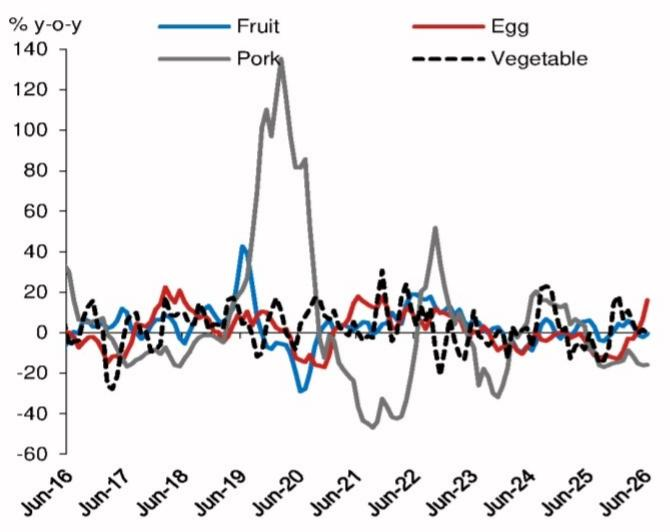
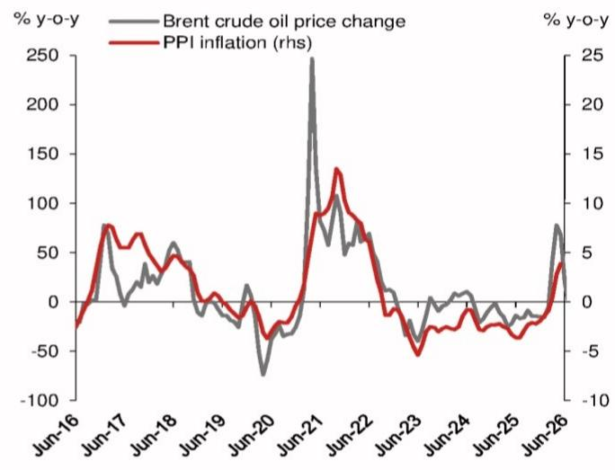
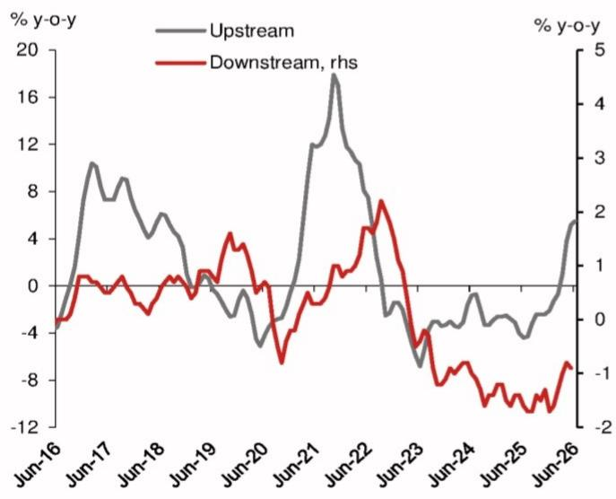
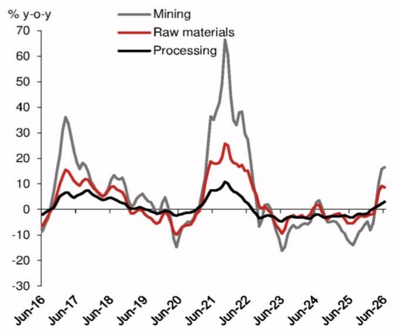

# Asia Insights

宏观环境 - 亚洲（除日本）

## 中国：6月CPI涨幅回落，PPI涨幅上升

6月CPI同比涨幅从5月的1.2%回落至1.0%，略低于市场预期（共识：1.1%；NOM：1.2%）。CPI涨幅回落主要受外部因素影响。6月全球原油和黄金价格明显回落，这两项分别计入CPI篮子中的能源和核心分项。根据国家统计局数据，原油和黄金对整体CPI涨幅的合计贡献较5月下降0.23个百分点，从5月的0.83个百分点降至6月的0.60个百分点。这表明，剔除原油和黄金的影响后，核心CPI涨幅基本稳定在同比0.4%左右。

6月PPI同比涨幅从5月的3.9%升至4.1%，符合预期（共识：4.1%；NOM：4.0%）。这一上升主要受低基数效应驱动，而随着全球原油价格回落，PPI环比涨幅转负。在我们的行业贡献分解中，我们估算，占PPI篮子约14%的石油相关行业，6月对整体PPI涨幅的贡献为1.6个百分点，低于5月的1.9个百分点。有色金属行业6月对整体涨幅贡献1.7个百分点，芯片相关科技制造业贡献0.4个百分点。剔除能源和AI相关材料的贡献后，我们估算6月核心PPI同比涨幅约为0.6%。

我们在6月初将2026年CPI和PPI涨幅预测分别从0.6%和1.0%上调至0.9%和2.5%，主要考虑到全球原油和芯片带来的输入性涨价因素。此后，原油价格回落至接近冲突前水平，但7月8日因地缘政治紧张局势再度升温而大幅反弹。虽然我们的价格预测高度依赖波动剧烈的全球原油价格走势，但剔除全球大宗商品价格和芯片价格后，核心价格涨幅仍然偏弱。我们预计未来数月政策层面将维持宽松的货币政策基调，并加大财政支出以提振内需。不过，鉴于市场流动性充裕且国债回报表现处于低位，我们维持今年内不会调整准备金率和政策利率的判断。

## 我们对7月价格数据的预测

我们预计7月CPI同比涨幅将进一步回落至0.8%，主要受食品价格以及能源和黄金价格贡献减弱的影响。高频数据显示，7月至今，MARA农产品价格同比从6月的-0.4%降至-2.3%，原因是鸡蛋价格从近期高点回落，而猪肉价格依然低迷。国家发改委7月初将零售汽油价格每吨下调950元人民币，而去年7月为每吨上调105元人民币。这将减少能源项对CPI篮子的贡献。不过，如果隔夜原油价格涨势持续，国家发改委可能在本月晚些时候再次调整汽油价格。

我们预计7月PPI同比涨幅维持在4.1%，因为全球原油价格回落大致抵消了去年同期的低基数效应。同比来看，7月至今布伦特原油价格涨幅从6月的19.8%显著降至0.5%。从相对值看，7月第一周布伦特原油价格维持在约70美元/桶的冲突前水平，但7月8日因地缘政治紧张局势再度升温而飙升至78美元/桶。如果原油价格这一大幅反弹持续，将对我们当前的预测构成上行风险。

## 研究分析师

亚洲宏观环境
Hannah Liu - NIHK
hannah.liu@NOM.com
+852 2252 1082

Jing Wang - NIHK
jing.wang@NOM.com
+852 2252 1011

Harrington Zhang - NIHK harrington.zhang@NOM.com +852 2252 2057

Ting Lu - NIHK  
ting.lu@NOM.com  
+852 2252 1306

## 原油和黄金价格回落带动CPI涨幅放缓

6月CPI同比涨幅从5月的1.2%放缓至1.0%，略低于市场预期（共识：1.1%；NOM：1.2%）。根据国家统计局数据，黄金和原油对整体涨幅的合计贡献6月较5月下降0.23个百分点。换言之，整体CPI涨幅的放缓主要可归因于黄金和原油价格涨幅的回落。

环比来看，6月CPI环比从5月的-0.1%降至-0.3%（2025年6月：-0.1%）。在全球原油价格大幅下跌的背景下，6月汽油价格同比上涨17.0%，约占整体CPI涨幅的一半。食品仍是明显的拖累项，6月同比涨幅为-1.6%，与5月的-1.7%变化不大，而非食品涨幅从1.9%降至1.5%。剔除食品和能源后，6月核心CPI同比涨幅从5月的1.1%微降至1.0%。服务价格涨幅保持在同比0.8%不变。

## 美伊谅解备忘录后原油价格涨幅回落

在全球原油价格大幅下跌的背景下，国内汽油价格6月环比显著下降4.9%，继5月下降0.3%之后，其对整体CPI涨幅的贡献从5月的-0.01个百分点和4月的+0.39个百分点降至6月的-0.15个百分点。同比来看，6月汽油价格涨幅从5月的23.5%降至17.0%，对整体涨幅的贡献为0.51个百分点，低于5月的0.66个百分点。

## 黄金的贡献进一步下降

6月黄金相关产品价格同比上涨28.1%，较5月的39.0%、4月的46.9%、3月的65.8%、2月的76.6%和1月的77.4%进一步回落。由于黄金在核心CPI篮子中的权重约为0.6%（参见《中国：剔除黄金后核心CPI涨幅的更真实图景》，2025年12月26日），我们估算黄金对核心CPI同比涨幅的贡献为0.17个百分点。因此，剔除黄金后，6月核心CPI同比涨幅将为0.83%，与5月的0.9%相近。

## 猪肉仍是明显拖累

在食品中，猪肉仍是最大的拖累项。6月猪肉价格同比涨幅为-15.9%，与5月的-16.1%和4月的-15.2%变化不大，对整体CPI涨幅的贡献为-0.3个百分点。鉴于猪肉供应充足而内需偏弱，短期内猪肉价格可能仍面临一定压力。根据MARA数据，最新数据显示6月生猪屠宰量增速仍处于21.6%的较高水平，尽管较5月的26.7%有所放缓。

## 其他分项

其他分项的贡献基本稳定。受热浪天气影响供应有限，6月鸡蛋价格同比涨幅从5月的6.6%跃升至16.0%，但对整体涨幅的影响仅为0.08个百分点。受芯片价格上涨影响，包含手机在内的通信工具价格涨幅进一步扩大，6月同比从5月的6.6%和4月的4.2%升至7.6%。相比之下，受耐用品以旧换新政策的回补效应影响（参见《中国：零售销售再审视》，2026年7月2日），6月家用电器价格涨幅从5月的3.4%降至2.2%。

## 6月PPI涨幅小幅上升

6月PPI同比涨幅从5月的3.9%进一步升至4.1%，符合市场预期（共识：4.1%；NOM：4.0%）。这标志着PPI连续第四个月录得正增长，且为2022年7月以来最高月度读数，主要受全球能源冲击推动。正如预期，6月PPI环比涨幅转负，从5月的0.5%降至-0.3%，表明随着全球原油价格回落，涨价压力正在缓解。

PPI涨幅的上升完全集中在上游行业，而下游行业的价格同比甚至出现下降，这表明涨价压力并未在整个经济中扩散。市场在解读这一较强读数时仍应保持一定审慎态度。

6月上游行业PPI同比涨幅从5月的5.2%升至5.5%，对整体PPI涨幅贡献4.28个百分点。在上游行业中，采矿和制造业的PPI同比涨幅分别从5月的15.8%和2.3%升至6月的16.5%和3.0%。然而，原材料行业PPI同比涨幅从5月的9.2%放缓至6月的8.6%，对5月整体PPI涨幅构成负贡献。对于下游行业（消费品），6月PPI同比涨幅从5月的-0.8%微降至-0.9%，表明消费端价格压力仍然温和。

在具体行业中，6月石油和天然气开采业PPI同比涨幅从5月的35.7%显著放缓至16.8%。石油、煤炭及其他燃料加工业PPI同比涨幅也从5月的18.4%放缓至6月的16.7%。黑色金属和有色金属冶炼及压延加工业的PPI同比涨幅变化不大，6月分别为3.1%和23.4%，而5月为1.0%和24.0%。

图1：PPI涨幅的行业分解及贡献

<table><tr><td>类别</td><td>权重 %</td><td>贡献（6月）百分点</td><td>贡献（5月）百分点</td><td>2026年6月</td><td>2026年5月</td><td>2026年4月</td><td>2026年3月</td><td>2026年2月</td><td>2026年1月</td></tr><tr><td>PPI</td><td></td><td></td><td></td><td>4.1</td><td>3.9</td><td>2.8</td><td>0.5</td><td>-0.9</td><td>-1.4</td></tr><tr><td>石油相关</td><td></td><td>1.6</td><td>1.9</td><td>0.4</td><td></td><td></td><td></td><td></td><td></td></tr><tr><td>石油和天然气开采</td><td>0.8</td><td>0.14</td><td>0.29</td><td>16.8</td><td>35.7</td><td>28.6</td><td>5.2</td><td>-12.9</td><td>-16.7</td></tr><tr><td>石油、煤炭及其他燃料加工</td><td>3.8</td><td>0.64</td><td>0.71</td><td>16.7</td><td>18.4</td><td>14.2</td><td>-4.5</td><td>-12.0</td><td>-11.5</td></tr><tr><td>化学原料及化学制品制造</td><td>6.5</td><td>0.73</td><td>0.83</td><td>11.3</td><td>12.7</td><td>8.9</td><td>-0.3</td><td>-3.7</td><td>-5.0</td></tr><tr><td>化学纤维制造</td><td>0.7</td><td>0.06</td><td>0.06</td><td>7.4</td><td>8.5</td><td>5.4</td><td>-2.3</td><td>-6.0</td><td>-6.4</td></tr><tr><td>橡胶和塑料制品制造</td><td>2.2</td><td>0.03</td><td>0.01</td><td>1.4</td><td>0.5</td><td>-1.3</td><td>-3.4</td><td>-4.2</td><td>-4.1</td></tr><tr><td>有色金属相关</td><td></td><td>1.7</td><td>1.8</td><td></td><td></td><td></td><td></td><td></td><td></td></tr><tr><td>有色金属矿采选</td><td>0.3</td><td>0.08</td><td>0.11</td><td>25.5</td><td>36.5</td><td>38.9</td><td>36.4</td><td>30.2</td><td>22.7</td></tr><tr><td>有色金属冶炼及压延加工</td><td>7.0</td><td>1.65</td><td>1.69</td><td>23.4</td><td>24.0</td><td>22.5</td><td>22.4</td><td>22.1</td><td>17.1</td></tr><tr><td>黑色金属相关</td><td></td><td></td><td></td><td></td><td></td><td></td><td></td><td></td><td></td></tr><tr><td>黑色金属矿采选</td><td>0.3</td><td>0.02</td><td>0.01</td><td>5.2</td><td>3.3</td><td>1.3</td><td>0.1</td><td>1.0</td><td>3.0</td></tr><tr><td>黑色金属冶炼及压延加工</td><td>5.6</td><td>0.17</td><td>0.06</td><td>3.1</td><td>1.0</td><td>-1.1</td><td>-2.5</td><td>-3.4</td><td>-3.7</td></tr><tr><td>煤炭相关</td><td></td><td></td><td></td><td></td><td></td><td></td><td></td><td></td><td></td></tr><tr><td>煤炭开采和洗选</td><td>1.9</td><td>0.39</td><td>0.19</td><td>20.6</td><td>10.0</td><td>3.1</td><td>-2.2</td><td>-7.0</td><td>-9.8</td></tr><tr><td>非金属矿物制品冶炼及压延</td><td>0.3</td><td>-0.01</td><td>-0.01</td><td>-3.3</td><td>-3.4</td><td>-4.1</td><td>-4.2</td><td>-5.0</td><td>-4.6</td></tr><tr><td>非金属矿物制品制造</td><td>3.3</td><td>-0.15</td><td>-0.17</td><td>-4.4</td><td>-5.1</td><td>-5.5</td><td>-4.9</td><td>-4.9</td><td>-5.4</td></tr><tr><td>部分制造业产品</td><td></td><td></td><td></td><td></td><td></td><td></td><td></td><td></td><td></td></tr><tr><td>计算机、通信及其他电子设备制造</td><td>12.5</td><td>0.41</td><td>0.26</td><td>3.3</td><td>2.1</td><td>1.5</td><td>0.4</td><td>-0.9</td><td>-1.6</td></tr><tr><td>电气机械及器材制造</td><td>8.4</td><td>0.43</td><td>0.38</td><td>5.1</td><td>4.5</td><td>3.6</td><td>3.2</td><td>2.0</td><td>0.8</td></tr><tr><td>汽车制造</td><td>8.0</td><td>-0.17</td><td>-0.16</td><td>-2.1</td><td>-2.0</td><td>-2.0</td><td>-2.5</td><td>-2.4</td><td>-2.5</td></tr><tr><td>金属制品制造</td><td>3.4</td><td>0.05</td><td>0.03</td><td>1.6</td><td>0.8</td><td>0.5</td><td>0.2</td><td>-0.2</td><td>-0.7</td></tr><tr><td>通用设备制造</td><td>3.7</td><td>-0.03</td><td>-0.03</td><td>-0.7</td><td>-0.9</td><td>-1.0</td><td>-1.2</td><td>-1.1</td><td>-1.3</td></tr><tr><td>专用设备制造</td><td>2.8</td><td>0.00</td><td>-0.02</td><td>0.0</td><td>-0.8</td><td>-0.9</td><td>-1.0</td><td>-1.0</td><td>-0.9</td></tr></table>

注：行业权重根据其2025年工业收入计算。
来源：Wind，NOM全球宏观环境研究。

图2：主要分项价格涨幅分解

<table><tr><td rowspan="2">类别</td><td colspan="6">同比 %</td></tr><tr><td>2026年6月</td><td>2026年5月</td><td>2026年二季度</td><td>2026年一季度</td><td>2025年</td><td>2024年</td></tr><tr><td>CPI</td><td>1.0</td><td>1.2</td><td>1.1</td><td>0.9</td><td>0.0</td><td>0.2</td></tr><tr><td>食品</td><td>-1.6</td><td>-1.7</td><td>-1.6</td><td>0.4</td><td>-1.5</td><td>-0.6</td></tr><tr><td>粮食</td><td>-0.5</td><td>-0.3</td><td>-0.4</td><td>-0.3</td><td>-1.0</td><td>-0.1</td></tr><tr><td>鲜菜</td><td>-0.3</td><td>1.6</td><td>0.3</td><td>7.6</td><td>-3.9</td><td>5.0</td></tr><tr><td>猪肉</td><td>-15.9</td><td>-16.1</td><td>-15.7</td><td>-11.3</td><td>-6.1</td><td>7.7</td></tr><tr><td>水产品</td><td>-0.4</td><td>0.6</td><td>0.5</td><td>3.5</td><td>1.4</td><td>1.0</td></tr><tr><td>蛋类</td><td>16.0</td><td>6.6</td><td>7.7</td><td>-5.2</td><td>-7.4</td><td>-4.4</td></tr><tr><td>奶类</td><td>-1.7</td><td>-1.2</td><td>-1.4</td><td>-0.9</td><td>-1.5</td><td>-1.6</td></tr><tr><td>鲜果</td><td>-0.7</td><td>-2.2</td><td>-1.3</td><td>4.3</td><td>1.2</td><td>-3.5</td></tr><tr><td>非食品</td><td>1.5</td><td>1.9</td><td>1.7</td><td>0.9</td><td>0.4</td><td>0.4</td></tr><tr><td>衣着</td><td>1.4</td><td>1.4</td><td>1.4</td><td>1.8</td><td>1.5</td><td>1.4</td></tr><tr><td>居住</td><td>-0.3</td><td>-0.2</td><td>-0.2</td><td>-0.2</td><td>0.1</td><td>0.1</td></tr><tr><td>生活用品及服务</td><td>1.3</td><td>1.8</td><td>1.5</td><td>2.3</td><td>0.9</td><td>0.5</td></tr><tr><td>交通和通信</td><td>4.1</td><td>5.4</td><td>4.7</td><td>-1.1</td><td>-2.6</td><td>-1.9</td></tr><tr><td>教育文化和娱乐</td><td>1.4</td><td>1.3</td><td>1.3</td><td>1.0</td><td>0.8</td><td>1.5</td></tr><tr><td>医疗保健</td><td>2.3</td><td>2.1</td><td>2.2</td><td>1.8</td><td>0.8</td><td>1.3</td></tr><tr><td>其他用品和服务</td><td>6.6</td><td>9.9</td><td>9.2</td><td>14.1</td><td>9.3</td><td>3.8</td></tr><tr><td>商品</td><td>1.1</td><td>1.6</td><td>1.4</td><td>0.9</td><td>-0.3</td><td>-0.1</td></tr><tr><td>服务</td><td>0.8</td><td>0.8</td><td>0.8</td><td>0.8</td><td>0.5</td><td>0.7</td></tr><tr><td>核心CPI（剔除食品和能源）</td><td>1.0</td><td>1.1</td><td>1.1</td><td>1.2</td><td>0.7</td><td>0.5</td></tr><tr><td>PPI</td><td>4.1</td><td>3.9</td><td>3.6</td><td>-0.6</td><td>-2.6</td><td>-2.2</td></tr><tr><td>上游</td><td>5.5</td><td>5.2</td><td>4.8</td><td>-0.3</td><td>-3.0</td><td>-2.5</td></tr><tr><td>采掘</td><td>16.5</td><td>15.8</td><td>14.3</td><td>-3.8</td><td>-9.0</td><td>-2.9</td></tr><tr><td>原材料</td><td>8.6</td><td>9.2</td><td>8.3</td><td>-0.9</td><td>-3.4</td><td>-1.7</td></tr><tr><td>加工</td><td>3.0</td><td>2.3</td><td>2.3</td><td>0.3</td><td>-2.4</td><td>-2.9</td></tr><tr><td>下游</td><td>-0.9</td><td>-0.8</td><td>-0.9</td><td>-1.5</td><td>-1.5</td><td>-1.1</td></tr><tr><td>食品</td><td>-2.1</td><td>-1.8</td><td>-1.9</td><td>-1.8</td><td>-1.6</td><td>-1.1</td></tr><tr><td>衣着</td><td>-1.0</td><td>-1.0</td><td>-1.0</td><td>-0.9</td><td>-0.1</td><td>-0.1</td></tr><tr><td>一般日用品</td><td>-1.0</td><td>-1.0</td><td>-1.0</td><td>-1.7</td><td>0.8</td><td>0.0</td></tr><tr><td>耐用消费品</td><td>0.1</td><td>0.0</td><td>-0.1</td><td>-1.5</td><td>-3.3</td><td>-2.2</td></tr></table>

来源：国家统计局，Wind，NOM全球宏观环境研究

图3：CPI和PPI涨幅  
  
来源：Wind和NOM全球宏观环境研究。

图4：CPI涨幅：食品与非食品  
  
来源：Wind，NOM全球宏观环境研究。

图5：主要食品类别价格涨幅  
  
来源：Wind，NOM全球宏观环境研究。

图6：布伦特原油价格与PPI涨幅  
  
来源：Wind，NOM全球宏观环境研究

图7：PPI涨幅：上游与下游  
  
来源：国家统计局，Wind，NOM全球宏观环境研究

图8：上游行业PPI涨幅  
  
来源：国家统计局，Wind，NOM全球宏观环境研究

## 附录A-1

本报告由NOM International (Hong Kong) Ltd. (NIHK) 编制。有关NOM集团实体的详细信息，请参阅免责声明。

## 分析师认证

我们，Hannah Liu、Jing Wang、Harrington Zhang和Ting Lu，特此证明：(1) 本研究报告中所表达的观点准确反映了我们个人对相关证券或发行人的看法；(2) 我们的薪酬中没有任何部分直接或间接与本研究报告中的具体建议或观点相关；(3) 我们的薪酬中没有任何部分与NOM Securities International, Inc.、NOM International plc或任何其他NOM集团公司进行的任何特定投资银行业务交易挂钩。

## 重要披露

## 研究报告在线获取及利益冲突披露

NOM集团研究报告可在www.NOMnow.com/research、Bloomberg、Capital IQ、Factset、LSEG上获取。

重要披露可访问 http://go.NOMnow.com/research/m/Disclosures 阅读，或向NOM Securities International, Inc.索取。如网站访问遇到问题，请发送邮件至grpsupport@NOM.com寻求帮助。

负责编制本报告的分析师获得的薪酬基于多种因素，包括公司总收入，其中一部分来自投资银行业务。除非另有说明，本报告首页列出的非美国分析师未在FINRA规则下注册/合格为研究分析师，可能不是NSI的关联人员，且可能不受FINRA规则2241关于与所覆盖公司沟通、公开露面以及研究分析师账户持有证券交易的限制。

NOM Global Financial Products Inc. (NGFP)、NOM Derivative Products Inc. (NDP) 和 NOM International plc. (NIplc) 已在美国商品期货交易委员会和美国期货业协会注册为掉期交易商。NGFP、NDPI和NIplc主要从事掉期及其他衍生品交易，其中部分可能构成本报告的主题。

## 免责声明

本出版物包含由第1页确定的NOM集团实体编制的内容，并可能包含一个或多个NOM集团实体的贡献，其员工及其各自隶属关系在第1页或本出版物其他地方注明。本文中使用的术语"NOM集团"指NOM Holdings, Inc.及其关联公司和子公司，包括：(a) NOM Securities Co., Ltd. ('NSC') 日本东京，(b) NOM Financial Products Europe GmbH ('NFPE')，德国，(c) NOM International plc ('NIplc')，英国，(d) NOM Securities International, Inc. ('NSI')，美国纽约，(e) NOM International (Hong Kong) Ltd. ('NIHK')，香港，(f) NOM Financial Investment (Korea) Co., Ltd. ('NFIK')，韩国（在韩国金融投资协会注册的NOM分析师信息可在KOFIA内联网http://dis.kofia.or.kr上查询），(g) NOM Singapore Ltd. ('NSL')，新加坡（注册号197201440E，受新加坡金融管理局监管），(h) NOM Australia Ltd. ('NAL')，澳大利亚（ABN 48 003 032 513），受澳大利亚证券和投资委员会监管，持有澳大利亚金融服务牌照号246412，(i) NOM Securities Malaysia Sdn. Bhd. ('NSM')，马来西亚，(j) NIHK, Taipei Branch ('NITB')，台湾，(k) NOM Financial Advisory and Securities (India) Private Limited ('NFASL')，印度孟买（注册地址：Ceejay House, Level 11, Plot F, Shivsagar Estate, Dr. Annie Besant Road, Worli, Mumbai- 400 018, India；电话：91 22 4037 4037，传真：91 22 4037 4111；CIN No: U74140MH2007PTC169116，SEBI证券经纪业务注册号：INZ000255633；SEBI商人银行业务注册号：INM000011419；SEBI研究业务注册号：INH000001014 - 合规官：Ms. Pratiksha Tondwalkar，91 22 40374904，投诉邮箱：investorgrievancesra@NOM.com 网页：链接

对于涉及印度上市公司或由印度NFASL研究分析师撰写的报告：(i) 证券市场投资存在市场风险。投资前请仔细阅读所有相关文件。(ii) SEBI的注册和NISM的认证并不保证中介机构的业绩或向读者提供任何回报保证。(iii) NFASL提供研究服务的条款和条件在NFASL网页上披露。

(I) NOM Fiduciary Research & Consulting Co., Ltd. ('NFRC') 日本东京。(m) NOM Orient International Securities Co., Ltd ("NOI") 是NOM集团、东方国际（集团）有限公司和上海黄浦投资控股（集团）有限公司共同控股的合资企业。根据中华人民共和国法律（为本文件目的，不包括香港、澳门和台湾），NOI在中国境内获准提供证券研究和研究交流，并独立于NOM集团其他成员运营；特别是，NOI在中国证券中的权益不会向任何其他NOM集团实体披露或与其持仓合并，其他NOM集团实体在中国证券中的权益也不会向NOI披露或与其持仓合并。研究报告首页上NOI旁边印有的个人姓名表示该个人受雇于NOI，根据研究合作协议为NIHK提供研究协助。研究报告首页上员工姓名旁的'NSFSPL'表示该个人受雇于NOM Structured Finance Services Private Limited，根据公司间协议为某些NOM实体提供协助。研究报告首页上个人姓名旁的'Verdhana'表示该个人受雇于PT Verdhana Sekuritas Indonesia ('Verdhana')，根据研究合作协议为NIHK提供研究协助，Verdhana及其个人均未在印度尼西亚境外获得许可。

本材料：(I) 仅供您个人参考，我们不据此征求任何行动；(II) 不应被视为在任何司法管辖区出售或招揽购买任何证券的要约，若此类要约或招揽在该司法管辖区属非法行为；(III) 除与NOM集团相关的披露外，基于我们认为可靠的来源信息，但未经NOM集团独立核实。

除与NOM集团相关的披露外，NOM集团不对本文件的公平性、准确性、完整性、正确性、可靠性或适用于任何特定目的或适销性作出任何明示或暗示的保证、陈述或承诺，并且在适用法律/法规允许的最大范围内，不对因使用本文件及相关数据而产生的任何行为（或决定不采取行动）承担责任（无论是因疏忽或其他原因，以及全部或部分）。在适用法律/法规允许的最大范围内，NOM集团的所有保证和其他承诺特此排除，NOM集团不对因使用、误用或分发本材料或其中包含的信息或以其他方式与之相关的任何损失承担责任（无论是因疏忽或其他原因，以及全部或部分）。

本材料中表达的观点或估计为截至原始发布日期当前的观点，其中包含的信息（包括观点和估计）如有变更，恕不另行通知。然而，NOM集团明确表示不承担任何更新或修订本文件的义务。本文中的任何评论或陈述均为作者本人的观点，可能与NOM集团内部其他方的观点不同。客户应考虑本报告中的任何建议或推荐是否适合其特定情况，并在适当时寻求专业建议，包括税务建议。NOM集团不提供税务建议。

在适用法律/法规允许的范围内，NOM集团及其高级职员、董事、员工和关联方可能以委托人、代理人或其他身份进行交易，或持有相关发行人证券、商品或工具，或基于其的期权或其他衍生工具的多头或空头头寸，或买卖这些工具。NOM集团公司也可能担任发行人金融工具的市场做市商或流动性提供者（根据英国适用法规的定义）。如果市场做市商活动符合美国或其他司法管辖区特定法律法规的定义，将在具体发行人披露中单独说明。

本文件可能包含从第三方获得的信息，包括但不限于信用评级机构的评级。NOM集团特此明确否认对从第三方获得的任何信息的原创性、公平性、准确性、完整性、正确性、适销性或适用于特定目的的所有陈述、保证或承诺，并且不对因使用或误用本材料中包含的任何从第三方获得的信息或以其他方式与之相关的任何直接、间接、附带、示范性、补偿性、惩罚性、特殊或后果性损害、成本、费用、法律费用或损失（包括收入或利润损失和机会成本）承担责任（无论是因疏忽或其他原因，以及全部或部分）。禁止以任何形式复制和分发第三方内容，除非事先获得相关第三方的书面许可。第三方内容提供者不保证（明示或暗示）任何信息（包括评级）的公平性、准确性、完整性、正确性、及时性或可用性，并且不对因使用或误用此类内容而产生的任何错误或遗漏（无论是疏忽或其他原因）或结果负责。第三方内容提供者不提供任何明示或暗示的保证，包括但不限于适销性或适用于特定目的或用途的任何保证。第三方内容提供者不对因使用或误用其内容（包括评级）而产生的任何直接、间接、附带、示范性、补偿性、惩罚性、特殊或后果性损害、成本、费用、法律费用或损失（包括收入或利润损失和机会成本）承担责任（无论是因疏忽或其他原因，以及全部或部分）。信用评级是意见陈述，而非事实陈述或购买、持有或出售
