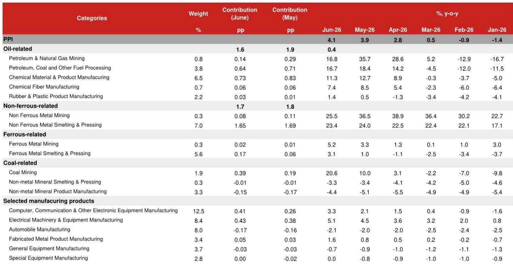

# NOM：油价与黄金推高PPI，中国核心通胀却仍在低位调整

6月通胀数据出炉，CPI同比1.0%，PPI同比4.1%。表面看，PPI连续四个月正增长且创近四年新高，似乎预示着价格变化正在积聚。但NOM这份研报的核心判断恰恰相反：剔除全球商品价格扰动后，中国核心通胀依然仍在调整，内需驱动的涨价动力并未形成。

这份报告的价值不在于确认通胀读数，而在于拆解了“谁在涨、谁在跌”的结构性真相。对于关注宏观环境和产业定价权的读者而言，理解这种分化比记住一个数字更重要。

## 1. PPI的4.1%是上游的变动，下游仍在价格调整

PPI读数较高，但涨幅完全集中在采掘和原材料等上游环节。NOM测算，仅石油相关行业就贡献了1.6个百分点，有色金属贡献1.7个百分点，两者合计超过PPI总涨幅的80%。而下游消费品PPI同比反而从-0.8%进一步降至-0.9%，连续多月处于负值区间。

这意味着什么？上游涨价并未通过产业链有效传导至终端消费者。企业端成本上升仍在内部消化，而非转嫁给市场。这种“上游热、下游冷”的格局，反映的是供给端影响而非需求端复苏。对于制造业企业而言，利润空间正在被两头挤压。

> **KC评论：** 报告图7中上游与下游PPI的差距持续扩大，是观察企业盈利变化的关键指标。完整报告里对石油、有色金属、芯片相关行业的细分拆解，值得仔细对照自己所在产业链的位置。

## 2. CPI走弱的主要因素是油价和黄金，而非内需

6月CPI从1.2%回落至1.0%，NOM拆解后发现，0.23个百分点的回落几乎全部来自石油和黄金价格贡献的减少。剔除这两项后，核心CPI同比仅约0.4%，与5月基本持平。换句话说，CPI的波动更多反映的是全球大宗商品定价，而非中国家庭消费的强弱。

食品端同样缺乏支撑。猪肉价格同比下跌15.9%，贡献了-0.3个百分点，且生猪出栏量仍处高位，短期难见拐点。鸡蛋价格因天气因素短暂跳升，但权重极小，对整体通胀影响有限。

> **KC评论：** 报告图2中“其他商品和服务”分项从9.9%降至6.6%，这个变化值得关注——它可能反映了黄金相关消费品的价格回落。完整报告对黄金在核心CPI中权重的讨论，是理解“真实”通胀水平的关键技术细节。

## 3. 报告没有完全回答：如果油价反弹持续，政策会如何应对？

NOM在报告中坦诚其通胀预测高度依赖油价的“剧烈波动路径”。7月初布伦特原油一度跌至70美元/桶附近，但8日因地缘政治紧张突然反弹至78美元。如果这一反弹持续，7月PPI可能超出当前4.1%的预测，CPI也会获得额外支撑。

但这里存在一个尚未被充分讨论的问题：若输入性通胀重新抬头，而国内需求依然偏弱，政策将面临两难。NOM维持“今年不再降准降息”的判断，逻辑是市场流动性充裕、国债回报表现已处于低位。但如果油价推高PPI的同时，内需仍无起色，货币政策的空间和意愿是否会发生变化？这份报告没有给出明确答案，但读者应当保持跟踪。

## 4. 关注“芯片通胀”这个新变量

报告中有个容易被忽视的细节：通信工具价格同比上涨7.6%，连续数月走高。NOM将其归因于芯片价格上涨。在PPI侧，计算机通信和电子设备制造业的贡献也从0.26个百分点升至0.41个百分点。

这是一个值得追踪的结构性变化。AI和半导体产业链的扩张正在通过全球贸易传导至消费品价格。对于下游电子制造和通信设备企业而言，成本变化可能才刚刚开始显现。这与传统的大宗商品周期不同，它更多由技术周期和地缘供应链调整驱动，持续性或许更强。

---

理解通胀的分化，比判断通胀的方向更重要。这份NOM研报的价值，就在于它帮你拆开了“4.1%”这个数字，让你看到哪些是风吹过来的，哪些是真正从地上长出来的。完整报告中的行业细分表格和贡献度拆解，是判断自己所在领域定价权是否变化的第一手工具。

For informational purposes only. Portions may be generated,translated,summarized,or edited with AI assistance based on source materials and may contain omissions or errors. Please verify independently. This is not investment,legal,tax,accounting,or other professional advice.

For informational purposes only. Portions may be generated,translated,summarized,or edited with AI assistance based on source materials and may contain omissions or errors. Please verify independently. This is not investment,legal,tax,accounting,or other professional advice.

