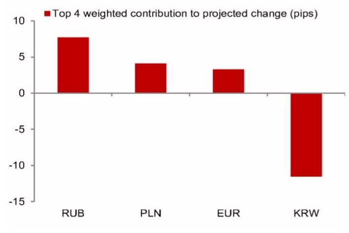
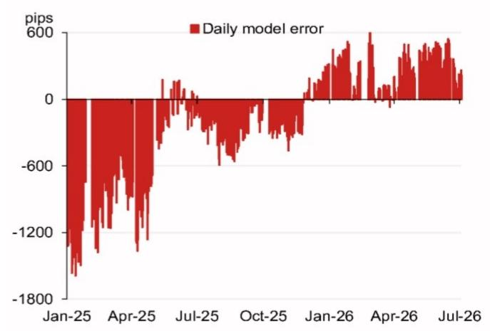

# 汇率观察笔记

## 亚洲市场（除日本外）汇率观察

模型参考值：6.7936

模型测算值：6.7936，此前为6.8036（较前次官方收盘价有所调整）。

含调节因子的模型测算值：6.7942（较前次参考值有所调整）。

2026年7月10日

## 研究团队

亚洲汇率策略
Craig Chan
Wee Choon Teo
Vicky Chen
Manthan Shingala

图1：隔夜主要因素对测算变化的贡献（不含调节因子）

来源：NOM

图2：近期模型偏差（不含调节因子调整）

来源：Bloomberg, NOM

图3：每日汇率参考值变动

来源：Bloomberg, NOM

图4：重要事件日历

| 日期 | 事件 | 地点 | 备注 |
|------|------|------|------|
| 2026年7月下旬 | 相关工作会议 | 中国 | 会议通常每月举行一次，7月会议内容通常包含经济工作安排。 |
| 2026年10月1-7日 | 国庆黄金周假期 | 中国 | |
| 2026年11月 | 亚太区域会议 | 中国深圳 | 中国将主办第31次亚太区域经济领导人会议。 |
| 2026年12月中旬 | 中央经济工作会议 | 中国 | |
| 2026年12月下旬 | 相关工作会议 | 中国 | |
| 2026年底 | 相关访问活动 | 美国 | |

来源：Bloomberg, NOM

## 附录A-1

本报告由NOM Singapore Ltd. (NSL)编制。

详见NOM集团实体免责声明。

## 分析师声明

我们，Craig Chan, Wee Choon Teo, Vicky Chen和Manthan Shingala，特此声明：(1)本研究报告中所表达的观点准确反映了我们对相关证券或发行人的个人看法；(2)我们的薪酬中没有任何部分直接或间接与本研究报告中的具体建议或观点相关；(3)我们的薪酬中没有任何部分与NOM Securities International, Inc.、NOM International plc或任何其他NOM集团公司进行的特定交易相关。

## 重要披露

## 研究报告在线获取及利益冲突披露

NOM集团研究报告可通过www.NOMnow.com/research、Bloomberg、Capital IQ、Factset、LSEG获取。

重要披露信息可于http://go.NOMnow.com/research/m/Disclosures查阅或向NOM Securities International, Inc.索取。

编制本报告的分析师的薪酬基于公司总收入等因素，其中一部分来自相关业务活动。除非另有说明，本报告列出的非美国分析师未在FINRA规则下注册/具备研究分析师资格，可能不是NSI的关联人员，且可能不受FINRA规则2241关于与所覆盖公司沟通、公开露面及交易证券的限制。

NOM Global Financial Products Inc. (NGFP)、NOM Derivative Products Inc. (NDP)和NOM International plc. (NIplc)已在商品期货交易委员会和全国期货协会注册为掉期交易商。

## 美国要求的额外披露

主要交易：NOM Securities International, Inc及其关联公司通常作为固定收益证券（或相关衍生品）的主要交易方。分析师与其他NOM Securities International, Inc.人员的互动：NOM Securities International, Inc及其关联公司的固定收益研究分析师定期与销售和交易部门人员互动，以获取其覆盖领域的流动性和定价信息。

## 估值方法 - 固定收益

NOM的固定收益策略师通过提供交易建议来表达对证券价格和金融市场的看法。这些建议可以是相对价值建议、方向性交易建议、资产配置建议或三者的组合。

交易建议中嵌入的分析包括但不限于：

- 关于证券价格是否偏离其基本面的基础分析。
- 价格变动的量化分析。
- 技术因素，如监管变化、市场风险偏好变化、评级行动、一级市场活动和供需考虑。

交易建议的时间框架是可变的。战术性建议时间框架较短，通常少于三个月。战略性交易建议时间框架较长，通常超过三个月。

根据欧盟市场滥用监管法规，NOM全球固定收益研究发布的评级分布如下：

52%被赋予买入（或同等）评级；其中50%的发行人接受了NOM集团的重要服务。
0%被赋予中性（或同等）评级。
48%被赋予卖出（或同等）评级；其中50%的发行人接受了NOM集团的重要服务。截至2026年6月30日。

## 免责声明

本出版物包含由第1页确定的NOM集团实体编制的材料，并可能包含一个或多个NOM集团实体的贡献。本文中使用的"NOM集团"指NOM Holdings, Inc.及其关联公司和子公司。

本材料仅供您私人参考，我们不基于此材料寻求任何行动；不构成在任何司法管辖区出售或购买任何证券的要约；除与NOM集团相关的披露外，基于我们认为可靠的来源信息，但未经NOM集团独立验证。

除与NOM集团相关的披露外，NOM集团不保证、不代表或承诺本文件的公平性、准确性、完整性、正确性、可靠性或适用于任何特定目的，并且在法律允许的最大范围内，不承担因使用本文件及相关数据而产生的任何责任。

本文所表达的意见或估计是截至原始发布日期的当前意见，信息（包括其中包含的意见和估计）可能随时更改，恕不另行通知。NOM集团明确表示没有义务更新或修订本文件。

NOM集团及其高级职员、董事、员工和关联公司，在适用法律允许的范围内，可能作为主事人、代理人或其他方式，持有或买卖本文提及的发行人或证券的金融工具。

本文可能包含从第三方获得的信息。NOM集团特此明确否认对第三方信息的任何陈述、保证或承诺，并且不对因使用或滥用第三方信息而产生的任何损失承担责任。

读者应将本文件视为其投资决策的单一因素，不应将其视为识别所有风险。NOM集团制作多种不同类型的研究产品，包括基础分析和量化分析；一种研究产品中的建议可能与其他类型研究产品中的建议不同。

本文呈现的数字可能涉及过去表现或基于过去表现的模拟，这些并非未来表现的可靠指标。如果信息包含对未来表现和业务前景的预期、预测或指示，此类预测可能不是未来表现的可靠指标。

关于固定收益研究：建议分为两类：战术性（通常持续最多三个月）或战略性（通常持续6-12个月）。交易建议可能随时根据情况变化进行审查。建议中显示的价格和回报表现基于提交时的指示性价格。

本文所述的证券可能未根据美国1933年证券法注册，在此情况下，除非符合注册要求或豁免条件，否则不得在美国或向美国人发售或出售。

本文件已获批准在英国作为投资研究由NIplc分发。NIplc由审慎监管局授权并由金融行为监管局和审慎监管局监管。

本文件已获批准在欧洲经济区作为投资研究由NOM Financial Products Europe GmbH ("NFPE")分发。

本文件已获NIHK批准在香港分发。本文件仅适用于香港适用法规下的"专业读者"。

本文件已获批准在澳大利亚由NAL分发。

本文件已获批准在马来西亚由NSM分发。

在新加坡，本文件由NSL分发。NSL可根据金融顾问法规第32C条安排分发其外国关联公司制作的此文件。本文件适用于《证券与期货法》定义的认可、专家或机构读者。

除非1933年法规S条款禁止，本材料在美国由NSI分发。

本文件未获批准在沙特阿拉伯、阿联酋或卡塔尔向特定人员以外的人士分发。

对于涉及台湾上市公司或由台湾研究分析师撰写的报告：本文件仅供参考。您应独立评估投资风险并对投资决策负责。未经NOM集团书面授权，不得复制或引用本报告的任何部分。

本材料不得在印度尼西亚分发或传递给印度尼西亚共和国境内的个人或印度尼西亚公民。

本报告未获批准或旨在在中国大陆分发。接收者不应依赖本报告中的任何信息做出投资决策。

未经NOM集团成员事先书面同意，不得以任何形式复制、再分发或重新发布本材料的任何部分。

NOM集团通过其合规政策和程序（包括但不限于利益冲突、中国墙和保密政策）以及维护中国墙和员工培训来管理研究生产中的冲突。

如需获取本文件中包含的任何研究交流所使用的方法或模型的额外信息，请联系本报告首页列出的NOM研究分析师。

版权所有 © 2026 NOM Singapore Ltd., Singapore。保留所有权利。
