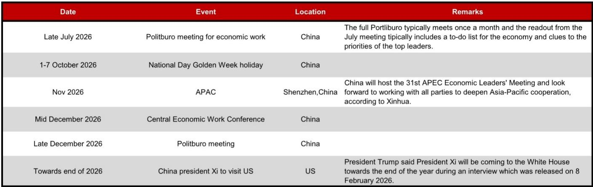
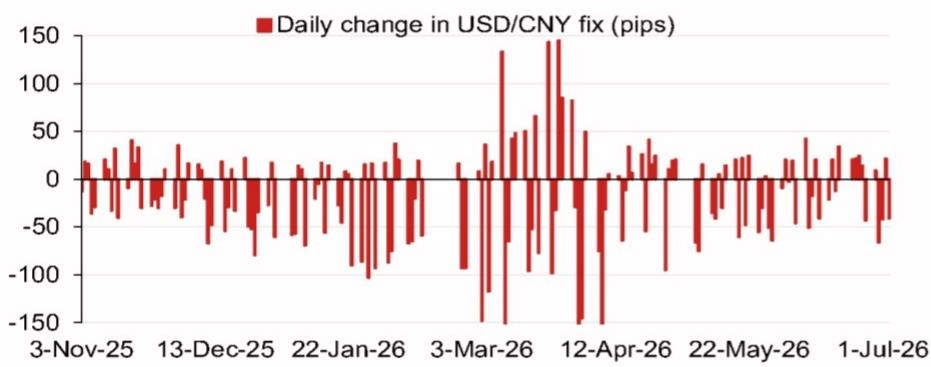

# NOM：从NOM模型看人民币定价，隔夜变量权重变化暗藏政策意图

人民币每日中间价的设定，是市场观察中国政策意图最直接的窗口之一。NOM最新一期USD/CNY定盘模型报告，提供了一个值得关注的细微判断：模型预测的中间价，在剔除逆周期因子后，较上一日官方收盘价仅高出1个基点，而计入逆周期因子后的预测值则较前一日定盘价低了94个基点。这组数字本身并不构成方向性变化，但连续多日的模型误差和权重贡献拆解，暗示着定价机制内部正在发生微调。

报告的核心价值不在于给出一个具体点位预测，而在于它提供了一套可追踪的“政策透明度工具”。对于关注人民币走势的专业读者，这份报告的价值不在结论，而在其拆解逻辑：哪些隔夜变量在推动模型变化，逆周期因子在多大程度上被启用，以及模型误差是否在偏离实际定盘。

## 1. 逆周期因子的启用程度，比点位本身更值得追踪

NOM模型将中间价预测拆解为两部分：无逆周期因子的纯粹模型输出，以及计入该因子后的调整值。7月10日的报告显示，无因子模型预测为6.7936，较前一日官方收盘价仅调高1个基点，几乎持平。但计入逆周期因子后，预测值降至6.7942，较前一日定盘价低了94个基点。

这组数据指向一个关键信息：逆周期因子正在被积极使用，且方向是引导中间价低于模型纯变量输出。过去几周，这一因子的调整幅度和方向是否稳定，比单日预测值更有观察意义。如果逆周期因子连续多日以较大幅度压低预测值，说明政策层在主动管理市场预期；如果因子调整幅度收窄或方向逆转，则可能意味着对汇率波动的容忍度在变化。

> **KC评论：** 逆周期因子是政策意图的“影子变量”。与其盯着6.79还是6.80的中间价点位，不如去看模型预测与实际定盘之间的差值是否在扩大或收窄。这个差值，才是政策态度最直接的读数。

## 2. 隔夜变量权重拆解：谁在驱动模型变化

报告中的图1展示了前四大隔夜变量对模型预测变化的贡献权重。虽然具体数值需查阅原文，但这类拆解的逻辑本身就有价值：它让市场参与者知道，中间价模型的调整究竟是受美元指数变动驱动，还是受欧元、日元等交叉汇率波动影响，抑或是来自中国国内因素。

一个值得追问的问题是：当模型预测与实际定盘出现系统性偏差时，偏差来源是否与特定变量类别相关？如果偏差主要来自美元指数贡献项，说明政策对冲的是外部不确定性；如果偏差来自交叉汇率项，则可能反映的是对一篮子货币稳定性的考量。报告没有展开这个层面的分析，但读者可以据此建立自己的跟踪框架。

## 3. 报告尚未完全回答的关键问题：模型误差是否在扩大

报告中的图2展示了近期模型误差（剔除逆周期因子后的预测与实际定盘的偏离）。这是最值得持续跟踪的图表。如果模型误差在收窄，说明市场定价与模型逻辑趋于一致，政策干预减少；如果误差在扩大，则意味着实际定盘正在偏离纯粹变量驱动的结果，逆周期因子或其他非模型因素在加大介入力度。

NOM报告提供了一个分析工具，但没有给出“误差是否在趋势性扩大”的判断。这需要读者结合多期报告的数据自行验证。一个实用的做法是：将过去10-20个交易日的模型误差绘制成时间序列，观察其标准差是否在上升。如果标准差走高，说明中间价设定的可预测性在下降，市场对政策意图的解读成本在上升。

## 4. 未来事件清单：下半年政策窗口期

报告附录中的事件日历列出了下半年关键节点：7月底政治局会议、10月国庆假期、11月APEC深圳峰会、12月中旬中央宏观环境工作会议、以及年底前预期中的中国领导人访美。这些事件构成了人民币汇率政策的潜在催化剂。

对市场参与者而言，这些时间点不仅是宏观事件，更是检验中间价模型稳定性的不确定性测试窗口。例如，在政治局会议和中央宏观环境工作会议前后，逆周期因子的启用力度是否加大？在APEC峰会和中美高层互动前夕，中间价是否出现“维稳”特征？这些问题的答案，都可以通过跟踪NOM这类模型报告来逐步验证。

> **KC评论：** 人民币中间价的设定，本质上是政策信号与市场力量的博弈。NOM的模型拆解了博弈的一方（市场变量），而逆周期因子则反映了另一方（政策意图）。读者真正需要做的是：定期对比这两者的差值，判断博弈天平正在向哪一侧倾斜。

---

**观察框架总结**：关注三个指标——逆周期因子调整幅度（方向与连续性）、模型误差的波动率（是否在扩大）、以及关键政策事件前后中间价设定的模式变化。这三者结合起来，比任何单日预测值都更能反映人民币汇率政策的真实取向。

For informational purposes only. Portions may be generated,translated,summarized,or edited with AI assistance based on source materials and may contain omissions or errors. Please verify independently. This is not investment,legal,tax,accounting,or other professional advice.

For informational purposes only. Portions may be generated,translated,summarized,or edited with AI assistance based on source materials and may contain omissions or errors. Please verify independently. This is not investment,legal,tax,accounting,or other professional advice.

