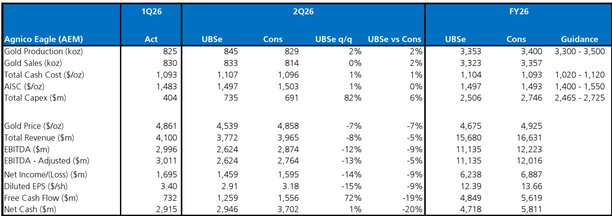
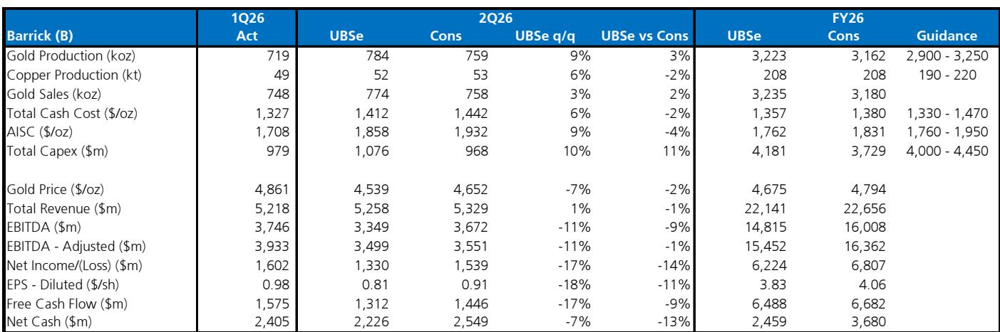
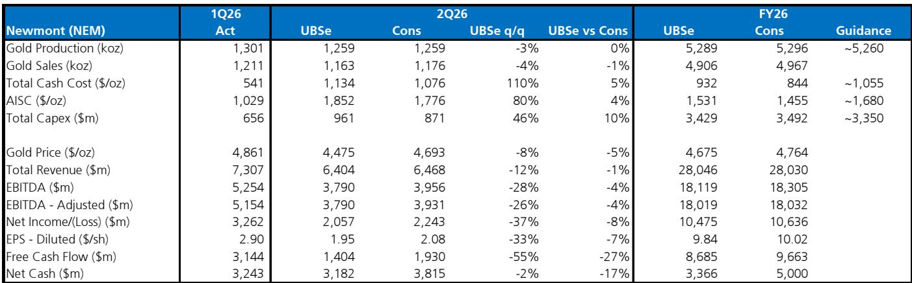

# UBS：黄金回调25%，UBS称矿企韧性远超以往周期

黄金从2024年四季度到2026年一季度价格弹性较高，驱动因素不再是传统的实际利率和美元走势，而是储备多元化和对货币信用体系的忧虑。中东冲突成为催化剂，让黄金的历史宏观驱动因素重新发挥作用——能源推高通胀、美联储偏鹰、实际利率上升、美元走强，共同引发约25%的回调。UBS最新发布的黄金矿业2Q26季报前瞻指出，如果美国数据继续强劲、市场表现持续上行，金价短期仍有节奏变化空间。但央行购金、主权债务上升和去美元化趋势构成的支撑结构并未瓦解，仓位已重新调整，不确定性回报正在改善。

金矿股（GDX）较高点已回调约35%，短期面临盈利下修、能源成本上升和成本指引不确定性。但UBS强调，与以往周期不同，本轮节奏变化中矿企的起点明显更强：创纪录的利润率、强劲的资产负债表（多数净现金）、健康的自由现金流、自律的资本配置，以及回购和机会性并购的能力。如果金价继续下跌，矿股大概率跟随，但在该机构看来，它们比过去任何周期都更有韧性。

## 1. 成本不确定性已现，但全年指引大概率不变

市场对二季度的财务预期需要下调，但主要源于金价的季度环比回落，而非运营出现变化。能源成本不确定性确实存在，但部分被汇率变动和较低的权益金所抵消。UBS认为，全年成本指引面临的不确定性有限。

具体来看，纽蒙特二季度运营符合预期，产量按计划推进，但自由现金流因资本开支上升和营运资本逆风环比减半，回购节奏变化。巴里克二季度产量环比小幅提升，但燃料驱动的成本上升是核心观察点；马里运营未受区域动荡影响。阿格尼科再次交出稳定表现，但柴油成本上升和约6.25亿美元的研究流出影响了自由现金流；加拿大马拉蒂克矿坑壁位移事件可能带来每年6-8万盎司的产量不确定性。

> **KC评论：** 这份报告最值得仔细看的不是单季度数字，而是各公司对全年指引的态度。如果多数矿企维持原指引，说明管理层对下半年金价和成本控制有信心，这本身就是信号。

## 2. 矿企进入节奏变化周期的方式与前几轮完全不同

这是UBS报告中最值得反复品读的判断。历史上金矿股在周期中往往债务高企、资本开支失控、被迫融资。但本轮主要矿企的资产负债表是近几年最健康的——多数处于净现金状态，自由现金流回报表现约7%，企业价值/EBITDA约6倍。

更关键的是资本配置纪律。回购和并购决策都以股东回报为导向，而非盲目扩张。这意味着即便金价继续下跌，矿企也不太可能被迫抛售资产或稀释股权。它们有足够的财务缓冲来等待价格复苏。

但这不等于报价不会继续跌。如果宏观环境迫使金价再下台阶，矿股的贝塔特性仍会放大跌幅。区别在于，本轮节奏变化的底部结构会比以往更坚实，反弹时的弹性也可能更大。

## 3. 报告尚未完全回答的关键问题：能源成本能否被消化

UBS反复提到柴油和燃料成本上升对矿企成本端的不确定性。巴里克、阿格尼科、金罗斯等多家公司都面临这一挑战。问题在于，能源成本上升是暂时的输入性通胀，还是结构性抬升了矿企的盈亏平衡线？

报告没有给出明确判断。如果能源成本持续高位，即便金价企稳，矿企的利润率和自由现金流也会被压缩。这将对回购能力和估值倍数形成持续压制。读者需要跟踪的是各家公司的成本指引是否会随着油价波动而调整，以及是否有对冲策略来平滑影响。

## 4. 观察框架：关注自由现金流和资本开支节奏，而非金价本身

对于金矿股读者，UBS报告提供了一个清晰的观察框架

第一，盯住自由现金流。二季度纽蒙特FCF环比减半、阿格尼科因研究流出导致FCF承压，但这些都是季节性资本开支和项目研究的结果。如果下半年FCF随产量回升而改善，市场情绪可能率先修复。

第二，关注资本开支节奏。二季度是全年资本开支的高峰期，三季度开始通常回落。如果各公司维持全年资本开支指引，下半年的FCF改善将是可预期的。

第三，不要忽视并购和项目进展。阿格尼科的加拿大马拉蒂克矿坑壁事件、金罗斯的Fort Knox Phase 11项目延展、Lundin Gold的扩产研究——这些微观事件对单只公司的定价影响可能超过金价波动本身。

> **KC评论：** UBS这份报告最有价值的部分不是预测金价方向，而是提供了一个判断矿企“抗跌能力”的框架。如果你相信黄金的结构性支撑依然存在，那么当前的回调可能只是在测试每家公司的财务韧性。完整报告里对各公司的季度数据拆解和成本细节值得仔细对照。

For informational purposes only. Portions may be generated,translated,summarized,or edited with AI assistance based on source materials and may contain omissions or errors. Please verify independently. This is not investment,legal,tax,accounting,or other professional advice.

For informational purposes only. Portions may be generated,translated,summarized,or edited with AI assistance based on source materials and may contain omissions or errors. Please verify independently. This is not investment,legal,tax,accounting,or other professional advice.

