# Metal Matters

## 铜价有望在9月后回升，中期看涨观点不变

### 研究观点

我们发布了4月和5月的全球铜终端消费追踪数据。表面数据显示的铜终端消费同比下降，主要反映了2025年第二季度中国可再生能源装机量因政策推动而出现的基数效应。全球其他地区的铜终端消费增长温和，但整体制造业景气度仍保持稳健。我们预计铜价将从9月起重新获得上行动力，并认为在一年内有望触及每吨15,000美元的水平，尽管铜关税动态和黄金市场的逆风可能在夏季（7月和8月）限制涨幅。

我们对短期铜价方向的把握有限。我们认为，在我们的基准情景下，即美国铜关税担忧消退且黄金价格下行势头持续，铜价在夏季难以持续上涨——我们此前对6月铜价上涨的预测未能实现，原因是美联储的鹰派立场超出预期，尽管这与6月更广泛的大宗商品价格回调（如黄金、石油、铝）有关。然而，美国对铜阴极可能征收第232条关税的担忧减弱，可能在未来几周内对市场情绪产生影响（鉴于特朗普总统6月底的审查截止日期已过，且假设我们的基准情景——不会宣布关税——成立）。

尽管如此，我们认为从9月起将重新出现积极的价格催化剂，包括美联储转向更鸽派立场、市场对2027年铜现货市场供需趋紧的关注度提升，以及结构性中期看涨背景（请参见我们于6月底发布的114页《铜书2026》）。我们预计2026年第四季度铜均价为每吨14,500美元，风险偏向于美联储因通胀缓解和美国劳动力市场走软而采取更鸽派立场、美伊协议最终达成的可能性、实际利率下降，以及整体对需求和增长预期更为有利的环境。

全球制造业PMI显示6月活动进一步扩张，受人工智能相关投资和国防支出支撑，尽管美国和欧洲的环比读数有所放缓。制造业活动的韧性以及这些金属密集型需求领域可能继续支撑铜需求，这是一个利好因素，而我们的全球终端消费追踪器可能低估了这一因素，因为它目前并未直接追踪这些领域。人工智能投资带来的生产率提升也有可能通过支撑增长和抑制高于目标的通胀来支持铜价。

2026年5月全球铜终端消费表面数据同比下降约10%，这是由于2025年5月中国可再生能源装机量报告出现异常峰值（当时全球铜终端消费追踪器同比增长13.5%）。剔除这些扭曲因素后，潜在终端消费表现温和但具有韧性，隐含终端消费同比增长约1%。政策驱动的中国太阳能和风能装机报告前置在2025年5月达到峰值，严重扭曲了今年的同比比较。因此，仅依赖铜终端消费的表面数据会夸大铜需求的疲软程度。经太阳能/风能扭曲调整后，隐含的全球铜终端消费年初至今增长1.4%，而未经调整的基准为下降2.1%。

---

## 铜价有望在9月后回升，中期看涨观点不变

我们预计铜价在夏季过后将重新获得上行动力，预计2026年第四季度均价为每吨14,500美元，并在一年内触及每吨15,000美元。我们认为，鉴于我们预期市场将在未来几个月内淡化美国对铜阴极征收进口关税的尾部风险，且黄金（及更广泛的贵金属）价格短期内可能进一步承压，铜价在7月和8月难以持续上涨。到9月，我们预计看涨催化剂将重新出现，包括美联储因美国劳动力市场状况软化而转向更鸽派立场、市场重新关注2027年铜现货市场预计将趋紧的动态，以及结构性铜牛市逻辑（参见我们于6月中旬发布的114页报告：《铜书2026——结构性顺风与周期性敏感性为铜价每吨15,000美元铺平道路》）。我们认为，实际利率下降、美伊协议最终且更可持续地达成，以及对需求和增长预期更为有利的环境，将在今年晚些时候进一步改善市场对铜的情绪。

我们的基准情景仍然是铜阴极不会受到美国第232条进口关税的影响。我们认为，由于6月30日审查截止日期已过且未宣布任何措施，市场倾向于在夏季淡化关税的尾部风险。特朗普总统去年7月设定的对铜阴极进行第232条关税审查的6月30日截止日期已过去一周多，政府未作出任何表态。未来几周仍有可能宣布关税，但我们认为可能性不大，并且我们认为，美国政府通过既不实施关税也不排除其可能性来维持战略模糊性符合其利益。如果市场参与者选择淡化关税尾部风险，这可能在7月/8月对铜价构成逆风（对美国铜价影响更大，因为当前存在溢价，图1），但需要与更看涨的长期结构性市场主题以及围绕美联储言论和霍尔木兹海峡局势的利率预期波动相权衡。

**图1. 我们预计COMEX相对于LME的溢价将在7月和8月进一步收窄，因为关税风险被淡化（假设我们的基准情景——不会宣布关税）**
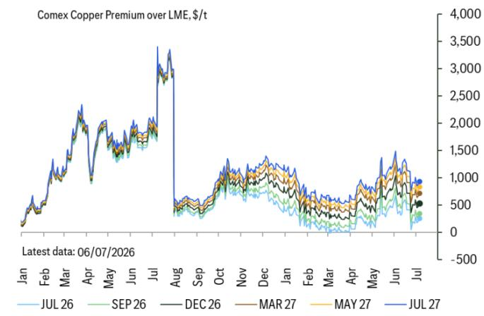
© 2026 Citi Inc. 未经Citi书面许可不得转载。
来源：Citi, Bloomberg, CME Group, LME

**图2. 截至5月底，中国废铜进口量同比基本持平，表明全球废铜供应对铜价大幅上涨的反应平淡。**
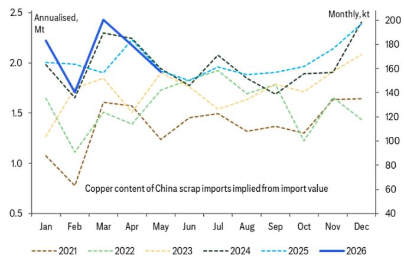
© 2026 Citi Inc. 未经Citi书面许可不得转载。
来源：Citi, TDM, 中国海关, LME, Bloomberg

截至5月，中国废铜进口量同比基本持平（图2），尽管铜价同比大幅上涨，这表明废铜市场对价格相对缺乏弹性。

结合2026年矿山供应预计持平的情况，这表明供应面非常紧张，可以抵消今年中国需求增长的预期放缓。中国废铜进口量截至5月同比基本持平，4月和5月与2025年水平大致相当。在铜价显著走高的环境下，进口反应不强表明全球废铜供应持续紧张，废铜供应对价格激励的反应平淡。我们预计2026年铜市场将基本平衡（图3），在当前价格水平下，假设需求温和周期性复苏、能源转型和人工智能需求持续增长，而明年供应增长约为趋势水平的一半，市场将在2027年转为约40万吨的缺口。

**图3. Citi铜供需平衡表2020-2030**

| 千吨铜 | 2020 | 2021 | 2022 | 2023 | 2024 | 2025 | 2026f | 2027f | 2028f | 2029f | 2030f |
|---|---|---|---|---|---|---|---|---|---|---|---|
| 矿山产量 | 20,752 | 21,179 | 21,808 | 22,395 | 23,128 | 23,398 | 23,334 | 23,739 | 24,509 | 25,272 | 25,880 |
| 同比变化 | 0.7% | 2.1% | 3.0% | 2.7% | 3.3% | 1.2% | -0.3% | 1.7% | 3.2% | 3.1% | 2.4% |
| 其中：扰动预留（吨） | | | | | | | 973 | 1,805 | 1,926 | 1,964 | 2,023 |
| 其中：扰动预留（%） | | | | | | | 4.0% | 7.1% | 7.3% | 7.2% | 7.2% |
| 精炼产量 | 23,591 | 24,374 | 25,067 | 25,561 | 26,450 | 27,300 | 27,505 | 27,866 | 28,716 | 29,557 | 30,248 |
| 同比变化 | -0.3% | 3.3% | 2.8% | 2.0% | 3.5% | 3.2% | 0.8% | 1.3% | 3.0% | 2.9% | 2.3% |
| 精炼消费 | 23,103 | 24,769 | 24,841 | 25,704 | 26,311 | 26,943 | 27,522 | 28,267 | 28,820 | 29,446 | 29,928 |
| 同比变化 | -3.4% | 7.2% | 0.3% | 3.5% | 2.4% | 2.4% | 2.2% | 2.7% | 2.0% | 2.2% | 1.6% |
| 终端消费 | 24,165 | 25,908 | 25,984 | 26,886 | 27,521 | 28,182 | 28,788 | 29,567 | 30,146 | 30,800 | 31,305 |
| 盈余/缺口 | 489 | -395 | 226 | -143 | 139 | 357 | -18 | -401 | -104 | 111 | 320 |
| 均价（美元/吨，除美国外） | 6,183 | 9,318 | 8,830 | 8,485 | 9,145 | 9,950 | 13,700 | 14,250 | 14,000 | 14,000 | 14,000 |

*更新于2026年6月12日，预测产量和消费基于当前约每吨13,500美元的现货价格
© 2026 Citi Inc. 未经Citi书面许可不得转载。
来源：Citi, Bloomberg, Wood Mackenzie, BGRIMM, IWCC, ICSG, 公司报告

## 全球工厂产出持续扩张，尽管短期前景受美联储鹰派立场和地缘政治不确定性影响

6月全球PMI数据显示，包括中国、美国和欧洲在内的所有主要经济体的制造业活动均在扩张（见图4和图5）。这通常对铜的周期性消费构成支撑信号，尽管近期读者对美联储加息的预期升温对市场情绪产生了影响。中国制造业PMI回升至扩张区间，最新读数为50.3。出口订单继续引领复苏，高科技制造业表现优于传统经济部门。我们的中国经济学家预计近期将有进一步定向宽松措施，但并非政策转向。7月的政治局会议是下一个需要关注的中国政策催化剂。

欧洲PMI显示制造业连续第五个月扩张，而美国数据则显示活动温和增长。尽管6月欧洲和美国的读数均较5月略有下降，但中东冲突导致的供应链中断（消费者在预期价格上涨前积累库存）支撑了活动。美国制造业部门继续显示动能，人工智能基础设施的建设仍是一个利好因素。此外，国防支出正成为活动的潜在贡献因素。我们的美国经济学家预计，随着这些利好因素持续，制造业PMI今年将保持在扩张区间。

**图4. 铜基金持仓仍为净多头，受结构性需求驱动因素、供应约束以及改善的PMI支撑。**
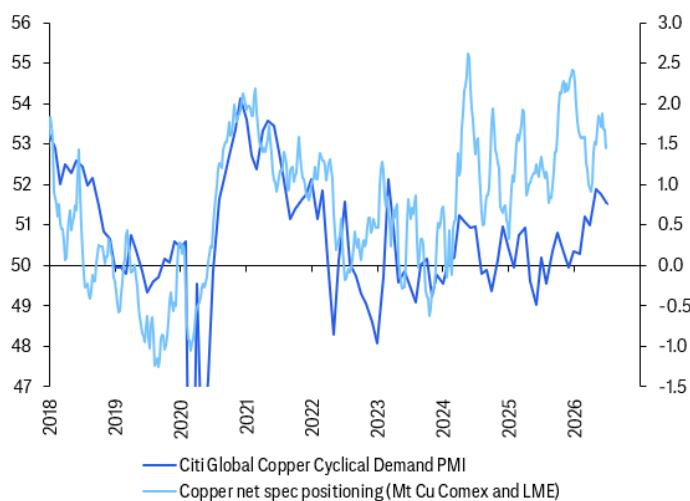
© 2026 Citi Inc. 未经Citi书面许可不得转载。
来源：Citi, Bloomberg, LME, CME Group

**图5. 近期全球PMI处于扩张区间，受中东紧张局势和人工智能/数据中心建设引发的供应链囤货影响。**
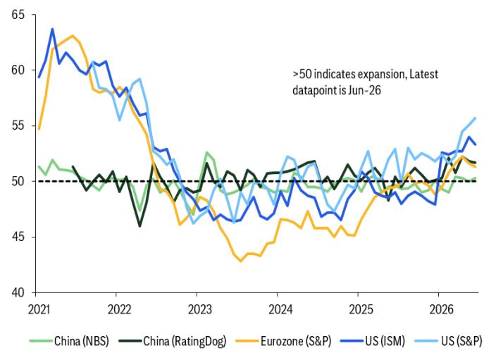
© 2026 Citi Inc. 未经Citi书面许可不得转载。
来源：Citi, Rating Dog, Platts, Bloomberg, NBS, SMM

## 中国可再生能源基数效应对追踪的全球铜终端消费产生负向扭曲，其他领域增长但缓慢

根据我们的专有全球铜终端消费追踪器，2026年5月隐含的全球铜终端消费同比下降约10%。这主要反映了与2026年5月中国可再生能源装机量报告创纪录峰值相比的统计基数效应。所有其他领域的合计需求同比增长1%。表面数据的疲软并不令人意外，符合我们此前报告中的预期，我们曾强调去年中国可再生能源装机量因政策和贸易驱动的变化而产生的巨大影响。值得注意的是，2025年5月隐含的铜终端消费同比增长约13%，受中国太阳能装机量报告异常强劲的推动，能源转型相关需求同比激增约120%。相比之下，2026年第二季度更为正常化的报告装机量看起来要弱得多。中国的可再生能源装机量报告是潜在铜消费的不完美代理指标，因为政策敏感性波动较大，在解读我们追踪器隐含的同比增长率时必须承认这一点。基数效应可能在2026年下半年逆转，并推动更积极的隐含增长。

**图6. 中国可再生能源装机量因强劲的基数效应拖累追踪的铜终端消费同比增长**
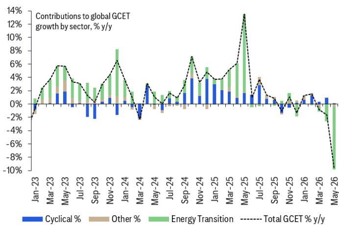
© 2026 Citi Inc. 未经Citi书面许可不得转载。
来源：Citi, ICA, Wood Mackenzie, Bloomberg

**图7. 剔除中国太阳能和风能报告装机量隐含的消费后，2026年5月全球隐含铜终端消费同比增长约1%。**
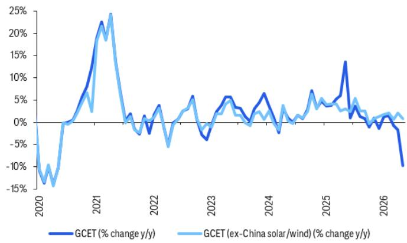
© 2026 Citi Inc. 未经Citi书面许可不得转载。
来源：Citi, ICA, Wood Mackenzie, Bloomberg

**图8. 总隐含铜终端消费（基于我们的追踪器）年化约为2700万吨**
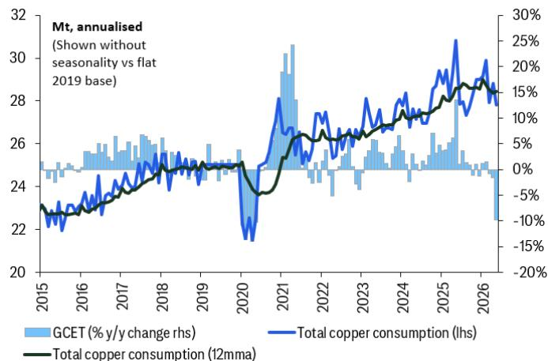
© 2026 Citi Inc. 未经Citi书面许可不得转载。
来源：Citi

**图9. 中国隐含铜终端消费因统计效应走弱，拖累全球隐含铜终端消费**
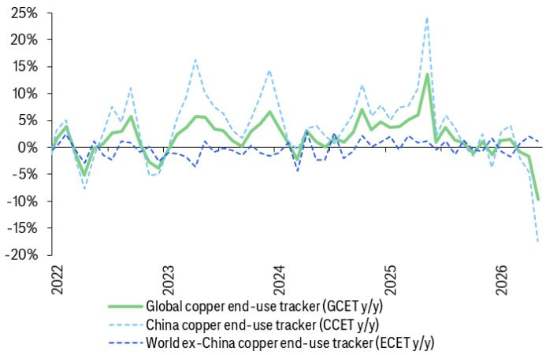
© 2026 Citi Inc. 未经Citi书面许可不得转载。
来源：Citi

中国铜终端消费表面数据（基于我们的追踪器）疲软是全球消费的主要拖累因素。2026年5月中国铜终端消费同比下降约17%。然而，经可再生能源部门扭曲调整后，潜在情况（见图8）更为稳定。剔除太阳能和风能装机量，中国铜终端消费同比增长约0.6%，表明更广泛的工业需求具有温和韧性。主要拖累因素仍是可再生能源装机量的急剧放缓。中国5月太阳能装机量约为8.7吉瓦——为今年最低月度运行率——而2025年5月为异常高的约93吉瓦。同样，风能装机量约为3.8吉瓦，而去年同期约为26吉瓦。继去年前置建设后的这种正常化，显著减少了能源转型领域的铜需求。

此外，国内电动汽车需求走弱也对能源转型相关的铜消费构成压力。电动汽车批发量年初至今仅增长约2%，而零售量同比下降约15%，表明国内需求疲软。然而，这被强劲的出口需求部分抵消，电动汽车出口量同比激增约115%。尽管2026年电动汽车销售开局缓慢，但电动汽车隐含的铜消费在5月仍实现了约17%的稳健同比增长，受到出口渠道和持续电气化趋势的支撑。展望未来，季节性和政策支持应提供利好因素。我们预计2026年下半年电动汽车销售将出现更强劲的回升，这得益于近期宣布的旨在促进电动汽车消费（尤其是在农村地区）的政策措施。

**图10. 剔除太阳能和风能影响后，中国隐含终端消费5月同比增长约0.6%**
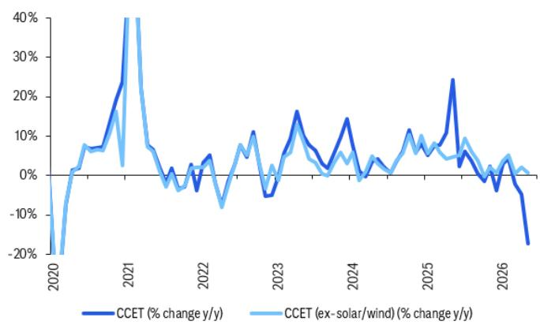
© 2026 Citi Inc. 未经Citi书面许可不得转载。
来源：Citi, ICA, Wood Mackenzie, Bloomberg

**图11. 中国报告太阳能装机量在2025年第二季度飙升后，年初至今下降70%**
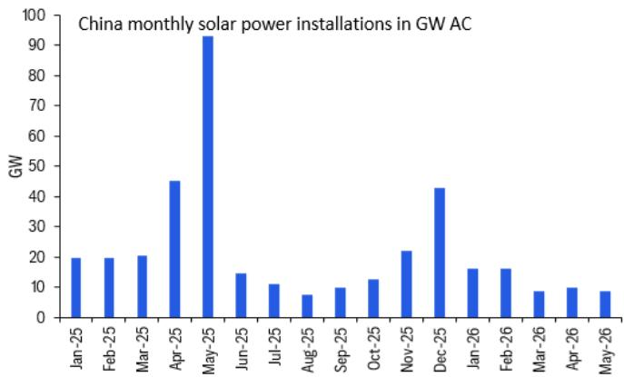
© 2026 Citi Inc. 未经Citi书面许可不得转载。
来源：Citi, NEA

**图12. 中国报告风能装机量在2025年5月政策驱动峰值后，年初至今下降约50%**
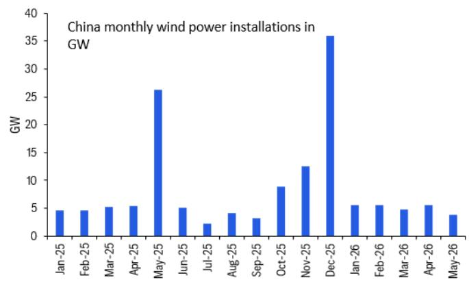
© 2026 Citi Inc. 未经Citi书面许可不得转载。
来源：Citi, NEA

**图13. 中国电动汽车批发量年初至今增长2%**

© 2026 Citi Inc. 未经Citi书面许可不得转载。
来源：Citi, CPCA, Bloomberg

**图14. 电动汽车出口是中国汽车批发增长的主要驱动力**
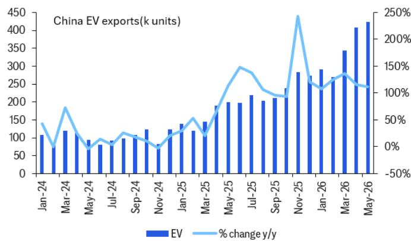
© 2026 Citi Inc. 未经Citi书面许可不得转载。
来源：Citi, CPCA, Bloomberg

**图15. 中国商用车电气化势头正在增强**
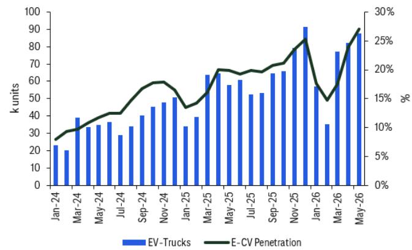
© 2026 Citi Inc. 未经Citi书面许可不得转载。
来源：Citi, CATARAC, Bloomberg

2026年5月，中国以外地区的隐含铜终端消费同比增长1%，受到能源转型和周期性相关消费的共同支撑。短期内中国以外地区的前景喜忧参半。由于美联储鹰派立场，读者定价了今年加息，需求相关担忧浮现。相比之下，我们的内部观点预计从10月开始降息。人工智能相关资本支出的增长正在推动对电力基础设施设备（包括开关设备和变压器）的需求，从而支撑铜消费。此外，中国以外地区太阳能、风能和电池储能系统装机量的持续增长正在贡献增量需求。制造业景气度呈上升趋势，尤其是美国PMI读数强劲，我们可能会在未来几个月看到这反映在一些追踪的周期性消费序列中。

**图16. 汇总表：全球、中国和世界（除中国外）铜月度终端消费追踪器（总需求包括电网和发电），隐含同比变化百分比**

| | 2025年4月 | 2025年5月 | 2025年6月 | 2025年7月 | 2025年8月 | 2025年9月 | 2025年10月 | 2025年11月 | 2025年12月 | 2026年1月 | 2026年2月 | 2026年3月 | 2026年4月 | 2026年5月 |
|---|---|---|---|---|---|---|---|---|---|---|---|---|---|---|
| 全球铜终端消费追踪器 | 6.1% | 13.5% | 1.0% | 3.7% | 1.3% | 0.8% | -1.1% | 1.0% | -1.4% | 1.3% | 1.5% | -0.8% | -1.7% | -9.7% |
| 建筑 | -3% | -4% | -3% | 1% | -4% | -4% | -7% | -5% | -4% | 0% | 11% | -7% | -4% | -4% |
| 家电 | -1% | 0% | 4% | 4% | 3% | -1% | -4% | -2% | -2% | 0% | 0% | 4% | 1% | 0% |
| 机械和设备 | 0% | 0% | 1% | 1% | 2% | 2% | 0% | 1% | 1% | 1% | 0% | 0% | 2% | 1% |
| 汽车 | 15% | 10% | 7% | 12% | 11% | 14% | 7% | 3% | 0% | -3% | -9% | -2% | -2% | -1% |
| 电动汽车 | 40% | 30% | 21% | 26% | 24% | 25% | 18% | 12% | 5% | -3% | -12% | 0% | 5% | 10% |
| 内燃机 | 2% | -1% | -1% | 3% | 2% | 5% | 0% | -5% | -4% | -3% | -7% | -3% | -6% | -8% |
| 电网（来自年度估算） | 3% | 2% | 2% | 2% | 3% | 3% | 3% | 3% | 3% | 3% | 3% | 3% | 3% | 3% |
| 发电（部分来自年度估算） | 69% | 169% | -17% | -6% | -10% | -20% | -10% | 16% | -11% | 10% | 11% | -18% | -31% | -67% |
| 总周期性 | 1% | 2% | 2% | 4% | 1% | 1% | -2% | -1% | 0% | 1% | 2% | 0% | 1% | 0% |
| 总能源转型 | 58% | 118% | -4% | -3% | 1% | -2% | 4% | 10% | -9% | 1% | -1% | -6% | -20% | -49% |

| | 2025年4月 | 2025年5月 | 2025年6月 | 2025年7月 | 2025年8月 | 2025年9月 | 2025年10月 | 2025年11月 | 2025年12月 | 2026年1月 | 2026年2月 | 2026年3月 | 2026年4月 | 2026年5月 |
|---|---|---|---|---|---|---|---|---|---|---|---|---|---|---|
| 世界（除中国外）铜终端消费追踪器 | 1% | 1% | 0% | 1% | -1% | 1% | -1% | -1% | 2% | -1% | -2% | 1% | 2% | 1% |
| 建筑 | 0% | 1% | 1% | 2% | -2% | 2% | -1% | -1% | 2% | -2% | -4% | 1% | 2% | 0% |
| 家电 | -1% | 0% | -4% | -2% | -5% | -4% | -4% | -3% | -2% | -4% | -2% | -3% | 1% | -1% |
| 机械和设备 | 0% | 0% | 0% | 1% | 0% | 1% | 0% | 2% | 2% | 3% | 1% | 1% | 3% | 3% |
| 汽车 | 8% | 3% | -3% | 4% | 2% | 8% | 1% | -6% | 2% | -4% | -5% | -3% | -4% | -6% |
| 电动汽车 | 17% | 8% | 0% | 9% | 14% | 22% | 6% | -20% | -2% | -11% | -11% | -3% | -12% | -11% |
| 内燃机 | 6% | 2% | -4% | 2% | -1% | 4% | 0% | -2% | 3% | -2% | -3% | -3% | -3% | -5% |
| 电网（来自年度估算） | 5% | 4% | 4% | 5% | 5% | 6% | 7% | 8% | 8% | 9% | 10% | 10% | 11% | 12% |
| 发电（来自年度估算） | 2% | 1% | 1% | 2% | 3% | 4% | 6% | 7% | 8% | 9% | 10% | 12% | 13% | 14% |

| | 2025年4月 | 2025年5月 | 2025年6月 | 2025年7月 | 2025年8月 | 2025年9月 | 2025年10月 | 2025年11月 | 2025年12月 | 2026年1月 | 2026年2月 | 2026年3月 | 2026年4月 | 2026年5月 |
|---|---|---|---|---|---|---|---|---|---|---|---|---|---|---|
| 中国铜终端消费追踪器 | 11% | 24% | 2% | 6% | 4% | 0% | -2% | 2% | -4% | 3% | 4% | -2% | -5% | -17% |
| 建筑 | -6% | -7% | -5% | 1% | -6% | -8% | -12% | -9% | -7% | 0% | 20% | -12% | -9% | -10% |
| 家电 | -2% | 1% | 6% | 6% | 4% | -1% | -6% | -4% | -3% | 0% | 0% | 5% | 1% | 0% |
| 机械和设备 | -1% | -2% | 2% | 2% | 10% | 6% | 0% | 5% | 1% | 4% | 4% | 0% | 7% | 3% |
| 汽车 | 23% | 19% | 20% | 22% | 20% | 20% | 13% | 10% | -2% | -2% | -14% | 0% | 1% | 5% |
| 电动汽车 | 49% | 39% | 31% | 33% | 27% | 26% | 22% | 23% | 7% | 1% | -13% | 1% | 10% | 17% |
| 内燃机 | -5% | -6% | 5% | 6% | 8% | 9% | -1% | -10% | -17% | -5% | -16% | -3% | -14% | -15% |
| 电网（来自年度估算） | 2% | 2% | 2% | 2% | 2% | 2% | 2% | 2% | 2% | 2% | 2% | 2% | 1% | 1% |
| 发电 | 170% | 350% | -31% | -13% | -25% | -42% | -23% | 23% | -16% | 11% | 12% | -46% | -56% | -86% |

© 2026 Citi Inc. 未经Citi书面许可不得转载。
来源：Citi, ICA, Wind, Bloomberg, IWCC

如果您有视觉障碍并希望与Citi代表就本文件中图形的详细信息进行沟通，请致电美国1-888-500-5008（TTY：711），或从美国境外拨打+1-210-677-3788。

---

## 附录A-1

## 分析师认证

主要负责本研究报告准备和内容的研究分析师要么在作者栏中以"AC"标识，要么以粗体列在与该分析师相关的内容旁边。如果作者栏中指定了多位AC分析师，则每位分析师仅就其负责的整个研究报告部分进行认证，但以下情况除外：(a) 归属于以粗体列在内容旁边的另一位AC认证分析师的内容，以及(b) 仅针对特定发行人的观点，这些观点归属于下方该发行人价格图表或评级历史表中标识的另一位AC认证分析师。这些分析师中的每一位均就其负责的报告部分认证：(1) 其中表达的观点准确反映了他们个人对每个提及的发行人和证券的看法，并且是独立准备的，包括对Citi Global Markets Inc.及其关联公司；以及(2) 研究分析师的薪酬的任何部分过去、现在或将来都不会直接或间接与该研究分析师在本报告中表达的具体建议或观点相关联。

## 重要披露

分析师的薪酬由Citi管理层和Citi高级管理层决定，并基于旨在惠及Citi Global Markets Inc.及其关联公司（"公司"）读者客户的活动和服务。薪酬不与特定交易或建议挂钩。与所有公司员工一样，分析师的薪酬受到公司整体盈利能力的影响，包括投资银行、销售和交易以及自营交易收入。股票研究分析师薪酬的一个因素是安排机构客户与被覆盖公司管理团队之间的企业接触活动。通常，当分析师对公司持积极看法时，公司管理层更有可能参与。

对于公司不是做市商的Product中推荐的金融工具，公司是该金融工具（及其任何基础工具）的流动性提供者，并可能在与这些工具相关的交易中作为主体行事。公司是可能与Product中推荐的证券挂钩的可交易金融工具的定期发行人。公司定期交易Product中讨论的发行人的证券。公司可能以与Product不一致的方式进行证券交易，并且对于Product涵盖的证券，将按主体基础从客户处买入或卖出。

除非另有说明，研究分析师或其团队的任何成员在过去12个月内均未参观过已提供投资观点的公司的实质性运营。

有关作为本Citi产品（"Product"）主题的公司的重要披露（包括历史披露副本），请联系Citi, 388 Greenwich Street, 6th Floor, New York, NY, 10013, Attention: Legal/Compliance [E6WYB6412478]。此外，相同的重要披露（估值和风险评估以及历史披露除外）包含在公司披露网站上，网址为：

https://www.citivelocity.com/cvr/eppublic/citi\_research\_disclosures。估值和风险评估可在关于主题公司的最新研究报告/报告的正文中找到。根据市场滥用法规，过去12个月内发布的所有Citi建议的历史记录可通过Citi Velocity (https://www.citivelocity.com/cv2) 或您的标准分发门户访问。历史披露（最多过去三年）将根据要求提供。

## 研究分析师隶属关系/非美国研究分析师披露

本报告作者的法律实体列于下方（其监管机构进一步列于本文）。编制本报告的非美国研究分析师（即除被标识为受雇于Citi Global Markets Inc.的分析师之外的所有列出的研究分析师）未在FINRA注册/具备研究分析师资格。此类研究分析师可能不是成员组织的关联人士（但受雇于成员组织的关联公司），因此可能不受FINRA规则2241关于与主题公司沟通、公开露面以及研究分析师账户持有证券交易的限制。

| Citi Global Markets Inc. | Alexander Hacking, CFA |
|---|---|
| Citi Global Markets Asia Limited | Jack Shang, CFA |
| Citi Global Markets Singapore Pte. Ltd. | Kenny Hu, CFA |
| Citi Global Markets India Private Limited | Shreyas Madabushi |
| Citi Global Markets Limited | Wenyu Yao; Tom Mulqueen; Maximilian J Layton; Ephrem Ravi |

## 其他披露

建议中提及的任何工具的价格均为前一交易日该工具主要市场的收盘价，除非另有说明。

本研究报告中所作任何建议的完成和首次传播时间均为Product顶部显示的东部日期时间。如果Product引用了其他分析师的看法，请参阅价格图表或评级历史表，以了解该看法的完成和首次传播的日期/时间。

欧洲法规要求，如果建议与作者在过去12个月内发布的关于同一金融工具或发行人的任何先前建议不同，则应指明变更以及先前建议的日期。请参阅已发布研究中的交易历史或联系研究分析师。

Citi已制定政策，用于识别、考虑和管理因发布或分发投资研究而产生的潜在利益冲突。这些政策的描述可在以下网址找到：https://www.citivelocity.com/cvr/eppublic/citi\_research\_disclosures。

过去12个月每个季度末，所有Citi研究建议中等同于"买入"、"持有"、"卖出"的比例（以及其中在过去12个月内获得Citi投资公司服务的百分比显示在括号中）如下：2026年第一季度 买入33%(63%)，持有44%(52%)，卖出23%(46%)，相对价值0.5%(89%)；2025年第四季度 买入33%(63%)，持有44%(50%)，卖出23%(46%)，相对价值0.4%(91%)；2025年第三季度 买入33%(61%)，持有44%(52%)，卖出23%(50%)，相对价值0.4%(80%)；2025年第二季度 买入33%(63%)，持有44%(51%)，卖出23%(49%)，相对价值0.4%(86%)。为披露除股票以外的建议（其定义可在相应的披露部分找到），"买入"表示正向方向性交易想法；"卖出"表示负向方向性交易想法；"相对价值"表示任何没有明确方向的投资策略的交易想法。

欧洲法规要求在引用证券过往表现时提供5年价格历史。CitiVelocity的图表工具（https://www.citivelocity.com/cv2/#go/CHARTING\_3\_Equities）提供创建可定制价格图表的功能，包括五年选项。该工具可在CitiVelocity（https://www.citivelocity.com/）的任何资产类别菜单下的数据与分析部分找到。如需更多信息，请联系CitiVelocity支持（https://www.citivelocity.com/cv2/go/CLIENT\_SUPPORT）。所有参考价格的来源，除非另有说明，均为DataCentral，其从LSEG Data & Analytics获取价格信息。过往表现并非未来结果的保证或可靠指标。预测并非未来表现的保证或可靠指标。

读者在投资前应始终仔细考虑ETF的投资目标、风险以及费用和支出。适用的招股说明书和关键读者信息文件（如适用）应包含有关此类ETF的此等信息和其他信息。在投资前仔细阅读任何此类招股说明书非常重要。客户可从适用的分销商或授权参与者、ETF上市的交易所和/或适用的ETF发行人的适用网站获取ETF的招股说明书和关键读者信息文件。投资及其任何应计收入的价值可能下跌或上涨。任何过往表现、预测或预报均不表明未来或可能的表现。本文包含的有关ETF的任何信息仅供说明之用，不应被视为出售或招揽购买任何ETF单位的要约，无论是明示还是暗示。所表达的意见是作者的意见，不一定反映ETF发行人、其任何代理人或其关联公司的观点。

Citi Global Markets India Private Limited和/或其关联公司可能不时实际或实益拥有主题发行人债务证券的1%或以上。

请注意，根据经修订的第13959号行政命令（"命令"），美国人被禁止投资于美国政府确定为命令主题的任何公司的证券。本研究不旨在以任何可能导致违反命令的方式使用或依赖。鼓励读者依靠自己的法律顾问就遵守命令以及美国财政部外国资产控制办公室管理和执行的其他经济制裁计划提供建议。

本通讯面向符合以色列《投资咨询、投资营销和投资组合管理法》（1995年）（"咨询法"）中定义的"合格客户"的人士。在以色列境内，本通讯不面向零售客户，Citi不会向零售客户或非合格客户提供此类产品或交易。演讲者未获得以色列证券管理局（"ISA"）的投资顾问或投资营销许可，本通讯不构成投资或营销建议。本文包含的信息可能涉及ISA未监管的事项。作为本
