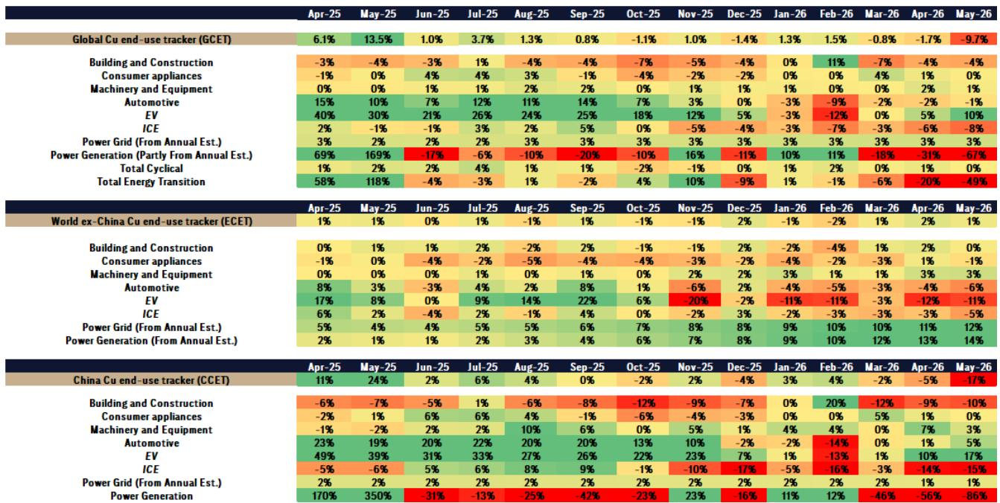
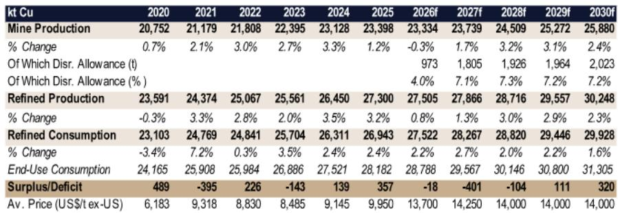
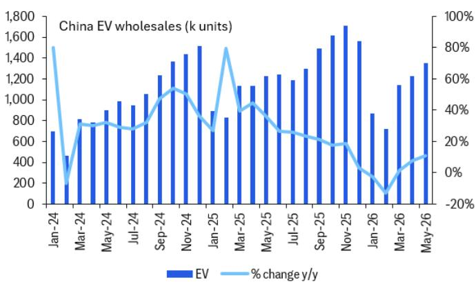

# Citi：中国铜消费剔除基数效应后仍增长，Citi关注政策刺激效果

一份来自Citi的最新报告，在铜价短期方向判断上保持了克制，但对中期走势给出了清晰的时间表。报告的核心判断是：铜价在七月和八月可能难以持续上涨，但进入九月后，催化剂将重新集结，一年内有望触及每吨15000美元。这并非一个简单的“看多”或“看空”，而是一个基于多重变量叠加的阶段性节奏判断。

报告认为，夏季铜价面临两重阻力。其一，市场对美国政府可能对铜征收“232条款”关税的担忧正在消退。在6月底的审查截止日过后，白宫未作表态，Citi的基本假设是最终不会加征关税。这种“战略模糊”反而让市场倾向于在夏季定价中剔除这部分不确定性溢价，尤其是此前存在显著升水的COMEX铜价面临回落不确定性。其二，黄金等贵金属价格的弱势若持续，也会对铜价情绪形成影响。

> **KC评论：** 这份报告最有价值的部分不是预测价格，而是它拆解了铜价短期和中期的不同驱动力。夏季的阻力是“事件驱动”和“情绪联动”，而秋季的支撑是“基本面”和“政策预期”。读者需要关注的是，这些变量何时切换。

## 1. 供给侧的约束比需求疲软更值得关注

市场对铜需求的担忧，很大程度上被一个统计陷阱放大了。Citi的全球铜终端消费跟踪器显示，5月同比下滑约10%，但这几乎完全是因为去年同期的中国可再生能源装机量出现了政策驱动的申报高峰，形成了极高的基数。剔除这一扭曲后，全球铜终端消费同比仍增长约1%，虽然谈不上强劲，但远非标题数字显示的那样悲观。

真正支撑Citi中期看多信心的，是供给侧的持续紧张。报告指出，2026年全球矿山产量预计将基本持平，而废铜供应对高价的反应也异常平淡。中国1-5月的废铜进口量同比几乎持平，说明废铜市场对价格激励的弹性很低。这意味着，即便需求增长温和，2027年铜市场也可能从当前的平衡状态转向约40万吨的缺口。供给约束正在为下一轮上涨埋下伏笔。

## 2. 全球制造业仍在扩张，但结构分化明显

6月的全球制造业PMI数据显示，中国、美国和欧洲均处于扩张区间，这通常对铜的周期性消费是利好。但Citi也指出了其中的结构性分化：中国的PMI回升主要由出口订单和高技术制造业拉动，传统宏观环境部门依然偏弱；欧洲和美国的PMI读数虽较5月略有回落，但活动受到了中东局势引发的供应链囤货行为的支撑。

一个尚未被市场完全定价的潜在需求增量，来自AI基础设施研究和国防开支。报告认为，这些领域对铜的消耗强度较高，而Citi的终端消费跟踪器目前并未直接纳入这些细分项，因此实际需求可能被低估。如果AI带来的生产效率提升能够支持宏观环境增长并抑制通胀，反而会为铜价创造更有利的宏观环境。

## 3. 报告未完全回答的关键问题：中国需求能否接力

尽管Citi对供给端和海外需求给出了相对清晰的判断，但报告对2026年下半年中国需求的复苏路径，着墨有限。中国铜终端消费在剔除可再生能源基数效应后虽显韧性，但国内电动车零售销量同比仍在调整15%，房地产和传统基建领域也未见明显起色。Citi预计下半年电动车销售会因政策刺激而回暖，但这一判断的兑现程度，将直接影响全球铜需求的底部位置。

> **KC评论：** 报告引用了大量图表来支撑其判断，其中“中国废铜进口量对价格不敏感”和“剔除可再生能源后的全球终端消费”这两张图，是理解其供给约束和需求真相的关键。读者在阅读原文时，应重点关注这两个维度的数据假设是如何推导出2027年供给缺口的。

对于铜市场的参与者而言，这份报告提供了一个明确的观察框架：夏季是验证供给约束和消化宏观噪音的阶段，而9月之后，美联储的政策转向、2027年供需缺口的重新定价，以及中国政策刺激的实际效果，将是决定铜价能否突破15000美元的关键变量。

For informational purposes only. Portions may be generated,translated,summarized,or edited with AI assistance based on source materials and may contain omissions or errors. Please verify independently. This is not investment,legal,tax,accounting,or other professional advice.

For informational purposes only. Portions may be generated,translated,summarized,or edited with AI assistance based on source materials and may contain omissions or errors. Please verify independently. This is not investment,legal,tax,accounting,or other professional advice.

