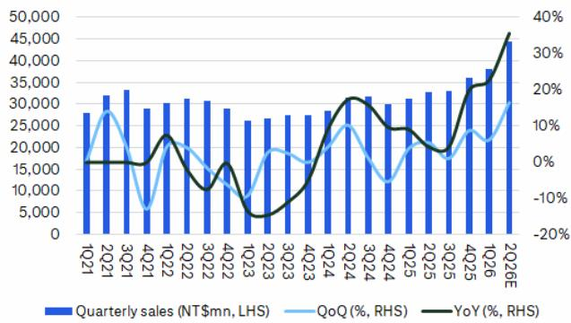
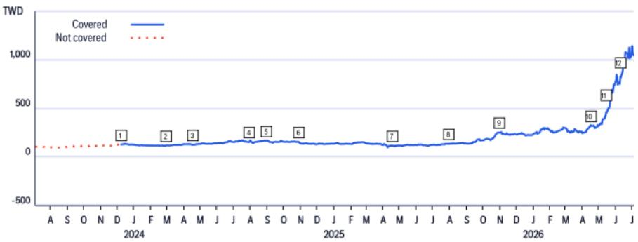
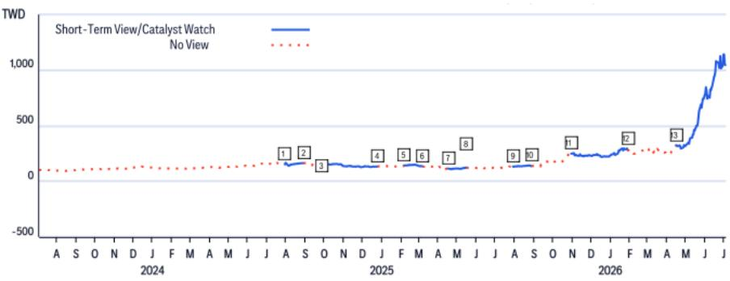

08 Jul 2026 08:48:54 ET | 12 pages

# 国巨 (2327.TW)

## 2Q26营收超预期；上升周期持续

## 研究观点

国巨公布6月营收为新台币154亿元（月增2%/年增39%），第二季度营收达新台币445亿元（季增16%/年增36%），创下历史新高。第二季度营收表现优于市场预期约10%/6%，显著高于此前“温和增长”的指引。强劲的业绩来自标准品和特殊品两大产品线，显示出此轮上升周期中需求的广泛性，而非集中于单一产品线。由于订单出货比持续维持在1.0以上，且与AI相关的订单持续增加，我们认为未来能见度依然良好。国巨上半年营收为新台币826亿元，已达到市场全年预测的47%，随着下半年新一代AI GPU/ASIC平台放量及价格调整加速，全年预测存在上调空间。维持正面看法。

<table><tr><td colspan="2">正面</td></tr><tr><td colspan="2">短期观点：正面，有效期至2026年7月15日</td></tr><tr><td>价格（2026年7月8日13:30）</td><td>新台币891.00元</td></tr><tr><td>目标价</td><td>新台币1,500.00元</td></tr><tr><td>预期报价回报</td><td>68.4%</td></tr><tr><td>预期股息率</td><td>0.7%</td></tr><tr><td>预期总回报</td><td>69.0%</td></tr><tr><td>市值</td><td>新台币1,845,676百万元/美元57,784百万元</td></tr></table>

Laura (Chia Yi) Chen

+886-2-8726-9090

laura.cy.chen@citi.com

图1. 国巨 – 季度营收趋势  
  
© 2026 Citi Inc. 未经Citi书面许可不得转载。
来源：公司报告，Citi

图2. 国巨 – 月度营收趋势  
  
© 2026 Citi Inc. 未经Citi书面许可不得转载。
来源：公司报告，Citi

## 国巨 (2327.TW) 短期观点

方向：正面

期限：90天内（2026年7月15日到期）

添加日期：2026年4月15日

类别：财报

我们预计市场将对优于预期的第一季度业绩及积极的第二季度展望做出正面反应。2026年需求前景改善以及芝浦电子的整合，有望增强产品组合并推动公司估值进一步重估。

## 国巨

## 估值

我们设定目标价为新台币1,500元，基于2027-2028年平均每股收益的40倍。我们采用市盈率法进行估值，认为公司的盈利表现和行业动态将是市场关注的重点。40倍的目标倍数处于2022年以来交易区间的上沿。在此期间，公司经历了行业周期，成功整合收购业务以丰富产品线，并开始实现稳定的利润率与盈利。

## 风险

目标价与评级面临的主要下行风险包括：1）需求复苏慢于预期；2）同行及价格竞争加剧；3）并购整合及协同效应的执行风险；4）汇率及利率波动。

如果您有视觉障碍并希望就本文件中图表的细节与Citi代表沟通，请致电美国1-888-500-5008（TTY：711），或从美国境外拨打+1-210-677-3788。

## 附录A-1

## 分析师认证

主要负责本研究报告准备和内容的研究分析师，要么在作者栏中以“AC”标识，要么在归属于该分析师的内容旁以粗体列出。如果作者栏中指定了多位AC分析师，每位分析师仅就其负责的报告部分进行认证，但以下情况除外：(a) 归属于另一位以粗体列出的AC认证分析师的内容，以及(b) 仅针对特定发行人的观点，该观点归属于在下方该发行人的价格图表或评级历史表中标识的另一位AC认证分析师。这些分析师各自就其负责的报告部分认证：(1) 其中表达的观点准确反映了他们对每个提及的发行人和证券的个人观点，并且是以独立方式准备的，包括对Citi Global Markets Inc.及其关联方；(2) 研究分析师的薪酬的任何部分，过去、现在或将来，均不直接或间接与该研究分析师在本报告中表达的具体建议或观点相关。

## 重要披露

<table><tr><td></td><td>日期</td><td>评级</td><td>目标价</td><td>收盘价</td></tr><tr><td>1</td><td>2023年12月8日 06:05:24</td><td>*1</td><td>*170.53</td><td>125.75</td></tr><tr><td>2</td><td>2024年2月29日 11:30:38</td><td>1</td><td>*155.88</td><td>116.75</td></tr><tr><td>3</td><td>2024年4月18日 10:39:34</td><td>1</td><td>*166.34</td><td>124.08</td></tr><tr><td>4</td><td>2024年7月30日 09:42:26</td><td>1</td><td>*189.36</td><td>152.74</td></tr></table>

\*表示变更

<table><tr><td></td><td>日期</td><td>评级</td><td>目标价</td><td>收盘价</td></tr><tr><td>5</td><td>2024年8月29日 07:49:40</td><td>1</td><td>*190.00</td><td>164.25</td></tr><tr><td>6</td><td>2024年10月29日 14:57:08</td><td>1</td><td>*175.00</td><td>147.75</td></tr><tr><td>7</td><td>2025年4月17日 08:52:57</td><td>1</td><td>*172.50</td><td>114.25</td></tr><tr><td>8</td><td>2025年7月29日 08:39:27</td><td>1</td><td>*161.25</td><td>133.75</td></tr></table>

<table><tr><td></td><td>日期</td><td>评级</td><td>目标价</td><td>收盘价</td></tr><tr><td>9</td><td>2025年10月30日 15:11:47</td><td>1</td><td>*290.00</td><td>249.00</td></tr><tr><td>10</td><td>2026年4月15日 09:52:44</td><td>1</td><td>*400.00</td><td>322.00</td></tr><tr><td>11</td><td>2026年5月13日 07:29:40</td><td>1</td><td>*495.00</td><td>420.00</td></tr><tr><td>12</td><td>2026年6月8日 11:56:35</td><td>1</td><td>*1,500.00</td><td>751.00</td></tr></table>

以上评级/目标价变更反映美国东部时间

## 国巨 (2327.TW)

短期观点/催化剂观察研究

分析师：Michael Hung

<table><tr><td></td><td>日期</td><td>操作</td><td>预期方向</td><td>期限</td><td>收盘价</td></tr><tr><td>1</td><td>2024年7月30日 05:42:26</td><td>添加STV</td><td>正面</td><td>30天</td><td>152.74</td></tr><tr><td>2</td><td>2024年8月29日 21:41:46</td><td>移除STV</td><td>正面</td><td>30天</td><td>164.25</td></tr><tr><td>3</td><td>2024年9月26日 07:17:25</td><td>添加STV</td><td>正面</td><td>90天</td><td>163.00</td></tr><tr><td>4</td><td>2024年12月25日 19:58:15</td><td>移除STV</td><td>正面</td><td>90天</td><td>133.25</td></tr><tr><td>5</td><td>2025年2月5日 03:13:59</td><td>添加STV</td><td>正面</td><td>30天</td><td>142.25</td></tr></table>

CW - 催化剂观察，STV - 短期观点

<table><tr><td colspan="2">日期</td><td>操作</td><td>预期方向</td><td>期限</td><td>收盘价</td></tr><tr><td>6</td><td>2025年3月7日 12:14:51</td><td>移除STV</td><td>正面</td><td>30天</td><td>133.75</td></tr><tr><td>7</td><td>2025年4月17日 04:52:57</td><td>添加STV</td><td>正面</td><td>30天</td><td>114.25</td></tr><tr><td>8</td><td>2025年5月16日 14:27:03</td><td>移除STV</td><td>正面</td><td>30天</td><td>124.50</td></tr><tr><td>9</td><td>2025年7月29日 04:39:27</td><td>添加STV</td><td>负面</td><td>30天</td><td>133.75</td></tr><tr><td>10</td><td>2025年8月28日 21:46:17</td><td>移除STV</td><td>负面</td><td>30天</td><td>137.00</td></tr></table>

<table><tr><td>日期</td><td>操作</td><td>预期方向</td><td>期限</td><td>收盘价</td></tr><tr><td>13 2025年10月30日 11:11:47</td><td>添加STV</td><td>正面</td><td>90天</td><td>249.00</td></tr><tr><td>14 2026年1月28日 19:41:59</td><td>移除STV</td><td>正面</td><td>90天</td><td>285.50</td></tr><tr><td>15 2026年4月15日 05:52:44</td><td>添加STV</td><td>正面</td><td>90天</td><td>322.00</td></tr></table>

以上评级/目标价变更反映美国东部时间

Citi股票评级分布

<table><tr><td>Citi Global Markets Inc.或其关联方在过去12个月内因非投行服务从国巨获得报酬。</td></tr><tr><td>Citi Global Markets Inc.或其关联方目前或过去12个月内拥有以下客户，并提供非投行、证券相关服务：国巨。</td></tr><tr><td>Citi Global Markets Inc.或其关联方目前或过去12个月内拥有以下客户，并提供非投行、非证券相关服务：国巨。</td></tr><tr><td>Citi Global Markets Inc.和/或其关联方与国巨存在重大经济利益关系。（关于重大经济利益关系确定的解释，请参阅www.citiVelocity.com上的利益冲突管理政策。）</td></tr><tr><td>分析师薪酬由Citi管理层和Citi高级管理层决定，并基于旨在惠及Citi Global Markets Inc.及其关联方（“公司”）读者客户的活动和服务。薪酬不与特定交易或建议挂钩。与所有公司员工一样，分析师的薪酬受到公司整体盈利能力的影响，包括投行、销售和交易以及自营交易收入。股票研究分析师薪酬的一个因素是安排机构客户与所覆盖公司管理层之间的企业接触活动。通常，当分析师对公司持正面看法时，公司管理层更有可能参与。</td></tr><tr><td>对于产品中推荐且公司并非做市商的金融工具，公司是该等金融工具（及其任何基础工具）的流动性提供者，并可能就此类工具的交易担任主体。公司是定期发行与产品中可能推荐的证券挂钩的可交易金融工具的发行人。公司定期交易产品中讨论的发行人证券。公司可能以与产品不一致的方式进行证券交易，并就所覆盖的证券以主体身份向客户买入或卖出。</td></tr><tr><td>除非另有说明，研究分析师或其团队任何成员在过去12个月内均未实地考察过已提供投资观点的公司的运营情况。</td></tr><tr><td>有关本Citi产品（“产品”）所涉及公司的重要披露（包括历史披露副本），请联系Citi，地址：388 Greenwich Street, 6th Floor, New York, NY, 10013，收件人：Legal/Compliance [E6WYB6412478]。此外，除估值与风险评估及历史披露外，相同的重要披露包含在公司披露网站https://www.citivelocity.com/cvr/eppublic/citi_research_disclosures上。估值与风险评估可在关于标的公司的最新研究笔记/报告正文中找到。根据市场滥用法规，过去12个月内所有Citi建议的历史记录可通过Citi Velocity (https://www.citivelocity.com/cv2) 或您的标准分发门户访问。历史披露（最多过去三年）将根据要求提供。</td></tr></table>

<table><tr><td></td><td colspan="3">12个月评级</td><td colspan="3">催化剂观察</td></tr><tr><td>数据截至2026年7月1日</td><td>正面</td><td>中性</td><td>负面</td><td>正面</td><td>中性</td><td>负面</td></tr><tr><td>Citi全球基础覆盖（中性=持有）</td><td>61%</td><td>32%</td><td>7%</td><td>36%</td><td>48%</td><td>16%</td></tr><tr><td>各评级类别中为投行客户的百分比</td><td>38%</td><td>42%</td><td>27%</td><td>42%</td><td>37%</td><td>36%</td></tr></table>

## Citi基础研究投资评级指南：

Citi股票建议包括投资评级和可选的风险评级以标识高风险股票。风险评级同时考虑价格波动性和基本面标准。股票将没有风险评级或被赋予高风险评级。

投资评级：Citi投资评级为正面、中性和负面。我们的评级是分析师对预期总回报（“ETR”）和风险的预期函数。ETR是未来12个月内股票预期价格上涨（或下跌）加上股息回报表现的总和。目标价基于12个月的时间范围。投资评级定义如下：正面（1）ETR为15%或以上，或高风险股票为25%或以上；负面（3）为负ETR。任何未被赋予正面或负面评级的覆盖股票均为中性（2）。对于评级为中性（2）的股票，如果分析师认为缺乏足够的估值驱动因素和/或投资催化剂来得出正面或负面的投资观点，他们可以在获得Citi管理层批准后选择不设定目标价，从而不推导ETR。Citi可能因监管和/或内部政策原因暂停其评级和目标价，并赋予“评级暂停”状态。Citi也可能因其他特殊情况（例如缺乏对分析师论点至关重要的信息、交易暂停）影响公司和/或公司证券交易而暂停其评级和目标价，并赋予“审核中”状态。在这两种情况下，评级和目标价将在评级历史价格图表中分别显示为“—”和“-”。在2022年4月11日之前，Citi将两种情况均赋予“审核中”状态，而在2020年11月11日之前仅在特殊情况下使用。在实际可行的情况下，分析师将尽快发布重新确立评级和投资论点的说明。投资评级由上述范围在首次覆盖、投资和/或风险评级变更或目标价变更时确定（受有限的管理酌情权限制）。有时，由于市场价格波动和/或其他短期波动或交易模式，预期总回报可能落在此范围之外。此类临时偏差将被允许，但需接受研究管理部门的审查。您买入或卖出证券的决定应基于您个人的投资目标，并且只有在评估了股票的预期表现和风险后才能做出。

## 催化剂观察/短期观点（“STV”）评级披露：

催化剂观察和STV正面/负面判断：Citi还可能包含催化剂观察或STV正面或负面判断，以表明分析师预期股价在指定30天或90天期限内，因一项或多项影响公司或市场的特定近期催化剂或事件而相对上涨（下跌）。当分析师对股价将受到影响的信心较高时，将发布催化剂观察；当信心水平中等时，将发布STV。催化剂观察或STV正面/负面判断将在指定的30/90天期限结束时自动失效。如果股价表现（按市场收盘价计算）相对于判断方向超过15%，催化剂观察也将自动移除（除非分析师推翻）。分析师也可以在指定期限结束前通过发布的研究笔记移除催化剂观察或STV判断。催化剂观察/STV正面或负面判断可能不同于且不影响股票的基础股权评级，后者反映更长期的相对总回报预期。出于FINRA评级分布披露规则的目的，催化剂观察/STV正面判断对应于买入建议，催化剂观察/STV负面判断对应于卖出建议。任何未被赋予催化剂观察正面、催化剂观察负面、STV正面或STV负面判断的股票均被视为催化剂观察/STV无观点。出于FINRA评级分布披露规则的目的，我们在催化剂观察/STV正面/负面评级系统的评级分布表中将催化剂观察/STV无观点对应于持有。然而，我们重申，我们不认为无观点是一种建议。对于所有催化剂观察/STV正面/负面判断，存在催化剂和相关的股价变动可能不会如预期实现的风险。

## 研究分析师隶属关系/非美国研究分析师披露

本报告作者的雇佣法律实体列示如下（其监管机构进一步列示于本文）。编写本报告的非美国研究分析师（即除被标识为受雇于Citi Global Markets Inc.的分析师之外的所有列示分析师）未在FINRA注册/具备研究分析师资格。此类研究分析师可能不是成员组织的关联人士（但受雇于成员组织的关联方），因此可能不受FINRA规则2241关于与标的公司沟通、公开露面以及研究分析师账户持有证券交易的限制。

Citi Global Markets Taiwan Securities Company Limited Michael Hung; Laura (Chia Yi) Chen

## 其他披露

建议中提及的任何工具的价格均为前一交易日该工具主要市场的收盘价，除非另有说明。

本研究报告中所作任何建议的完成和首次分发时间均为产品顶部显示的美国东部日期时间。如果产品引用了其他分析师的观点，请参阅价格图表或评级历史表以了解该观点的完成和首次分发的日期/时间。

各司法管辖区的法规要求，如果建议与作者在过去12个月内发布的关于同一金融工具或发行人的任何先前建议不同，则应指明变更以及先前建议的日期。对于基础覆盖，请参阅本披露附录中的价格图表或评级变更历史，或发行人披露摘要https://www.citivelocity.com/cvr/eppublic/citi_research_disclosures。

Citi已实施识别、考虑和管理因发布或分发投资研究而产生的潜在利益冲突的政策。这些政策的描述可在https://www.citivelocity.com/cvr/eppublic/citi_research_disclosures找到。

过去12个月每个季度末所有Citi研究建议中相当于“正面”、“中性”、“负面”的比例（括号内为过去12个月内接受过Citi投资公司服务的比例）如下：2026年第一季度 正面33%（63%），中性44%（52%），负面23%（46%），相对价值0.5%（89%）；2025年第四季度 正面33%（63%），中性44%（50%），负面23%（46%），相对价值0.4%（91%）；2025年第三季度 正面33%（61%），中性44%（52%），负面23%（50%），相对价值0.4%（80%）；2025年第二季度 正面33%（63%），中性44%（51%），负面23%（49%），相对价值0.4%（86%）。为披露除股权以外的建议（其定义可在相应披露部分找到），“正面”表示正向方向性交易想法；“负面”表示负向方向性交易想法；“相对价值”表示任何没有明确方向的投资策略的交易想法。

欧洲法规要求在引用证券过往表现时提供5年价格历史。CitiVelocity的图表工具（https://www.citivelocity.com/cv2/#go/CHARTING_3_Equities）提供创建可定制价格图表的功能，包括五年选项。该工具可在CitiVelocity（https://www.citivelocity.com/）任何资产类别菜单下的数据与分析部分找到。如需更多信息，请联系CitiVelocity支持（https://www.citivelocity.com/cv2/go/CLIENT_SUPPORT）。所有引用价格的来源，除非另有说明，均为DataCentral，其从LSEG Data & Analytics获取价格信息。过往表现并非未来结果的保证或可靠指标。预测并非未来表现的保证或可靠指标。

读者在投资前应始终仔细考虑ETF的投资目标、风险以及费用和支出。ETF的适用招股说明书和关键读者信息文件（如适用）应包含该ETF的此等信息和其他信息。在投资前仔细阅读任何此类招股说明书非常重要。客户可从适用的分销商或授权参与者、ETF上市的交易所和/或适用ETF发行人的适用网站获取ETF的招股说明书和关键读者信息文件。研究价值及任何应计收入可能下跌或上涨。任何过往表现、预测或预报均不预示未来或可能的表现。本文包含的任何关于ETF的信息仅供说明之用，不应被视为出售或招揽购买任何ETF单位的要约，无论是明示还是暗示。所表达的意见是作者的意见，不一定反映ETF发行人、其任何代理人或其关联方的观点。
Citi Global Markets India Private Limited和/或其关联方可能不时实际或实益拥有标的发行人债务证券的1%或以上。

请注意，根据经修订的第13959号行政命令（“命令”），美国人士被禁止投资于美国政府确定为该命令标的的任何公司的证券。本研究不旨在以任何可能导致违反该命令的方式使用或依赖。鼓励读者依靠自己的法律顾问就遵守该命令以及由美国财政部外国资产控制办公室管理和执行的其他经济制裁计划提供建议。

本通讯面向符合以色列《投资咨询、投资营销和投资组合管理法》（1995年）（“咨询法”）中定义的“合格客户”的人士。在以色列境内，本通讯不针对零售客户，Citi不会向零售客户或非合格客户提供此类产品或交易。演示者未获得以色列证券管理局（“ISA”）的投资顾问或投资营销人员许可，本通讯不构成投资或营销建议。本文包含的信息可能涉及ISA未监管的事项。本通讯涉及的任何证券不得向任何以色列人士发售或出售，除非根据《以色列证券法》（1968年）的证券发售豁免及其下的公开发售规则。

Citi广泛并同时通过公司专有的电子分发平台（例如Citi Velocity和各种全球财富平台）向公司的机构和零售客户分发其研究内容。为方便起见，某些（但非全部）研究内容可能通过第三方聚合器分发。客户可酌情通过电子邮件接收已发布的研究报告，且仅在此类研究内容已广泛分发之后。某些研究仅提供给机构读者以满足监管要求。Citi分析师向客户提供的服务水平和类型可能因多种因素而异，例如客户对接收分析师通讯的频率和方式的个人偏好、客户的风险状况和投资重点及视角（例如市场范围、特定行业、长期、短期等）、客户与公司整体关系的规模和范围以及法律和监管限制。

根据Comissão de Valores Mobiliários Resolução 20和ASIC Regulatory Guide 264，Citi需要披露Citi关联公司或企业是否与标的公司存在商业关系。考虑到Citi在100多个国家/地区运营多项业务，Citi很可能与标的公司存在商业关系。

公司推荐、提供或销售的证券：(i) 不受联邦存款保险公司保险；(ii) 不是任何受保存款机构（包括Citi）的存款或其他义务；以及 (iii) 面临投资风险，包括可能损失本金投资金额。产品仅供参考，不构成购买或出售证券的要约或招揽。任何购买产品中提及的证券的决定都必须考虑该证券的现有公开信息或任何注册招股说明书。尽管信息来自并基于公司认为可靠的来源，但我们不保证其准确性，并且信息可能不完整和经过压缩。但请注意，公司已采取一切合理措施确定产品重要披露部分中披露的准确性和完整性。公司的研究部门已获得本产品中提及的标的公司的协助，包括但不限于与标的公司管理层的讨论。公司政策禁止研究分析师向标的公司发送研究草稿。但应假定产品的作者已与标的公司进行讨论，以确保在发布前事实的准确性。关于ESG（环境、社会、治理）因素的陈述和观点通常基于标的公司发布的公开声明或其他公开新闻，作者可能未独立核实。ESG因素是读者在做出投资决策时可能考虑的一个因素。所有意见、预测和估计构成作者截至产品日期的判断，并且这些以及产品中包含的任何其他信息如有变更，恕不另行通知。金融工具的价格和可用性也可能随时变更，恕不另行通知。尽管公司内部其他部门为产品中讨论的公司提供建议，但在此类角色中获得的信息不用于产品的准备。尽管Citi未设定预定的发布频率，但如果产品是基础股权或信用研究报告，Citi旨在提供对所覆盖发行人的研究覆盖，包括响应影响发行人的新闻。对于非基础研究报告，Citi可能不会定期更新报告中的观点、建议和事实。尽管Citi保持对发行人的覆盖、提出建议或讨论发行人，但Citi可能因法律或政策原因定期被限制引用某些发行人。如果已发布交易想法的组成部分受到限制，该交易想法将从产品中包含的任何开放交易想法列表中移除。限制解除后，如果分析师继续支持该交易想法，它将被重新列入开放交易想法列表，否则将被正式关闭。Citi可能向不同类别的客户提供不同的研究产品和服务（例如，基于长期或短期投资期限），这可能导致与替代研究产品中的建议相矛盾的不同结论或建议，可能影响证券价格，前提是每种产品均与其各自评级系统一致。

投资非美国证券，包括ADR，可能涉及某些风险。非美国发行人的证券可能未在美国证券交易委员会注册，也不受其报告要求的约束。关于外国证券的信息可能有限。外国公司通常不受与美国公司相同的统一审计和报告标准、实践和要求的约束。某些外国公司的证券可能流动性较低，其价格比同类美国公司的证券更波动。此外，汇率变动可能对外国股票投资的价值及其对美国读者的相应股息支付产生不利影响。ADR读者的净股息是使用预扣税率惯例估算的，被认为是准确的，但敦促读者咨询其税务顾问以获取准确的股息计算。从公司收到产品的读者可能被禁止在某些州或其他司法管辖区从公司购买产品中提及的证券。请向您的财务顾问咨询更多详情。Citi Global Markets Inc.对美国的产品负责。美国读者因产品中包含的信息而下的任何订单只能通过Citi Global Markets Inc.下达。

对产品生产负责的Citi法律实体是第一位作者受雇的法律实体。

产品在澳大利亚通过Citi Global Markets Australia Pty Limited提供。（ABN 64 003 114 832和AFSL No. 240992），ASX集团参与者，受澳大利亚证券和投资委员会监管。Citi Centre, 2 Park Street, Sydney, NSW 2000。Citi Global Markets Australia Pty Limited不是《1959年银行法》下的授权存款机构，也不受澳大利亚审慎监管局监管。
产品在巴西由Citi Global Markets Brasil - CCTVM SA提供，该公司受CVM - Comissão de Valores Mobiliários（“CVM”）、BACEN - 巴西中央银行、APIMEC - Associação dos Analistas e Profissionais de Investimento do Mercado de Capitais和ANBIMA – Associação Brasileira das Entidades dos Mercados Financeiro e de Capitais监管。地址：Av. Paulista, 1111 - 14º andar (parte) - CEP: 01311920 - São Paulo - SP。

本产品在智利通过Banchile Corredores de Bolsa S.A.提供，该公司是Citi Inc.的间接子公司，受Comisión Para El Mercado Financiero监管。地址：Enrique Foster Sur, 20, piso 6, Las Condes, Santiago, Chile。

哥伦比亚共和国读者披露：本通讯或信息不构成2010年第2555号法令第2.40.1.1.2条或其修改、替代或补充法规意义上的专业研究交流。编制和分发本条所述的研究报告和一般通讯不需要成为哥伦比亚金融监管局监管的实体。
产品在德国由Citi Global Markets Europe AG（“CGME”）提供，该公司受欧洲中央银行和德国联邦金融监管局（Bundesanstalt für Finanzdienstleistungsaufsicht BaFin）监管。地址：Börsenplatz 9, 60313 Frankfurt am Main, Germany。

除非另有说明，如果编写本报告的分析师位于香港且报告涉及“证券”（定义见香港法例第571章《证券及期货条例》），则该报告由Citi Global Markets Asia Limited在香港发布。Citi Global Markets Asia Limited受香港证券及期货事务监察委员会监管。如果报告由非香港分析师编写，请注意该分析师（及其受雇或认可的法律实体）未在香港获得许可/注册，并且他们不声称如此。请参阅“研究分析师隶属关系/非美国研究分析师披露”部分以了解分析师雇佣实体的详细信息。

产品在印度由Citi Global Markets India Private Limited（CGM）提供，该公司作为研究分析师受印度证券交易委员会（SEBI）监管（SEBI注册号INH000000438）。CGM还积极参与印度的商人银行业务（SEBI注册号INM000010718）和股票经纪业务（SEBI注册号INZ000263033），并已就此向SEBI注册。SEBI的注册、孟买证券交易所（BSE）的入会以及国家证券市场研究所（NISM）的认证绝不保证中介机构的业绩或向读者提供任何回报保证。CGM的注册办公室位于1202, 12th Floor, First International Financial Centre (FIFC), G Block, Bandra Kurla Complex, Bandra East, Mumbai – 400098，注册电话：+91 22 61759999。Citi维持健全的政策、程序、控制和培训，以确保持续遵守所有适用的规则和法规。本文包含的所有建议均由合格的研究分析师做出。CGM的公司识别号为U99999MH2000PTC126657，其合规官[Vishal Bohra]的联系方式为：电话：+91-022-61759994，传真：+91-022-61759851，电子邮件：cgmcompliance@citi.com。关于研究分析师的读者章程、合规审计报告和投诉信息可在

https://www.citivelocity.com/cvr/eppublic/citi_research_disclosures找到。申诉官[Niraj Mody]的联系方式为：电话：+91-22-42775002，电子邮件：EMEA.CR.Complaints@citi.com。证券市场投资存在市场风险。投资前请仔细阅读所有相关文件。SEBI规定的客户条款和条件可在https://www.citivelocity.com/rendition/authfilelinksvcs/eppublic/V1/file?paramData=ZmlsZU5hbWU9L1MzL0dETVMvcHViRGlzY2xvc3VyZUhObWxzL2dkbV9kaXNfc2ViaV9UZXJtc29mVXNlLmhObWw找到。

产品在印度尼西亚通过PT Citi Sekuritas Indonesia提供。地址：Citibank Tower 10/F, Pacific Century Place, SCBD lot 10, Jl. Jend Sudirman Kav 52-53, Jakarta 12190, Indonesia。本产品及其任何副本不得在印度尼西亚或向任何印度尼西亚公民（无论其居住地）或印度尼西亚居民分发，除非符合适用的资本市场法律法规。本产品不是印度尼西亚的证券要约。本产品中提及的证券尚未根据相关资本市场法律法规向资本市场和金融服务局（OJK）注册，不得在印度尼西亚共和国境内或向印度尼西亚公民通过公开发售或在构成印度尼西亚资本市场法律法规意义上的要约的情况下发售或出售。

产品在日本由Citi Global Markets Japan Inc.（“CGMJ”）提供，该公司受金融厅、证券交易监督委员会、日本证券业协会、东京证券交易所和大阪证券交易所监管。地址：Otemachi Park Building, 1-1-1 Otemachi, Chiyoda-ku, Tokyo 100-8132 Japan。如果在CGMJ研究报告中发现错误，修订版将发布在公司的Citi Velocity网站上。如果您对Citi Velocity有疑问，请致电(81 3) 6270-3019寻求帮助。

产品根据沙特法律在沙特阿拉伯王国通过Citi Saudi Arabia提供，该公司受资本市场管理局（CMA）监管，CMA许可证号17184-31。地址：2239 Al Urubah Rd – Al Olaya Dist. Unit No. 18, Riyadh 12214 – 9597, Kingdom Of Saudi Arabia。

产品在韩国由Citi Global Markets Korea Securities Ltd.（CGMK）提供，该公司受金融委员会、金融监督院和韩国金融投资协会（KOFIA）监管。CGMK地址：Citibank Center, 50 Saemunan-ro, Jongno-gu, Seoul 03184, Korea。KOFIA在其网站上提供研究分析师的注册信息。如果您希望查找CGMK研究分析师的KOFIA注册信息，请访问以下网站：http://dis.kofia.or.kr/websquare/index.jsp?w2xPath=/wq/fundMgr/DISFundMgrAnalystList.xml&divisionId=MDISO3002002000000&serviceId=SDISO3002002000。产品在韩国由Citibank Korea Inc.提供，该公司受金融委员会和金融监督院监管。地址：Citibank Center, 50 Saemunan-ro, Jongno-gu, Seoul 03184, Korea。本研究报告仅提供给《金融投资服务和资本市场法》及其执行法令中定义的韩国专业读者。

产品在马来西亚由Citi Global Markets Malaysia Sdn Bhd（注册号199801004692 (460819-D)）（“CGMM”）向其客户提供，CGMM对其内容负责，但仅限于CGMM的客户。CGMM受马来西亚证券委员会监管。请就产品产生或与之相关的任何事宜联系CGMM，地址：Level 43 Menara Citibank, 165 Jalan Ampang, 50450 Kuala Lumpur, Malaysia。

产品在墨西哥由Citi México Casa de Bolsa, S.A. de C.V., Grupo Financiero Citi México提供，该公司是Citi Inc.的全资子公司，受Comision Nacional Bancaria y de Valores监管。地址：Prolongación Reforma 1196, 24 floor, Colonia Santa Fe, Alcaldía Cuajimalpa de Morelos, C.P. 05348, Ciudad de México。

产品在波兰由Biuro Maklerskie Banku Handlowego (DMBH)提供，DMBH是Bank Handlowy w Warszawie S.A.的独立部门，后者是Citi Inc.的子公司，受Komisja Nadzoru Finansowego监管。地址：Biuro Maklerskie Banku Handlowego (DMBH), ul.Senatorska 16, 00-923 Warszawa。

产品在新加坡通过Citi Global Markets Singapore Pte. Ltd.（“CGMSPL”）提供，CGMSPL持有资本市场服务牌照和豁免财务顾问牌照，受新加坡金融管理局监管。请就
