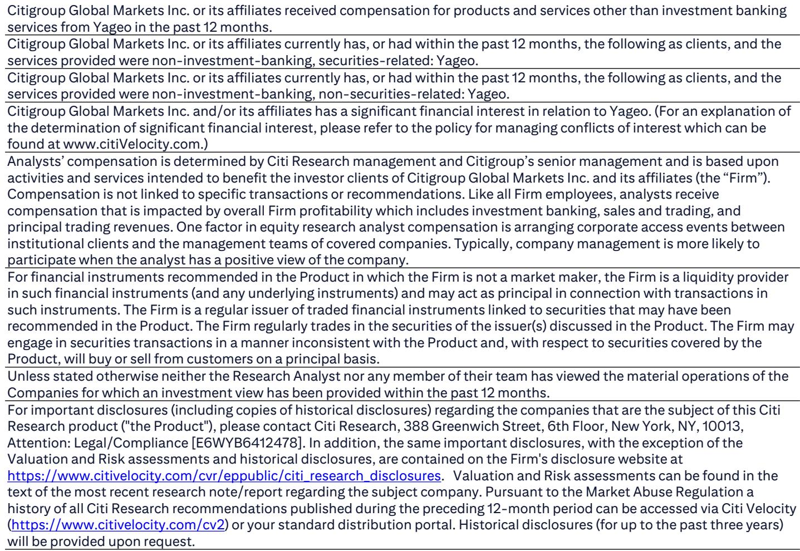
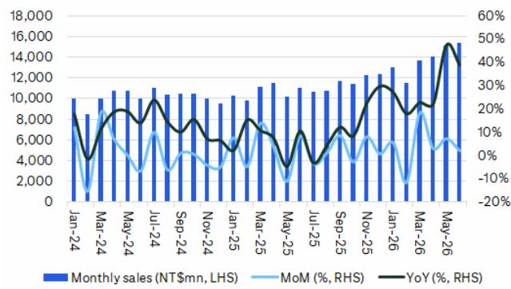

# Citi：国巨营收超预期，Citi指AI和消费电子双驱动

被动元件龙头国巨刚交出一份超出预期的成绩单。6月营收154亿新台币，同比增长39%，带动第二季度营收达到445亿新台币，创下历史新高，比Citi和市场的共识预期分别高出10%和6%。这份报告最值得关注的核心判断是：国巨正在经历一个需求基础更广泛的上行周期，而非市场此前预期的单一产品线驱动。

报告显示，第二季度的强劲表现来自标准品和特殊品两大板块的同步增长。这与过去几轮周期中，国巨往往依赖某一类产品（如MLCC）拉动的模式有本质区别。BB值持续高于1.0，AI相关订单仍在加速，Citi认为公司对未来几个季度的能见度依然扎实。上半年营收826亿新台币，已经完成市场全年预测的47%，这意味着随着下半年新一代AI GPU和ASIC平台放量、产品定价调整加速，全年数字存在明显的上修空间。

> **KC评论：** 这份报告的核心信号是“广度”。过去市场对被动元件周期的理解往往是“看MLCC价格就够了”，但这次标准品和特殊品同步走强，意味着下游需求不只是AI服务器的单点拉动，而是工业、车用、消费电子等多个终端同时回温。完整报告里的月度营收趋势图值得细看，它能验证这种同步性是否在持续。

## 1. 需求广度才是这轮周期的真正变量

市场对被动元件周期并不陌生。2018年的超级周期由MLCC价格明显走强驱动，随后急转直下。2021年的复苏同样短暂。但Citi这次强调的不同在于：国巨的订单能见度不是建立在单一产品线的紧缺之上，而是建立在多个产品类别同时扩量的基础上。

标准品和特殊品的同步增长，让公司对下游客户的需求判断更可靠。BB值持续高于1.0，意味着订单流入速度持续超过出货速度，这种信号在过去两轮周期中通常出现在上行初期，而非末期。Citi认为，这种“广度”让国巨的周期比以往更可持续。

## 2. 上半年数字已为全年留下空间

一个值得关注的数字是：国巨上半年营收已达市场全年预测的47%。如果下半年没有出现重大逆转，全年数字大概率会高于当前共识。Citi在报告中提到，下半年随着下一代AI GPU和ASIC平台开始放量，产品定价调整节奏会加快。

这里的关键变量不是“会不会涨价”，而是“涨价的速度和幅度”。报告没有完全展开的是，定价调整对不同产品线的弹性差异有多大——特殊品的议价能力可能比标准品更强，但标准品的出货量基数更大。读者在阅读完整报告时，可以重点关注Citi对2H26定价调整节奏的假设细节。

## 3. 报告尚未完全回答的问题：整合红利何时兑现

国巨过去几年通过并购（包括近期对芝浦电子的整合）不断扩展产品组合。Citi在报告中肯定了整合对产品组合的增强作用，但并未详细量化协同效应何时会体现在利润率上。

这是一个值得追问的问题。如果需求广度是这轮周期的优势，那么产品组合的多样性是否意味着利润率会比过往周期更稳定？还是说，整合带来的费用增加会在短期内抵消营收增长的好处？报告没有给出明确答案，但这恰恰是读者在关注国巨时应该持续跟踪的观察点。

## 4. 一个值得建立的观察框架

对于关注被动元件赛道的读者，Citi这份报告提供了一个清晰的跟踪框架：不要只看MLCC价格或单一产品线的出货量，而是要跟踪标准品和特殊品两大板块的同步性信号。如果两者同时保持增长，周期的可持续性会更强；如果出现分化，则可能是周期接近尾声的信号。

另一个值得关注的指标是BB值的变化趋势。Citi认为当前1.0以上的水平是积极信号，但如果它开始向下穿越1.0，就需要重新审视需求结构。

For informational purposes only. Portions may be generated,translated,summarized,or edited with AI assistance based on source materials and may contain omissions or errors. Please verify independently. This is not investment,legal,tax,accounting,or other professional advice.

For informational purposes only. Portions may be generated,translated,summarized,or edited with AI assistance based on source materials and may contain omissions or errors. Please verify independently. This is not investment,legal,tax,accounting,or other professional advice.

