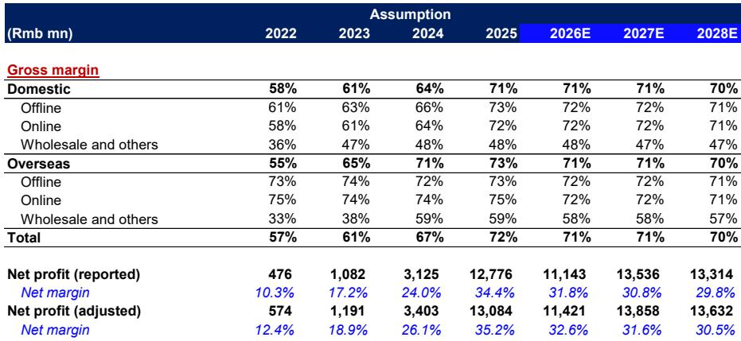
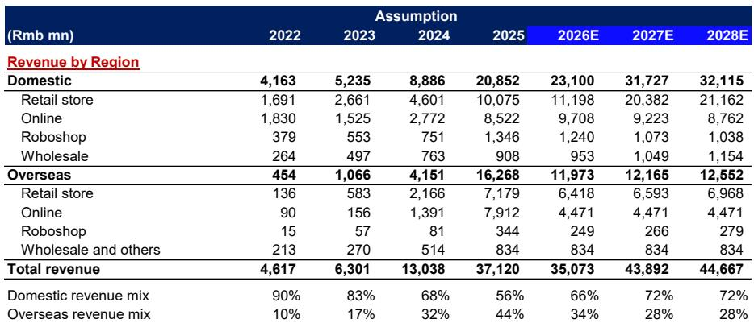
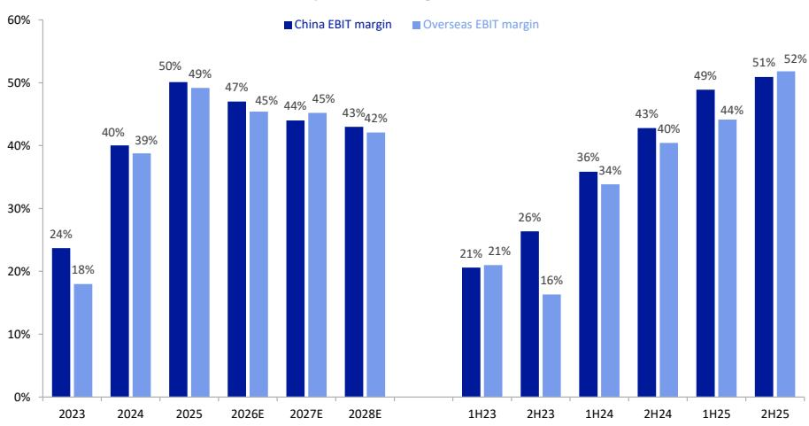

# Pop Mart's Labubu Bubble Is Deflating: The Scarcity Engine That Drove a 75% Revenue Surge Is Now Signaling a Sharp Reversal

The narrative that Pop Mart had transcended the typical toy fad cycle is being tested in real time, and the early evidence points to a failure. After a first quarter of 2026 that saw group revenue surge an estimated 75-80% year-over-year, the second quarter is shaping up to be a brutal reversion. Based on channel checks, secondary market pricing, and the company's own promotional behavior, the engine of scarcity that powered Pop Mart's ascent is sputtering. The company is not merely experiencing a normal seasonal slowdown; it is confronting a structural demand decline for its flagship IP, Labubu, just as its overseas expansion story hits a wall of its own making. For observers who priced in perpetual moat expansion, the second half of 2026 will be a reckoning.

The core thesis that has supported Pop Mart's premium valuation is that its IP portfolio creates a self-reinforcing cycle of collectibility and price appreciation. This cycle is now broken. The launch of Labubu 4.0, the "THE MONSTERS Hair Salon" series, was the critical test. It was supposed to be the next blockbuster, buoyed by World Cup-related exposure and celebrity endorsements. Instead, the secondary market is signaling a catastrophic loss of enthusiasm. Within one week of launch, standard editions of Labubu 4.0 were trading at roughly one-third of their retail price. This is not a normal discount for a collectible; it is a fire sale. It tells us that the marginal buyer, the collector and the reseller who together create the frenzy, has stepped away. The scarcity premium has evaporated.

This is not simply a product miss. It is a signal that the IP cycle has peaked. The company's entire business model depends on the ability to generate excitement around new drops. When a highly anticipated launch falls flat, it raises a fundamental question: has the market for Labubu become saturated? The data from the report suggests that the answer is yes, and the implications for the rest of 2026 are severe.

## The Second-Quarter Slowdown Is Not a Blip; It Is the Leading Edge of a Deeper Contraction

The headline numbers for the second quarter of 2026 are alarming enough on their own. The report forecasts group revenue growth of just 1.6% year-over-year, a dramatic deceleration from the triple-digit growth rates of recent quarters. But the more important metric is the sequential decline. Revenue is projected to fall 16.3% quarter-over-quarter. This is not a slow-down; it is a stop. The first quarter's performance, which was artificially boosted by a low base and Chinese New Year demand, masked a deteriorating trend that is now fully visible.

The geographic breakdown reveals a double whammy. In China, sales are expected to grow only 15% year-over-year in the second quarter, but the exit rate is the real concern. The report suggests that the exit rate could turn flattish or even negative following the Labubu 4.0 disappointment. This means that by the end of June, the domestic business was already in decline. The overseas story, which had been the primary driver of the bull thesis, is even worse. Overseas sales are forecast to decline 19% year-over-year in the second quarter, a stark reversal from the roughly 40% growth in the first quarter. The sequential decline of 20% in overseas markets suggests that the international expansion is hitting a demand ceiling far sooner than expected.

The pattern is clear. The first quarter was a sugar high. The second quarter is the hangover. And the third and fourth quarters, which face the toughest year-over-year comparisons, are likely to be a full-blown withdrawal. The report projects group revenue declines of 35% and 18% in the third and fourth quarters, respectively. The overseas business is expected to see even steeper drops of 50% and 34%. This is not a normalization; it is a correction. The company that grew revenue by nearly three times in 2025 is now facing a year-over-year decline for the full fiscal year 2026.

## Destocking Promotions Reveal Hidden Inventory Pressure That Will Crush Margins

The most telling indicator of distress is not the sales forecast but the company's behavior. Pop Mart built its brand on scarcity. Products were deliberately under-supplied to create secondary market premiums and FOMO-driven demand. That strategy is now being abandoned. The report documents widespread destocking promotions across multiple markets, a clear sign that inventory is piling up.

In China, during the 618 shopping festival, Pop Mart's official store offered tiered discounts and "Lucky Bags" that bundled multiple products at a discount. The inclusion of the Labubu World Cup series in every four bags is particularly revealing. This was a series that was expected to be a strong seller. Bundling it in a discount promotion suggests that demand was far weaker than anticipated. The company is now using its most popular IP to clear inventory of other products, a classic sign of over-ordering and weak demand.

This promotional behavior is not limited to China. The report notes similar Lucky Bag discounts in Indonesia, Singapore, and Thailand. In Europe and the U.S., third-party stores are offering direct discounts of around 20%. Official stores are also participating during major shopping festivals. The global nature of this destocking suggests a systemic inventory problem, not a regional anomaly.

The margin implications are significant. Pop Mart's gross margins have been a key pillar of the investment case, hovering around 72% for the overall business. Promotional activity, especially bundling and direct discounts, erodes those margins. The report's own model shows overseas gross margins declining from 73% in 2025 to 71% in 2026, and domestic margins holding steady at 71%. But these are averages. The marginal cost of clearing excess inventory through discounts could be much higher. If the company needs to increase promotional intensity to move product in the second half, the margin compression could be more severe than the current forecasts imply. The risk is that Pop Mart finds itself in a classic retail death spiral: cutting prices to clear inventory, which trains consumers to wait for discounts, which destroys the scarcity model entirely.

## The Overseas Growth Story Has Hit a Structural Wall, Not a Temporary Speed Bump

The bull case for Pop Mart has long rested on the idea that its IP would travel globally, creating a multi-year growth runway outside of China. The first quarter of 2026 seemed to validate this, with overseas revenue growing roughly 40% year-over-year. But the second quarter's projected 19% decline is a warning that the international expansion is not replicating the Chinese model. The sequential decline of 20% suggests that the overseas business is contracting in absolute terms, not just growing more slowly.

The breakdown by region is instructive. Asia, which had been the strongest overseas market, is expected to decline 10% year-over-year in the second quarter. North America is projected to fall 30%. Even Europe, Australia, and other markets, which have the lowest base, are expected to decline 9%. The weakness is broad-based. The third quarter is even worse, with overseas sales projected to fall 50% year-over-year.

What is driving this collapse? The report does not explicitly state the cause, but the pattern suggests several factors at play. First, the initial overseas demand was likely driven by the same scarcity and hype dynamics that worked in China. International customers were buying Pop Mart products as a novelty and a status symbol. Once the novelty wore off and the supply became more available, the demand normalized. Second, the overseas expansion was heavily dependent on the Labubu IP. If Labubu is losing its appeal in China, it is likely losing its appeal overseas as well. Third, the company may have over-expanded its retail footprint, opening stores faster than organic demand could fill them. The result is a glut of inventory and a need to discount, which is exactly what we are seeing.

The implication for observers is that the overseas business cannot be relied upon to offset weakness in China. The two are likely correlated, not independent. If the core IP is fading, it will fade everywhere at roughly the same time. The diversification thesis is breaking down.

## What the Report Does Not Fully Answer: Can Pop Mart Create a Second Act?

The report provides a compelling case for a sharp slowdown, but it leaves several critical questions unanswered. The most important is whether Pop Mart can develop a new IP to replace Labubu. The company has other IPs, but none have achieved the same cultural resonance. The report's analysis of the Labubu 4.0 launch suggests that even the strongest IP is showing signs of fatigue. But it does not address the pipeline. Are there new IPs in development that could capture the public's imagination? Or is the company's entire creative engine dependent on a single character that is now past its peak?

A second unanswered question is the role of the secondary market. The report uses secondary market pricing as a signal of demand, but it does not explore the feedback loop between the primary and secondary markets. If collectors lose money on Labubu 4.0, will they be less willing to engage with future drops? The psychology of the collector is fragile. A single bad experience can break the habit. The report hints at this dynamic but does not quantify the risk.

Finally, the report does not address the competitive landscape. Are other toy companies gaining share? Are there new entrants that could disrupt Pop Mart's model? The Chinese pop toy market has been a winner-take-most market, but that could change if Pop Mart stumbles. The report's analysis is focused on the company's internal dynamics, but the external environment could amplify the downturn.

## A Decision Framework for Observers: Distinguishing Between a Cyclical Downturn and a Structural Decline

For those trying to make sense of the Pop Mart story, the key question is whether this is a cyclical downturn that will pass or a structural decline that will persist. The report provides enough data to build a simple decision framework.

The first variable is the trajectory of Labubu. If the secondary market pricing for Labubu 4.0 stabilizes and the next IP launch shows renewed enthusiasm, then the current weakness could be a temporary product cycle issue. But if the discount deepens and the next launch is also weak, then the IP is in structural decline. The second variable is the overseas business. If overseas sales stabilize in the second half of 2026, then the current weakness could be a digestion period following rapid expansion. But if the declines continue, then the international expansion is fundamentally flawed.

The third variable is promotional intensity. If Pop Mart can clear its inventory without resorting to deep, sustained discounts, then the margin damage will be contained. But if the company needs to cut prices aggressively to move product, then the scarcity model is broken, and margins will compress permanently. The fourth variable is the company's response. Is management acknowledging the problem and adjusting its strategy, or is it doubling down on expansion? The report does not provide management commentary, but this is a critical qualitative factor.

Based on the data in the report, the evidence points toward a structural decline. The severity of the Labubu 4.0 discount, the breadth of the destocking promotions, and the synchronized weakness across geographies suggest that this is not a normal cyclical trough. The scarcity premium that was the foundation of the business model is gone. Rebuilding it will be difficult, if not impossible.

The report's own forecasts imply a 6% decline in full-year 2026 revenue and a 13% decline in adjusted net profit. But these forecasts could prove optimistic if the promotional environment worsens or if the third and fourth quarter declines are steeper than modeled. The report is 20% below Bloomberg consensus on net profit, suggesting that the market has not fully priced in the downside. The risk is that the current consensus estimates are still too high.

## The Full Report Contains the Charts That Tell the Story

The analysis above draws on the key data points and conclusions from the report, but the original document contains the visual evidence that makes the case undeniable. The quarterly revenue forecast chart shows the dramatic cliff from 75% growth to 1.6% growth. The EBIT margin breakdown by region shows the compression that is already underway. The key assumptions table shows the expected decline in overseas online revenue from 7.9 billion RMB in 2025 to 4.5 billion RMB in 2026, a 43% drop that is not fully appreciated by the market.

Join the community to read the full report and review the original charts.

*For informational purposes only. Portions may be generated, translated, summarized, or edited with AI assistance based on source materials and may contain omissions or errors. Please verify independently. This is not investment, legal, tax, accounting, or other professional advice.*

For informational purposes only. Portions may be generated, translated, summarized, or edited with AI assistance based on source materials and may contain omissions or errors. Please verify independently. This is not investment, legal, tax, accounting, or other professional advice.

