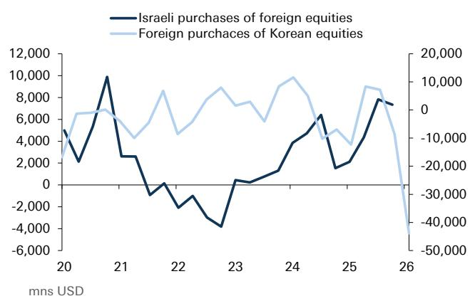
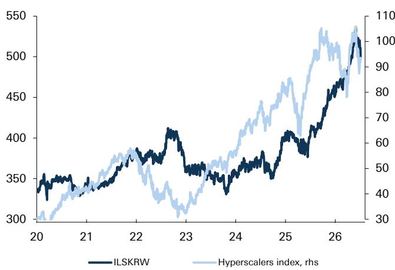

# DB：科技周期中谢克尔与韩元为何走势分化？DB拆解资金传导机制

科技股如果出现明显调整，美元会如何反应？市场通常存在两种不同预期：避险情绪可能推升美元，或是美联储政策预期与资金流向变化共同影响美元。DB外汇策略师Oliver Harvey在最新报告中，没有直接回答这个复杂问题，而是提出了一个更具体的观察视角——关注以色列谢克尔对韩元的汇率（ILS/KRW）。

这个组合看起来有些反直觉。以色列和韩国宏观环境都高度依赖全球科技周期，一个侧重软件，一个横跨软硬件。按照一般理解，两者货币走势应该趋同。但DB发现，自2024年中期以来，ILS/KRW已明显走强约50%，几乎与超大规模云服务商的报价涨幅同步。这背后是两国截然不同的资金传导机制。

以色列谢克尔与美国市场的正相关性较强。当美股科技股上涨，以色列本地科技出口企业会将部分利润汇回国内，同时国内机构因持有大量美股科技头寸而获利，随后会进行组合观察再平衡——卖出美元、买入谢克尔或对冲美元敞口。这种“本土资金回流”机制，使得谢克尔在科技周期中持续走强。

韩元的情况则完全不同。传统上韩元与韩国综合报价指数（Kospi）正相关，但近几个月这个关系已经发生变化。DB亚洲策略团队指出，当科技股推动Kospi上涨时，外资反而倾向于对韩国公司持谨慎态度或增加对韩元的对冲。原因在于，韩国市场的外资占比更高，科技股上涨带来的获利了结和资金外流，压过了本土资金的支撑。驱动谢克尔的是国内机构的再平衡，驱动韩元的则是外资的再平衡。

> **KC观察：** 这提醒我们，同样依赖科技周期的地区，货币走向可能截然不同。关键在于谁在持有科技资产、谁在做再平衡。对于关注新兴市场资金流向的读者，DB报告中的图3（相对资金流对比）值得仔细看，它直观展示了以色列国内资金与韩国外资的此消彼长。

如果科技股出现大规模调整，这条逻辑链会反向运行。谢克尔从全球较贵的货币之一（按DB模型衡量）面临回调可能性，而韩元则可能因外资流出变化而相对走强。DB认为，ILS/KRW目前已是全球较“贵”的货币对，这意味着一旦科技情绪转变，这个组合可能出现明显波动。

报告没有完全回答的问题是：科技股调整的触发因素是什么？是美联储政策方向变化，还是AI资本开支预期节奏变化？这两种情景对谢克尔和韩元的影响路径并不完全相同。前者可能通过利率渠道同时影响两国，后者则更直接冲击出口结构差异——以色列的软件出口与韩国的硬件出口，对AI周期的敏感度可能不同。

对于关注外汇和新兴市场的读者，这份报告提供了一个有价值的分析框架：不要只看地区对科技周期的“暴露度”，更要看资金在谁手里、谁在做对冲。以色列的“内部机构驱动”与韩国的“外部机构驱动”，是理解这对货币未来分化的关键视角。而完整的报告里，还有更多关于相对资金流和估值模型的细节值得翻阅。

For informational purposes only. Portions may be generated,translated,summarized,or edited with AI assistance based on source materials and may contain omissions or errors. Please verify independently. This is not investment,legal,tax,accounting,or other professional advice.

For informational purposes only. Portions may be generated,translated,summarized,or edited with AI assistance based on source materials and may contain omissions or errors. Please verify independently. This is not investment,legal,tax,accounting,or other professional advice.

