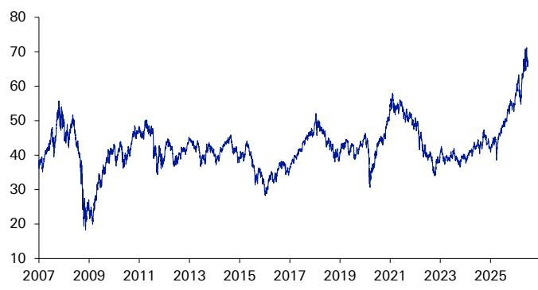
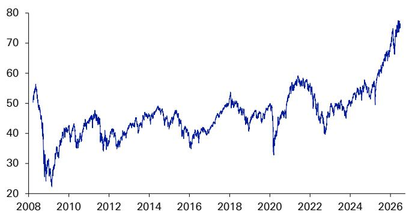

# DB：过去近20年回报表现持平，新兴市场ETF如今更像半导体和AI的集中押注

过去近二十年，持有美国以外公司的读者常常质疑：分散化真的有用吗？估值真的会回归吗？DB在其年度“WOW!”图表包中揭示了一个令人意外的转折：一只跟踪美国以外全球市场的ETF，2025年初的价格水平与2007年6月几乎持平；同期，标普500指数近乎翻了两番。然而，近期故事的另一面是——非美市场开始表现相对更好。

这份报告的核心判断是：新兴市场ETF的底层结构已经发生根本性变化，它不再是你以为的那个“传统宏观环境”敞口。如今，一只新兴市场ETF本质上更像是一笔大型科技押注。

---

## 1. “旧宏观环境”的回归正在改变全球资金流向

非美指数过去长期超配资金、能源、材料和工业等“旧宏观环境”板块，而缺乏支撑标普500在2010年代走强的超级科技股。但趋势已经逆转。地缘政治格局的变迁正在为传统宏观环境中此前被冷落的板块提供支撑。国防和工业自主化的重新聚焦只是一个例子。AI驱动的资本支出正在外溢至电力、硬件和材料——这正是非美和新兴市场指数超配的领域。

财政政策的积极转向正在加速这一进程。德国的刺激计划是发达市场的典型案例，但这一趋势在新兴市场国家也在扩大。墨西哥在削减财政赤字的同时，正对传统宏观环境中的铁路基础设施进行大规模研究。欧洲银行（近15年的落后板块）因盈利能力改善而大幅重估，这本身就是一个传统宏观环境复苏的指标。

> **KC评论：** 这份报告提醒我们，不要简单将新兴市场视为“大宗商品”或“廉价劳动力”的代名词。其指数成分的演变，反映了全球供应链重构和科技研究扩散的深层趋势。完整报告中的“WOW!”图表包值得细看，它提供了更多关于这一结构性转变的视觉证据。

## 2. 新兴市场ETF的集中度已超过标普500

一个反直觉的数据是：新兴市场指数前十大成分股的集中度已经达到39.4%，高于标普500的36.7%。而全球指数（除美国）的前十大集中度仅为16.8%。这意味着，新兴市场ETF的回报表现越来越依赖于少数几家公司的命运。

更具体地说，新兴市场指数中最大的三家公司——台积电、三星和SK海力士——合计权重接近30%。这三家都是科技硬件公司，与全球AI和半导体周期高度绑定。因此，当你买入一只新兴市场ETF时，你的不确定性敞口实际上被高度集中到了科技硬件和半导体领域。

> **KC评论：** 这并不意味着新兴市场ETF需要继续观察，而是它已经从一个“广泛分散化”的配置工具，变成了一个“高度集中的科技+传统宏观环境”的混合体。读者需要重新审视自己的不确定性暴露。报告没有回答的问题是，这种集中度本身是否构成新的脆弱性。

## 3. 美元走弱为海外回报提供额外支撑

报告还指出了一个关键的宏观变量：美元在2010年至2024年间经历了约40%的强势周期，这对以美元计价的读者来说，构成了未对冲海外回报的持久影响。2025年，美元指数下跌超过9%，为2017年以来最差年度表现，尽管今年有所反弹。

如果美元强势周期确实进入平台期，那么对于美国读者而言，海外研究的汇率回报将不再是负贡献。这为非美市场的相对表现提供了一个额外的顺风。但DB也谨慎指出，这一趋势仍有反复，今年以来的部分逆转就是例证。

## 4. 报告尚未完全回答的关键问题：这种结构的可持续性

这份报告以其标志性的“WOW!”风格提出了一个有力的观察，但它也留下了一个关键问题：这种结构变化是暂时的，还是长期的？

新兴市场ETF的科技化，究竟是AI研究浪潮带来的周期性溢出，还是新兴市场自身产业结构升级的长期结果？如果AI资本支出周期节奏变化，或者半导体行业进入节奏变化周期，高度集中的新兴市场ETF将面临显著的回撤不确定性。此外，传统宏观环境板块的复苏——如欧洲银行和墨西哥基础设施——能否持续，也取决于全球财政扩张的力度和地缘政治格局的演变。

对于读者而言，这份报告的价值不在于给出一个明确的“买或不买”信号，而在于提供了一个重新审视资产配置框架的视角。当一只ETF的结构与你以为的完全不同时，你的不确定性预算和回报预期也需要相应调整。

For informational purposes only. Portions may be generated,translated,summarized,or edited with AI assistance based on source materials and may contain omissions or errors. Please verify independently. This is not investment,legal,tax,accounting,or other professional advice.

