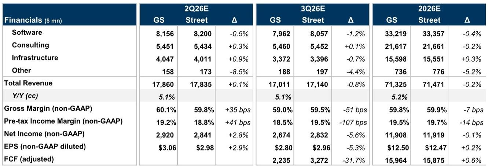
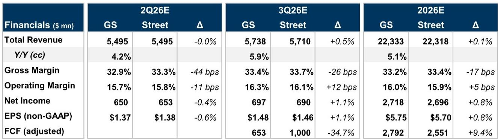
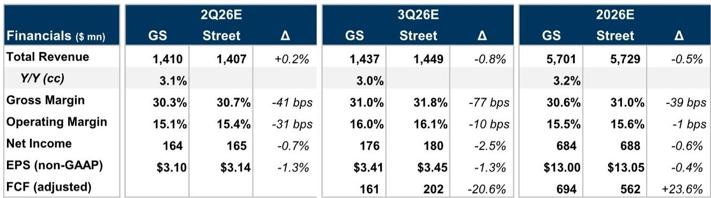

# IT服务行业财报季：关注宏观环境变化，而非单季数据

即将到来的IT服务行业第二季度财报季，其核心看点并非企业能否达成或超出短期收入预期。实际数据很可能与预期相符。真正的关键在于管理层对未来几个月的展望——而信号已经趋于谨慎。今年4月和5月，宏观环境不确定性的增加已开始影响客户的决策。这意味着，本次财报电话会议中更新的业绩指引，将反映出一个与年初制定全年预测时截然不同的需求环境。

最重要的结论是：预计企业将下调其业绩指引区间的上限，并将预期锚定在中点。这并非暂时性停顿。它反映了支出复苏进程的持续扰动，这一影响现已延伸至2026年。对于观察者而言，其含义是明确的。该板块的估值水平并不高，但宏观不确定性已消除了出现超预期惊喜的可能性。个股选择将比板块方向更为重要。在这一格局中，有一家公司作为企业AI需求的独特受益者脱颖而出，而其他公司则面临来自可自由支配支出敞口和日益增长的AI颠覆风险的结构性阻力。

## IBM定位为企业AI需求的净受益者，而可自由支配支出敞口较大的公司面临更大下行风险

IT服务行业内部的分化并非随机。它直接映射到收入来源的构成。IBM受益于软件和咨询业务的独特组合，使其成为企业AI应用普及的净受益者。其软件组合对更广泛AI相关担忧的韧性较强，而这些担忧正对整个软件行业构成压力。其咨询业务虽然不能完全免受宏观环境疲软的影响，但得益于AI相关实施工作的持续需求。这种双重敞口创造了纯咨询公司所缺乏的缓冲。

相比之下，那些对可自由支配支出项目（客户可以推迟的应用实施、咨询和转型工作）敞口较高的公司则更为脆弱。EPAM就是一个明显的例子。其核心业务完全属于可自由支配支出范畴，自4月以来不断恶化的宏观环境使得管理层不太可能上调近期已下调的指引。尽管EPAM拥有稳健的执行记录和不断增长的AI业务，一旦支出恢复，这些可能推动长期增长，但短期内，随着客户继续推迟决策，压力可能持续存在。

这种模式并非二元对立。Cognizant和Globant处于中间位置，增长稳定但缺乏亮点。Cognizant受益于注重成本的客户在可自由支配支出疲软的情况下仍维持外包需求。Globant则面临来自中东地区敞口和面向消费者垂直行业的阻力，但如果管理层能释放加速信号，其AI Pods业务可能成为潜在催化剂。TaskUs（评级为报告观点）面临更严峻的挑战：来自AI颠覆带来的定价和利润率压力，这并非周期性，而是结构性的。

## 指引区间收窄是主导主题，收窄的方向比相对数字更重要

当一家公司收窄其业绩指引区间时，直觉反应是关注中点。这是一个错误。关键信号在于收窄是来自上限下调、下限上调，还是两者兼有。在当前环境下，上限正在下调。这表明管理层认为出现上行情景的可能性降低。这等于承认，达到区间高端所需的宏观环境利好因素并未出现，且在可预见的未来也不太可能出现。

对于IBM，预计管理层将重申2026年实现超过5.0%的固定汇率收入增长，并伴有温和的正向外汇影响。关键变量是第二季度的咨询订单。这些订单将提供关于延迟决策是否正在加速的可见性。如果订单疲软，2026年的咨询收入轨迹将面临阻力。但IBM的软件业务势头，得益于Red Hat的两位数增长和Confluent的持续整合，提供了缓冲。

对于Cognizant，预计指引区间将从4.0%至6.5%的固定汇率增长收窄至4.0%至6.0%。这一调整反映了持续的宏观不确定性和Astreya收购贡献减少一个月。中点保持不变，但上限的移除表明，目前加速增长的路径已被阻断。Cognizant的利润率故事，得益于Project Leap带来的AI驱动效率提升，提供了部分抵消，但来自定价和底层招聘的毛利率压力仍令人担忧。

对于EPAM，预计指引区间将从2.5%至5.0%的有机固定汇率增长收窄至2.5%至4.0%。这是对上限的有意义下调。它反映了应用实施和咨询领域的可自由支配支出不太可能迅速反弹的现实。EPAM稳健的执行记录和不断增长的AI业务是真正的资产，但它们是长期期权，只有在宏观环境好转时才能兑现。目前，该股缺乏短期催化剂。

对于Globant，预计指引区间将从0.3%至2.2%的增长收窄至0.3%至1.8%。该公司面临来自中东地区地缘政治扰动以及媒体与娱乐、旅游与酒店等面向消费者垂直行业疲软的阻力。潜在的上升催化剂是AI Pods业务，但这在整体收入基础中仍占很小比例。该股已大幅回调，这降低了门槛，但宏观环境的不确定性依然存在。

## 报告提出了一个未完全解答的关键问题：当前疲软有多少是周期性的，又有多少是结构性的？

该报告将当前的宏观扰动视为一种最终会逆转的周期性阻力。这是一个合理的基线假设，但它留下了一个重要问题。IT服务行业的疲软有多少实际上是结构性的，是由AI驱动的自动化对传统应用实施和咨询工作的永久性替代所驱动的？

答案因公司而异，报告提供了线索，但没有给出明确的框架。对于TaskUs，这种颠覆显然是结构性的。AI正在直接取代构成其收入模式核心的劳动密集型业务流程外包工作。报告观点反映了这样一种看法：这不是周期性低迷，而是定价能力和利润率的长期性下降。

对于EPAM和Globant，问题更为微妙。两家公司都有不断增长的AI业务，这表明它们正在适应。但适应需要时间，且AI原生服务的收入贡献相对于传统业务仍然较小。风险在于传统业务的侵蚀速度快于AI业务的扩张速度。这是一个时间错配，可能会在几个季度内压缩利润率和增长率，即使长期逻辑保持不变。

对于IBM，结构性问题实际上是一个利好因素。该公司的软件组合，特别是Red Hat及其AI平台WatsonX，使其能够抓住企业AI应用普及带来的增长机会。咨询业务则受益于AI产生的实施工作。结构性转变对IBM有利，这就是为什么它是研究覆盖范围内最具差异化的公司。

该报告并未解决周期性对结构性的争论。它提供了数据和估计，但将判断当前疲软有多少是暂时的、有多少是永久性的任务留给了观察者。这是正确的方法，因为答案只有在未来几个季度的数据出来后才能变得清晰。但这也是为什么观察者需要保持选择性，而不是将整个板块视为单一交易。

## 应对IT服务财报季的决策框架

观察者应以清晰的决策框架来应对即将到来的财报季，该框架将信号与噪音区分开来。该框架包含三个层面。

首先，评估业绩指引轨迹。关键问题不在于指引是否收窄，而在于收窄是由上限下调还是下限上调驱动的。上限下调是防御性的。它表明管理层认为上行空间减少。下限上调将是建设性的，但这不是我们本季度预期的模式。如果有任何公司通过提高下限同时保持上限不变来带来惊喜，那将是一个有意义的积极信号。

其次，评估AI叙事。每家公司都会谈论AI。问题在于AI收入是增量性的，还是仅仅是重新包装的传统业务。寻找具体指标：AI订单增长、AI原生收入占总收入的比例，以及已超越试点阶段并实现规模化的AI项目数量。能够展示有形、可衡量AI收入的公司将获得认可。只能提供定性评论的公司则不会。

第三，监控利润率轨迹。宏观阻力正在对收入增长构成压力，但利润率扩张是一个独立的变量。即使在低增长环境下也能扩大利润率的公司，正在展示运营纪律和定价能力。利润率出现压缩的公司则面临双重打击：收入降低和盈利能力下降。Cognizant的利润率故事，得益于AI驱动的效率提升，值得关注。EPAM因工资上涨和定价问题面临的利润率压力则是一个风险。

报告为这一分析提供了原始素材。这些估计与市场共识基本一致，这意味着股价变动将由定性评论和指引更新驱动，而非季度数据本身。带着这一框架进入财报季的观察者，将能够区分那些有效管理宏观阻力的公司和那些被宏观阻力压垮的公司。

## 未解决的分析问题：当宏观周期转向时会发生什么？

报告的分析基于当前的宏观环境，但它隐含地提出了一个未完全解答的前瞻性问题。当宏观周期确实转向时——当客户信心恢复、可自由支配支出重启时——哪些公司最有能力抓住复苏机会？

报告提供了线索。EPAM拥有稳健的执行记录和不断增长的AI业务，这表明它可能是一个强劲的复苏标的。Globant拥有可能加速增长的AI Pods业务。Cognizant拥有规模和成本结构，可以从外包需求的反弹中受益。但报告并未为这些情景分配概率，也未提供判断复苏时机的框架。

这就是未解决的分析问题。当前的指引收窄是一种防御性举措，反映了未来六到十二个月的现实。但股价也在计入一个可能比市场预期更远的复苏。风险在于，指引收窄并非一次性事件，而是更长时期下调的开始。机会在于，股价已经计入了显著的悲观情绪，任何企稳的迹象都可能引发反弹。

希望为复苏布局的观察者需要区分那些正在有效管理低迷期的公司和那些正在被结构性颠覆的公司。报告提供了进行这种区分的数据，但最终判断需要对宏观疲软的持续时间以及AI驱动替代的速度有一个看法。这是每位观察者必须根据自己的时间范围和风险承受能力做出的判断。

## 加入社区阅读完整报告并查看原始图表

完整分析包含详细的财务模型，这些模型为支撑研究观点的收入轨迹、利润率趋势和估值倍数提供了视觉背景。访问完整报告以查看论证背后的数据。

*仅供参考。部分内容可能基于源材料通过AI辅助生成、翻译、总结或编辑，可能存在遗漏或错误。请独立核实。本文不构成专业建议。*

仅供参考。部分内容可能基于源材料通过AI辅助生成、翻译、总结或编辑，可能存在遗漏或错误。请独立核实。本文不构成专业建议。

