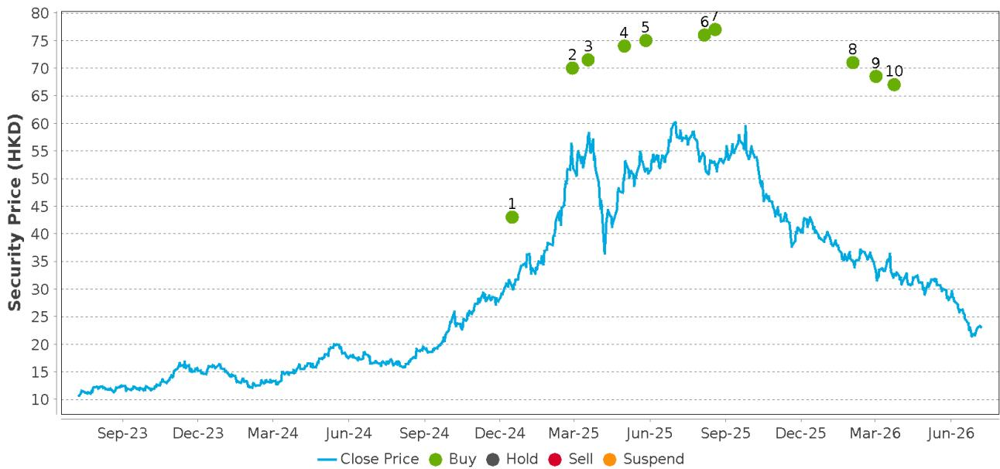

# 小米推出“天行”系列插电式混合动力车型，布局家庭与户外出行市场

## 以“天行”PHEV系列进军家庭与户外旅行市场，拓展“蓝海”空间

小米于7月8日正式发布全新插电式混合动力车型系列“天行”，标志着公司在新的市场领域迈出重要一步。与现有的“YU7”SUV和“SU7”纯电轿车专注于高性能纯电车型不同，“天行”系列将战略性地扩展小米的汽车产品线，瞄准家庭用车、长途出行和户外旅行市场。

## “天行”系列首款车型“昆仑N90”SUV，专为多场景家庭与户外出行设计

据车纪派报道，小米“天行”系列的首款车型将是“昆仑N90”全尺寸七座SUV，随后将推出“昆仑N80”全尺寸五座SUV和“昆仑N70”大型五座SUV。具体来看，“昆仑N90”SUV旨在满足多场景家庭旅行和露营需求，可作为多功能用车。该车型可能提供车顶升降扩展装置，为户外旅行提供帐篷或折叠床，方便乘客在车内休息。同时，“昆仑N90”SUV的第二排座椅可180度旋转，在后部形成面对面的交流空间，适合会议、游戏或用餐等活动。

## “天行”PHEV系列预计8月交付，定位清晰

据车纪派消息，小米预计将于7月23日举办技术日活动，随后“天行”系列将于8月开始正式交付，“昆仑N80”SUV预计于2026年第四季度推出。我们预计“天行”系列PHEV的定位将低于现有的纯电系列（“YU7”和“SU7”），因为据报道小米计划为“天行”系列采用两家更具成本效益的电池供应商——欣旺达和中创新航，而纯电车型则使用宁德时代和比亚迪的电池。因此，我们预计“天行”系列PHEV的定价区间将在人民币20万至45万元之间，与比亚迪“方程豹”品牌的“Ti7”和“Ti9”SUV展开竞争。进入PHEV领域预计将为公司的销量做出重要贡献，预计2026年全年PHEV车型交付量为15万辆。

日期：2026年7月8日

<table><tr><td>评级</td><td>买入</td></tr><tr><td>目标价（港元）</td><td>67.00</td></tr><tr><td>7月7日收盘价</td><td>23.10</td></tr><tr><td>52周区间</td><td>59.45 – 21.42</td></tr></table>

估值与风险

王斌

研究分析师

+852-220-35496

## 近期订单情况显示“天行”PHEV系列定价策略

根据Thinkercar数据，小米过去四周的新增订单分别约为5,000、7,200、6,100和5,400辆，7月第一周环比下降11%，同比下降93%至5,400辆。考虑到近期新增订单的节奏，我们预计小米可能会为“天行”系列PHEV产品制定有竞争力的定价策略，入门价可能低于人民币20万元，以实现公司全年的销量目标。

## 附录1

## 重要披露

<table><tr><td>公司</td><td>代码</td><td>近期价格</td><td>披露</td></tr><tr><td>小米</td><td>1810.HK</td><td>23.1（港元）2026年7月7日</td><td>2, 14, 24</td></tr></table>

除非另有说明，价格均为上一交易日收盘价，数据来源于路透、彭博及其他供应商。其他信息来源于DB、标的公司及其他来源。

## 美国监管机构要求的重要披露

2 - DB及/或其关联公司可能担任该公司所发行金融工具的做市商或流动性提供者。

14 - DB及/或其关联公司在过去一年内因非投行相关服务从该公司获得报酬。

## 非美国监管机构要求的重要披露

2 - DB及/或其关联公司可能担任该公司所发行金融工具的做市商或流动性提供者。

24 - DB及/或其关联公司在过去12个月内与该公司就提供指令2014/65/EU附件一A和B部分所述服务达成协议，或在过去12个月内因提供该等服务而有义务或有权（视情况而定）支付或收取报酬。

关于本研究报告主要标的以外的证券的建议或估计的披露，请参阅最近发布的公司报告或访问我们网站上的全球披露查询页面：https://research.db.com/Research/Disclosures/EquityResearchDisclosures。除本报告外，重要的风险与利益冲突披露也可在https://research.db.com/Research/Disclosures/Disclaimer找到。强烈建议读者在投资前审阅此信息。

## 分析师认证

本报告中表达的观点准确反映了以下签署首席分析师的个人观点。此外，以下签署首席分析师未曾且不会因提供本报告中的具体建议或观点而获得任何报酬。王斌。

历史建议与目标价：小米（1810.HK）  

<table><tr><td>1.</td><td>2024年12月16日</td><td>目标价：43（港元），收盘价30.35（港元），建议：买入，分析师：王斌</td></tr><tr><td>2.</td><td>2025年2月27日</td><td>目标价：70（港元），收盘价53.1（港元），建议：买入，分析师：王斌</td></tr><tr><td>3.</td><td>2025年3月18日</td><td>目标价：71.5（港元），收盘价57.65（港元），建议：买入，分析师：王斌</td></tr><tr><td>4.</td><td>2025年5月1日</td><td>目标价：74（港元），收盘价49.95（港元），建议：买入，分析师：王斌</td></tr><tr><td>5.</td><td>2025年5月27日</td><td>目标价：75（港元），收盘价51.55（港元），建议：买入，分析师：王斌</td></tr><tr><td>6.</td><td>2025年8月6日</td><td>目标价：76（港元），收盘价54（港元），建议：买入，分析师：王斌</td></tr><tr><td>7.</td><td>2025年8月19日</td><td>目标价：77（港元），收盘价52.4（港元），建议：买入，分析师：王斌</td></tr><tr><td>8.</td><td>2026年2月2日</td><td>目标价：71（港元），收盘价35.06（港元），建议：买入，分析师：王斌</td></tr><tr><td>9.</td><td>2026年3月2日</td><td>目标价：68.5（港元），收盘价33.14（港元），建议：买入，分析师：王斌</td></tr><tr><td>10.</td><td>2026年3月24日</td><td>目标价：67（港元），收盘价32.68（港元），建议：买入，分析师：王斌</td></tr></table>

公司评级分布与银行关系

<table><tr><td>DBSI覆盖公司</td><td>买入</td><td>持有</td><td>卖出</td></tr><tr><td>覆盖</td><td>57%</td><td>42%</td><td>0%</td></tr><tr><td>有银行关系</td><td>43%</td><td>35%</td><td>0%</td></tr><tr><td>有MiFID服务</td><td>63%</td><td>51%</td><td>67%</td></tr></table>

<table><tr><td>全球覆盖公司</td><td>买入</td><td>持有</td><td>卖出</td></tr><tr><td>覆盖</td><td>58%</td><td>40%</td><td>2%</td></tr><tr><td>有银行关系</td><td>47%</td><td>34%</td><td>31%</td></tr><tr><td>有MiFID服务</td><td>75%</td><td>69%</td><td>94%</td></tr></table>

## 公司评级与分布说明

上表展示了DB公司研究评级在覆盖公司中的分布情况。我们还列出了在过去12个月内DB提供投行服务和/或MiFID投资及辅助服务的公司百分比。请参阅下方评级说明和定义。

注——百分比已四舍五入，因此可能不总和为100%。

覆盖：所有被评级覆盖公司的总体评级分布。

有银行关系：在每个“买入”、“持有”和“卖出”类别中，DB在过去12个月内提供投行服务的被评级公司的百分比。

有MiFID服务：在每个“买入”、“持有”和“卖出”类别中，DB在过去12个月内提供MiFID投资及辅助服务的被评级公司的百分比。

买入/持有/卖出百分比：这些百分比反映了在每个类别中被赋予相应评级的公司比例，基于我们对12个月股东总回报（TSR）的展望。

## 评级定义：

买入：基于当前12个月的TSR展望，我们建议读者买入该股票。

卖出：基于当前12个月的TSR展望，我们建议读者卖出该股票。

持有：我们对未来12个月的股票持中性看法，基于此时间范围，不建议买入或卖出。

TSR：股东总回报。从当前价格到预测目标价格的百分比变化加上预测股息回报表现。

新发布的研究建议和目标价取代之前发布的研究。

## 附加信息

本报告中的信息和观点由DB AG或其关联公司（统称“DB”）准备。尽管此处信息被认为是可靠的，且来自被认为可靠的公开来源，但DB对其准确性或完整性不作任何陈述。本报告中指向第三方网站的超链接仅为方便读者提供。DB既不认可其内容，也不对这些网站的安全性控制负责。

如果您使用DB的服务购买或出售本报告中讨论的证券，或包含在DB分析师的其他（口头或书面）沟通中，DB可能作为自有账户的委托人或他人的代理人行事。

DB在决定作为委托人交易时可能考虑本报告。它也可能以与本研究报告观点不一致的方式，为其自有账户或与客户进行交易。DB内部的其他人员，包括策略师、销售人员和其它分析师，可能持有与本研究报告不一致的观点。DB发布多种研究产品，包括基本面分析、股权挂钩分析、定量分析和交易思路。一种沟通类型中的建议可能与另一种不同，无论是由于不同的时间范围、方法论、视角或其他原因。DB及/或其关联公司可能持有其撰写报告的发行人的债务或股权证券。分析师的薪酬部分基于DB AG及其关联公司的盈利能力，包括投行、交易和自营交易收入。

意见、估计和预测构成本报告作者截至报告日期的当前判断。它们不一定反映DB的意见，且可能随时更改，恕不另行通知。DB为其覆盖公司发行的证券的买卖双方提供流动性。DB分析师有时可能持有与DB现有长期评级不一致的短期交易思路。一些股票交易思路在研究网站（https://research.db.com/Research/）上列为催化剂电话（Catalyst Calls），可在总体覆盖列表和覆盖公司页面上找到。催化剂电话代表分析师高度确信某股票将在不少于两周且不超过三个月的时间范围内跑赢或跑输市场和/或特定行业。除催化剂电话外，分析师可能偶尔与客户、DB销售人员和交易员讨论交易策略或思路，这些思路涉及可能对本报告中讨论的证券市场价格产生短期或中期影响的催化剂或事件，其影响方向可能与分析师当前12个月的总回报或投资回报观点相反。DB没有义务更新、修改或修订本报告，或在意见、预测或估计发生变化或不准确时通知接收方。市场状况以及一般和公司特定经济前景的变化频率使得难以按固定间隔更新研究。更新由覆盖分析师或研究部门管理层自行决定，大多数报告不定期发布。本报告仅供参考，未考虑个别客户的特定投资目标、财务状况或需求。它不是购买或出售任何金融工具或参与任何特定交易策略的要约或要约邀请。目标价本质上是不精确的，是分析师判断的产物。本报告中讨论的金融工具可能不适合所有读者，读者必须自行做出明智的投资决策。金融工具的价格和可用性可能随时更改，恕不另行通知，投资交易可能因价格波动和其他因素导致损失。如果金融工具以读者货币以外的货币计价，汇率变化可能对投资产生不利影响。过往表现不一定预示未来结果。除非另有说明，表现计算不包括交易成本。除非另有说明，价格均为上一交易日收盘价，数据来源于路透、彭博及其他供应商。数据也来源于DB、标的公司及其他方。人工智能工具可能用于准备此材料，包括但不限于协助事实查找、数据分析、模式识别、内容起草和与研究材料相关的编辑更正。

DB部门独立于银行的其他业务部门。关于我们为防止和避免研究利益冲突而设置的组织安排和信息壁垒的详细信息，请访问我们的网站（https://research.db.com/Research/）上的免责声明。

宏观经济波动通常构成与承诺支付固定或浮动利率的工具相关的风险的主要部分。对于持有固定利率工具（从而接收这些现金流）的读者而言，利率上升自然会提高应用于预期现金流的贴现因子，从而导致损失。特定现金流的期限越长，贴现因子变动越大，损失就越高。通胀意外上行、财政融资需求和外汇贬值率是接收方最常见的负面宏观经济冲击。但交易对手风险、发行人信用状况、客户细分、监管（包括对不同类型读者的资产持有限制的变化）、税收政策变化、货币可兑换性（可能限制货币兑换、利润汇回和/或头寸清算）以及当地清算机构的结算问题也是重要的风险因素。固定收益工具对宏观经济冲击的敏感性可以通过将合同现金流与通胀、外汇贬值或特定利率挂钩来缓解——这些在新兴市场中很常见。指数固定值可能——按设计——滞后或错误衡量其旨在跟踪的底层变量的实际变动。在掉期市场中，浮动息票利率（即通常与短期利率参考指数挂钩的息票）与固定息票交换，选择正确的固定值（或指标）尤为重要。以与息票计价货币不同的货币融资会带来外汇风险。掉期期权（swaptions）除了与利率变动相关的风险外，还具有期权的典型风险。

衍生品交易涉及多种风险，包括市场风险、交易对手违约风险和流动性风险。这些产品是否适合读者使用取决于读者自身的具体情况，包括其税务状况、监管环境以及其其他资产和负债的性质；因此，读者在进入与本出版物内容类似或受其启发的任何交易前，应寻求专业的法律和财务建议。期货和期权交易（无论是国内还是国外）的损失风险可能很大。由于期货和期权交易的高杠杆性，可能产生超过初始存入资金金额的损失——理论上可达无限损失。期权交易涉及风险，不适合所有读者。在购买或出售期权之前，读者必须审阅“标准化期权的特征和风险”，网址为https://www.theocc.com/company-information/documents-and-archives/options-disclosure-document。如果您无法访问该网站，请联系您的DB代表获取此重要文件的副本。

外汇交易的参与者可能面临多种因素产生的风险，包括：(i) 汇率可能波动且波动幅度较大；(ii) 货币价值可能受到众多市场因素的影响，包括世界和国家经济、政治和监管事件、股票和债务市场事件以及利率变化；以及(iii) 货币可能面临贬值或政府实施的汇率管制，这可能影响货币的价值。投资于其价值受底层货币影响的证券（如ADR）的读者实际上承担了货币风险。

除非适用法律另有规定，所有交易应通过读者所在司法管辖区的DB实体执行。除本报告外，重要的利益冲突披露也可在https://research.db.com/Research/上每个公司的研究页面或“披露”选项卡下找到。强烈建议读者在投资前审阅此信息。

DB（包括DB AG、其分支机构和关联公司）不就本报告中提供的任何信息担任您的财务顾问、顾问或受托人。DB不提供投资、法律、税务或会计建议，DB不担任您的公正顾问，也不对材料中呈现的任何策略、产品或任何其他信息表达任何意见或建议。此处包含的信息仅基于接收方将独立评估任何投资决策的优劣而提供，并不构成对任何产品或服务或任何交易策略的建议或意见。

所呈现的信息具有一般性，不针对退休账户或任何特定个人或账户类型，因此明确基于其非建议的性质提供给您，您不得依赖其做出决策。我们提供的信息仅针对我们认为具有财务成熟度、能够独立评估投资风险（无论是总体上还是针对特定交易和投资策略）且理解DB在其产品和服务提供中具有财务利益的人士。如果情况并非如此，或者您是IRA或其他直接接收此信息的零售读者，我们要求您立即告知我们。

2018年7月，DB修订了其短期思路评级系统，品牌名称从SOLAR思路改为催化剂电话（CC）；源自美洲地区的催化剂电话的评级类别已与全球分析师使用的类别保持一致；CC的有效期已从最长180天缩短至90天。

美国：由DB Securities Incorporated批准和/或分发，该公司是FINRA和SIPC的成员。位于美国以外的分析师受雇于非美国关联公司，且未注册/未具备FINRA研究分析师资格。

欧洲经济区（不包括英国）：由DB AG批准和/或分发，DB AG是一家根据德意志联邦共和国法律注册成立的股份有限公司，主要营业地点位于法兰克福。DB AG根据德国银行法获得授权，并受欧洲中央银行和德国联邦金融监管局（BaFin）的监管。

英国：由DB AG通过其伦敦分行（地址：21 Moorfields, London EC2Y 9DB）批准和/或分发。DB AG在英国由审慎监管局授权，并受审慎监管局和金融行为监管局的有限监管。有关我们授权和监管范围的详细信息，请索取。

香港特别行政区：由DB AG香港分行分发，但涉及《香港证券及期货条例》第571章含义内的期货合约的研究内容除外。关于此类期货合约的研究报告不旨在供位于、注册于、组成于或居住于香港的人士访问。研究报告的作者及其代表和/或关联的实体可能未获发牌在香港进行受规管活动，如果未获发牌，则不得声称能够这样做。上述“附加信息”部分中的规定应在当地法律法规允许的最大范围内适用，包括但不限于《证券及期货事务监察委员会持牌人或注册人操守准则》。本报告旨在仅分发给《证券及期货条例》附表1第1部分定义的“专业读者”。非专业读者不得依据或依赖本文件行事。本文件相关的任何投资或投资活动仅适用于专业读者，且仅与专业读者进行。

印度：由Deutsche Equities India Private Limited (DEIPL) 准备，公司识别号：U65990MH2002PTC137431，注册地址：14th Floor, The Capital, C-70, G Block, Bandra Kurla Complex, Mumbai (India) 400051。电话：+91 22 7180 4444。它在印度证券交易委员会（SEBI）注册为股票经纪人，注册号：INZ000252437；商人银行家，SEBI注册号：INM000010833；研究分析师，SEBI注册号：INH000001741。DEIPL的合规/申诉官是Rashmi Poddar女士（电话：+91 22 7180 4929，电子邮件：complaints.deipl@db.com）。SEBI的注册和NISM的认证绝不保证DEIPL的表现或向读者提供任何回报保证。证券市场的投资受市场风险影响。投资前请仔细阅读所有相关文件。DEIPL可能因违反印度法规而收到SEBI的行政警告。DB及/或其关联公司可能持有标的公司的债务头寸或头寸。关于关联公司的信息，请参阅年度报告中的“持股”部分：https://www.db.com/ir/en/annual-reports.htm。有关最新的印度研究审计报告，请参阅https://country.db.com/india/deutsche-equities-india/index?language\_id=1。

日本：由Deutsche Securities Inc.(DSI)批准和/或分发。注册号——注册为金融工具交易商，关东财务局局长（金商）第117号。协会成员：日本证券业协会、第二类金融工具交易商协会和日本金融期货协会。股票交易的佣金和风险——对于股票交易，我们按与每位客户约定的佣金率乘以交易金额收取股票佣金和消费税。股票交易可能因股价波动和其他因素导致损失。外国股票交易可能因外汇波动导致额外损失。对于某些类别的研究交流、产品和服务，我们可能收取佣金和费用。推荐的投资策略、产品和服务存在本金损失以及因市场和/或经济趋势变化和/或市场价值波动导致的其他损失的风险。在决定购买金融产品和/或服务之前，客户应仔细阅读相关披露、招股说明书和其他文件。本报告中提到的“穆迪”、“标准普尔”和“惠誉”除非在实体名称中特别指定日本或“日本”，否则不是日本注册的信用评级机构。非DSI分析师撰写的关于日本上市公司的报告由DB集团的分析师撰写，覆盖公司由DSI指定。本报告中所述的一些外国证券未根据日本《金融工具和交易法》披露。DB股票分析师设定的目标价基于12个月的预测期。

韩国：由Deutsche Securities Korea Co.分发。

南非：DB AG约翰内斯堡在德意志联邦共和国注册成立（南非分行注册号：1998/003298/10）。

新加坡：本报告由DB AG新加坡分行（地址：One Raffles Quay #18-00 South Tower Singapore 048583，电话：65 6423 8001）发布，可就本报告相关事宜联系该分行。如果DB在新加坡向非合格读者、专家读者或机构读者（定义见适用的新加坡法律法规）发布或传播本报告，DB对此类人士承担其内容的法律责任。

台湾：关于在台湾交易的证券/投资的信息仅供参考。读者应独立评估投资风险，并对其投资决策全权负责。未经书面同意，DB不得向台湾公共媒体分发，也不得被台湾公共媒体引用或使用。关于不在台湾交易的证券/工具的信息仅供参考，不构成交易此类证券/工具的建议。

卡塔尔：卡塔尔金融中心（注册号00032）的DB AG受卡塔尔金融中心监管局监管。DB AG - QFC分行仅可从事其现有QFCRA许可证范围内的金融服务活动。其在QFC的主要营业地点：Qatar Financial Centre, Tower, West Bay, Level 5, PO Box 14928, Doha, Qatar。此信息由DB AG分发。相关金融产品或服务仅适用于卡塔尔金融中心监管局定义的商业客户。

俄罗斯：此处提交的信息、解释和意见不属于任何需要在俄罗斯联邦获得许可的评估或估值活动的背景，也不构成此类活动。

沙特阿拉伯王国：Deutsche Securities Saudi Arabia (DSSA) 是一家封闭式股份公司，由沙特阿拉伯王国资本市场管理局授权，许可证号（第37-07073号），从事以下业务活动：交易、安排、咨询和托管服务。DSSA注册办公室：Faisaliah Tower, 17th Floor, King Fahad Road - Al Olaya District Riyadh, Kingdom of Saudi Arabia P.O. Box 301806。

阿拉伯联合酋长国：迪拜国际金融中心（注册号00045）的DB AG受迪拜金融服务管理局监管。DB AG - DIFC分行仅可从事其现有DFSA许可证范围内的金融服务活动。其在DIFC的主要营业地点：Dubai International Financial Centre, The Gate Village, Building 5, PO Box 504902, Dubai, U.A.E.。此信息由DB AG分发。相关金融产品或服务仅适用于迪拜金融服务管理局定义的专业客户。

澳大利亚和新西兰：本研究仅适用于《澳大利亚公司法》和《新西兰金融顾问法》含义内的“批发客户”。请参阅澳大利亚特定的研究披露及相关信息，网址为https://www.dbresearch.com/PROD/RPS\_EN-PROD/PROD0000000000521304.xhtml。如果研究涉及任何特定的金融产品，接收方在做出是否购买该产品的决定前应考虑任何产品披露声明、招股说明书或其他适用的披露文件。在准备本报告时，首席分析师或协助准备本报告的个人可能已与本研究主题的公司联系，以确认/澄清数据、事实、陈述、获得使用公司来源材料的许可，和/或进行实地考察访问。未经研究管理部门事先批准，分析师不得接受当前或潜在银行客户支付的参加实地考察、会议、社交活动等所产生的差旅、住宿或其他费用。同样，未经研究管理部门和反贿赂与反腐败（“ABC”）团队事先批准，分析师不得从其覆盖的发行人处接受供个人使用的福利或其他有价物品。

关于本报告中讨论的证券、其他金融产品或发行人的附加信息，可应要求提供。未经DB事先书面同意，不得复制、分发或发布本报告。

回测、假设或模拟的表现结果具有固有限制。与基于实际客户投资组合交易的实际表现记录不同，模拟结果是通过追溯应用一个本身具有事后之明的回测模型获得的。考虑历史事件的回测表现也与实际账户表现不同，因为实际投资策略可能随时因任何原因调整，包括对重大经济或市场因素的反应。回测表现包括假设结果，这些结果不反映股息和其他收益的再投资，也不反映咨询费、经纪费或其他佣金以及客户本应支付或实际支付的任何其他费用的扣除。未声明任何交易策略或账户将或可能实现与所示类似的利润或损失。替代建模技术或假设可能产生显著不同的结果，并可能被证明更为合适。过去的假设回测结果既不是未来回报的指标，也不是保证。实际结果将有所不同，可能与本分析存在重大差异。

本文阐述的计算单个E、S、G和综合ESG分数的方法是DB AG研究部门开发的新方法，使用系统方法计算，无需人工干预。不同的数据提供商、市场部门和地区采用不同的方式处理ESG分析并整合其发现。因此，本文提及的ESG分数可能与市场上其他ESG数据提供商开发和实施的等效评级不同，也可能与DB集团内其他部门开发和实施的等效评级不同。此类ESG分数也不同于DB AG先前发布的研究报告中使用的其他评级和排名。此外，此类ESG分数不代表DB AG的正式或官方观点。

应注意，将ESG因素纳入任何投资策略的决定可能会抑制参与某些原本符合您投资目标和其他主要投资策略的研究线索的能力。主要由可持续投资组成的投资组合的回报可能低于或高于不考虑ESG因素、排除或其他可持续性问题的投资组合，并且此类投资组合可用的研究线索可能有所不同。公司可能不一定在ESG或可持续投资问题的所有方面都达到高标准表现；也无法保证任何公司将在企业责任、可持续性和/或影响力表现方面达到预期。

版权所有 © 2026 DB AG

David Folkerts-Landau
集团首席经济学家兼全球研究主管

<table><tr><td>Pam Finelli首席运营官兼固定收益研究主管</td><td>Steve Pollard全球公司研究与销售主管</td><td>Jim Reid全球宏观与主题研究主管</td><td>Tim Rokossa欧洲公司研究主管</td></tr><tr><td>Matthew Barnard美洲公司研究主管</td><td>Debbie Jones全球可持续发展与数据创新研究主管</td><td>Robin Winkler德国宏观研究主管</td><td>Sameer Goel全球新兴市场与亚太研究主管</td></tr><tr><td>Francis Yared全球利率研究主管</td><td>George Saravelos全球外汇研究主管</td><td>Peter Hooper研究副主席</td><td>Nilendra de-Mel亚太及中东产品开发主管</td></tr></table>

国际生产地点

<table><tr><td>DB AG</td><td>DB AG</td><td>DB AG</td><td>Deutsche Securities Inc.</td></tr><tr><td>DB Place</td><td>股票研究</td><td>香港分行</td><td>1-3-1 Azabudai</td></tr><tr><td>Level 16</td><td>Mainzer Landstrasse 11-17</td><td>环球贸易广场</td><td>Azabudai Hills Mori JP Tower</td></tr><tr><td>Corner of Hunter &amp; Phillip Streets</td><td>60329 Frankfurt am Main Germany</td><td>九龙柯士甸道西1号</td><td>Minato-ku, Tokyo 106-0041</td></tr><tr><td>Sydney, NSW 2000 Australia</td><td>电话：(49) 69 910 00</td><td>香港</td><td>日本</td></tr><tr><td>电话：(61) 2 8258 1234</td><td></td><td>电话：(852) 2203 8888</td><td>电话：(81) 3 6730 1000</td></tr></table>

DB AG
21 Moorfields
London EC2Y 9DB
United Kingdom
电话：(44) 20 7545 8000

DB Securities Inc.

The DB Center
1 Columbus Circle
New York, NY 10019
电话：(1) 212 250 2500

DB AG
新加坡分行
One Raffles Quay, South Tower
Singapore 048583
电话：(65) 6423 8001
