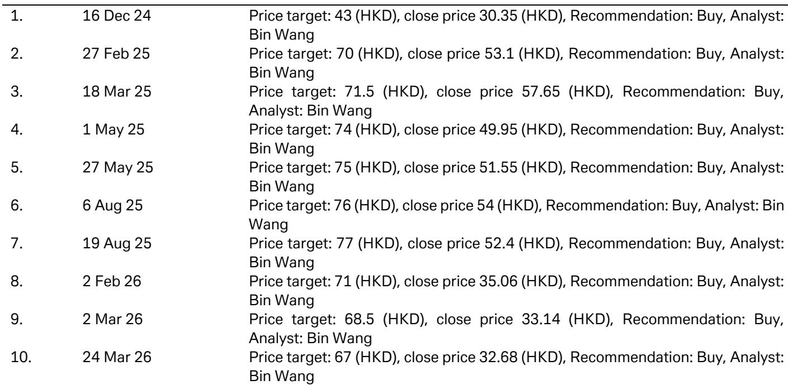
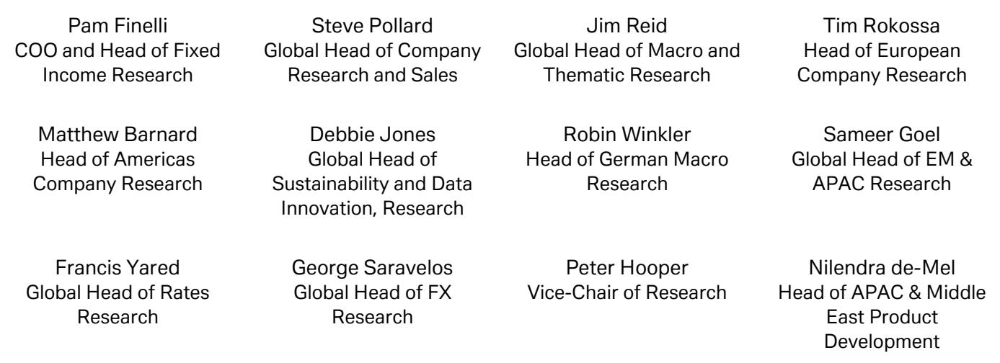

# DB：订单变化背景下小米天行系列定价策略观察，20万起与比亚迪竞争

一份由DB于7月8日发布的小米集团研究报告，其核心判断并非关于SU7或YU7的销量爬坡，而是指向一个更根本的战略动作：小米汽车正式进入插电式混合动力（PHEV）市场，推出全新“天行”系列。在纯电市场尚未完全站稳脚跟时，这一动作意味着什么？报告给出的信号是，小米正在寻找“绿地区域”的增量，而非简单扩充产品线。

报告指出，小米的“天行”系列将首先推出“昆仑N90”全尺寸七座SUV，随后是“昆仑N80”和“昆仑N70”。这些车型的设计目标非常明确：家庭出行和户外旅行。N90的第二排座椅可180度旋转，车顶可能提供升顶帐篷，这些细节透露了小米对特定使用场景的深度切入——它瞄准的不是日常通勤，而是周末出游、长途自驾和露营等“非典型”电动车使用场景。这与SU7和YU7主打高性能纯电的定位形成了清晰区隔。

> **KC评论：** 小米选择PHEV作为“天行”系列的动力形式，而非纯电，本身就是对当前市场现实的回应。纯电的补能焦虑在长途和户外场景中尤为突出，PHEV恰好解决了这个痛点。报告没有明说，但小米这一步，实际上是在用技术方案的选择来降低用户对“新品牌”的信任门槛。

## 1. 近期订单变化，或影响“天行”系列定价策略

报告引用了Thinkercar的数据：小米过去四周的周新增订单量分别为5000、7200、6100和5400辆，7月第一周环比有所调整至5400辆。这一数据本身值得关注——它表明SU7上市初期的订单热潮正在消退，市场进入了更常态化的竞争阶段。

DB的分析逻辑是：在订单变化的背景下，小米要实现其全年销量目标，就必须让“天行”系列承担起走量任务。而走量的最直接手段，就是定价。报告预计，“天行”系列PHEV的定价区间可能在20万至45万元人民币，与比亚迪“方程豹”品牌的“Ti7”和“Ti9”SUV竞争。但考虑到订单不确定性，不排除入门价格会低于20万元。

## 2. 供应链切换是降本的关键，但也是不确定性点

报告提到一个值得注意的细节：为了控制成本，小米为“天行”系列选择了欣旺达和中创新航作为电池供应商，而非SU7使用的宁德时代和比亚迪。这一供应链切换，直接解释了为何“天行”系列能够在定价上低于纯电版本。

但这也引出了一个报告尚未完全回答的关键问题：电池供应商的切换，是否会影响“天行”系列的产品一致性和口碑？欣旺达和中创新航在PHEV电池领域的供应经验，能否支撑小米对“户外旅行”场景所承诺的可靠性？对于小米这样一个新进入者而言，供应链的稳定性与品牌声誉之间的平衡，是一个必须面对的考验。

## 3. 报告留下的追问：PHEV是过渡方案，还是长期战略？

DB预测，“天行”系列在2026年全年有望交付15万辆PHEV车型。这个数字如果实现，将显著改变小米汽车的收入结构。但一个更深层的问题是：当纯电补能基础设施在未来几年内趋于完善，小米的PHEV战略是否会被自身“更快”的纯电技术路线所取代？

报告没有给出答案。它只是提供了判断框架：小米的“天行”系列，本质上是对“家庭”和“户外”两个场景的占位。如果这两个场景的需求被验证为长期且可持续，那么PHEV就不是权宜之计，而是一个差异化的产品矩阵。反之，它可能只是小米在纯电成熟前的“过渡性”收入来源。

对于关注小米汽车战略的读者而言，这份报告的价值不在于给出一个确定的结论，而在于提供了一个清晰的观察坐标：小米不再只是“电动轿车”的挑战者，它正在试图用PHEV打开一个更广阔的市场。而这一尝试的成效，将直接决定小米汽车未来几年的竞争位置。

For informational purposes only. Portions may be generated,translated,summarized,or edited with AI assistance based on source materials and may contain omissions or errors. Please verify independently. This is not investment,legal,tax,accounting,or other professional advice.

For informational purposes only. Portions may be generated,translated,summarized,or edited with AI assistance based on source materials and may contain omissions or errors. Please verify independently. This is not investment,legal,tax,accounting,or other professional advice.

