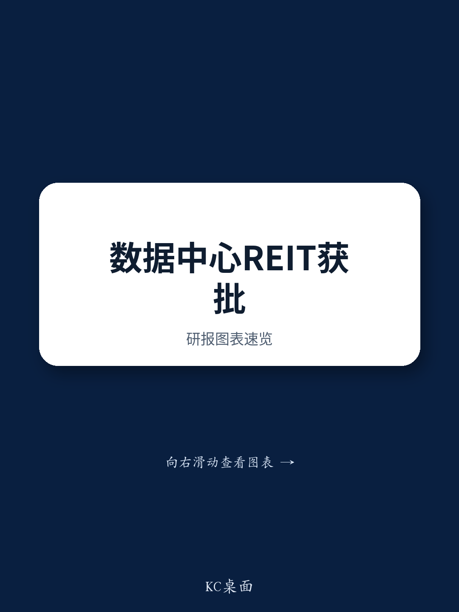

# GS：中国数据中心REIT审批窗口打开，但谁能赶上第一波存疑

中国数据中心行业迎来了一个关键的政策节点。7月8日，国家发改委正式上线基础设施REIT项目信息系统，并同步披露了两单已完成发改委审批、提到至相关部门的数据中心REIT项目。这标志着数据中心资产标的化从个案试点进入可复制的审批通道。

但这份由GS发布的报告真正值得关注的判断，不在于审批本身，而在于它揭示了一个分化：并非所有头部IDC公司都能在同一时间窗口内完成资产注入。谁先跑通“建设-运营-退出”的闭环，谁就能在资本效率上拉开差距。

## 1. 润泽科技已拿到实质进展，资产注入年内可期

报告确认，润泽科技位于廊坊的A7、A8数据中心已纳入现有南方润泽科技数据中心REIT（180901.SZ）的扩募资产池，计划发行规模约77亿元。这两栋楼合计IT容量78MW，利用率接近90%。GS预计，这次资产注入的估值约80亿元，润泽可获得超过60亿元的总对价。

对比来看，现有REIT载体中A18机楼的估值仅为45亿元（对应8亿元前期资本开支），这次扩募的资产体量更大，说明监管层对优质数据中心资产的认可度在提升。

> **KC评论：** 润泽的“建设-运营-转让”循环已经跑通。对于读者而言，这不仅是单个项目的退出，更意味着公司可以用更低的资本成本去获取新项目。报告里那张关于REIT估值与资本开支对比的表格值得细看，它揭示了资产周转效率如何转化为回报优势。

## 2. 万国数据的REIT进程面临更大的时间不确定性

与润泽形成对比的是，万国数据的项目并未出现在发改委提到列表中。GS指出，考虑到润泽从发改委审批到REIT挂牌耗时约5-6个月，万国数据要在年内完成资产注入的可见度明显偏低。

这一点与万国数据管理层近期更谨慎的措辞一致。报告特别提到，公司2026年的收入和EBITDA指引并未纳入REIT出表的假设。这意味着，若REIT无法在年内落地，万国数据的资产负债表不确定性和市场定价逻辑都需要重新评估。

> **KC评论：** 万国数据面临的不是资产质量问题，而是审批节奏。报告没有完全展开的一个变量是：如果REIT审批延迟，公司是否还有其他融资渠道来支撑其资本开支计划？这部分判断需要结合万国数据后续的债务结构和现金流披露来验证。

## 3. 报告尚未回答的关键问题：定价不确定性与REIT估值的博弈

GS在报告中承认，万国数据2026年二至四季度EBITDA增速预计持平，而同期收入增速约8%，主要受定价不确定性影响。这个细节值得注意：即便REIT通道打开，底层资产的租金回报率能否支撑理想的估值倍数，仍存在变数。

数据中心REIT的定价逻辑本质上取决于机柜租金走势和上架率预期。如果行业新增供给持续释放，租金承压，那么REIT的派息率可能低于市场隐含假设。报告没有完全展开这部分测算，但读者可以追问：当前市场对数据中心REIT的定价，是否充分反映了2026-2027年的供需格局？

## 4. 观察框架：从“谁能做REIT”转向“谁的资产更适合做REIT”

这份报告给行业观察者提供了一个更精细的分析框架。过去市场关注的是哪些公司有资格申报REIT，现在需要进一步追问三个问题：

第一，资产的运营成熟度。利用率90%以上的资产显然比仍在爬坡期的资产更适合装入REIT。第二，资产包的规模效应。单次发行规模越大，分摊的中介费用和运营成本越低。第三，母公司对REIT出表的依赖程度。润泽科技已经证明REIT可以成为常态化的资本工具，而万国数据则需要在审批窗口之外准备备用方案。

真正拉开差距的，不是REIT本身，而是谁能把资产运营能力转化为资本市场的定价权。

---

For informational purposes only. Portions may be generated,translated,summarized,or edited with AI assistance based on source materials and may contain omissions or errors. Please verify independently. This is not investment,legal,tax,accounting,or other professional advice.

For informational purposes only. Portions may be generated,translated,summarized,or edited with AI assistance based on source materials and may contain omissions or errors. Please verify independently. This is not investment,legal,tax,accounting,or other professional advice.

