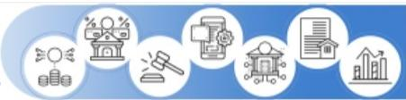
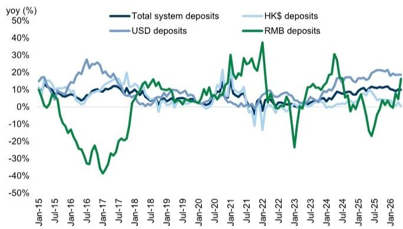

# 亚太地区银行：新措施深化市场互联互通；对香港银行构成结构性利好

亚洲财富增长
机遇、监管变化以及区域财富货币化进程的演变 了解更多 >

Melissa Kuang, CFA  
+65-6889-2869 |  
melissa.kuang@gs.com  
GS (Singapore) Pte

Wayne Wang  
+65-6889-2866 |  
wayne.q.wang@gs.com  
GS (Singapore) Pte

7月7日，中国人民银行与香港金融管理局及证券及期货事务监察委员会在峰会上联合宣布了11项措施，旨在进一步加强香港与内地之间的金融合作。在这11项措施中，有6项聚焦于支持香港的固定收益与货币市场，并提升香港与内地金融市场的互联互通；其余5项则旨在进一步发展香港的离岸人民币业务。

下文概述了所有举措，我们特别关注香港金融管理局人民币业务设施的扩展与优化，该设施预计于2026年7月10日生效。根据修订后的框架，设施规模将从2000亿元人民币增加至5000亿元人民币，同时可用的期限将在现有的1个月、3个月、6个月和1年期基础上，新增9个月、2年和3年期品种。

总体而言，我们认为这一揽子措施对我们覆盖范围内的香港银行（中银香港、东亚银行、渣打银行和HSBC控股）构成结构性利好。从更宏观的视角看，这些措施通过增加离岸人民币流动性和促进更多人民币业务活动，应能支持整个行业与人民币相关的资产负债表增长。在此背景下，我们认为中银香港可能是近期的主要受益者，因其作为香港相对少见人民币清算行的角色，这从今日（7月8日）的股价反应中可见一斑（中银香港收盘上涨5.2%，而我们覆盖的其他香港银行平均下跌0.5%）。香港金融管理局人民币业务设施的扩展应能支持更高的人民币清算和结算活动，并可能为中银香港带来费用方面的上行空间。此外，该公告应有助于缓解读者对近期内地跨境监管动态的一些担忧，并强化政策制定者持续致力于将香港发展为领先离岸人民币中心的承诺。

在此查看我们对中银香港的评级调整报告（迎来转折——资产质量风险缓解，资本回报成为焦点；上调至买入）

各项举措概要（更多详情请参阅随附演示文稿）：

1.  支持香港固定收益与货币电子交易平台的发展
2.  支持在香港推出香港交易及结算所有限公司5年期中国国债期货
3.  支持将“北向债券通”债券纳入香港期货交易所有限公司清算所及香港联交所期权清算所的可接受抵押品
4.  进一步优化“互换通”
5.  进一步优化并扩大“南向债券通”
6.  优化“北向债券通”的运作安排
7.  扩大并优化香港金融管理局的人民币业务设施
8.  探索引入7天期离岸人民币流动性的招标机制
9.  探索发行离岸人民币短期债务工具
10. 推动发展印度尼西亚卢比与离岸人民币之间的双边货币交易框架
11. 向银行发布良好实践以促进人民币采用

图表1：香港体系人民币存款同比增速呈现回升迹象  
  
截至2026年5月数据

## 附录：信息披露

## 关于Reg AC

我们，Melissa Kuang, CFA 和 Wayne Wang，特此证明本报告中表达的所有观点准确反映了我们个人对相关公司及其证券的看法。我们还证明，我们的薪酬中没有任何部分直接或间接与本报告中表达的具体建议或观点相关。

除非另有说明，本报告封面所列的个人均为GS全球投资研究部门的分析师。

撰稿人：Melissa Kuang, CFA GS (Singapore) Pte, Wayne Wang GS (Singapore) Pte。

除非另有说明，本报告撰稿人披露中列出的个人均为GS全球投资研究部门的分析师。

## GS因子概况

GS因子概况通过将股票的关键属性与市场（即我们的评级股票池）及其行业同行进行比较，提供投资背景信息。所描绘的四个关键属性是：增长、财务回报、估值倍数和综合指标（增长、财务回报和估值倍数的复合指标）。增长、财务回报和估值倍数是通过对每只股票的特定指标使用标准化排名计算得出的。然后将这些指标的标准化排名进行平均，并转换为相关属性的百分位数。每个指标的具体计算可能因财年、行业和地区而异，但标准方法如下：

增长基于股票的前瞻性销售增长、EBITDA增长和每股收益增长（对于金融股，仅基于每股收益和销售增长），较高的百分位数表示增长较高的公司。财务回报基于股票的前瞻性净资产回报表现、已动用资本回报率和现金回报率（对于金融股，仅基于净资产回报表现），较高的百分位数表示财务回报较高的公司。估值倍数基于股票的前瞻性市盈率、市净率、股息率、企业价值/EBITDA、企业价值/自由现金流和企业价值/债务调整后现金流（对于金融股，仅基于市盈率、市净率和股息率），较高的百分位数表示交易倍数较高的股票。综合百分位数计算为增长百分位数、财务回报百分位数和（100% - 估值倍数百分位数）的平均值。

财务回报和估值倍数使用GS分析师对未来至少三个季度后的财年末预测。增长使用对未来至少七个季度后的财年输入数据，与未来至少三个季度后的财年进行比较（所有指标均基于每股数据）。

有关我们如何计算GS因子概况的更详细说明，请联系您的GS代表。

## 并购排名

在我们的全球覆盖范围内，我们使用并购框架审视股票，同时考虑定性因素和定量因素（可能因行业和地区而异），以纳入某些公司可能被收购的可能性。然后，我们分配一个并购排名，作为对我们评级覆盖范围内的公司进行评分的方法，从1到3，其中1表示公司成为收购目标的可能性高（30%-50%），2表示可能性中等（15%-30%），3表示可能性低（0%-15%）。对于排名为1或2的公司，根据我们的标准部门指引，我们将并购组成部分纳入我们的目标价。并购排名3被视为不重要，因此不计入我们的目标价，并且可能在研究中讨论或不讨论。

## Quantum

Quantum是GS的专有数据库，可提供详细的财务报表历史、预测和比率。它可用于对单一公司进行深入分析，或比较不同行业和市场的公司。

## 信息披露

## 定价信息

中银香港（控股）（港币45.42元），东亚银行（港币13.05元），HSBC控股（港币151.90元），渣打银行（港币221.00元）

## 评级/投资银行关系分布

GS投资研究全球股票覆盖范围

<table><tr><td rowspan="2"></td><td colspan="3">评级分布</td><td colspan="3">投资银行关系</td></tr><tr><td>买入</td><td>持有</td><td>卖出</td><td>买入</td><td>持有</td><td>卖出</td></tr><tr><td>全球</td><td>50%</td><td>34%</td><td>16%</td><td>65%</td><td>60%</td><td>45%</td></tr></table>

截至2026年4月1日，GS全球投资研究对3,074只股票进行了投资评级。GS将股票分配为各区域投资清单上的买入和卖出；未如此分配的股票被视为中性。就FINRA规则要求的上述披露而言，此类分配等同于买入、持有和卖出。请参阅下文“评级、覆盖范围及相关定义”。投资银行关系图表反映了在过去十二个月内，GS为其提供投资银行服务的每个评级类别中标的公司的百分比。

## 监管披露

## 美国法律法规要求的披露

请参阅上述针对本报告提及的公司的特定监管披露，以了解以下任何要求的披露：待定交易中的经理或联合经理；1%或以上的所有权；特定服务的报酬；客户关系类型；先前期间的公开募股管理/联合管理；董事职位；对于股票，做市和/或专家角色。GS可能作为本报告讨论的发行人的债务证券（或相关衍生品）的本金进行交易或可能进行交易。

以下是额外要求的披露：所有权和重大利益冲突：GS政策禁止其分析师、向分析师报告的专业人员及其家庭成员持有分析师覆盖范围内任何公司的证券。分析师薪酬：分析师的薪酬部分基于GS的盈利能力，其中包括投资银行收入。分析师作为高管或董事：GS政策通常禁止其分析师、向分析师报告的人员或其家庭成员担任分析师覆盖范围内任何公司的高管、董事或顾问。非美国分析师：非美国分析师可能不是GS & Co. LLC的关联人士，因此可能不受FINRA规则2241或FINRA规则2242关于与标的公司沟通、公开露面以及交易分析师所覆盖证券的限制。

## 美国以外司法管辖区法律法规要求的额外披露

以下披露是所指示司法管辖区要求的披露，除非已根据美国法律法规在上文作出。澳大利亚：GS Australia Pty Ltd及其关联公司不是澳大利亚的授权存款机构（该术语在1959年银行法（联邦）中定义），不提供银行服务，也不在澳大利亚开展银行业务。除非GS另有约定，本研究及其任何访问权限仅面向澳大利亚公司法意义上的“批发客户”。在编制研究报告时，GS Australia全球投资研究部门的成员可能会参加由其研究报告所涉及的公司和其他实体主办或组织的实地考察和其他会议。在某些情况下，如果GS Australia认为在实地考察或会议的具体情况下适当且合理，此类实地考察或会议的费用可能部分或全部由相关发行人承担。如果本文档内容包含任何金融产品建议，则仅为一般性建议，由GS在未考虑客户的目标、财务状况或需求的情况下编制。客户在根据任何此类建议采取行动之前，应考虑该建议是否适合其自身的目标、财务状况和需求。某些GS Australia和New Zealand的利益披露声明以及GS的澳大利亚卖方研究独立性政策声明副本可在以下网址获取：https://www.goldmansachs.com/disclosures/australia-new-zealand/index.html。巴西：有关CVM第20号决议的披露信息可在以下网址获取：https://www.gs.com/worldwide/brazil/area/gir/index.html。在适用的情况下，根据CVM第20号决议第20条的定义，本研究报告内容的主要负责分析师（巴西注册分析师）为本报告开头指定的第一作者，除非文本末尾另有说明。加拿大：此信息仅供您参考，在任何情况下均不应被视为GS & Co. LLC为在加拿大购买证券而向加拿大证券购买者发出的广告、要约或招揽。GS & Co. LLC未在加拿大任何司法管辖区根据适用的加拿大证券法注册为交易商，通常不被允许交易加拿大证券，并且可能被禁止在加拿大某些司法管辖区出售某些证券和产品。如果您希望在加拿大交易任何加拿大证券或其他产品，请联系GS Canada Inc.（GS Group Inc.的关联公司）或其他注册的加拿大交易商。香港：有关本研究中提及的所覆盖公司证券的更多信息，可向GS (Asia) L.L.C.索取。印度：有关本研究中提及的标的公司或公司的更多信息，可从GS (India) Securities Private Limited获取，研究分析师 – SEBI注册号INH000001493，地址：10th Floor, Ascent-Worli, Sudam Kalu Ahire Marg, Worli, Mumbai-400 025, India，企业识别号U74140MH2006FTC160634，电话+91 22 6616 9000，传真+91 22 6616 9001。GS可能实益拥有本研究报告提及的标的公司或公司1%或以上的证券（该术语在1956年印度证券合同（监管）法第2(h)条中定义）。SEBI的注册和NISM的认证绝不保证中介机构的业绩，也不向读者提供任何回报保证。GS (India) Securities Private Limited的合规官和读者投诉联系详情、年度合规审计报告副本以及其他相关信息和披露可在此链接找到：https://www.goldmansachs.com/worldwide/india/research-analyst。日本：见下文。韩国：除非GS另有约定，本研究及其任何访问权限仅面向金融服务和资本市场法意义上的“专业读者”。有关本研究中提及的标的公司或公司的更多信息，可从GS (Asia) L.L.C.首尔分行获取。新西兰：GS New Zealand Limited及其关联公司不是新西兰的“注册银行”或“存款接受者”（定义见1989年新西兰储备银行法）。除非GS另有约定，本研究及其任何访问权限面向“批发客户”（定义见2008年金融顾问法）。某些GS Australia和New Zealand的利益披露声明副本可在以下网址获取：https://www.goldmansachs.com/disclosures/australia-new-zealand/index.html。俄罗斯：在俄罗斯联邦分发的研究报告不被定义为俄罗斯法律中的广告，而是信息和分析，其主要目的不是推广产品，并且不提供俄罗斯评估活动法律意义上的评估。研究报告不构成俄罗斯法律法规定义的个人化研究交流，不针对特定客户，并且在未分析客户财务状况、投资概况或风险状况的情况下编制。GS不对客户或任何其他人基于本研究可能做出的任何投资决策承担责任。新加坡：GS (Singapore) Pte.（公司编号：198602165W），受新加坡金融管理局监管，对本研究承担法律责任，如有任何与本相关或由此产生的问题，应与其联系。台湾：此材料仅供参考，未经许可不得转载。读者应仔细考虑自身的投资风险。投资结果由个人读者负责。英国：在英国被归类为零售客户（该术语在金融行为监管局规则中定义）的人士，应结合先前GS关于本报告所提及的所覆盖公司的报告阅读本研究，并应参考GS International已发送给他们的风险警告。这些风险警告的副本以及本报告中使用的某些金融术语的词汇表，可向GS International索取。

欧盟和英国：关于欧盟委员会授权条例（EU）（2016/958）第6(2)条（包括该授权条例在英国脱离欧盟和欧洲经济区后转化为英国国内法律和法规）中关于研究交流或其他建议或暗示投资策略的信息客观呈现的技术安排以及特定利益或利益冲突迹象披露的技术标准的信息，可在以下网址获取：https://www.gs.com/disclosures/europeanpolicy.html，其中阐述了与投资研究相关的利益冲突管理欧洲政策。

日本：GS Japan Co., Ltd.是一家金融工具交易商，在关东财务局注册，注册号为Kinsho 69，并且是日本证券交易商协会、日本金融期货协会、第二类金融工具交易商协会和日本投资管理协会的成员。股票买卖需支付与客户预先确定的佣金加上消费税。有关日本证券交易所、日本证券交易商协会或日本证券金融公司要求的任何适用披露，请参阅公司特定披露。

## 评级、覆盖范围及相关定义

买入（B），中性（N），卖出（S）分析师推荐股票作为买入或卖出，以纳入各区域投资清单。被分配为投资清单上的买入或卖出取决于股票相对于其覆盖范围的总回报潜力。任何未被分配为投资清单上的买入或卖出且具有有效评级（即，不是评级暂停、未评级、早期生物技术、覆盖暂停或未覆盖的股票）的股票被视为中性。每个区域管理区域信念清单，这些清单选自各自区域投资清单上的报告评级股票，代表侧重于总回报潜力大小和/或在其各自覆盖范围内实现回报的可能性的研究交流。此类信念清单中股票的添加或移除由每个相应区域的投资审查委员会或其他指定委员会管理，并不代表分析师对此类股票的投资评级发生变化。

总回报潜力代表当前股价与目标价之间的上行或下行差异，包括在目标价相关时间范围内预期支付或预计的所有股息。所有覆盖的股票都需要目标价。总回报潜力、目标价和相关时间范围在每份添加或重申投资清单成员资格的报告中有说明。

覆盖范围：每个覆盖范围内的所有股票列表可按主要分析师、股票和覆盖范围在以下网址获取：https://www.gs.com/research/hedge.html。

未评级（NR）。当GS在涉及该公司的合并或战略交易中担任顾问角色时，当由于GS参与交易而存在法律、监管或政策限制时，以及在某些其他情况下，根据GS政策，投资评级、目标价和盈利预测（如相关）将被移除。早期生物技术（ES）。当该公司既没有通过II期临床试验的药物、治疗或医疗设备，也没有分销后II期药物、治疗或医疗设备的许可时，根据GS政策，不分配投资评级和目标价。评级暂停（RS）。GS已暂停对该股票的投资评级和目标价，因为没有足够的基本面基础来确定投资评级或目标价。先前的投资评级和目标价（如有）不再对该股票有效，不应依赖。覆盖暂停（CS）。GS已暂停对该公司的覆盖。未覆盖（NC）。GS未覆盖该公司。

## 全球产品；分发实体

GS全球投资研究为GS客户在全球范围内制作和分发研究产品。位于全球GS办公室的分析师对行业和公司以及宏观经济、货币、大宗商品和投资组合策略进行研究。本研究由以下实体分发：在澳大利亚由GS Australia Pty Ltd（ABN 21 006 797 897）分发；在巴西由GS do Brasil Corretora de Títulos e Valores Mobiliários S.A.分发；GS巴西公共沟通渠道：0800 727 5764 和/或 contatogoldmanbrasil@gs.com。工作日（节假日除外），上午9点至下午6点。GS巴西公众沟通渠道：0800 727 5764 和/或 contatogoldmanbrasil@gs.com。营业时间：周一至周五（节假日除外），上午9点至下午6点；在加拿大由GS & Co. LLC分发；在香港由GS (Asia) L.L.C.分发；在印度由GS (India) Securities Private Ltd.分发；在日本由GS Japan Co., Ltd.分发；在韩国由GS (Asia) L.L.C.首尔分行分发；在新西兰由GS New Zealand Limited分发；在俄罗斯由OOO GS分发；在新加坡由GS (Singapore) Pte.（公司编号：198602165W）分发；在美国由GS & Co. LLC分发。GS International已批准本研究在英国的分发。

GS International（“GSI”），由审慎监管局授权并由金融行为监管局和审慎监管局监管，已批准本研究在英国的分发。

欧洲经济区：GS Bank Europe SE（“GSBE”）是一家在德国注册的信贷机构，在单一监管机制下，接受欧洲中央银行的直接审慎监管，并在其他方面接受德国联邦金融监管局和德国联邦银行的监管，并在欧洲经济区内分发研究。

## 一般披露

本研究仅供我们的客户使用。除与GS相关的披露外，本研究基于我们认为可靠的当前公开信息，但我们不保证其准确或完整，也不应依赖于此。本文所含信息、意见、估计和预测截至本文日期，如有更改，恕不另行通知。我们力求适时更新我们的研究，但各种法规可能阻止我们这样做。除某些定期发布的行业报告外，大部分报告根据分析师的判断不定期发布。

GS开展全球全方位服务、综合性的投资银行、投资管理和经纪业务。我们与全球投资研究所覆盖的相当大比例的公司存在投资银行和其他业务关系。GS & Co. LLC，美国经纪交易商，是SIPC的成员（https://www.sipc.org）。

我们的销售人员、交易员和其他专业人士可能会向我们的客户和自营交易部门提供口头或书面的市场评论或交易策略，这些评论或策略可能反映与本研究中表达的观点相反的意见。我们的资产管理业务、自营交易部门和投资业务可能做出与本研究中表达的建议或观点不一致的投资决策。

本报告中指定的分析师可能不时与我们的客户（包括GS销售人员和交易员）讨论，或可能在本报告中讨论，涉及可能对本报告讨论的股票市场价格产生近期影响的催化剂或事件的交易策略，这种影响可能在方向上与分析师的已发布目标价预期相反。任何此类交易策略都不同于且不影响分析师对此类股票的基本股票评级，该评级反映了股票相对于其覆盖范围的总回报潜力，如本文所述。

我们及我们的关联公司、高级职员、董事和员工可能不时持有本研究中提及的任何证券或衍生品的多头或空头头寸，作为本金进行交易，并买入或卖出，除非法规或GS政策禁止。

在GS组织的会议上，第三方演讲者（包括来自GS其他部门的个人）所持观点不一定反映全球投资研究的观点，也不是GS的官方观点。

本文引用的任何第三方，包括任何销售人员、交易员和其他专业人士或其家庭成员，可能持有与本文指定分析师表达的观点不一致的所提及产品的头寸。

本研究不构成在任何司法管辖区出售或购买任何证券的要约或招揽，如果此类要约或招揽在该司法管辖区是非法的。它不构成个人建议，也未考虑个别客户的具体投资目标、财务状况或需求。客户应考虑本研究中的任何建议或推荐是否适合其特定情况，并在适当时寻求专业建议，包括税务建议。本研究中提及的投资的价格和价值以及从中获得的收入可能会波动。过往表现并非未来表现的指引，未来回报不保证，且可能发生原始资本损失。汇率波动可能对某些投资的价值或价格或从中获得的收入产生不利影响。

某些交易，包括涉及期货、期权和其他衍生品的交易，会产生重大风险，并不适合所有读者。读者应审查当前的期权和期货披露文件，这些文件可从GS销售代表处或以下网址获取：https://www.theocc.com/about/publications/character-risks.jsp 和 https://www.goldmansachs.com/disclosures/cftc_fcm_disclosures。在要求多次买卖期权的策略（如价差）中，交易成本可能很高。将根据要求提供支持性文件。

全球投资研究提供的不同服务级别：GS全球投资研究向您提供的服务级别和类型可能与向GS内部和其他外部客户提供的服务级别和类型不同，具体取决于多种因素，包括您个人对沟通频率和方式的偏好、您的风险状况和投资重点及视角（例如，市场范围、特定行业、长期、短期）、您与GS整体客户关系的规模和范围，以及法律和监管限制。例如，某些客户可能要求在特定证券的研究发布时收到通知，某些客户可能要求将分析师基础分析所依据的特定数据（这些数据可在我们的内部客户网站上获取）通过数据馈送或其他方式以电子方式交付给他们。对分析师的基础研究观点（例如，评级、目标价或对股票盈利预测的重大变更）的任何更改，都不会在通过电子方式向我们的内部客户网站广泛发布研究报告或以其他必要方式向所有有权接收此类报告的客户传达此类信息之前，传达给任何客户。

所有研究报告同时通过电子方式发布到我们的内部客户网站，并同时向所有客户提供。并非所有研究内容都会重新分发给我们的客户或提供给第三方聚合商，GS也不对第三方聚合商重新分发我们的研究负责。对于与一只或多只证券、市场或资产类别相关的研究、模型或其他数据（包括相关服务），请联系您的GS代表或访问 https://research.gs.com。

披露信息也可在 https://www.gs.com/research/hedge.html 获取，或联系研究合规部，地址：200 West Street, New York, NY 10282。

## © 2026 GS.

您仅可为自己使用而存储、显示、分析、修改、重新格式化及打印通过本服务向您提供的信息。未经GS明确书面同意，您不得转售或逆向工程此信息以计算或开发任何用于披露和/或营销的指数，或创建任何其他衍生作品或商业产品、数据或服务。未经GS明确书面同意，您不得以任何格式向任何第三方发布、传输或以其他方式复制此信息的全部或部分内容。前述限制包括但不限于，使用、提取、下载或检索此信息的全部或部分内容，以训练或微调机器学习或人工智能系统，或作为任何此类系统的提示或输入来提供或复制此信息的全部或部分内容。
