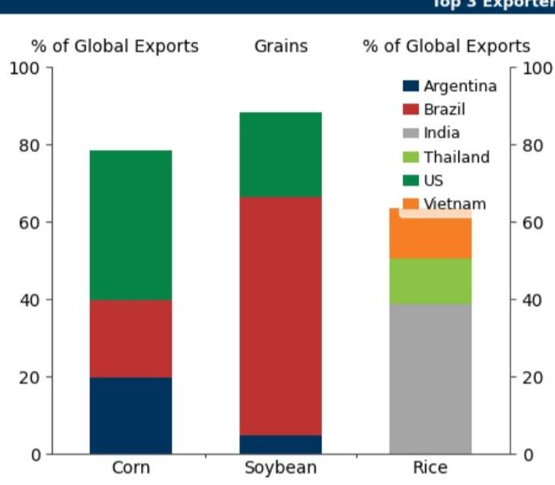
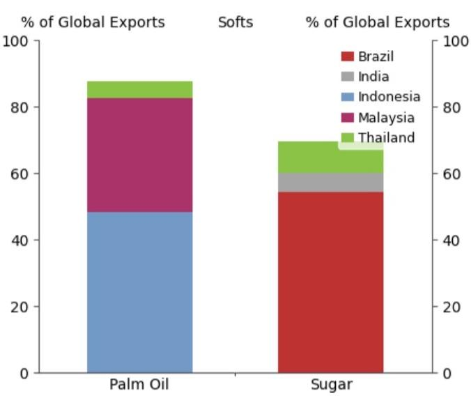
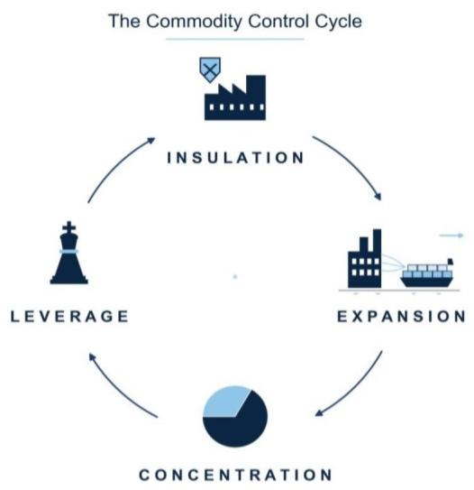
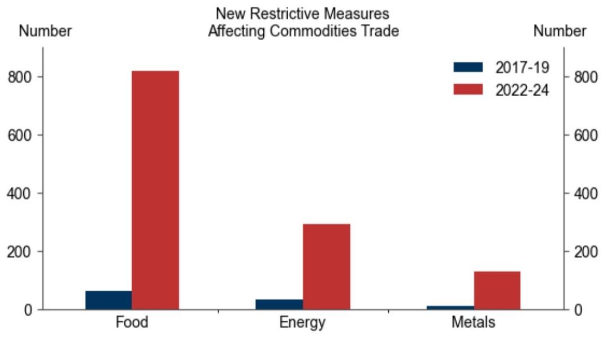
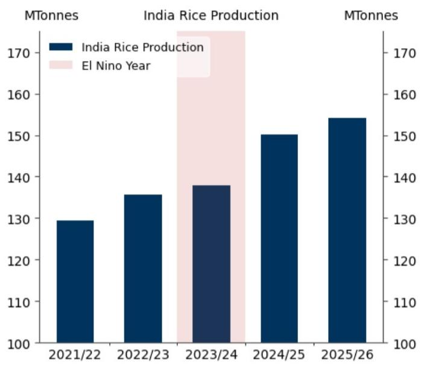
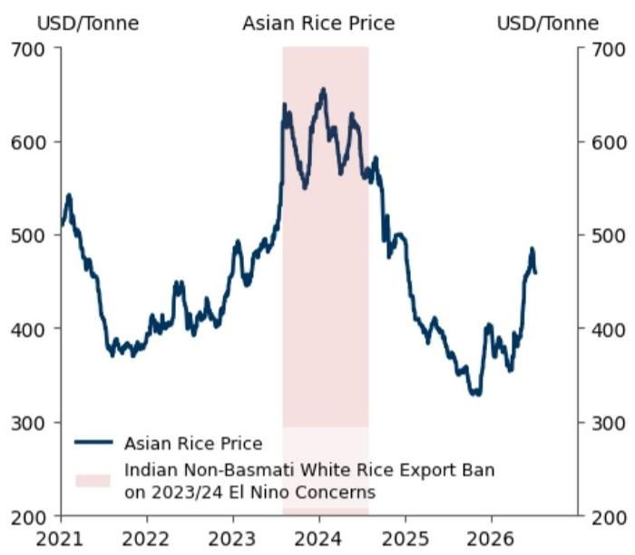
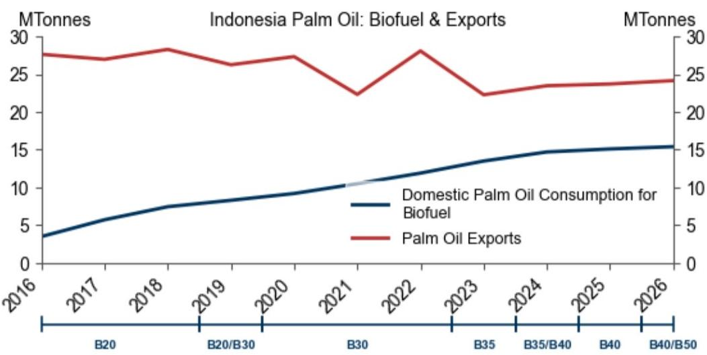
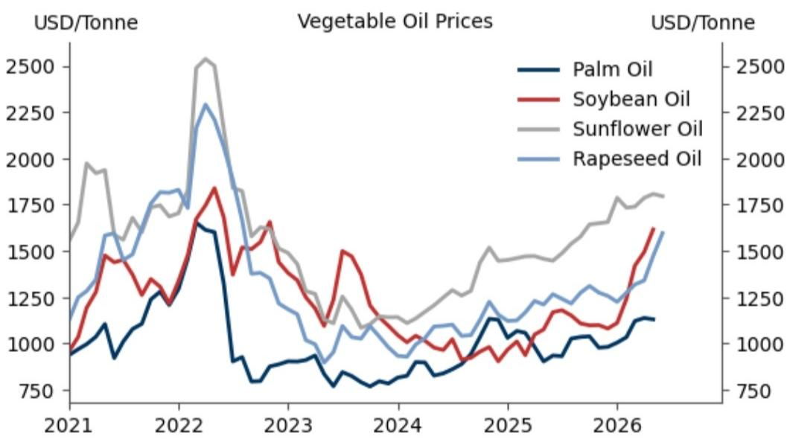
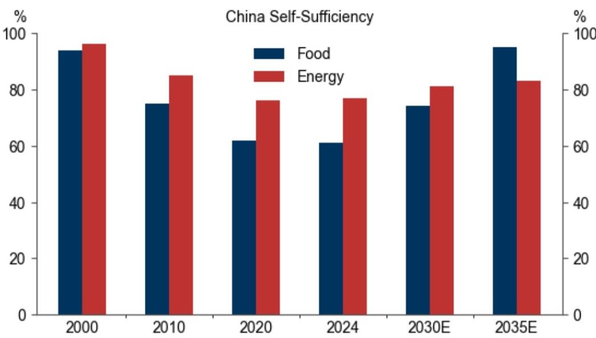
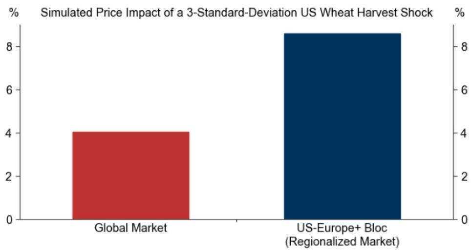

# 农业市场观察：粮食与能源安全政策对农产品价格的影响

全球农产品供应在地理上高度集中。在大豆、玉米、大米、糖和棕榈油等关键作物中，前三大出口国占全球贸易量的60-90%，这使得农业市场极易受到局部天气、地缘政治或政策变化的影响。

由于主要农产品出口国越来越多地通过出口限制和生物燃料政策来优先保障国内粮食和能源安全，即使是轻微的供应波动——或对波动的担忧——也可能引发减少可出口供应的政策。在高度集中的市场中，由此导致的出口供应减少可能远大于最初的生产波动，从而放大价格波动。依赖进口的国家可能通过增加储备和追求更高的自给率来应对，通常接受更高的国内生产成本以换取供应安全。虽然这些措施最终旨在提高本地韧性，但它们也分割了贸易，降低了市场流动性，并增加了价格对未来波动的敏感性。

我们认为，保护主义政策应对的风险是农产品价格和农业波动性的一个关键上行风险来源，因为三个近期的供应担忧可能引发预防性措施，即使潜在的波动最终被证明是有限的。

☐ 首先，厄尔尼诺现象已经出现，有63%的概率发展为“超级”厄尔尼诺。由于大米等主食以及糖和棕榈油等用于生物燃料的作物的许多主要出口国集中在历史上在厄尔尼诺事件期间天气较为不利的地区，即使是轻微的天气波动——或对天气波动的担忧——也可能引发预防性的出口限制。

☐ 其次，2026年上半年能源价格上涨以及对燃料安全的担忧可能促使政府提高生物燃料掺混要求，进一步将作物从出口市场转向国内燃料生产。

☐ 第三，在主要氮肥进口国为下半年种植做准备的关键第三季度采购季，化肥市场仍然面临霍尔木兹海峡再次出现中断的风险。

作者感谢我们的商品研究团队实习生Samuel Jonsson对本报告的重大贡献。

## 按商品划分的前三大出口国

## 粮食与能源安全政策对农产品价格的风险

全球农产品供应在地理上高度集中。在大豆、玉米、大米、糖和棕榈油等关键作物中，前三大出口国占全球贸易量的60-90%（图表1），这使得农业市场极易受到局部天气、地缘政治和政策变化的影响。

图表1：全球农产品供应在地理上高度集中

数据样本为2025年。

来源：美国农业部，GS全球研究

与我们的商品控制周期框架一致，集中供应增加了中断风险，因为主导生产国可以利用出口作为杠杆来源。反过来，高中断风险鼓励各国通过保护主义政策来保护自己免受外部冲击（图表2）。虽然这些政策可能提高国内韧性，但它们也分割了全球市场，减少了交易流动性，并可能增加价格波动。

图表2：与我们的商品控制周期框架一致，集中供应增加了中断风险

来源：GS全球研究

自2022年以来，商品市场的保护主义措施有所增加，这很可能反映了疫情、2021年电力短缺以及地缘政治事件后粮食和能源市场中断的教训。保护主义措施的增加在农业领域最为显著，因为粮食的基本属性使得供应安全可能成为政治优先事项（图表3）。

图表3：保护主义措施的增加在农业领域最为显著

来源：全球贸易预警，GS全球研究

例如，印度（约占全球大米出口的40%）在2023年厄尔尼诺担忧之前对非巴斯马蒂大米出口实施了预防性禁令，尽管国内产量最终证明具有韧性，这推动了亚洲大米价格的急剧上涨（图表4）。¹ 最近，印度因对今年潜在“超级”厄尔尼诺的担忧而引入了糖出口限制。² 因此，即使是轻微的供应冲击也可能从全球贸易中移除不成比例的数量，并产生远大于潜在物理波动本身所导致的价格变动。

图表4：在2023年厄尔尼诺担忧之前，印度实施了预防性大米出口禁令，尽管国内产量最终证明具有韧性

泰国白米5%是亚洲大米价格的基准价格。

来源：美国农业部，彭博，GS全球研究

能源安全问题也可能通过生物燃料政策收紧粮食市场。更高的生物燃料掺混要求可能通过将大豆、糖、玉米、油菜籽和棕榈油转向国内燃料生产来减少可出口的作物供应。2016年至2026年间，印度尼西亚（约占全球可交易棕榈油的50%）将其国内生物燃料掺混要求从20%提高到40-50%，而其毛棕榈油产量由于土地限制和单产停滞仅温和增长（图表5）。生物燃料消费的急剧增加直接减少了该国的可出口棕榈油盈余，收紧了全球植物油市场，并提高了植物油综合体的价格下限，因为消费者从历史上一直是低成本植物油的产品转向替代品（图表6）。

图表5：生物燃料消费的急剧增加直接减少了该国的可出口棕榈油盈余...

BXX表示XX%的生物柴油掺混要求。
来源：美国农业部，GS全球研究

图表6：...提高了植物油综合体的价格下限

全球基准价格：BMD毛棕榈油，CBOT豆油期货，黑海葵花籽油FOB，欧洲菜籽油FOB荷兰工厂
来源：国际货币基金组织，GS全球研究

依赖进口的国家可能通过保护其供应链来应对日益增加的中断风险。短期内，这可能采取增加储备的形式。图表7显示，相对于其消费份额，在全球商品储备中占有的份额不成比例地大，这很可能反映了建立国内供应缓冲的深思熟虑策略。长期来看，这可能涉及旨在提高国内产量和减少进口依赖的政策，即使生产成本更高。

图表7：在全球作物库存中占有很大份额

2025/26年度在全球期末库存和消费中的份额。
来源：美国农业部，GS全球研究

粮食安全被反复强调为核心国家利益，强调“中国人的饭碗要牢牢端在自己手中”。³ 与这一目标一致，我们的研究分析师预计，到2035年，粮食自给率将从目前的60%左右上升到90%左右——这意味着国内消费的几乎所有粮食都将在国内生产（图表8）。实现这一自给率需要通过最低价格、补贴、土地保护政策以及定期限制化肥出口以优先保障国内农业来支持国内生产。与从巴西和美国的进口相比，大部分粮食生产发生在成本相对较高的土地上，这意味着愿意接受更高的生产成本以换取更大的粮食安全。印度也遵循类似的粮食安全方法，通过谷物农民最低支持价格、国家化肥采购计划和战略储备来实现。

图表8：我们的研究分析师预计，未来十年粮食和能源安全将继续加强

我们将自给率定义为国内表观消费中由国内生产满足的份额。更多信息请参阅我们的研究分析师出版物：中国农业：中国的粮食安全——朝着雄心勃勃的目标取得显著进展
来源：公司数据，国家统计局，农业农村部，粮农组织，美国农业部，万得，GS全球研究

虽然风险管理政策——包括对商品进口的关税、出口管制、国家支持的国内生产形式以及政府库存建设——最终旨在提高国内韧性，但它们也可能分割全球市场，减少交易流动性并提高价格波动。⁴ 我们估计，外部冲击（例如农业市场的气候变化冲击）的价格影响取决于其相对于吸收该冲击的市场规模；如果一个区域集团是全球市场的一半大小，那么相同的冲击产生的价格影响是全球市场的两倍（图表9）。⁵ 导致市场分割的措施因此可能产生与其管理中断风险的预期目标不同的结果。

图表9：冲击的价格影响取决于其相对于吸收该冲击的市场规模；如果一个区域集团是全球市场的一半大小，那么相同的冲击产生的价格影响是全球市场的两倍

来源：美国农业部，粮农组织，国际货币基金组织，Fally and Sayre (2019)，Alvarez et al. (2013)，GS全球研究

我们认为，保护主义政策应对的风险是农产品价格和农业波动性的一个关键上行风险来源，因为三个近期的供应担忧可能引发预防性措施，即使潜在的波动最终被证明是有限的。

首先，厄尔尼诺现象已经出现，有63%的概率发展为“超级”厄尔尼诺。由于大米等主食以及糖和棕榈油等用于生物燃料的作物的许多主要出口国集中在历史上在厄尔尼诺事件期间天气较为不利的地区，即使是轻微的天气波动——或对天气波动的担忧——也可能引发预防性的出口限制。

■ 其次，2026年上半年能源价格上涨以及对燃料安全的担忧可能促使政府提高生物燃料掺混要求，进一步将作物从出口市场转向国内燃料生产。

第三，在主要氮肥进口国为下半年种植做准备的关键第三季度采购季，化肥市场仍然面临霍尔木兹海峡再次出现中断的风险。

## 附录

## 分析师认证

我们，Lina Thomas和Daan Struyven，特此证明本报告中表达的所有观点准确反映了我们的个人观点，这些观点未受公司业务或客户关系考虑的影响。

除非另有说明，本报告封面所列的个人是GS全球研究部门的研究分析师。

撰稿作者：Lina Thomas GS & Co. LLC，Daan Struyven GS & Co. LLC。

除非另有说明，本报告撰稿作者披露中列出的个人是GS全球研究部门的研究分析师。

## 披露信息

## 监管披露

## 美国法律法规要求的披露

请参阅上述针对本报告提及公司的特定监管披露，了解以下任何要求的披露：待定交易中的经理或联合经理；1%或以上所有权；特定服务的报酬；客户关系类型；先前期间的已管理/联合管理公开发行；董事职位；对于股票证券，做市和/或专家角色。GS以自营身份交易或可能交易本报告讨论的发行人的债务证券（或相关衍生品）。

以下是额外的要求披露：所有权和重大利益冲突：GS政策禁止其分析师、向分析师报告的专业人员及其家庭成员持有分析师覆盖范围内任何公司的证券。分析师薪酬：分析师的薪酬部分基于GS的盈利能力，其中包括投资银行收入。分析师作为高管或董事：GS政策通常禁止其分析师、向分析师报告的人员或其家庭成员担任分析师覆盖范围内任何公司的高管、董事或顾问。非美国分析师：非美国分析师可能不是GS & Co. LLC的关联人员，因此可能不受FINRA规则2241或FINRA规则2242关于与主题公司沟通、公开露面以及交易分析师覆盖证券的限制。

美国以外司法管辖区法律和法规要求的额外披露

以下是相关司法管辖区要求的披露，除非已根据美国法律法规在上文作出。澳大利亚：GS Australia Pty Ltd及其关联公司不是澳大利亚的授权存款机构（该术语在1959年银行法（联邦）中定义），不在澳大利亚提供银行服务或开展银行业务。除非GS另有约定，本研究及其任何访问仅面向澳大利亚公司法含义内的“批发客户”。在制作研究报告时，GS Australia全球研究部门的成员可能参加作为其研究报告主题的公司和其他实体主办的地点访问和其他会议。在某些情况下，如果GS Australia认为在特定情况下与地点访问或会议相关是适当和合理的，此类地点访问或会议的费用可能部分或全部由相关发行人承担。如果本文档内容包含任何金融产品建议，则仅为一般性建议，由GS在未考虑客户目标、财务状况或需求的情况下编制。客户在根据任何此类建议采取行动前，应考虑该建议是否适合其自身目标、财务状况和需求。某些GS Australia和New Zealand利益披露以及GS澳大利亚卖方研究独立性政策声明的副本可在以下网址获取：https://www.goldmansachs.com/disclosures/australia-new-zealand/index.html。巴西：有关CVM第20号决议的披露信息可在https://www.gs.com/worldwide/brazil/area/gir/index.html获取。在适用的情况下，根据CVM第20号决议第20条定义，对本研究报告内容负主要责任的巴西注册分析师为本报告开头指定的第一作者，除非文本末尾另有说明。加拿大：此信息仅供您参考，在任何情况下均不应被解释为GS & Co. LLC为在加拿大购买证券以交易任何加拿大证券而进行的广告、要约或招揽。GS & Co. LLC未在加拿大任何司法管辖区根据适用的加拿大证券法注册为交易商，通常不被允许交易加拿大证券，并且可能被禁止在加拿大某些司法管辖区销售某些证券和产品。如果您希望在加拿大交易任何加拿大证券或其他产品，请联系GS Canada Inc.（GS Group Inc.的关联公司）或其他注册的加拿大交易商。香港：可根据要求从GS (Asia) L.L.C.获取本研究中提及的覆盖公司证券的进一步信息。印度：可从GS (India) Securities Private Limited获取本研究中提及的主题公司或公司的进一步信息，研究分析师 - SEBI注册号INH000001493，地址：10th Floor, Ascent-Worli, Sudam Kalu Ahire Marg, Worli, Mumbai-400 025, India，企业识别号U74140MH2006FTC160634，电话+91 22 6616 9000，传真+91 22 6616 9001。GS可能实益拥有本研究报告提及的主题公司或公司1%或以上的证券（该术语在1956年印度证券合同（监管）法第2(h)条中定义）。SEBI的注册和NISM的认证绝不保证中介机构的业绩或向读者提供任何回报保证。GS (India) Securities Private Limited的合规官和读者投诉联系详情、年度合规审计报告副本以及其他相关信息和披露可在以下链接找到：

https://www.goldmansachs.com/worldwide/india/research-analyst。日本：见下文。韩国：除非GS另有约定，本研究及其任何访问仅面向金融服务和资本市场法含义内的“专业读者”。可从GS (Asia) L.L.C.首尔分行获取本研究中提及的主题公司或公司的进一步信息。新西兰：GS New Zealand Limited及其关联公司不是新西兰的“注册银行”或“存款接受者”（定义见1989年新西兰储备银行法）。除非GS另有约定，本研究及其任何访问面向“批发客户”（定义见2008年金融顾问法）。某些GS Australia和New Zealand利益披露的副本可在以下网址获取：https://www.goldmansachs.com/disclosures/australia-new-zealand/index.html。俄罗斯：在俄罗斯联邦分发的研究报告不是俄罗斯立法定义的广告，而是不以产品推广为主要目的的信息和分析，不提供俄罗斯评估活动立法含义内的评估。研究报告不构成俄罗斯法律法规定义的个人化研究交流，不针对特定客户，并且在未分析客户财务状况、投资概况或风险概况的情况下编制。GS不对客户或任何其他人基于本研究可能做出的任何投资决策承担责任。新加坡：GS (Singapore) Pte.（公司编号：198602165W），受新加坡金融管理局监管，对本研究承担法律责任，如有任何与本相关的事宜，请联系该公司。台湾：此材料仅供参考，未经许可不得转载。读者应仔细考虑自身的投资风险。投资结果由个人读者负责。英国：在英国将被归类为零售客户的个人（该术语在金融行为监管局规则中定义）应结合先前关于本报告所涉覆盖公司的GS研究阅读本研究，并应参考GS International已发送给他们的风险警告。这些风险警告的副本以及本报告中使用的某些金融术语的词汇表可向GS International索取。

欧盟和英国：有关欧盟委员会授权条例（EU）（2016/958）补充欧洲议会和理事会条例（EU）第596/2014号（包括该授权条例在英国脱离欧盟和欧洲经济区后转化为英国国内法律和法规的情况）第6(2)条关于研究交流客观呈现的技术安排以及特定利益或利益冲突指示披露的技术标准的披露信息，可在https://www.gs.com/disclosures/europeanpolicy.html获取，该页面说明了与投资研究相关的利益冲突管理的欧洲政策。

日本：GS Japan Co., Ltd.是在关东财务局注册的金融工具交易商，注册号Kinsho 69，是日本证券交易商协会、日本金融期货协会、第二类金融工具公司协会和日本投资管理协会的成员。股票买卖需收取与客户预先确定的佣金加上消费税。有关日本证券交易所、日本证券交易商协会或日本证券金融公司要求的任何适用披露，请参阅公司特定披露。

## 全球产品；分发实体

GS全球研究为GS客户在全球范围内制作和分发研究产品。位于GS全球各办事处的分析师对行业和公司以及宏观经济、货币、商品和投资组合策略进行研究。本研究由以下机构分发：在澳大利亚由GS Australia Pty Ltd（ABN 21 006 797 897）分发；在巴西由GS do Brasil Corretora de Títulos e Valores Mobiliários S.A.分发；公共沟通渠道GS Brazil：0800 727 5764和/或contatogoldmanbrasil@gs.com。工作日（节假日除外），上午9点至下午6点。GS Brasil公众沟通渠道：0800 727 5764和/或contatogoldmanbrasil@gs.com。营业时间：周一至周五（节假日除外），上午9点至下午6点；在加拿大由GS & Co. LLC分发；在香港由GS (Asia) L.L.C.分发；在印度由GS (India) Securities Private Ltd.分发；在日本由GS Japan Co., Ltd.分发；在韩国由GS (Asia) L.L.C.首尔分行分发；在新西兰由GS New Zealand Limited分发；在俄罗斯由OOO GS分发；在新加坡由GS (Singapore) Pte.（公司编号：198602165W）分发；在美国由GS & Co. LLC分发。GS International已批准本研究在英国的分发。

GS International（“GSI”），由审慎监管局（“PRA”）授权并由金融行为监管局（“FCA”）和PRA监管，已批准本研究在英国的分发。

欧洲经济区：GS Bank Europe SE（“GSBE”）是在德国注册的信贷机构，在单一监管机制内，受欧洲中央银行直接审慎监管，并在其他方面受德国联邦金融监管局（Bundesanstalt für Finanzdienstleistungsaufsicht, BaFin）和德意志联邦银行监管，并在欧洲经济区内分发研究。

## 一般披露

本研究仅供我们的客户使用。除与GS相关的披露外，本研究基于我们认为可靠的当前公开信息，但我们不声明其准确或完整，且不应依赖于此。本文所含信息、意见、估计和预测截至本文日期，如有更改，恕不另行通知。我们寻求在适当时候更新我们的研究，但各种法规可能阻止我们这样做。除某些定期发布的行业报告外，大多数报告根据分析师的判断不定期发布。

GS开展全球全方位、综合性的投资银行、投资管理和经纪业务。我们与全球研究覆盖的相当大比例的公司有投资银行和其他业务关系。GS & Co. LLC，美国经纪交易商，是SIPC成员（https://www.sipc.org）。

我们的销售人员、交易员和其他专业人员可能向我们的客户和自营交易部门提供口头或书面的市场评论或交易策略，这些评论或策略反映的观点可能与本研究表达的观点相反。我们的资产管理部、自营交易部门和投资业务可能做出与本研究的建议或观点不一致的投资决策。

我们及我们的关联公司、高管、董事和员工可能不时持有本研究提及的证券或衍生品（如有）的多头或空头头寸，以自营身份进行交易，并买卖这些证券或衍生品，除非法规或GS政策另有禁止。

在GS组织的会议上归因于第三方演讲者（包括来自GS其他部门的个人）的观点不一定反映全球研究的观点，也不是GS的官方观点。

本文引用的任何第三方，包括任何销售人员、交易员和其他专业人员或其家庭成员，可能持有与本研究指定分析师表达的观点不一致的上述产品的头寸。

本研究侧重于跨市场、行业和板块的投资主题。它不试图区分我们描述的任何行业或板块内单个公司的前景或表现，也不提供对单个公司的分析。

本研究中与股票或信用证券或行业或板块内证券相关的任何交易建议反映了所讨论的投资主题，并非孤立地对任何此类证券的建议。

本研究不构成在任何司法管辖区出售或招揽购买任何证券的要约，如果此类要约或招揽在该司法管辖区将是非法的。它不构成个人建议，也未考虑个别客户的具体投资目标、财务状况或需求。客户应考虑本研究中的任何建议或推荐是否适合其特定情况，并在适当情况下寻求专业建议，包括税务建议。本研究中提及的投资的价格和价值以及从中获得的收入可能会波动。过往表现并非未来表现的指引，未来回报不保证，且可能发生原始资本损失。汇率波动可能对某些投资的价值或价格或从中获得的收入产生不利影响。

某些交易，包括涉及期货、期权和其他衍生品的交易，会产生重大风险，不适合所有读者。读者应查看当前的期权和期货披露文件，这些文件可从GS销售代表或以下网址获取：https://www.theocc.com/about/publications/character-risks.jsp 和 https://www.goldmansachs.com/disclosures/cftc_fcm_disclosures。在需要多次买卖期权的期权策略（如价差策略）中，交易成本可能很高。将根据要求提供支持文件。

全球研究提供的不同服务水平：GS全球研究向您提供的服务水平和类型可能与向GS内部和其他外部客户提供的服务水平和类型不同，具体取决于多种因素，包括您个人对接收沟通频率和方式的偏好、您的风险状况和投资重点及视角（例如，市场范围、特定板块、长期、短期）、您与GS整体客户关系的规模和范围，以及法律和监管限制。

例如，某些客户可能要求在特定证券的研究发布时收到通知，某些客户可能要求将分析师基础分析所依据的特定数据通过数据馈送或其他方式以电子方式传送给他们。分析师基础研究观点的任何变化（例如，评级、目标价格或对股票证券盈利预测的重大变化）将在通过电子方式向我们的内部客户网站广泛发布研究报告或以其他必要方式向所有有权接收此类报告的客户传达此类信息之前，不会传达给任何客户。

所有研究报告同时通过电子方式发布到我们的内部客户网站，向所有客户分发和提供。并非所有研究内容都会重新分发给我们的客户或提供给第三方聚合商，GS也不对第三方聚合商重新分发我们的研究负责。对于与一个或多个证券、市场或资产类别相关的研究、模型或其他数据（包括相关服务），请联系您的GS代表或访问https://research.gs.com。

披露信息也可在https://www.gs.com/research/hedge.html或联系研究合规部，地址：200 West Street, New York, NY 10282获取。

## © 2026 GS.

您仅可为自己使用而存储、显示、分析、修改、重新格式化及打印通过本服务向您提供的信息。未经GS明确书面同意，您不得转售或逆向工程此信息以计算或开发用于披露和/或营销的任何指数，或创建任何其他衍生作品或商业产品、数据或产品。未经GS明确书面同意，您不得以任何格式向任何第三方发布、传输或以其他方式复制此信息的全部或部分。前述限制包括但不限于使用、提取、下载或检索此信息的全部或部分来训练或微调机器学习或人工智能系统，或向任何此类系统提供或复制此信息的全部或部分作为提示或输入。
