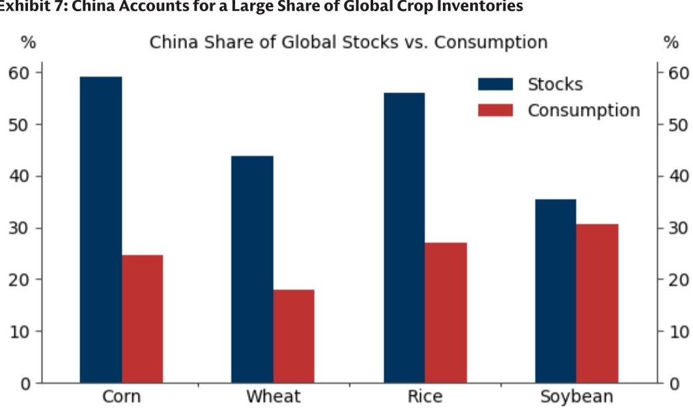

# 保护主义农业政策是作物价格波动的关键驱动因素，而非仅天气或冲突

全球农业系统比大多数市场参与者所认知的更为脆弱。在五种最关键的可贸易作物——大豆、玉米、大米、糖和棕榈油中，前三大出口国控制了全球贸易的60%至90%。这种地理集中造成了结构性脆弱性，远超商品分析师通常追踪的天气和产量风险。当少数国家主导可出口供应时，其国内政策决策可能比全球收成总量更为重要。市场低估的风险并非干旱或封锁，而是随之而来的政策反应。

一份全球研究机构的报告清晰地阐述了这一观点。作者认为，作物价格和农业波动性的主要上行风险来源并非物理性破坏本身，而是政府为应对真实或感知到的供应威胁而采取的保护主义措施。自2022年以来，保护主义行动在农业领域上升最为显著，因为食品的必需性使供应安全成为政治要务。印度在2023年对非巴斯马蒂大米出口实施的预防性禁令——尽管国内产量最终证明具有韧性，但在厄尔尼诺担忧之前就已实施——是典型例证。仅这一政策就推动了亚洲大米价格大幅上涨，远超任何实际作物歉收可能产生的影响。

这一点现在很重要，因为三个近期的供应担忧正在汇聚。厄尔尼诺现象已经出现，有63%的概率发展为“超级”厄尔尼诺。2026年上半年能源价格上涨可能促使政府提高生物燃料掺混比例，将作物从出口市场转向国内燃料生产。化肥市场在关键的第三季度采购季节仍面临霍尔木兹海峡再次中断的风险。即使这些风险中的每一个在物理影响上都有限，对其中任何一个风险的预防性政策反应都可能从全球贸易中移除不成比例的数量，并产生远超潜在破坏本身的价格波动。对于观察者而言，问题不在于冲击是否会发生，而在于全球农业的政策架构如何将每一次微小的震动放大为重大事件。

## 商品控制周期在集中度与保护主义之间形成自我强化循环

该报告引入了一个称为“商品控制周期”的框架，这是理解当前动态最具分析价值的视角。该周期运作如下：集中供应增加了中断风险，因为主导生产国可以将出口作为杠杆来源。高中断风险反过来鼓励各国通过保护主义政策使自己免受外部冲击。这些政策分割了全球市场，降低了贸易流动性，并增加了价格波动性。更高的波动性则进一步强化了采取更多保护主义措施的动机，因为依赖进口的国家试图缓冲自身免受日益不稳定的全球市场影响。

这并非理论构建。数据显示，自2022年以来，所有商品市场的保护主义措施都有所增加，但在农业领域增长最为显著。疫情、2021年的电力短缺，以及随后对食品和能源市场的干扰，都起到了催化剂作用。各国政府认识到，在压力时期不能依赖全球供应链，并据此采取了行动。结果是，本意旨在提高国内韧性的政策，反而使全球市场更加脆弱。

这对观察者而言意味着令人不安的启示。传统的商品价格模型侧重于供需平衡、库存和天气预报，却忽略了最重要的变量：政策干预的概率和幅度。当印度在2023年禁止大米出口时，尽管国内产量充足，它还是这样做了。该政策是预防性的，而非对实际短缺的反应。这意味着，即使在收成正常的年份，如果主导出口国的政治考量发生变化，价格也可能飙升。商品控制周期框架表明，此类变化正变得越来越频繁，而非减少。

## 生物燃料掺混比例是将可出口供应转向国内燃料生产的潜在机制

该报告对生物燃料政策的分析尤其有价值，因为它识别了一个渠道，通过该渠道，能源安全问题直接收紧食品市场。更高的生物燃料掺混比例通过将大豆、糖、玉米、油菜籽和棕榈油转向国内燃料生产，减少了可出口的作物供应。这一机制并非假设。在2016年至2026年间，印度尼西亚——约占全球可贸易棕榈油的50%——将其国内生物燃料掺混比例从20%提高到40-50%。同期，由于土地限制和产量停滞，毛棕榈油产量仅温和增长。生物燃料消费的急剧增加直接减少了该国的可出口棕榈油盈余。

其后果波及了整个植物油领域。随着印度尼西亚的可出口盈余萎缩，全球植物油市场收紧，抬高了所有替代品的价格底线。历史上依赖棕榈油作为低成本选择的消费者被迫转向豆油、菜籽油和葵花籽油，从而全面推高了价格。印度尼西亚的生物燃料政策不仅影响了棕榈油市场，还重构了整个植物油领域的定价动态。

这是标准商品模型难以捕捉的二级效应。该报告的框架表明，2026年能源价格上涨可能在其他主要生物燃料生产国引发类似动态。如果各国政府通过提高掺混比例来应对燃料安全问题，由此导致的作物从出口市场的转移可能是巨大的。关键见解在于，生物燃料政策并非与粮食安全政策分离的问题。它们是同一枚硬币的两面。能源安全问题通过强制性的生物燃料消费机制，转变为食品市场的中断。

## 依赖进口的国家通过建立战略储备和追求更高成本的自给自足来应对

该报告记录了依赖进口的国家如何适应农业市场碎片化的新现实。最明显的应对是战略储备。相对于其消费份额，中国在全球作物库存中占据了不成比例的巨大份额，这反映了建立国内供应缓冲的深思熟虑策略。这不是短期调整。相关研究预计，到2035年，中国的粮食自给率将从目前的60%左右上升到90%左右。实现这一目标意味着，几乎所有国内消费的食品都将在国内生产，即使生产成本显著更高。

这一策略的经济学值得仔细审视。与从巴西和美国进口相比，中国的大部分粮食生产发生在成本相对较高的土地上。愿意接受更高的生产成本以换取粮食安全，代表着该国农业政策框架的根本性转变。政策工具包括最低价格、补贴、土地保护政策，以及为优先保障国内农业而对化肥出口的定期限制。

印度也遵循类似的方法，对粮农采用最低支持价格、国家化肥采购计划和战略储备。报告指出，这些风险管理政策最终旨在提高国内韧性，但它们也可能分割全球市场，降低贸易流动性，并提高价格波动性。意想不到的后果是，旨在使各国免受外部冲击影响的相同政策，反而使全球市场更容易受到这些冲击的影响。当一个区域集团占全球市场一半规模时，与一个全球市场相比，同样的中断会产生两倍的价格影响。碎片化放大了波动性。

## 报告留下了关于政策升级速度和不可逆性的未解问题

尽管分析严谨，但该报告并未完全解决观察者需要回答的几个关键问题。第一个涉及政策升级的速度。商品控制周期被描述为一个自我强化的循环，但报告并未说明该循环收紧的速度有多快。这是一个在多年内逐渐展开的过程，还是单一冲击可能在数周内引发一连串保护主义措施？印度的大米出口禁令表明后者是可能的，但报告并未提供一个框架来预测此类连锁反应最可能发生的时间。

第二个未解问题涉及保护主义政策的不可逆性。一旦一个国家建立了国内生产能力和储备，它还会重新依赖全球市场吗？来自中国的证据表明不会。该国的自给率目标意味着其参与全球农业贸易的永久性减少。如果其他大型依赖进口的国家走同样的道路，可贸易作物的全球市场可能会结构性萎缩，从而提高价格中蕴含的波动性溢价。报告暗示了这种可能性，但并未对其长期影响进行建模。

第三个问题是关于农业保护主义与其他政策领域之间的相互作用。报告侧重于粮食和能源安全，但贸易政策、气候政策和地缘政治联盟呢？农业出口限制已成为地缘政治杠杆的工具，正如利用粮食供应作为影响力来源所证明的那样。报告并未探讨农业贸易的武器化如何可能加速碎片化进程。这些并非对分析的批评。它们是任何严肃的观察者都应该提出的自然后续问题。

## 应对农业政策风险的决策框架

对于试图将本报告见解付诸实践的观察者而言，一个结构化的决策框架至关重要。第一步是评估每个作物市场的集中度风险。报告提供了数据：主要作物的前三大出口国控制了全球贸易的60-90%。观察者应计算赫芬达尔-赫希曼指数或类似的集中度指标，用于其关注的每种作物。更高的集中度意味着更高的政策风险。

第二步是监测主导出口国的政治经济状况。哪些政府面临国内食品价格压力？哪些即将举行选举？哪些有使用出口限制作为政策工具的历史？印度2023年的大米出口禁令之前，公众对厄尔尼诺和国内大米价格的担忧就已存在。该政策事后看来是可预测的，但前提是关注政治信号，而不仅仅是天气数据。

第三步是测试投资组合对同时发生的政策冲击的承受能力。报告识别了三个近期触发因素：厄尔尼诺、推动生物燃料掺混比例的能源价格上涨，以及化肥供应中断。这些触发因素可能独立或组合激活。印度限制大米出口、印度尼西亚提高棕榈油生物燃料掺混比例、以及因霍尔木兹海峡中断导致化肥价格飙升的情景，将对多个作物市场产生复合效应。观察者应对政策风险的相关性进行建模，而不仅仅是物理供应风险。

第四步是识别结构性对冲。如果商品控制周期正在收紧，那么对稳定出口国的农业基础设施进行长期配置可能提供不对称的回报。同样，为依赖进口国家的国内生产提供农业投入品、物流或技术的公司，可能从自给自足趋势中受益。该报告未提供具体建议，但框架表明，赢家将是那些能够在政策比天气更重要的环境中游刃有余的人。

## 加入社区阅读完整报告并查看原始图表

此处呈现的分析仅触及完整报告内容的表面。原始文件包含详细图表，展示了农业供应的地理集中度、自2022年以来保护主义措施的上升、印度大米出口禁令对亚洲价格的影响、印度尼西亚棕榈油转向生物燃料生产，以及中国在全球作物库存中的不成比例份额。这些图表对于理解报告所识别趋势的规模至关重要。报告还完整包含了商品控制周期框架，并附有支持数据，展示了该周期在历史上的运作方式。对于希望构建自己的农业政策风险模型的观察者而言，基础数据和方法论是无价的。要获取完整分析和支持证据，请加入社区，那里提供完整报告和原始图表。

*仅供参考。部分内容可能基于源材料通过AI辅助生成、翻译、总结或编辑，可能存在遗漏或错误。请独立核实。这不构成任何专业建议。*

仅供参考。部分内容可能基于源材料通过AI辅助生成、翻译、总结或编辑，可能存在遗漏或错误。请独立核实。这不构成任何专业建议。

