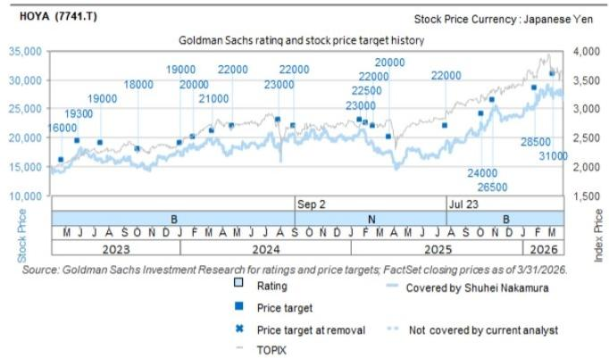

# Japan Electronic Components: Expert call: reconfirming sustained strength in nearline HDDs; we maintain positive view on TDK and HOYA

On July 7, we held a conference call with Techno Systems Research (TSR) to discuss the outlook for the HDD industry. Key points are as follows (unless otherwise noted, views are TSR's). (1) Nearline HDDs: 2026 TAM is expected to be 129 mn units (+4% yoy), of which nearline HDDs will account for 75.6 mn units (+12% yoy). The demand outlook is very strong, and robust production is expected to continue. (2) Price trends: The actions of HDD manufacturers in 2026 show a tendency to be more proactive in increasing capacity per unit (= average unit price increase) and raising prices on a same-product basis, rather than just increasing nearline HDD volumes/production capacity. Talk of LTAs heading toward 2030 has already emerged, and price increases are expected to continue. (3) HDD components: Bottlenecks for component/materials manufacturers are not as severe as they were at one point, but there are several materials that could become bottlenecks in the future. While ASP increases due to technological changes are possible, there have been no notable moves to raise prices on a same-product basis. (4) HDD heads: Outsourcing to TDK from WDC/STX (in-house heads) is expected to increase significantly from the April-June quarter (TDK has already disclosed guidance for a 40% increase in HDD head volumes in FY3/27, of which volumes for nearline HDDs are expected to increase 50%).

Bottom line: We reconfirmed the healthy and tight supply-demand situation for nearline HDDs. Component/materials manufacturers that (1) benefit from higher component counts, (2) benefit from ASP increases due to technological changes, and (3) can increase market share in nearline HDDs should strengthen their earnings growth potential. We maintain our positive view on TDK for HDD heads and suspensions, and HOYA for glass substrates.

Daiki Takayama  
+81(3)4587-9870 |  
daiki.takayama@gs.com  
GS Japan Co., Ltd.

Shuhei Nakamura  
+81(3)4587-9932 |  
shuhei.nakamura@gs.com  
GS Japan Co., Ltd.

Mitsuhiro Icho
+81(3)4587-9836 |
mitsuhiro.x.icho@gs.com
GS Japan Co., Ltd.

Kaho Otake  
+81(3)4587-7498 | kaho.otake@gs.com  
GS Japan Co., Ltd.

Makoto Takahara  
+81(3)4587-4270 |  
makoto.takahara@gs.com  
GS Japan Co., Ltd.

Yuji Hidaka
+81(3)4587-3656 | yuji.hidaka@gs.com
GS Japan Co., Ltd.

## Exhibit 1: HDD Quarterly/Yearly Shipment and TAM

HDD Quarterly/Yearly Shipment & TAM

<table><tr><td rowspan="2">mn units</td><td colspan="4">2025</td><td colspan="4">2026</td><td rowspan="2">2025</td><td rowspan="2">2026E</td></tr><tr><td>1Q</td><td>2Q</td><td>3Q</td><td>4Q</td><td>1Q</td><td>2QE</td><td>3QE</td><td>4QE</td></tr><tr><td>Enterprise</td><td>0.82</td><td>0.81</td><td>0.73</td><td>0.79</td><td>0.76</td><td>0.63</td><td>0.64</td><td>0.60</td><td>3.15</td><td>2.62</td></tr><tr><td>NL</td><td>14.61</td><td>16.47</td><td>18.14</td><td>18.40</td><td>18.66</td><td>18.70</td><td>19.09</td><td>19.15</td><td>67.62</td><td>75.60</td></tr><tr><td>3.5" ATA</td><td>7.57</td><td>7.85</td><td>7.17</td><td>8.35</td><td>8.27</td><td>7.76</td><td>7.50</td><td>7.30</td><td>30.94</td><td>30.83</td></tr><tr><td>2.5" Mobile</td><td>5.70</td><td>5.27</td><td>5.57</td><td>5.50</td><td>5.32</td><td>5.16</td><td>4.85</td><td>4.73</td><td>22.04</td><td>20.06</td></tr><tr><td>Total</td><td>28.70</td><td>30.40</td><td>31.61</td><td>33.04</td><td>33.01</td><td>32.25</td><td>32.08</td><td>31.78</td><td>123.75</td><td>129.11</td></tr><tr><td>Rev (mn $)</td><td>4,717</td><td>5,416</td><td>5,898</td><td>6,260</td><td>6,981</td><td>7,465</td><td>7,901</td><td>8,131</td><td>22,291</td><td>30,478</td></tr><tr><td>ASP</td><td>164.4</td><td>178.2</td><td>186.6</td><td>189.5</td><td>211.5</td><td>231.5</td><td>246.3</td><td>255.9</td><td>180.1</td><td>236.0</td></tr></table>

Source: Techno Systems Research, Data compiled by GS Global Investment Research

## Exhibit 2: HDD Quarterly/Yearly Production

HDD Quarterly/Yearly Production

<table><tr><td rowspan="2">mn units</td><td colspan="4">2025</td><td colspan="4">2026</td><td rowspan="2">2025</td><td rowspan="2">2026E</td></tr><tr><td>1Q</td><td>2Q</td><td>3Q</td><td>4Q</td><td>1Q</td><td>2QE</td><td>3QE</td><td>4QE</td></tr><tr><td>Enterprise</td><td>0.95</td><td>0.85</td><td>0.79</td><td>0.85</td><td>0.69</td><td>0.60</td><td>0.73</td><td>0.66</td><td>3.44</td><td>2.68</td></tr><tr><td>NL</td><td>17.32</td><td>18.37</td><td>18.96</td><td>20.12</td><td>20.77</td><td>20.97</td><td>21.28</td><td>21.35</td><td>74.77</td><td>84.37</td></tr><tr><td>3.5" ATA</td><td>7.12</td><td>6.85</td><td>7.30</td><td>7.24</td><td>7.29</td><td>6.81</td><td>6.78</td><td>6.73</td><td>28.51</td><td>27.61</td></tr><tr><td>2.5" Mobile</td><td>5.62</td><td>5.61</td><td>5.96</td><td>5.63</td><td>5.14</td><td>5.38</td><td>4.88</td><td>4.80</td><td>22.82</td><td>20.20</td></tr><tr><td>Total</td><td>31.01</td><td>31.68</td><td>33.01</td><td>33.84</td><td>33.89</td><td>33.76</td><td>33.67</td><td>33.54</td><td>129.54</td><td>134.86</td></tr></table>

Source: Techno Systems Research, Data compiled by GS Global Investment Research

## Price Target Risks and Methodology - TDK

Valuation methodology: We have a positive view on TDK with a 12-month price target of ¥4,600. Our target price is based on FY3/29E EV/GCI vs. CROCI/WACC, applying a 10% premium to our sector average EV/DACF multiple of 10X (implies FY3/28E P/E of 31X).

Key risks: Decline in smartphone production volume, higher input costs, and yen appreciation.

## Price Target Risks and Methodology - HOYA

Valuation methodology: Our 12-month target price of ¥33,000 is based on a sum-of-the-parts valuation methodology (FY26-27E EV/EBITDA-based, implies FY3/28E P/E of 35X and P/B of 11X), using different multiples for each of HOYA's two main segments – life care (FY3/27-3/28E EV/EBITDA of 15X/13X) and IT (FY3/27-FY3/28E EV/EBITDA of 35X/28X).

Key risks: Intensifying competition in core businesses, a weakening of demand, and large-scale capex or M&A deals.

## Disclosure Appendix

## Reg AC

We, Daiki Takayama, Shuhei Nakamura, Mitsuhiro Icho, Kaho Otake, Makoto Takahara and Yuji Hidaka, hereby certify that all of the views expressed in this report accurately reflect our personal views about the subject company or companies and its or their securities. We also certify that no part of our compensation was, is or will be, directly or indirectly, related to the specific recommendations or views expressed in this report.

Unless otherwise stated, the individuals listed on the cover page of this report are analysts in GS' Global Investment Research division.

Contributing Authors: Daiki Takayama GS Japan Co., Ltd., Shuhei Nakamura GS Japan Co., Ltd., Mitsuhiro Icho GS Japan Co., Ltd., Kaho Otake GS Japan Co., Ltd., Makoto Takahara GS Japan Co., Ltd., Yuji Hidaka GS Japan Co., Ltd..

Unless otherwise stated, the individuals listed in the Contributing Authors disclosure of this report are analysts in GS' Global Investment Research division.

## GS Factor Profile

The GS Factor Profile provides investment context for a stock by comparing key attributes to the market (i.e. our universe of rated stocks) and its sector peers. The four key attributes depicted are: Growth, Financial Returns, Multiple (e.g. valuation) and Integrated (a composite of Growth, Financial Returns and Multiple). Growth, Financial Returns and Multiple are calculated by using normalized ranks for specific metrics for each stock. The normalized ranks for the metrics are then averaged and converted into percentiles for the relevant attribute. The precise calculation of each metric may vary depending on the fiscal year, industry and region, but the standard approach is as follows:

Growth is based on a stock's forward-looking sales growth, EBITDA growth and EPS growth (for financial stocks, only EPS and sales growth), with a higher percentile indicating a higher growth company. Financial Returns is based on a stock's forward-looking ROE, ROCE and CROCI (for financial stocks, only ROE), with a higher percentile indicating a company with higher financial returns. Multiple is based on a stock's forward-looking P/E, P/B, price/dividend (P/D), EV/EBITDA, EV/FCF and EV/Debt Adjusted Cash Flow (DACF) (for financial stocks, only P/E, P/B and P/D), with a higher percentile indicating a stock trading at a higher multiple. The Integrated percentile is calculated as the average of the Growth percentile, Financial Returns percentile and (100% - Multiple percentile).

Financial Returns and Multiple use the GS analyst forecasts at the fiscal year-end at least three quarters in the future. Growth uses inputs for the fiscal year at least seven quarters in the future compared with the year at least three quarters in the future (on a per-share basis for all metrics).

For a more detailed description of how we calculate the GS Factor Profile, please contact your GS representative.

## M&A Rank

Across our global coverage, we examine stocks using an M&A framework, considering both qualitative factors and quantitative factors (which may vary across sectors and regions) to incorporate the potential that certain companies could be acquired. We then assign a M&A rank as a means of scoring companies under our rated coverage from 1 to 3, with 1 representing high (30%-50%) probability of the company becoming an acquisition target, 2 representing medium (15%-30%) probability and 3 representing low (0%-15%) probability. For companies ranked 1 or 2, in line with our standard departmental guidelines we incorporate an M&A component into our target price. M&A rank of 3 is considered immaterial and therefore does not factor into our price target, and may or may not be discussed in research.

## Quantum

Quantum is GS' proprietary database providing access to detailed financial statement histories, forecasts and ratios. It can be used for in-depth analysis of a single company, or to make comparisons between companies in different sectors and markets.

## Disclosures

The rating(s) for TDK is/are relative to the other companies in its/their coverage universe: Alps Alpine, Dai Nippon Printing, Hirose Electric, IRISO Electronics, Ibiden, Japan Aviation Electronics Industry, Kohoku Kogyo, Kyocera, MARUWA, Mabuchi Motor, Maxell Ltd., MinebeaMitsumi Inc., Murata Mfg., NGK Corp., Nichicon, Nidec, Nippon Ceramic, Niterra, Nitto Denko, Renesas Electronics, Rohm, TDK, TOPPAN Holdings, Taiyo Yuden

The rating(s) for HOYA is/are relative to the other companies in its/their coverage universe: Advantest, DISCO, Ebara, HOYA, JEOL, Kioxia Holdings, Kokusai Electric, Lasertec, SCREEN Holdings, Tokyo Electron, Tokyo Seimitsu, Ulvac

## Company-specific regulatory disclosures

The following disclosures relate to relationships between The GS Group, Inc. (with its affiliates, "GS") and companies covered by GS Global Investment Research and referred to in this research.

GS beneficially owned 1% or more of common equity (excluding positions managed by affiliates and business units not required to be aggregated under US securities law) as of the second most recent month end: TDK (¥3,302) and TDK (ADR) (\$45.24)

GS has received compensation for investment banking services in the past 12 months: TDK (¥3,302) and TDK (ADR) (\$45.24)

GS expects to receive or intends to seek compensation for investment banking services in the next 3 months: HOYA (¥24,185), TDK (¥3,302) and TDK (ADR) (\$45.24)

GS had an investment banking services client relationship during the past 12 months with: HOYA (¥24,185), TDK (¥3,302) and TDK (ADR) (\$45.24)

GS had a non-investment banking securities-related services client relationship during the past 12 months with: TDK (¥3,302) and TDK (ADR) (\$45.24)

GS had a non-securities services client relationship during the past 12 months with: TDK (¥3,302) and TDK (ADR) (\$45.24)

## Distribution of ratings/investment banking relationships

GS Investment Research global Equity coverage universe

<table><tr><td rowspan="2"></td><td colspan="3">Rating Distribution</td><td colspan="3">Investment Banking Relationships</td></tr><tr><td>Buy</td><td>Hold</td><td>Sell</td><td>Buy</td><td>Hold</td><td>Sell</td></tr><tr><td>Global</td><td>50%</td><td>34%</td><td>16%</td><td>65%</td><td>60%</td><td>45%</td></tr></table>

As of April 1, 2026, GS Global Investment Research had investment ratings on 3,074 equity securities. GS assigns stocks as Buys and Sells on various regional Investment Lists; stocks not so assigned are deemed Neutral. Such assignments equate to Buy, Hold and Sell for the purposes of the above disclosure required by the FINRA Rules. See 'Ratings, Coverage universe and related definitions' below. The Investment Banking Relationships chart reflects the percentage of subject companies within each rating category for whom GS has provided investment banking services within the previous twelve months.

## Price target and rating history chart(s)

  
The price targets shown should be considered in the context of all prior published GS, which may or may not have included price targets, as well as developments relating to the company, its industry and financial markets.

  
The price targets shown should be considered in the context of all prior published GS, which may or may not have included price targets, as well as developments relating to the company, its industry and financial markets.

## Target price history table(s)

## HOYA (7741.T)

TDK (6762.T)

<table><tr><td>Date of report</td><td>Target price (¥)</td><td>Closing price (¥)</td><td>Date of report</td><td>Target price (¥)</td><td>Closing price (¥)</td></tr><tr><td>31-May-26</td><td>33,000</td><td>27,080</td><td>08-Jun-26</td><td>4,600</td><td>3,715</td></tr><tr><td>30-Apr-26</td><td>32,000</td><td>29,100</td><td>28-Apr-26</td><td>3,000</td><td>2,677</td></tr><tr><td>09-Mar-26</td><td>31,000</td><td>26,765</td><td>23-Mar-26</td><td>2,900</td><td>2,043</td></tr><tr><td>30-Jan-26</td><td>28,500</td><td>25,870</td><td>12-Jan-26</td><td>2,800</td><td>2,142</td></tr><tr><td>31-Oct-25</td><td>26,500</td><td>25,085</td><td>31-Oct-25</td><td>2,700</td><td>2,673</td></tr><tr><td>08-Oct-25</td><td>24,000</td><td>22,155</td><td>02-Oct-25</td><td>2,400</td><td>2,154</td></tr><tr><td>23-Jul-25</td><td>22,000</td><td>18,590</td><td>01-Aug-25</td><td>2,100</td><td>1,876</td></tr><tr><td>24-Mar-25</td><td>20,000</td><td>17,490</td><td>28-Apr-25</td><td>2,000</td><td>1,460</td></tr><tr><td>18-Feb-25</td><td>22,000</td><td>19,040</td><td>31-Mar-25</td><td>2,100</td><td>1,546</td></tr><tr><td>03-Feb-25</td><td>22,500</td><td>19,625</td><td>01-Nov-24</td><td>2,300</td><td>1,848</td></tr><tr><td>22-Jan-25</td><td>23,000</td><td>21,500</td><td>01-Oct-24</td><td>2,230</td><td>1,948</td></tr><tr><td>02-Sep-24</td><td>22,000</td><td>20,760</td><td>02-Sep-24</td><td>11,300</td><td>2,023</td></tr><tr><td>01-Aug-24</td><td>23,000</td><td>18,680</td><td>30-Jul-24</td><td>11,500</td><td>2,029</td></tr><tr><td>24-Apr-24</td><td>22,000</td><td>18,685</td><td>02-Jul-24</td><td>11,200</td><td>2,004</td></tr><tr><td>13-Mar-24</td><td>21,000</td><td>18,925</td><td>26-Apr-24</td><td>8,300</td><td>1,462</td></tr><tr><td>01-Feb-24</td><td>20,000</td><td>18,550</td><td>03-Apr-24</td><td>8,700</td><td>1,488</td></tr><tr><td>04-Jan-24</td><td>19,000</td><td>16,995</td><td>31-Jan-24</td><td>7,800</td><td>1,488</td></tr><tr><td>05-Oct-23</td><td>18,000</td><td>15,135</td><td>06-Dec-23</td><td>7,500</td><td>1,338</td></tr><tr><td>19-Jul-23</td><td>19,000</td><td>16,350</td><td>01-Nov-23</td><td>6,500</td><td>1,158</td></tr><tr><td></td><td></td><td></td><td>04-Oct-23</td><td>6,400</td><td>1,052</td></tr><tr><td></td><td></td><td></td><td>02-Aug-23</td><td>6,500</td><td>1,089</td></tr></table>

Price targets shown in table(s) are unadjusted for corporate actions.

## Regulatory disclosures

## Disclosures required by United States laws and regulations

See company-specific regulatory disclosures above for any of the following disclosures required as to companies referred to in this report: manager or co-manager in a pending transaction; 1% or other ownership; compensation for certain services; types of client relationships; managed/co-managed public offerings in prior periods; directorships; for equity securities, market making and/or specialist role. GS trades or may trade as a principal in debt securities (or in related derivatives) of issuers discussed in this report.

The following are additional required disclosures: Ownership and material conflicts of interest: GS policy prohibits its analysts, professionals reporting to analysts and members of their households from owning securities of any company in the analyst's area of coverage. Analyst compensation: Analysts are paid in part based on the profitability of GS, which includes investment banking revenues. Analyst as officer or director: GS policy generally prohibits its analysts, persons reporting to analysts or members of their households from serving as an officer, director or advisor of any company in the analyst's area of coverage. Non-U.S. Analysts: Non-U.S. analysts may not be associated persons of GS & Co. LLC and therefore may not be subject to FINRA Rule 2241 or FINRA Rule 2242 restrictions on communications with a subject company, public appearances and trading in securities covered by the analysts.

## Additional disclosures required under the laws and regulations of jurisdictions other than the United States

Additional disclosures required under the laws and regulations of jurisdictions other than the United States

The following disclosures are those required by the jurisdiction indicated, except to the extent already made above pursuant to United States laws and regulations. Australia: GS Australia Pty Ltd and its affiliates are not authorised deposit-taking institutions (as that term is defined in the Banking Act 1959 (Cth)) in Australia and do not provide banking services, nor carry on a banking business, in Australia. This research, and any access to it, is intended only for "wholesale clients" within the meaning of the Australian Corporations Act, unless otherwise agreed by GS. In producing research reports, members of Global Investment Research of GS Australia may attend site visits and other meetings hosted by the companies and other entities which are the subject of its research reports. In some instances the costs of such site visits or meetings may be met in part or in whole by the issuers concerned if GS Australia considers it is appropriate and reasonable in the specific circumstances relating to the site visit or meeting. To the extent that the contents of this document contains any financial product advice, it is general advice only and has been prepared by GS without taking into account a client's objectives, financial situation or needs. A client should, before acting on any such advice, consider the appropriateness of the advice having regard to the client's own objectives, financial situation and needs. A copy of certain GS Australia and New Zealand disclosure of interests and a copy of GS' Australian Sell-Side Research Independence Policy Statement are available at: https://www.goldmansachs.com/disclosures/australia-new-zealand/index.html. Brazil: Disclosure information in relation to CVM Resolution n. 20 is available at https://www.gs.com/worldwide/brazil/area/gir/index.html. Where applicable, the Brazil-registered analyst primarily responsible for the content of this research report, as defined in Article 20 of CVM Resolution n. 20, is the first author named at the beginning of this report, unless indicated otherwise at the end of the text. Canada: This information is being provided to you for information purposes only and is not, and under no circumstances should be construed as, an advertisement, offering or solicitation by GS & Co. LLC for purchasers of securities in Canada to trade in any Canadian security. GS & Co. LLC is not registered as a dealer in any jurisdiction in Canada under applicable Canadian securities laws and generally is not permitted to trade in Canadian securities and may be prohibited from selling certain securities and products in certain jurisdictions in Canada. If you wish to trade in any Canadian securities or other products in Canada please contact GS Canada Inc., an affiliate of The GS Group Inc., or another registered Canadian dealer. Hong Kong: Further information on the securities of covered companies referred to in this research may be obtained on request from GS (Asia) L.L.C. India: Further information on the subject company or companies referred to in this research may be obtained from GS (India) Securities Private Limited, Research Analyst - SEBI Registration Number INH000001493, 10th Floor, Ascent-Worli, Sudam Kalu Ahire Marg, Worli, Mumbai-400 025, India, Corporate Identity Number U74140MH2006FTC160634, Phone +91 22 6616 9000, Fax +91 22 6616 9001. GS may beneficially own 1% or more of the securities (as such term is defined in clause 2 (h) the Indian Securities Contracts (Regulation) Act, 1956) of the subject company or companies referred to in this research report. Registration granted by SEBI and certification from NISM in no way guarantee performance of the intermediary or provide any assurance of returns to investors. GS (India) Securities Private Limited compliance officer and investor grievance contact details, a copy of the annual compliance audit report and other relevant information and disclosures can be found at this link:

https://www.goldmansachs.com/worldwide/india/research-analyst. Japan: See below. Korea: This research, and any access to it, is intended only for "professional investors" within the meaning of the Financial Services and Capital Markets Act, unless otherwise agreed by GS. Further information on the subject company or companies referred to in this research may be obtained from GS (Asia) L.L.C., Seoul Branch. New Zealand: GS New Zealand Limited and its affiliates are neither "registered banks" nor "deposit takers" (as defined in the Reserve Bank of New Zealand Act 1989) in New Zealand. This research, and any access to it, is intended for "wholesale clients" (as defined in the Financial Advisers Act 2008) unless otherwise agreed by GS. A copy of certain GS Australia and New Zealand disclosure of interests is available at: https://www.goldmansachs.com/disclosures/australia-new-zealand/index.html. Russia: Research reports distributed in the Russian Federation are not advertising as defined in the Russian legislation, but are information and analysis not having product promotion as their main purpose and do not provide appraisal within the meaning of the Russian legislation on appraisal activity. Research reports do not constitute a personalized investment recommendation as defined in Russian laws and regulations, are not addressed to a specific client, and are prepared without analyzing the financial circumstances, investment profiles or risk profiles of clients. GS assumes no responsibility for any investment decisions that may be taken by a client or any other person based on this research report. Singapore: GS (Singapore) Pte. (Company Number: 198602165W), which is regulated by the Monetary Authority of Singapore, accepts legal responsibility for this research, and should be contacted with respect to any matters arising from, or in connection with, this research. Taiwan: This material is for reference only and must not be reprinted without permission. Investors should carefully consider their own investment risk. Investment results are the responsibility of the individual investor. United Kingdom: Persons who would be categorized as retail clients in the United Kingdom, as such term is defined in the rules of the Financial Conduct Authority, should read this research in conjunction with prior GS on the covered companies referred to herein and should refer to the risk warnings that have been sent to them by GS International. A copy of these risks warnings, and a glossary of certain financial terms used in this report, are available from GS International on request.

European Union and United Kingdom: Disclosure information in relation to Article 6 (2) of the European Commission Delegated Regulation (EU) (2016/958) supplementing Regulation (EU) No 596/2014 of the European Parliament and of the Council (including as that Delegated Regulation is implemented into United Kingdom domestic law and regulation following the United Kingdom's departure from the European Union and the European Economic Area) with regard to regulatory technical standards for the technical arrangements for objective presentation of investment recommendations or other information recommending or suggesting an investment strategy and for disclosure of particular interests or indications of conflicts of interest is available at https://www.gs.com/disclosures/europeanpolicy.html which states the European Policy for Managing Conflicts of Interest in Connection with Investment Research.

Japan: GS Japan Co., Ltd. is a Financial Instrument Dealer registered with the Kanto Financial Bureau under registration number Kinsho 69, and a member of Japan Securities Dealers Association, Financial Futures Association of Japan Type II Financial Instruments Firms Association, and Investment Management Association of Japan. Sales and purchase of equities are subject to commission pre-determined with clients plus consumption tax. See company-specific disclosures as to any applicable disclosures required by Japanese stock exchanges, the Japanese Securities Dealers Association or the Japanese Securities Finance Company.

## Ratings, coverage universe and related definitions

Buy (B), Neutral (N), Sell (S) Analysts recommend stocks as Buys or Sells for inclusion on various regional Investment Lists. Being assigned a Buy or Sell on an Investment List is determined by a stock's total return potential relative to its coverage universe. Any stock not assigned as a Buy or a Sell on an Investment List with an active rating (i.e., a stock that is not Rating Suspended, Not Rated, Early-Stage Biotech, Coverage Suspended or Not Covered), is deemed Neutral. Each region manages Regional Conviction Lists, which are selected from Buy rated stocks on the respective region's Investment Lists and represent investment recommendations focused on the size of the total return potential and/or the likelihood of the realization of the return across their respective areas of coverage. The addition or removal of stocks from such Conviction Lists are managed by the Investment Review Committee or other designated committee in each respective region and do not represent a change in the analysts' investment rating for such stocks.

Total return potential represents the upside or downside differential between the current share price and the price target, including all paid or anticipated dividends, expected during the time horizon associated with the price target. Price targets are required for all covered stocks. The total return potential, price target and associated time horizon are stated in each report adding or reiterating an Investment List membership.

Coverage Universe: A list of all stocks in each coverage universe is available by primary analyst, stock and coverage universe at https://www.gs.com/research/hedge.html.

Not Rated (NR). The investment rating, target price and earnings estimates (where relevant) are removed pursuant to GS policy when GS is acting in an advisory capacity in a merger or in a strategic transaction involving this company, when there are legal, regulatory or policy constraints due to GS' involvement in a transaction, and in certain other circumstances. Early-Stage Biotech (ES). An investment rating and a target price are not assigned pursuant to GS policy when this company has neither a drug, treatment or medical device that has passed a Phase II clinical trial nor a license to distribute a post-Phase II drug, treatment or medical device. Rating Suspended (RS). GS has suspended the investment rating and price target for this stock, because there is not a sufficient fundamental basis for determining an investment rating or target price. The previous investment rating and target price, if any, are no longer in effect for this stock and should not be relied upon. Coverage Suspended (CS). GS has suspended coverage of this company. Not Covered (NC). GS does not cover this company.

## Global product; distributing entities

GS Global Investment Research produces and distributes research products for clients of GS on a global basis. Analysts based in GS offices around the world produce research on industries and companies, and research on macroeconomics, currencies, commodities and portfolio strategy. This research is disseminated in Australia by GS Australia Pty Ltd (ABN 21 006 797 897); in Brazil by GS do Brasil Corretora de Títulos e Valores Mobiliários S.A.; Public Communication Channel GS Brazil: 0800 727 5764 and / or contatogoldmanbrasil@gs.com. Available Weekdays (except holidays), from 9am to 6pm. Canal de Comunicação com o Público GS Brasil: 0800 727 5764 e/ou contatogoldmanbrasil@gs.com. Horário de funcionamento: segunda-feira à sexta-feira (exceto feriados), das 9h às 18h; in Canada by GS & Co. LLC; in Hong Kong by GS (Asia) L.L.C.; in India by GS (India) Securities Private Ltd.; in Japan by GS Japan Co., Ltd.; in the Republic of Korea by GS (Asia) L.L.C., Seoul Branch; in New Zealand by GS New Zealand Limited; in Russia by OOO GS; in Singapore by GS (Singapore) Pte. (Company Number: 198602165W); and in the United States of America by GS & Co. LLC. GS International has approved this research in connection with its distribution in the United Kingdom.

GS International ("GSI"), authorised by the Prudential Regulation Authority ("PRA") and regulated by the Financial Conduct Authority ("FCA") and the PRA, has approved this research in connection with its distribution in the United Kingdom.

European Economic Area: GS Bank Europe SE ("GSBE") is a credit institution incorporated in Germany and, within the Single Supervisory Mechanism, subject to direct prudential supervision by the European Central Bank and in other respects supervised by German Federal Financial Supervisory Authority (Bundesanstalt für Finanzdienstleistungsaufsicht, BaFin) and Deutsche Bundesbank and disseminates research within the European Economic Area.

## General disclosures

This research is for our clients only. Other than disclosures relating to GS, this research
