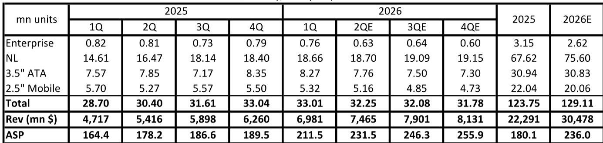
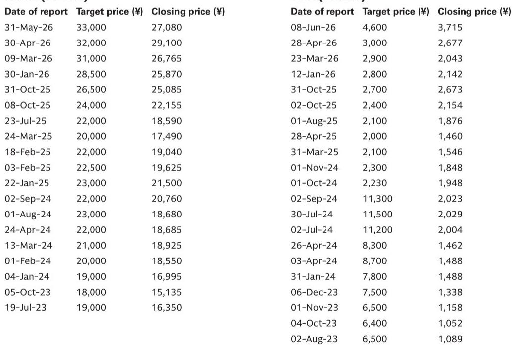
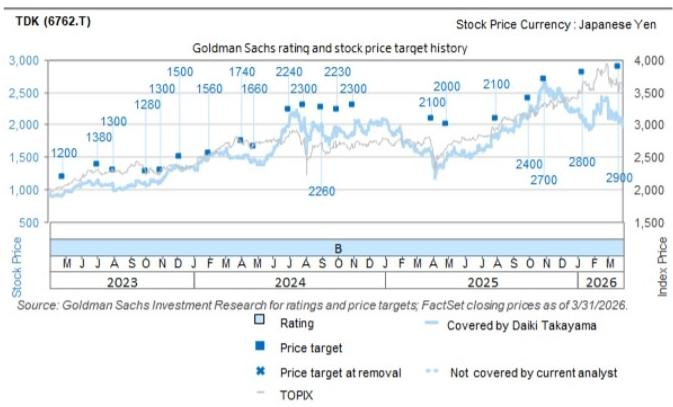

# Nearline HDD Demand Is Not Just Strong—It Is Structurally Tightening, and Component Suppliers with Technology Leverage Will Capture the Next Wave of Margin Expansion

The hard disk drive industry has been declared obsolete so many times that it has become a reflexive assumption among observers. That assumption is about to cost them. A recent expert call with Techno Systems Research (TSR), a leading industry research firm, has reconfirmed that the nearline HDD segment—the high-capacity drives used in cloud data centers—is entering a phase of sustained, structurally tight supply-demand dynamics that most market participants have not fully priced in. The data points are unambiguous: the total addressable market for nearline HDDs is projected to reach 75.6 million units in 2026, representing 12% year-over-year growth, while overall HDD shipments are expected to grow only 4%. This is not a cyclical bounce. It is a structural shift driven by the insatiable storage demands of artificial intelligence, machine learning, and the ongoing expansion of hyperscale cloud infrastructure.

What makes this moment strategically different is not just the volume growth. It is the pricing behavior. HDD manufacturers are not merely adding capacity; they are actively increasing average unit prices through product mix shifts and same-product price increases. Long-term agreements extending toward 2030 are already being discussed. For component and materials suppliers, this creates a rare window where volume, price, and technological complexity are all moving in the same direction. The key question for observers is no longer whether the nearline HDD market will grow. The question is which suppliers are positioned to capture disproportionate value from that growth.

The report from which this analysis draws focuses on two specific Japanese component manufacturers: TDK, which produces HDD heads and suspensions, and HOYA, which manufactures glass substrates. Both are rated 报告观点. But the strategic logic extends well beyond these two names. The nearline HDD supply chain is a complex ecosystem where bottlenecks, technological transitions, and outsourcing dynamics create winners and losers in ways that are not obvious from top-line demand forecasts alone. This article unpacks that logic, translates the report's findings into actionable strategic insights, and identifies the analytical questions that remain unresolved.

## The Nearline HDD Market Is Entering a Structural Supply-Demand Regime That Rewards Capacity Discipline and Pricing Power

The most important insight from the TSR call is not the unit growth number itself, but what it implies about the balance of power between HDD manufacturers and their customers. For years, the HDD industry was characterized by overcapacity, commoditization, and relentless downward pressure on prices. That era is ending. The data shows that nearline HDD production is expected to reach 84.4 million units in 2026, which is approximately 8.8 million units above the projected TAM of 75.6 million. At first glance, this might suggest oversupply. But the production number includes buffer stock, work-in-progress, and the need to maintain service-level agreements with hyperscale customers who demand immediate availability. The effective supply-demand balance is much tighter than the headline numbers suggest.

More telling is the pricing trajectory. The average selling price for HDDs is projected to rise from $180 in 2025 to $236 in 2026, a 31% increase. This is not driven by inflation or raw material costs. It is driven by two deliberate strategic actions by HDD manufacturers. First, they are shifting their product mix toward higher-capacity drives, which carry higher unit prices. Second, they are implementing same-product price increases—a move that would have been unthinkable in the oversupplied environment of previous years. The fact that long-term agreements extending to 2030 are already being negotiated indicates that both buyers and sellers expect this tightness to persist. For component suppliers, this creates a favorable environment where their customers have both the incentive and the ability to pay more for quality and reliability.

## Component Suppliers Benefit from Three Distinct Earnings Drivers, but Only Those with Technological Leverage Will Capture Sustainable Margin Expansion

The report identifies three mechanisms through which component and materials manufacturers can benefit from the nearline HDD boom: higher component counts, ASP increases due to technological changes, and market share gains in nearline-specific products. Each of these drivers operates differently, and the strategic implications vary significantly across the supply chain.

Higher component counts are the most straightforward driver. As nearline HDDs increase in capacity, they require more heads, more suspensions, and more substrates per drive. This is a volume-driven benefit that directly correlates with unit growth. But it is also the most easily replicated. Any supplier with existing capacity can capture this benefit, and it offers limited differentiation.

ASP increases due to technological changes are far more interesting from a research perspective. As HDD manufacturers push toward higher areal density and new recording technologies, they require components with tighter tolerances, new materials, and more complex manufacturing processes. Suppliers that can deliver these advanced components command higher prices. This is not a commodity play. It is a technology play. The key is to identify which components are experiencing the most rapid technological change and which suppliers have the proprietary process expertise to meet those requirements.

Market share gains in nearline-specific products represent the third and most powerful driver. The report notes that outsourcing of HDD heads from in-house production at Western Digital and Seagate to TDK is expected to increase significantly starting in the April-June quarter. TDK has already guided for a 40% increase in HDD head volumes in its fiscal year ending March 2027, with nearline-specific volumes expected to increase 50%. This is not just about riding the market growth. It is about capturing share from competitors. For observers, the distinction between market growth and market share gain is critical. Market growth is cyclical. Market share gain is structural.

## The Bottleneck Dynamics in the HDD Supply Chain Are Shifting, and the Next Constraint May Not Be Where Most Observers Expect

During the height of the pandemic-era supply chain disruptions, the HDD industry experienced severe bottlenecks across multiple component categories. Those bottlenecks have largely eased, but the report warns that several materials could become constrained in the future. This is a subtle but important point. The nature of the bottleneck is changing from a broad-based capacity constraint to a specific, technology-driven constraint.

The most likely future bottlenecks will occur in materials and components that require long qualification cycles, specialized manufacturing processes, or rare raw materials. Glass substrates, for example, require precision polishing and coating processes that are difficult to scale quickly. HDD heads require thin-film deposition and lithography processes that are similar to semiconductor manufacturing. These are not areas where capacity can be added overnight. The qualification process for a new component supplier in the HDD supply chain can take 12 to 18 months or longer, and hyperscale customers are notoriously conservative about changing suppliers once a product is qualified.

What the report does not fully answer is which specific materials will become constrained first and how severe those constraints will be. The bottleneck dynamics are inherently uncertain because they depend on the pace of technological change, the willingness of HDD manufacturers to qualify second sources, and the investment cycles of component suppliers themselves. This uncertainty creates both risk and opportunity. Observers who can identify the next bottleneck before it becomes obvious to the market will have a significant informational advantage.

## The Report Leaves Key Strategic Questions Open, Particularly Around the Sustainability of Pricing Power and the Pace of Technological Transition

No analysis is complete, and this report is no exception. There are several important questions that the current data does not fully resolve. The most critical is the sustainability of pricing power. HDD manufacturers are currently enjoying a favorable pricing environment, but this is partly a function of the post-pandemic recovery in cloud capital spending and the AI-driven surge in storage demand. If hyperscale customers decide to slow their capacity expansion or if alternative storage technologies such as solid-state drives become more cost-competitive at the high end, pricing power could erode quickly. The report does not provide a detailed scenario analysis for pricing under different demand assumptions.

A second open question is the pace of technological transition. The HDD industry is moving toward heat-assisted magnetic recording and other advanced technologies that require new component designs. The adoption curve for these technologies is uncertain, and it directly affects the ASP uplift that component suppliers can capture. If the transition is slower than expected, the technology-driven pricing benefits will be delayed. If it is faster, suppliers that are not prepared could lose market share.

A third question is the competitive response from in-house HDD head producers. The report highlights increased outsourcing to TDK, but it does not fully analyze the counter-strategies that Western Digital and Seagate might employ to protect their internal capabilities. If they invest aggressively to improve their in-house production, the outsourcing opportunity could be capped.

## A Decision Framework for Observers: Three Filters to Identify the Most Resilient Component Suppliers

For those looking to translate the report's insights into actionable decisions, a simple three-filter framework can help identify the component suppliers most likely to benefit from the nearline HDD cycle.

Filter one: Does the supplier benefit from technological change, or just from volume growth? Suppliers that only benefit from volume growth are exposed to any slowdown in demand. Suppliers that benefit from technological change have a structural advantage that persists even if unit growth moderates. TDK's position in HDD heads, where increasing areal density requires more precise and complex components, is a clear example of technological leverage.

Filter two: Does the supplier have a path to market share gain, or is it limited to market growth? Market share gain is the most powerful earnings driver because it compounds over time and is less sensitive to the demand cycle. The report's data on TDK's outsourcing wins suggests a clear share gain trajectory. For other component categories, observers should look for evidence of qualification wins, capacity expansion plans, or competitive displacements.

Filter three: Is the supplier's component category likely to become a bottleneck? Bottleneck components command pricing power and are less likely to face competitive pressure from new entrants. Glass substrates, for example, require significant capital investment and process expertise, which limits the threat of new competition. Components that are easy to manufacture or that have multiple qualified suppliers are less attractive.

Applying this framework, TDK and HOYA score well on multiple filters. But the framework also identifies potential risks. If the technological transition in HDD heads slows, TDK's ASP uplift could be delayed. If glass substrate capacity expands faster than demand, HOYA's pricing power could erode. The key is to monitor these variables closely and adjust positions as new data becomes available.

## Join the Community to Read the Full Report and Review the Original Charts

The analysis above is based on a single expert call and a limited set of data points. The full report contains detailed quarterly shipment and production data, pricing projections, and company-specific valuation analyses that provide a much richer picture of the opportunity. It also includes the original charts that illustrate the production-demand gap and the pricing trajectory in a way that text alone cannot capture. For those who want to go deeper into the specific names, the risk-reward profiles, and the scenario analysis, the full report is essential reading. Join the community to read the full report and review the original charts.

*For informational purposes only. Portions may be generated, translated, summarized, or edited with AI assistance based on source materials and may contain omissions or errors. Please verify independently. This is not professional advice.*

For informational purposes only. Portions may be generated, translated, summarized, or edited with AI assistance based on source materials and may contain omissions or errors. Please verify independently. This is not professional advice.

