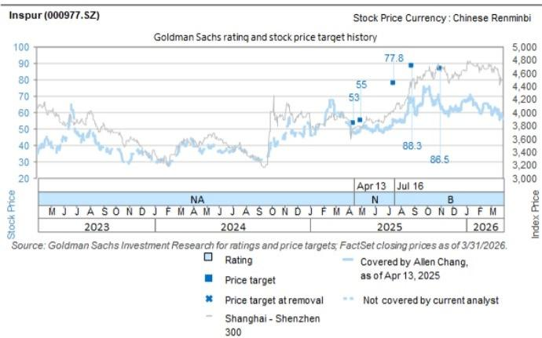

# Inspur (000977.SZ): AI server shipment accelerated ramp up; 2Q26 net income guidance beat

2Q26 net income guidance beat: Inspur reported strong 1H26 net income guidance at Rmb2.6bn~Rmb3.1bn (+226% ~288% YoY), suggesting 2Q26 net income at Rmb2.0bn~Rmb2.5bn, and beating our previous net income estimates of Rmb1.0bn. Management attributes the net income growth to (1) strong demand for AI servers, on rising China CSP AI Capex, (2) comprehensive product offerings with value-added solutions, and (3) secure procurement of upstream materials. We expect the company's revenue to grow at 22% CAGR in 2026-28E on the ongoing China CSP AI Capex cycle, while valuations appear stretched (above 5-year avg. P/E).

Allen Chang  
+852-2978-2930 |  
allen.k.chang@gs.com  
GS (Asia) L.L.C.

Verena Jeng
+852-2978-1681 | verena.jeng@gs.com
GS (Asia) L.L.C.

AI server ramp up ahead: We forecast China CSP's capex growth of +42%/ +14%/ +10% YoY in 2026-28E (link), and view the company as a key beneficiary of CSP clients' transition from AI servers empowered by global-tier GPUs to local AI chips. The company's inventory remains at a high level of Rmb44bn/ Rmb47bn in 1Q26/ 4Q25, supporting its AI server shipment ramp up ahead. Meanwhile, Inspur is also expanding to the SuperPOD architectural solution to meet clients' demand for large-scale deployment.

Ting Song +852-2978-6466 | ting.song@gs.com GS (Asia) L.L.C.

Earnings revision: We factor in Inspur's 2Q26 guidance and revise up earnings by $12\% / 2\% / 3\%$ in 2026-28E mainly on higher revenues of AI servers, driven by strong local CSP client demand and the company's shipment ramp up. We raise 2026 GM to reflect better product mix, while keep 2027-28E GM largely unchanged.

Source: Company data, GS Global Investment Research

Exhibit 1: Earnings revision

<table><tr><td rowspan="2">Rmb mn</td><td colspan="3">2026E</td><td colspan="3">2027E</td><td colspan="3">2028E</td></tr><tr><td>Old</td><td>New</td><td>Chg</td><td>Old</td><td>New</td><td>Chg</td><td>Old</td><td>New</td><td>Chg</td></tr><tr><td>Revenue</td><td>204,164</td><td>214,123</td><td>5%</td><td>250,893</td><td>259,093</td><td>3%</td><td>304,859</td><td>318,729</td><td>5%</td></tr><tr><td>GP</td><td>11,290</td><td>12,208</td><td>8%</td><td>13,313</td><td>13,603</td><td>2%</td><td>15,966</td><td>16,235</td><td>2%</td></tr><tr><td>OP</td><td>3,841</td><td>4,219</td><td>10%</td><td>4,400</td><td>4,530</td><td>3%</td><td>5,727</td><td>5,818</td><td>2%</td></tr><tr><td>Net income</td><td>3,593</td><td>4,010</td><td>12%</td><td>4,348</td><td>4,425</td><td>2%</td><td>5,645</td><td>5,787</td><td>3%</td></tr><tr><td>Margins</td><td></td><td></td><td></td><td></td><td></td><td></td><td></td><td></td><td></td></tr><tr><td>GM</td><td>5.5%</td><td>5.7%</td><td></td><td>5.3%</td><td>5.3%</td><td></td><td>5.2%</td><td>5.1%</td><td></td></tr><tr><td>OPM</td><td>1.9%</td><td>2.0%</td><td></td><td>1.8%</td><td>1.7%</td><td></td><td>1.9%</td><td>1.8%</td><td></td></tr><tr><td>NM</td><td>1.8%</td><td>1.9%</td><td></td><td>1.7%</td><td>1.7%</td><td></td><td>1.9%</td><td>1.8%</td><td></td></tr></table>

Valuation: We continue to use near-term P/E to derive our 12M TP and our target P/E is updated to 23.7x 2027E EPS (vs. 21.1x previously) on lower forward year earnings growth, which is still derived from peers' correlation between trading P/E and forward year net income YoY, supported by the industry's re-rate on rising AI capex in China and strong client demand. Our peer group includes global and China AI infrastructure (e.g. AI server, general server, storage, etc.) suppliers. Our new TP is

Rmb71.4 (vs. Rmb62.5 previously).  
Exhibit 2: Inspur P&L Summary

<table><tr><td>Rmb m</td><td>1Q25</td><td>2Q25</td><td>3Q25</td><td>4Q25</td><td>1Q26</td><td>2Q26E</td><td>3Q26E</td><td>4Q26E</td><td>2023</td><td>2024</td><td>2025</td><td>2026E</td><td>2027E</td><td>2028E</td></tr><tr><td colspan="9">Income statement</td><td colspan="6"></td></tr><tr><td>Revenues</td><td>46,858</td><td>33,334</td><td>40,477</td><td>44,113</td><td>35,470</td><td>54,336</td><td>60,353</td><td>63,964</td><td>65,867</td><td>114,767</td><td>164,782</td><td>214,123</td><td>259,093</td><td>318,729</td></tr><tr><td>GP</td><td>1,616</td><td>2,030</td><td>2,273</td><td>2,128</td><td>2,355</td><td>3,661</td><td>3,091</td><td>3,102</td><td>6,612</td><td>7,859</td><td>8,047</td><td>12,208</td><td>13,603</td><td>16,235</td></tr><tr><td>OP</td><td>495</td><td>582</td><td>676</td><td>66</td><td>949</td><td>1,701</td><td>845</td><td>724</td><td>1,167</td><td>1,949</td><td>1,819</td><td>4,219</td><td>4,530</td><td>5,818</td></tr><tr><td>Net income</td><td>463</td><td>336</td><td>683</td><td>931</td><td>605</td><td>1,979</td><td>736</td><td>689</td><td>1,783</td><td>2,292</td><td>2,413</td><td>4,010</td><td>4,425</td><td>5,787</td></tr><tr><td>EPS (Rmb)</td><td>0.32</td><td>0.23</td><td>0.46</td><td>0.64</td><td>0.41</td><td>1.35</td><td>0.50</td><td>0.47</td><td>1.21</td><td>1.56</td><td>1.64</td><td>2.73</td><td>3.01</td><td>3.94</td></tr><tr><td colspan="9">Margins</td><td colspan="6"></td></tr><tr><td>GM</td><td>3.4%</td><td>6.1%</td><td>5.6%</td><td>4.8%</td><td>6.6%</td><td>6.7%</td><td>5.1%</td><td>4.8%</td><td>10.0%</td><td>6.8%</td><td>4.9%</td><td>5.7%</td><td>5.3%</td><td>5.1%</td></tr><tr><td>OPM</td><td>1.1%</td><td>1.7%</td><td>1.7%</td><td>0.2%</td><td>2.7%</td><td>3.1%</td><td>1.4%</td><td>1.1%</td><td>1.8%</td><td>1.7%</td><td>1.1%</td><td>2.0%</td><td>1.7%</td><td>1.8%</td></tr><tr><td>NM</td><td>1.0%</td><td>1.0%</td><td>1.7%</td><td>2.1%</td><td>1.7%</td><td>3.6%</td><td>1.2%</td><td>1.1%</td><td>2.7%</td><td>2.0%</td><td>1.5%</td><td>1.9%</td><td>1.7%</td><td>1.8%</td></tr><tr><td colspan="9">Ratios</td><td colspan="6"></td></tr><tr><td>Opex ratio</td><td>2.4%</td><td>4.3%</td><td>3.9%</td><td>4.7%</td><td>4.0%</td><td>3.6%</td><td>3.7%</td><td>3.7%</td><td>8.3%</td><td>5.1%</td><td>3.8%</td><td>3.7%</td><td>3.5%</td><td>3.3%</td></tr><tr><td>R&amp;D ratio</td><td>1.4%</td><td>2.5%</td><td>2.4%</td><td>3.0%</td><td>2.4%</td><td>2.1%</td><td>2.2%</td><td>2.2%</td><td>4.7%</td><td>3.1%</td><td>2.3%</td><td>2.2%</td><td>2.2%</td><td>2.0%</td></tr><tr><td>Tax rate</td><td>17.5%</td><td>7.3%</td><td>10.5%</td><td>6.0%</td><td>4.9%</td><td>1.7%</td><td>3.1%</td><td>2.4%</td><td>1.7%</td><td>3.1%</td><td>2.4%</td><td>5.7%</td><td>5.0%</td><td>5.0%</td></tr><tr><td colspan="9">YoY</td><td colspan="6"></td></tr><tr><td>Revenues</td><td>166%</td><td>36%</td><td>-1%</td><td>39%</td><td>-24%</td><td>63%</td><td>49%</td><td>45%</td><td>-5%</td><td>74%</td><td>44%</td><td>30%</td><td>21%</td><td>23%</td></tr><tr><td>GP</td><td>14%</td><td>11%</td><td>-2%</td><td>-7%</td><td>46%</td><td>80%</td><td>36%</td><td>46%</td><td>-15%</td><td>19%</td><td>2%</td><td>52%</td><td>11%</td><td>19%</td></tr><tr><td>OP</td><td>34%</td><td>25%</td><td>-14%</td><td>-80%</td><td>92%</td><td>192%</td><td>25%</td><td>990%</td><td>-48%</td><td>67%</td><td>-7%</td><td>132%</td><td>7%</td><td>28%</td></tr><tr><td>Pretax income</td><td>57%</td><td>24%</td><td>-3%</td><td>-11%</td><td>39%</td><td>487%</td><td>11%</td><td>-26%</td><td>-16%</td><td>29%</td><td>4%</td><td>72%</td><td>10%</td><td>31%</td></tr><tr><td>Net income</td><td>51%</td><td>16%</td><td>-2%</td><td>-7%</td><td>31%</td><td>489%</td><td>8%</td><td>-26%</td><td>-15%</td><td>29%</td><td>5%</td><td>66%</td><td>10%</td><td>31%</td></tr><tr><td colspan="9">QoQ</td><td colspan="6"></td></tr><tr><td>Revenues</td><td>48%</td><td>-29%</td><td>21%</td><td>9%</td><td>-20%</td><td>53%</td><td>11%</td><td>6%</td><td rowspan="4" colspan="6"></td></tr><tr><td>GP</td><td>-30%</td><td>26%</td><td>12%</td><td>-6%</td><td>11%</td><td>55%</td><td>-16%</td><td>0%</td></tr><tr><td>OP</td><td>51%</td><td>18%</td><td>16%</td><td>-90%</td><td>1329%</td><td>79%</td><td>-50%</td><td>-14%</td></tr><tr><td>Net income</td><td>-54%</td><td>-27%</td><td>103%</td><td>36%</td><td>-35%</td><td>227%</td><td>-63%</td><td>-6%</td></tr></table>

Source: Company data, GS Global Investment Research

## Price Target Risks and Methodology - Inspur

Valuation: We derive our 12-m TP of Rmb71.4 on a target P/E multiple of 23.7x our 2027E EPS. Our target P/E of 23.7x is derived from the correlation between P/E and net income growth of its peers, based on the company's 2027E-28E net income YoY growth. We are Sell rated on Inspur. Upside risks: Stronger-than-expected generative AI demand in China; Faster-than-expected AI servers transition from global-tier GPU to local AI chips; Healthier-than-expected competition in AI servers in China.

<table><tr><td>000977.SZ</td><td colspan="2">12m Price Target: Rmb71.40</td><td colspan="2">Price: Rmb85.99</td><td colspan="2">Downside: 17.0%</td></tr><tr><td colspan="2">Sell</td><td colspan="5">GS Forecast</td></tr><tr><td></td><td></td><td></td><td>12/25</td><td>12/26E</td><td>12/27E</td><td>12/28E</td></tr><tr><td></td><td>Market cap:</td><td>Revenue (Rmb mn) New</td><td>164,782.0</td><td>214,123.3</td><td>259,093.1</td><td>318,728.8</td></tr><tr><td></td><td>Rmb126.3bn / $18.6bn</td><td>Revenue (Rmb mn) Old</td><td>164,782.0</td><td>204,163.8</td><td>250,893.0</td><td>304,858.9</td></tr><tr><td></td><td>Enterprise value:</td><td>EBITDA (Rmb mn)</td><td>2,641.4</td><td>5,054.3</td><td>5,376.6</td><td>6,613.7</td></tr><tr><td></td><td>Rmb129.2bn / $19.0bn</td><td>EPS (Rmb) New</td><td>1.64</td><td>2.73</td><td>3.01</td><td>3.94</td></tr><tr><td></td><td>3m ADTV: Rmb5.8bn / $853.7mn</td><td>EPS (Rmb) Old</td><td>1.64</td><td>2.45</td><td>2.96</td><td>3.84</td></tr><tr><td></td><td>China</td><td>P/E (X)</td><td>35.0</td><td>31.5</td><td>28.5</td><td>21.8</td></tr><tr><td></td><td>Greater China Technology</td><td>P/B (X)</td><td>3.8</td><td>5.0</td><td>4.4</td><td>3.8</td></tr><tr><td></td><td>M&amp;A Rank: 3</td><td>Dividend yield (%)</td><td>0.7</td><td>0.8</td><td>0.9</td><td>1.1</td></tr><tr><td></td><td>Leases incl. in net debt &amp; EV?: Yes</td><td>CROCI (%)</td><td>50.0</td><td>18.3</td><td>17.7</td><td>19.1</td></tr><tr><td></td><td></td><td></td><td>3/26</td><td>6/26E</td><td>9/26E</td><td>12/26E</td></tr><tr><td></td><td></td><td>EPS (Rmb)</td><td>0.41</td><td>1.35</td><td>0.50</td><td>0.47</td></tr></table>

Source: Company data, GS estimates, FactSet. Price as of 9 Jul 2026 close.

## Disclosure Appendix

## Reg AC

We, Allen Chang, Verena Jeng and Ting Song, hereby certify that all of the views expressed in this report accurately reflect our personal views about the subject company or companies and its or their securities. We also certify that no part of our compensation was, is or will be, directly or indirectly, related to the specific recommendations or views expressed in this report.

Unless otherwise stated, the individuals listed on the cover page of this report are analysts in GS' Global Investment Research division.

Contributing Authors: Allen Chang GS (Asia) L.L.C., Verena Jeng GS (Asia) L.L.C., Ting Song GS (Asia) L.L.C..

Unless otherwise stated, the individuals listed in the Contributing Authors disclosure of this report are analysts in GS' Global Investment Research division.

## GS Factor Profile

The GS Factor Profile provides investment context for a stock by comparing key attributes to the market (i.e. our universe of rated stocks) and its sector peers. The four key attributes depicted are: Growth, Financial Returns, Multiple (e.g. valuation) and Integrated (a composite of Growth, Financial Returns and Multiple). Growth, Financial Returns and Multiple are calculated by using normalized ranks for specific metrics for each stock. The normalized ranks for the metrics are then averaged and converted into percentiles for the relevant attribute. The precise calculation of each metric may vary depending on the fiscal year, industry and region, but the standard approach is as follows:

Growth is based on a stock's forward-looking sales growth, EBITDA growth and EPS growth (for financial stocks, only EPS and sales growth), with a higher percentile indicating a higher growth company. Financial Returns is based on a stock's forward-looking ROE, ROCE and CROCI (for financial stocks, only ROE), with a higher percentile indicating a company with higher financial returns. Multiple is based on a stock's forward-looking P/E, P/B, price/dividend (P/D), EV/EBITDA, EV/FCF and EV/Debt Adjusted Cash Flow (DACF) (for financial stocks, only P/E, P/B and P/D), with a higher percentile indicating a stock trading at a higher multiple. The Integrated percentile is calculated as the average of the Growth percentile, Financial Returns percentile and (100% - Multiple percentile).

Financial Returns and Multiple use the GS analyst forecasts at the fiscal year-end at least three quarters in the future. Growth uses inputs for the fiscal year at least seven quarters in the future compared with the year at least three quarters in the future (on a per-share basis for all metrics).

For a more detailed description of how we calculate the GS Factor Profile, please contact your GS representative.

## M&A Rank

Across our global coverage, we examine stocks using an M&A framework, considering both qualitative factors and quantitative factors (which may vary across sectors and regions) to incorporate the potential that certain companies could be acquired. We then assign a M&A rank as a means of scoring companies under our rated coverage from 1 to 3, with 1 representing high (30%-50%) probability of the company becoming an acquisition target, 2 representing medium (15%-30%) probability and 3 representing low (0%-15%) probability. For companies ranked 1 or 2, in line with our standard departmental guidelines we incorporate an M&A component into our target price. M&A rank of 3 is considered immaterial and therefore does not factor into our price target, and may or may not be discussed in research.

## Quantum

Quantum is GS' proprietary database providing access to detailed financial statement histories, forecasts and ratios. It can be used for in-depth analysis of a single company, or to make comparisons between companies in different sectors and markets.

## Disclosures

The rating(s) for Inspur is/are relative to the other companies in its/their coverage universe: AAC, ACM Research, AMEC, ASMPT, AVC, AccoTest, Anji Micro, Asus, Auras, BOE, BYDE, Biren, CR Micro, Cambricon, Chenbro, China Mobile (HK), China Telecom, China Tower Corp., China Unicom, Chinasoft Intl, Compal, Desay SV, E Ink, E-Town Semis, EHang, Empyrean, Eoptolink, FOCI, Fositek, Foxconn Industrial Internet, Gigabyte, Gigadevice, Glodon Co., HTC Corp., Hikvision, Hon Hai, Horizon Robotics, Hua Hong, Huace Navigation, Huaqin Co.(A), Huaqin Co.(H), Hwatsing, InnoScience, Innolight, Inspur, Insta360, Inventec, JCET, Kematek, King Slide, Kingdee, Kingsoft Office, LandMark, Largan, Lenovo, Lingyi, Maxscend, Meitu, MetaX, Mitac, Montage (A), Montage (H), NAURA, NSIG, Nexchip, OmniVision, Pegatron, Pony AI Inc. (ADR), Pony AI Inc. (H), Quanta, RoboTechnik, Ruijie Networks, SG Micro, SICC, SMIC (A), SMIC (H), SZS, Sangfor, SenseTime, Shengyi Tech, Shennan Circuits, StarPower, Sunny Optical, TFC Optical, Thundersoft, Tongyu Communication, Transsion, UMT, UNIS, VPEC, Vanchip, VeriSilicon, Victory Giant, WNC, WUS, WeRide, Wistron, Wiwynn, YJ Semitech, YOFC, Yonyou, ZTE (A), ZTE (H), iFlytek

## Company-specific regulatory disclosures

The following disclosures relate to relationships between The GS Group, Inc. (with its affiliates, “GS”) and companies covered by GS Global Investment Research and referred to in this research.

There are no company-specific disclosures for: Inspur (Rmb85.99)

## Distribution of ratings/investment banking relationships

GS Investment Research global Equity coverage universe

<table><tr><td rowspan="2"></td><td colspan="3">Rating Distribution</td><td colspan="3">Investment Banking Relationships</td></tr><tr><td>Buy</td><td>Hold</td><td>Sell</td><td>Buy</td><td>Hold</td><td>Sell</td></tr><tr><td>Global</td><td>50%</td><td>34%</td><td>16%</td><td>65%</td><td>60%</td><td>45%</td></tr></table>

As of April 1, 2026, GS Global Investment Research had investment ratings on 3,074 equity securities. GS assigns stocks as Buys and Sells on various regional Investment Lists; stocks not so assigned are deemed Neutral. Such assignments equate to Buy, Hold and Sell for the purposes of the above disclosure required by the FINRA Rules. See ‘Ratings, Coverage universe and related definitions’ below. The Investment Banking Relationships chart reflects the percentage of subject companies within each rating category for whom GS has provided investment banking services within the previous twelve months.

## Price target and rating history chart(s)

  
The price targets shown should be considered in the context of all prior published GS, which may or may not have included price targets, as well as developments relating to the company, its industry and financial markets.

## Target price history table(s) Inspur (000977.SZ)

<table><tr><td>Date of report</td><td>Target price (Rmb)</td><td>Closing price (Rmb)</td></tr><tr><td>23-Jun-26</td><td>62.50</td><td>64.00</td></tr><tr><td>04-May-26</td><td>76.50</td><td>69.75</td></tr><tr><td>02-Nov-25</td><td>86.50</td><td>65.23</td></tr><tr><td>28-Aug-25</td><td>88.30</td><td>67.90</td></tr><tr><td>16-Jul-25</td><td>77.80</td><td>54.52</td></tr><tr><td>01-May-25</td><td>55.00</td><td>50.85</td></tr><tr><td>13-Apr-25</td><td>53.00</td><td>47.78</td></tr></table>

Price targets shown in table(s) are unadjusted for corporate actions.

## Regulatory disclosures

## Disclosures required by United States laws and regulations

See company-specific regulatory disclosures above for any of the following disclosures required as to companies referred to in this report: manager or co-manager in a pending transaction; $1\%$ or other ownership; compensation for certain services; types of client relationships; managed/co-managed public offerings in prior periods; directorships; for equity securities, market making and/or specialist role. GS trades or may trade as a principal in debt securities (or in related derivatives) of issuers discussed in this report.

The following are additional required disclosures: Ownership and material conflicts of interest: GS policy prohibits its analysts, professionals reporting to analysts and members of their households from owning securities of any company in the analyst's area of coverage. Analyst compensation: Analysts are paid in part based on the profitability of GS, which includes investment banking revenues. Analyst as officer or director: GS policy generally prohibits its analysts, persons reporting to analysts or members of their households from serving as an officer, director or advisor of any company in the analyst's area of coverage. Non-U.S. Analysts: Non-U.S. analysts may not be associated persons of GS & Co. LLC and therefore may not be subject to FINRA Rule 2241 or FINRA Rule 2242 restrictions on communications with a subject company, public appearances and trading in securities covered by the analysts.

## Additional disclosures required under the laws and regulations of jurisdictions other than the United States

The following disclosures are those required by the jurisdiction indicated, except to the extent already made above pursuant to United States laws and regulations. Australia: GS Australia Pty Ltd and its affiliates are not authorised deposit-taking institutions (as that term is defined in the Banking Act 1959 (Cth)) in Australia and do not provide banking services, nor carry on a banking business, in Australia. This research, and any access to it, is intended only for “wholesale clients” within the meaning of the Australian Corporations Act, unless otherwise agreed by GS. In producing research reports, members of Global Investment Research of GS Australia may attend site visits and other meetings hosted by the companies and other entities which are the subject of its research reports. In some instances the costs of such site visits or meetings may be met in part or in whole by the issuers concerned if GS Australia considers it is appropriate and reasonable in the specific circumstances relating to the site visit or meeting. To the extent that the contents of this document contains any financial product advice, it is general advice only and has been prepared by GS without taking into account a client’s objectives, financial situation or needs. A client should, before acting on any such advice, consider the appropriateness of the advice having regard to the client’s own objectives, financial situation and needs. A copy of certain GS Australia and New Zealand disclosure of interests and a copy of GS’ Australian Sell-Side Research Independence Policy Statement are available at: https://www.goldmansachs.com/disclosures/australia-new-zealand/index.html. Brazil: Disclosure information in relation to CVM Resolution n. 20 is available at https://www.gs.com/worldwide/brazil/area/gir/index.html. Where applicable, the Brazil-registered analyst primarily responsible for the content of this research report, as defined in Article 20 of CVM Resolution n. 20, is the first author named at the beginning of this report, unless indicated otherwise at the end of the text. Canada: This information is being provided to you for information purposes only and is not, and under no circumstances should be construed as, an advertisement, offering or solicitation by GS & Co. LLC for purchasers of securities in Canada to trade in any Canadian security. GS & Co. LLC is not registered as a dealer in any jurisdiction in Canada under applicable Canadian securities laws and generally is not permitted to trade in Canadian securities and may be prohibited from selling certain securities and products in certain jurisdictions in Canada. If you wish to trade in any Canadian securities or other products in Canada please contact GS Canada Inc., an affiliate of The GS Group Inc., or another registered Canadian dealer. Hong Kong: Further information on the securities of covered companies referred to in this research may be obtained on request from GS (Asia) L.L.C. India: Further information

on the subject company or companies referred to in this research may be obtained from GS (India) Securities Private Limited, Research Analyst - SEBI Registration Number INH000001493, 10th Floor, Ascent-Worli, Sudam Kalu Ahire Marg, Worli, Mumbai-400 025, India, Corporate Identity Number U74140MH2006FTC160634, Phone +91 22 6616 9000, Fax +91 22 6616 9001. GS may beneficially own 1% or more of the securities (as such term is defined in clause 2 (h) the Indian Securities Contracts (Regulation) Act, 1956) of the subject company or companies referred to in this research report. Registration granted by SEBI and certification from NISM in no way guarantee performance of the intermediary or provide any assurance of returns to investors. GS (India) Securities Private Limited compliance officer and investor grievance contact details, a copy of the annual compliance audit report and other relevant information and disclosures can be found at this link:

https://www.goldmansachs.com/worldwide/india/research-analyst. Japan: See below. Korea: This research, and any access to it, is intended only for “professional investors” within the meaning of the Financial Services and Capital Markets Act, unless otherwise agreed by GS. Further information on the subject company or companies referred to in this research may be obtained from GS (Asia) L.L.C., Seoul Branch. New Zealand: GS New Zealand Limited and its affiliates are neither “registered banks” nor “deposit takers” (as defined in the Reserve Bank of New Zealand Act 1989) in New Zealand. This research, and any access to it, is intended for “wholesale clients” (as defined in the Financial Advisers Act 2008) unless otherwise agreed by GS. A copy of certain GS Australia and New Zealand disclosure of interests is available at: https://www.goldmansachs.com/disclosures/australia-new-zealand/index.html. Russia: Research reports distributed in the Russian Federation are not advertising as defined in the Russian legislation, but are information and analysis not having product promotion as their main purpose and do not provide appraisal within the meaning of the Russian legislation on appraisal activity. Research reports do not constitute a personalized investment recommendation as defined in Russian laws and regulations, are not addressed to a specific client, and are prepared without analyzing the financial circumstances, investment profiles or risk profiles of clients. GS assumes no responsibility for any investment decisions that may be taken by a client or any other person based on this research report. Singapore: GS (Singapore) Pte. (Company Number: 198602165W), which is regulated by the Monetary Authority of Singapore, accepts legal responsibility for this research, and should be contacted with respect to any matters arising from, or in connection with, this research. Taiwan: This material
