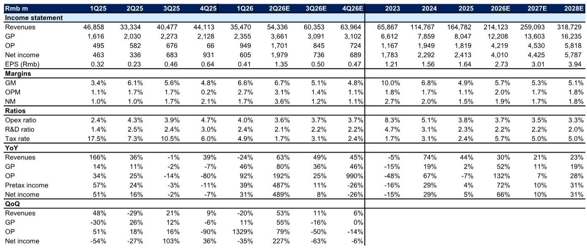
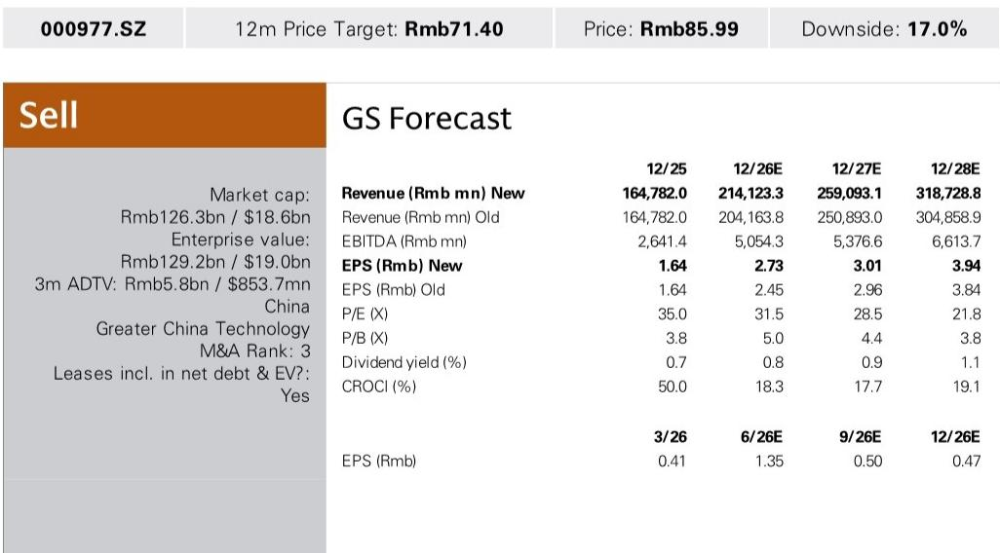
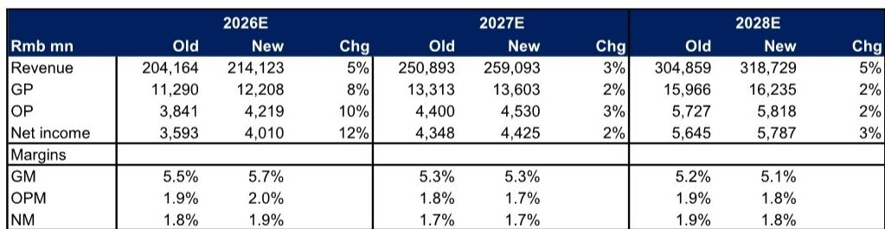

# Inspur's AI Server Surge Is Real, but the Market Is Already Pricing in Perfection

Inspur Electronic Information Industry (000977.SZ) has delivered a 1H26 net income guidance of RMB 2.6 billion to RMB 3.1 billion, implying a 2Q26 net income of approximately RMB 2.0 billion to RMB 2.5 billion. This result handily beats consensus expectations and represents a staggering 489% year-over-year growth in the second quarter alone. The driver is unmistakable: Chinese cloud service providers are accelerating their AI infrastructure buildout, and Inspur, as the country's dominant AI server supplier, is the primary beneficiary.

Yet the stock already trades at 28.5x forward P/E on 2027 estimates, above its five-year average, and carries a 报告观点 from the analyst who issued the report. This divergence between operational momentum and valuation discipline is the central tension that investors must confront. The question is not whether Inspur is executing well -- it clearly is. The question is whether the market has already priced in not just the current cycle, but also the structural margin compression that inevitably accompanies high-volume server businesses.

The report's earnings revisions are telling. Revenue estimates for 2026-2028 have been raised by 5%, 3%, and 5% respectively, driven almost entirely by higher AI server shipments to Chinese CSP clients. But gross margin assumptions have been revised up only modestly for 2026, to 5.7%, and left largely unchanged for 2027 and 2028 at 5.3% and 5.1%. This is not a margin expansion story. It is a volume story with structurally thin profitability.

The strategic implication is clear: Inspur is becoming a bellwether for China's domestic AI chip ecosystem transition, but its financial profile increasingly resembles a high-growth hardware manufacturer with low operating leverage. For long-only investors, the risk-reward calculus hinges on whether the volume trajectory can outrun the margin headwinds over the next 18 months.

## The China CSP Capex Cycle Is the Only Story That Matters, and It Has Legs

The report's core thesis rests on a straightforward premise: Chinese cloud service providers are in the early innings of a multi-year AI infrastructure investment cycle. The analyst forecasts China CSP capex growth of +42%, +14%, and +10% year-over-year in 2026, 2027, and 2028 respectively. Inspur, as the largest domestic AI server provider, is positioned to capture a disproportionate share of this spending.

What makes this cycle different from previous server upgrade cycles is the transition from global-tier GPUs to local AI chips. This is not merely a supply-chain adaptation; it is a structural shift driven by both geopolitical constraints and domestic policy imperatives. Chinese CSPs are being compelled to build out AI clusters using domestic silicon, which requires more servers per unit of compute performance. The volume effect is multiplicative: more servers are needed to achieve the same workload capacity, and Inspur benefits from both the volume increase and the system integration complexity that comes with heterogeneous chip architectures.

The inventory data supports the shipment narrative. Inspur's inventory stood at RMB 44 billion in 1Q26 and RMB 47 billion in 4Q25, levels that suggest the company is pre-positioning components for a sustained ramp. This is not inventory bloat from demand disappointment; it is deliberate build-ahead for committed CSP orders. The sequential revenue trajectory reinforces this interpretation, with 2Q26E revenue of RMB 54.3 billion representing 53% quarter-over-quarter growth.

However, the so-what here is not just that Inspur is growing. It is that the growth is becoming increasingly concentrated in a single demand driver. In 2023, Inspur's revenue was RMB 65.9 billion. By 2028E, the analyst expects revenue of RMB 318.7 billion, a nearly fivefold increase. The overwhelming majority of that increment comes from AI servers sold to a handful of Chinese CSP clients. This concentration risk is not adequately captured in the earnings revisions, because the base case assumes the capex cycle continues uninterrupted.

## Gross Margin Compression Is Structural, Not Cyclical, and the Inflection Point Is Near

The most analytically revealing exhibit in the report is the margin trajectory. Inspur's gross margin has declined from 10.0% in 2023 to an estimated 5.7% in 2026E, with further compression to 5.1% by 2028E. Operating margin follows a similar pattern, dropping from 1.8% in 2023 to an estimated 1.8% in 2028E, with a brief recovery to 2.0% in 2026E before settling back.

This is not a story of deteriorating execution. It is a structural feature of the AI server business. As AI servers become a larger share of the revenue mix, the aggregate gross margin converges toward the lower margin profile of the AI server product line. The report's own earnings revision shows that while revenue estimates were raised across the board, gross margin estimates for 2027 and 2028 were left unchanged. The analyst is effectively saying: we expect more volume, but no improvement in unit economics.

The second-order implication is that Inspur is approaching a margin floor. The operating expense ratio has already been compressed from 8.3% in 2023 to an estimated 3.3% by 2028E, suggesting there is limited room for further cost rationalization. The R&D ratio, already low at 2.3% in 2025, is forecast to decline to 2.0% by 2028E. At some point, the company cannot cut its way to higher margins; it must either achieve pricing power or develop higher-value solutions.

This is where the report's mention of SuperPOD architectural solutions becomes strategically significant. Inspur is expanding into large-scale deployment solutions that bundle servers with networking, cooling, and management software. If these solutions command higher margins than standalone server shipments, they could arrest the margin decline. But the report does not provide specific margin assumptions for this product line, leaving investors to infer that the base case assumes no material margin uplift from this initiative.

## The Valuation Framework Raises More Questions Than It Answers

The report's 报告观点 implies 17% downside from the current price of RMB 85.99. The target multiple is derived from a correlation analysis between trading P/E and forward-year net income growth among a peer group of global and China AI infrastructure suppliers.

This methodology is conceptually sound but operationally fragile. The peer group includes companies with vastly different business models, margin profiles, and growth trajectories. Some peers are pure-play AI server manufacturers; others are diversified technology hardware companies with significant software or services revenue. The correlation between P/E and earnings growth in such a heterogeneous group is likely to be weak, and the resulting target multiple carries wide confidence intervals.

More importantly, the valuation framework does not explicitly address the sustainability of the earnings growth that justifies the current multiple. The analyst's own estimates show net income growth decelerating from 66% in 2026E to 10% in 2027E and 31% in 2028E. The 2027 deceleration is particularly sharp and reflects the base effect from the 2026 ramp. If the CSP capex cycle peaks earlier than expected, or if competition intensifies, the deceleration could be even more pronounced, making the current multiple look expensive in hindsight.

The report's 报告观点 is consistent with this valuation concern, but the rating also introduces a tension that the report does not fully resolve. If the company is executing well, if the end-market demand is robust, and if the inventory buildup supports continued shipment growth, what catalyst would trigger the downside scenario? The report implies that the current multiple already reflects the best-case scenario, and any disappointment -- whether in margins, growth deceleration, or competitive dynamics -- would lead to a re-rating lower. But the report does not articulate a specific trigger event.

## What the Report Does Not Fully Answer: The Competitive Dynamics and the Chip Transition Risk

The report identifies Inspur as a key beneficiary of the transition from global-tier GPUs to local AI chips, but it does not fully analyze the competitive implications of this transition. As Chinese CSPs shift to domestic silicon, the server architecture becomes more fragmented and customized. Different CSPs may adopt different chip designs, requiring Inspur to maintain multiple server platforms and incur higher R&D and inventory costs.

Furthermore, the transition creates an opportunity for new entrants. If domestic chip suppliers develop their own reference designs or partner directly with CSPs, Inspur's role as systems integrator could be disintermediated. The report does not address the potential for vertical integration by CSPs themselves, who may choose to design their own servers to optimize for specific chip architectures.

The report also does not explore the working capital implications of the inventory buildup. With inventory at RMB 44 billion in 1Q26, Inspur is carrying significant balance sheet risk. If the CSP capex cycle slows or if chip supply chains experience disruptions, the company could face inventory write-downs that would pressure margins and cash flow. The report's earnings revisions do not incorporate any inventory risk premium.

These open questions are not criticisms of the report's analysis; they are inherent limitations of a single-company focus. The full report likely contains more granular data on competitive positioning and supply chain dynamics that would help investors assess these risks. But for the purposes of this analysis, the key takeaway is that the bull case for Inspur rests on a narrow set of assumptions about CSP capex continuity, margin stability, and competitive insulation.

## A Decision Framework for Investors Considering Inspur

For investors evaluating Inspur at current levels, the decision should be structured around three sequential questions, each of which narrows the range of acceptable outcomes.

First, do you have a view on China CSP capex that is more optimistic than the consensus implied by the report's forecasts? The report assumes 42% growth in 2026 decelerating to 10% in 2028. If you believe that China's AI investment cycle will be longer and deeper than this base case, then Inspur's revenue trajectory could exceed estimates, providing a buffer against margin compression. If you are 报告观点 or bearish on CSP capex, the stock offers no margin of safety.

Second, can Inspur achieve gross margins above 6% as AI servers become the dominant revenue driver? The report's base case assumes margins will settle around 5.1% by 2028. If the SuperPOD solution or other value-added services can lift margins to 6.5% or higher, the earnings power of the company would be materially greater than current estimates. This is the most important variable that the report does not fully resolve.

Third, is the current P/E multiple of 28.5x on 2027E earnings justified by the growth duration? At 28.5x, the market is pricing in not just the 2026 growth surge but also sustained mid-teens growth through 2028. If growth decelerates faster than expected, the multiple could contract to the low 20s, implying significant downside. If growth proves more durable, the multiple could expand to the mid-30s, supporting the current price.

Investors who answer yes to the first two questions and are comfortable with the valuation risk in the third may find Inspur attractive despite the 报告观点. Investors who are uncertain on any of these dimensions should consider the downside.

## Join the Community to Read the Full Report and Review the Original Charts

The analysis above draws on a single research report that provides detailed financial projections, peer valuation comparisons, and risk assessments. But the full report contains additional exhibits -- including the earnings revision table, the P&L summary, and the valuation methodology -- that are essential for investors conducting their own due diligence. The original charts show the quarterly revenue trajectory, margin trends, and inventory buildup in a format that allows for direct comparison with peer companies.

For investors who want to go deeper into the competitive dynamics of China's AI server market, the CSP capex cycle assumptions, and the chip transition risk, the full report is indispensable. It also shows how the investment thesis has evolved over time.

Join the community to read the full report and review the original charts.

*For informational purposes only. Portions may be generated, translated, summarized, or edited with AI assistance based on source materials and may contain omissions or errors. Please verify independently. This is not investment, legal, tax, accounting, or other professional advice.*

For informational purposes only. Portions may be generated, translated, summarized, or edited with AI assistance based on source materials and may contain omissions or errors. Please verify independently. This is not investment, legal, tax, accounting, or other professional advice.

