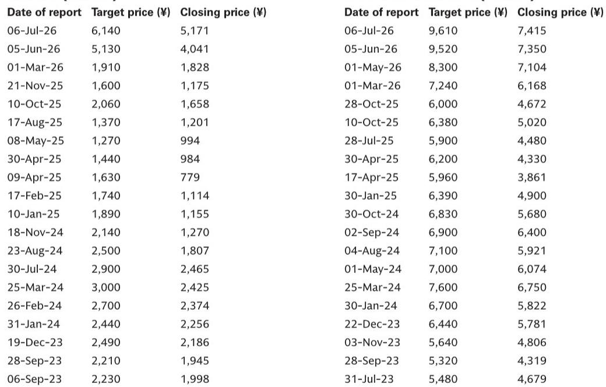
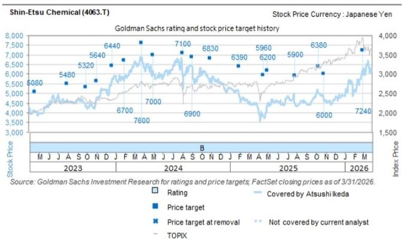
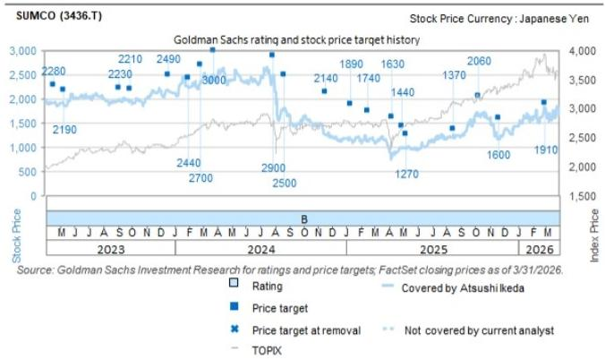

# GS：硅片长约从5年变10年，存储客户为AI需求主动锁仓

一份来自美光与环球晶圆的十年供应协议，正在改写半导体硅片行业的长期叙事。GS日本团队在最新研究报告中指出，这份长约的期限远超行业常规的5至7年，且首次出现在历史上被视为强周期的存储领域。这一信号的含义直接且深远：客户端的未来需求可见度正在结构性提升，而供给端的紧张预期正在倒逼产业链重新评估定价。

报告认为，这对信越化学和SUMCO两家日本硅片制造商构成明确的正面影响。两家公司均获得GS的“观点偏积极”评级。但比评级本身更值得关注的，是这份协议所揭示的行业底层逻辑变化。

## 1. 十年长约打破周期惯性，存储客户开始为远期供给“锁仓”

美光向环球晶圆提供5亿美元战略融资，并签署十年期硅片长期供应协议。GS分析师指出，行业此前的长约周期普遍在5至7年，且通常覆盖到2027或2028年底。美光此次将时间跨度拉长至十年，且明确涉及300毫米硅片在德克萨斯州工厂的产能扩张。

这一变化的核心在于，存储厂商过去是硅片需求波动的放大器，如今却成为需求稳定性的背书者。当一家存储巨头愿意用十年合约锁定上游材料，意味着其对AI驱动下的长期需求增长已有足够信心，同时也反映出对2027至2028年间硅片供应趋紧的真实考量。

> **KC评论：** 存储芯片的周期性特征曾让硅片厂商对其长约持保留态度。美光此次主动加码，等于在说“未来的需求不是周期波动，而是结构性增长”。读者可以重点关注信越化学在近期股东大会上提到的“AI用硅片需求自5、6月以来超预期扩张”这一细节，它可能是验证这一判断的微观证据。

## 2. 新研究门槛急剧抬高，下一轮长约议价权正在向卖方倾斜

长约期限的延长只是表象。更深层的变化在于，硅片新产能的资本开支门槛已大幅上升。GS注意到，SUMCO在2026年3月宣布将其在佐贺县吉野里町的新工厂研究规模缩减至最初计划的四分之一。这并非个案。

绿地和新建项目的成本飙升、建设工期的不确定性、以及除信越化学外多数硅片企业近期盈利承压，都在迫使行业提高新研究的最低回报率要求。GS判断，下一轮长约谈判中，价格调整的幅度很可能超过前两轮，即便考虑到客户即将进行的大规模扩产研究。

这意味着，硅片供应商的议价能力正在从“需求驱动”转向“供给约束驱动”。过去是客户用订单规模压价，未来可能是供应商用产能稀缺性提价。

## 3. 报告尚未完全回答的关键问题：涨价节奏与客户接受度

尽管逻辑链条清晰，但这份报告并未给出关于下一轮长约价格调整的具体量化预测。核心不确定性在于：客户能否接受硅片厂商提出的涨价幅度？尤其是当存储和逻辑芯片制造商自身的盈利能力正在显著扩张时，它们对材料涨价的容忍度有多高？

GS的分析框架暗示，硅片厂商需要证明其回报表现率足以覆盖新建产能的巨额资本开支，而客户则需要权衡锁仓成本与供应中断不确定性。这一博弈的结果，将直接影响信越化学和SUMCO未来3至5年的利润中枢。

> **KC评论：** 报告提到“客户设备制造商的盈利能力正在显著扩张”，这是涨价能否传导的关键前提。如果下游客户利润丰厚，硅片厂商的涨价诉求更容易被接受。反之，若终端需求出现波动，长约的执行力度可能面临考验。建议读者在阅读完整报告时，重点关注GS对信越化学和SUMCO的财务模型假设，尤其是对2028年后单位利润的预估。

## 4. 观察框架：三个信号决定行业走向

对于关注这一产业链的读者，GS的研报提供了三个可追踪的信号：

第一，存储厂商是否会跟进美光的做法。如果三星、SK海力士也签署类似的长约，那么“十年锁定”将从个案变为行业标准。

第二，SUMCO的产能扩张计划是否会重新上调。如果行业供需持续趋紧，缩减后的研究计划可能再次调整，这将是供给端紧张程度的直接反映。

第三，信越化学在2027至2028年长约续签中的定价结果。作为行业龙头，其长约价格将成为整个硅片市场的基准。

这些信号将在未来6至12个月内逐步显现，而当前的市场定价可能尚未完全反映这一结构性变化。

For informational purposes only. Portions may be generated,translated,summarized,or edited with AI assistance based on source materials and may contain omissions or errors. Please verify independently. This is not investment,legal,tax,accounting,or other professional advice.

For informational purposes only. Portions may be generated,translated,summarized,or edited with AI assistance based on source materials and may contain omissions or errors. Please verify independently. This is not investment,legal,tax,accounting,or other professional advice.

