# NAVIGATING CHINA AI MODELS

## LLM primer: Critical point of intelligence for global proliferation

## From DeepSeek's moment last year (on cost efficiency) to Zhipu's GLM moment this year (on model intelligence)

China's AI open-source/open-weight models are reaching a critical point of intelligence performance vs. global proprietary models, with a significant ramp up in domestic enterprise & global SME adoption that will enable a positive data flywheel of further model improvement, in our view. We evaluate How these models achieve such performance at low costs/tight computing resources; Why they pursue an open-source/open-weight approach and how they monetize; What the key addressable markets are, as global enterprises shift from 'token-maxxing' to ROI-first, where we highlight two favored ARR quadrants for Chinese models; and Who the potential long-term winners will be under our Competitive Positioning framework. We note any stricter access to China's future most frontier models for overseas markets, Western markets' policies on China models, and access to high-end computing in model training as three key swing factors/risks to our China AI model token/revenue growth trajectory.

We introduce our Chinese AI model Competitive Positioning framework based on pricing power, cost advantage and financial strength, overlaying with token scale and market share progressions, and identify Knowledge Atlas (Zhipu, initiation) and DeepSeek (private) as the strongest positioned in foundation models, and Bytedance (private) in multi-modal.

Ronald Keung, CFA
+852-2978-0856
ronald.keung@gs.com
GS (Asia) L.L.C.

Damian Xie
+852-2978-1398
damian.xie@gs.com
GS (Asia) L.L.C.

Eric Sheridan
+1(917)343-8683
eric.sheridan@gs.com
GS & Co. LLC

Iris Xiao
+852-2978-0202
iris.xiao@gs.com
GS (Asia) L.L.C.

Allen Chang
+852-2978-2930
allen.k.chang@gs.com
GS (Asia) L.L.C.

Steve Qiu
+852-2978-2672
steve.qiu@gs.com
GS (Asia) L.L.C.

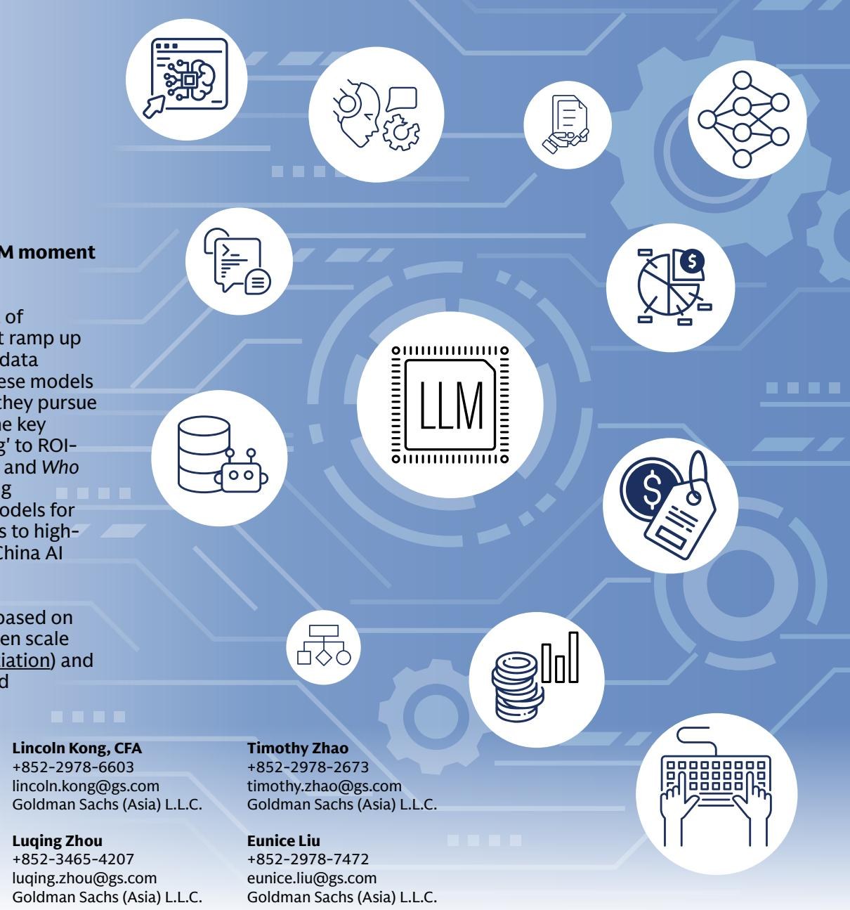

## □ □ □ □

Lincoln Kong, CFA
+852-2978-6603
lincoln.kong@gs.com
GS (Asia) L.L.C.

Luqing Zhou
+852-3465-4207
luqing.zhou@gs.com
GS (Asia) L.L.C.

Timothy Zhao
+852-2978-2673
timothy.zhao@gs.com
GS (Asia) L.L.C.

Eunice Liu
+852-2978-7472
eunice.liu@gs.com
GS (Asia) L.L.C.

GS does and seeks to do business with companies covered in its research reports. As a result, investors should be aware that the firm may have a conflict of interest that could affect the objectivity of this report. Investors should consider this report as only a single factor in making their investment decision. For Reg AC certification and other important disclosures, see the Disclosure Appendix, or go to www.gs.com/research/hedge.html. Analysts employed by non-US affiliates are not registered/qualified as research analysts with FINRA in the U.S.

## Table of Contents

Dissecting China open-source models unit economics today and path to profitability 4
PM Summary 5
Comparing China's key LLM players 11
Decoding China's AI model tokens & our forecasts on token/revenue share 12
How do Chinese models achieve competitive performance at low costs/tight computing resources? 13
Why are Chinese models pursuing an open source/open weight approach, and ways to monetize? 20
What are the key addressable markets, domestically and internationally, and key risks? 23
Who are best positioned to be the long term winners? Introducing our Competitive Positioning framework 26
Foundation models 26
Multi-modal generation models 32
Key upside and downside risks 37
China's key AI players at a glance 40
Price Target Methodology & Risks 47
Disclosure Appendix 49

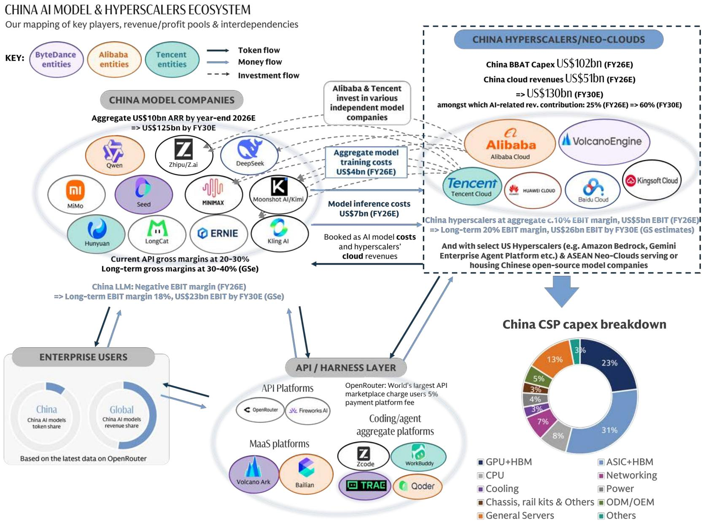

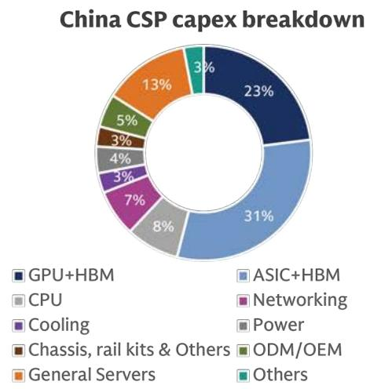  
1) The calculation of China cloud revenues includes Alibaba, Tencent, ByteDance, Baidu, and Kingsoft Cloud. 2) China CSP capex breakdown is based on GS Greater China Tech team estimates; 3) Companies included are for illustrative purposes and may not be an exhaustive list.

Source: Company data, GS Global Investment Research

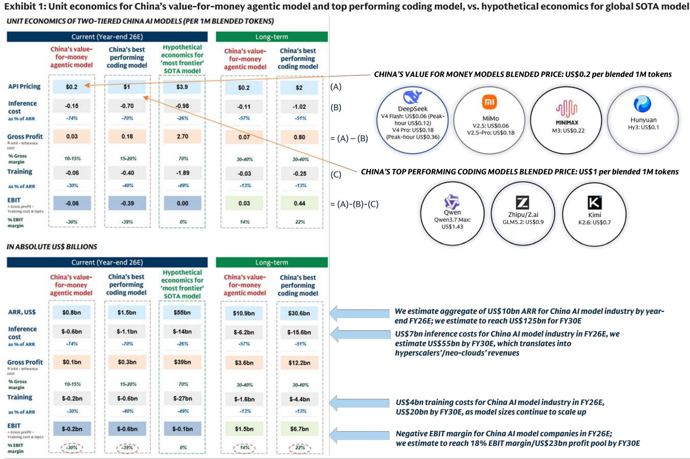

## Dissecting China open-source models unit economics today and path to profitability

Exhibit 1: Unit economics for China's value-for-money agentic model and top performing coding model, vs. hypothetical economics for global SOTA model UNIT ECONOMICS OF TWO-TIERED CHINA AI MODELS (PER 1M BLENDED TOKENS)

## IN ABSOLUTE US\$ BILLIONS

Source: Company data, GS Global Investment Research

We estimate aggregate of US\$10bn ARR for China AI model industry by year-end FY26E; we estimate to reach US\$125bn for FY30E

US\$7bn inference costs for China AI model industry in FY26E, we estimate US\$55bn by FY30E, which translates into hyperscalers'/neo-clouds' revenues

US\$4bn training costs for China AI model industry in FY26E, US\$20bn by FY30E, as model sizes continue to scale up

Negative EBIT margin for China AI model companies in FY26E; we estimate to reach 18% EBIT margin/US\$23bn profit pool by FY30E

## PM Summary

## From DeepSeek's moment last year (on cost efficiency) to Zhipu's GLM moment this year (on model intelligence)

China's AI open-source/open-weight models are reaching a critical point of intelligence performance vs. global proprietary models, with a significant ramp up in domestic enterprise adoption and a proliferation of global consumer and SME demand. In this report, we evaluate How these models achieve such performance at low costs/tight computing resources; Why they pursue an open source/open weight approach and how they monetize; What the key addressable markets are, where we highlight two favoured ARR quadrants and risk factors; and Who the potential long-term winners will be under our Competitive Positioning framework.

We believe Chinese models are reaching a critical 'good enough' stage for agentic tasks/specific coding scenarios, and rising fragmentation in China's AI model landscape (but the strong will get stronger). While pricing power remains strong for models with frontier performance/multi-modal, the lower-end segment is in a price war; nevertheless, Agentic AI is driving explosive demand for these value-for-money models at the lower-end. Access to computing will be a swing factor, where US/China regulations, balance sheet and inference efficiency are key.

Accordingly, we introduce our Chinese AI model Competitive Positioning framework based on pricing power, cost advantage and financial strength, overlaying with token scale and market share progressions, and identify Knowledge Atlas (Zhipu, initiation) and DeepSeek (private) as the strongest positioned in foundation models, and Bytedance (private) in multi-modal.

How do Chinese models achieve competitive performance at low costs/tight computing resources? By leveraging smaller-sized parameter models for equivalent benchmark performance, and Mixture-of-Expert and new architectural innovations. Chinese AI models are bifurcating into a two-tiered market where performance and time to market are key to pricing power, thereby leading to two 'ARR maximising' quadrants based on token adoption and pricing. A positive flywheel is taking effect for top Chinese AI models driven by increasing actual real world coding adoption, and reducing their reliance on model distillation practices.

Why are Chinese models pursuing an open source/open weight approach, and ways to monetize? Open source allows for greater flexibility in model training/deployment, and allows for the widest adoption and an open community. We believe open source models' disclosed ARRs are likely understating total deployment and revenue potentials, and we expect more shifts to open weight (with Community License, i.e., commercial terms if for commercial use) among Chinese AI models down the road.

What are the key addressable markets, domestically and internationally, and key risks? We highlight two favoured ARR quadrants and estimate China/China AI models market to see token growth of 25X by 2030E; the coding landscape to consolidate while the agentic/low-end segment could remain fragmented. International (going global) should be a key upside, with the potential for higher pricing and global proliferation, especially in non-US markets as global enterprises increasingly pivot from a token-maxing to a ROI-first model that prioritizes clear task boundaries, number of agents per day, back-end process automation and actual output over pure computational token volume. Key risk factors are market access/anti-distillation and regulations, including any stricter access to China's future most frontier models for overseas markets, access to highest-end leased computing equipment (used for training), market access to western markets, further restriction lists/entity list designations (but this could be positive for China's path to further AI self-sufficiency across software/CPU/ASICs), and competition from SLM/threat from AI architectures.

Who are best positioned to be the long term winners within China's AI model companies? We expect players with the largest ARR scale with a gross margin advantage + financial strength to be the long-term winners. We highlight independent AI model companies mostly stand out in our Competitive Positioning framework in pricing power + cost advantage (in aggregate represent over US\$200bn in implied valuations, based on latest market cap/funding rounds), where Zhipu and DeepSeek are the most strongly positioned in text based foundation models, while ByteDance leads in multi-modal capabilities based on our framework.

## Signposts we are looking for into 2H 2026

\- Harness/agentic applications: We expect China AI model companies to increasingly focus on positioning their harness/agentic applications as key entry points, especially in coding (e.g. Zhipu's ZCode, Tencent's Workbuddy, and Alibaba's Qoder which are aggregate platforms that support the full suite of AI models) as model companies attempt to close the loop in capturing more real-life coding and agentic data for scaling. Co-work and industry expert agentic products could be the next priorities. Enterprises will increasingly focus on overall cost per task instead of headline pricing per token, with an openness to using different models (multiple-models approach).

\- Multiple large parameter high-end coding model launches and potentially stricter access to the most advanced Chinese AI models outside of China: We anticipate multiple new Chinese AI model launches over 2H26 with significantly larger total parameter sizes of 2-5 trillion across Chinese AI model players. Coding/programming segment competition will intensify as Chinese models try to challenge Zhipu GLM's leadership via training on high-quality real-life coding data (where available) and scaling to larger parameter model sizes. We also expect a potential shift from an open-source to an open-weight approach for best-performing models (i.e. from free-for-all use cases to requiring revenue sharing/a take rate for commercial use). The addition of multi-modal/visual understanding will be the next upgrades amongst Chinese AI foundation models (e.g. for GLM, DeepSeek), while MiniMax M3 already excels in these given the multi-modal focus of MiniMax from the start. That said, we note press reports on potential future restrictions on overseas access to China's most advanced AI models (both closed and open source if at the frontier level) as cutting-edge artificial intelligence is increasingly being seen as a critical national asset.

Continued suppressed API pricing for the lower end agentic-focused segment: While DeepSeek recently announced an increase in peak-hour pricing from mid-July, we expect API pricing and therefore gross margins to remain under pressure at the lower-end pricing segment (around US\$0.1-0.2 per 1M tokens) into the second half, as China's AI model players have significant cash buffers post-fund raising to subsidize competitive pricing at zero/negative gross margins in the near term. As a result, we see financial strength as one of the three most important metrics (alongside pricing power and cost efficiencies) in assessing a Chinese AI model company, where cash on hand, net cash as % of assets and valuation multiples will be the critical financial strength metrics for long-term success. This said, we are Buy-rated on MiniMax as the company stands out on cost efficiency/cost advantage metrics under our Competitive Positioning framework. With its M3 model well positioned in the favored ARR maximizing quadrant (attractive pricing + high token volumes), alongside its discounted valuation at 13X P/2026E year-end ARR (vs. China/global peers which command multiples several times higher at similar ARR stage), we believe risk-reward is skewed to the upside and reiterate our Buy rating. Key swing factors for MiniMax to improve its overall competitive positioning will hinge on its pricing power and financial strength. We expect its H3 video generation model performance (imminent launch in a more favorable industry landscape vs. text models) and time-to-market for its next M3 updates (focusing on further coding intelligence level uplift from post-training/reinforcement learning, we estimate over July-Aug, and a larger parameter size M3 model later in 2H 2026) will be the next key drivers.

Multi-modal/video-generation models to see further ARR ramp-up from global adoption: We expect continued healthy industry pricing and gross margins within video generation (unlike foundation text) where key players ByteDance's SeeDance, Kuaishou's (Buy) Kling and MiniMax's Hailuo/upcoming H3 models to enjoy healthy growth over 2H 2026 amid new functionality breakthroughs (combination of video-generation with LLM) and tight computing resources where demand significantly outpaces capacity. According to China news reports like LatePost and 36Kr, ByteDance's Seedance gross margins have been at a healthy $70 \%$ at its latest US $\$ 2$ bn+ ARR run-rate.

We also expect increasing domestic ASICs supply, tighter access to overseas computing resources and potential market access limitations (could mirror TikTok's trajectory where rapid expansion in western markets was followed by more regulations/focus on ensuring data security where computing will have to be conducted within local jurisdictions).

## Our assessment of AI model companies: ARR scale x gross margin advantage + financial strength

■ Largest ARR scale (Token scale x pricing power)

■ Gross margin advantage (Training & Inference efficiency, Technology)

■ Financial strength (Balance sheet, Access to computing)

Accordingly, we lay out our Competitive Positioning framework for AI model players based on quantifiable metrics, 1) Pricing Power (amongst which, based on Time-to-market of model launch, Arena score based on actual usage cases and pricing

level), 2) Cost advantage (based on token volume scale, throughput/cache hit rate, parameter sizes/activation ratio and our estimate of inference gross margins), and 3) Financial strength (based on cash on-hand, net cash as % of assets, and valuation multiples).

Exhibit 2: Competitive positioning framework for AI model players

<table><tr><td>Key themes</td><td colspan="3">Chinese models reaching critical stage of intelligence for wide adoption across agentic tasks/specific coding scenarios</td><td colspan="3">Fragmentation between China AI models but strong to get stronger; pricing power to come from frontier performance/multi-modal</td><td colspan="2">Agentic AI driving higher demand for value-for-money models/SLMs</td><td colspan="2">Access to computing, where balance sheet and inference efficiency are key</td></tr><tr><td>Drivers of corporate performance</td><td colspan="10">Competitive positioning</td></tr><tr><td>CP category</td><td colspan="3">Pricing Power</td><td colspan="4">Cost advantage</td><td colspan="3">Financial strength</td></tr><tr><td>CP metrics</td><td>Time to market</td><td>Arena score</td><td>Pricing</td><td>Token volume</td><td>Throughput /Cache hit rate</td><td>Parameter size/ activation ratio</td><td>Inference GPM</td><td>Cash on hand</td><td>Net cash as % of asset</td><td>Valuation multiples</td></tr></table>

Source: GS Global Investment Research

Source: GS Global Investment Research

Exhibit 3: Overview of competitive analysis for key LLM labs' positioning

Alibaba Qwen: Full-stack AI player with multi-year AI/cloud upside, leading position of most areas

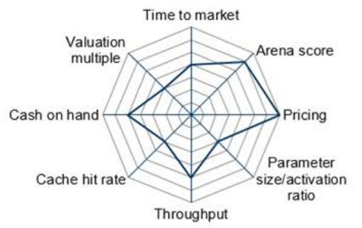  
Zhipu GLM: Leading model capabilities in coding/agentic scenarios  
Tencent Hunyuan: Strong contender after AI strategic revamp; potential in Weixin AI agent

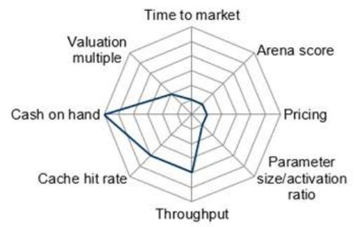  
MiniMax M-series: Unique full-modal capabilities among independent players; cost-efficient computing architectures

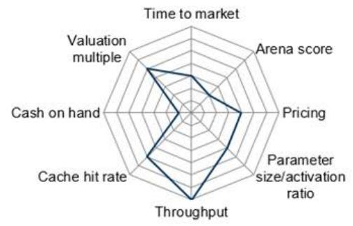  
DeepSeek: Extreme cost efficiency to sustain scalable token usage on competitive pricing

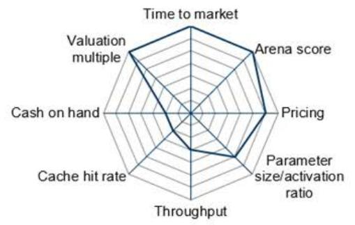  
N/A for DeepSeek/ByteDance valuation multiple

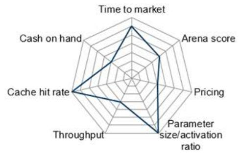

ByteDance Seedance: leading in model performance with strong financial/ecosystem back-up for quick adoption & commercialization

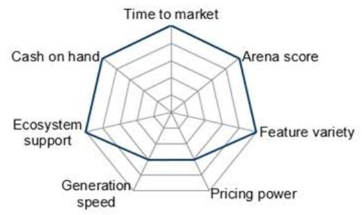

Exhibit 4: We identify two favorable ARR quadrants (in maximizing ARR) which is a combination of maximizing token volumes and/or pricing level  
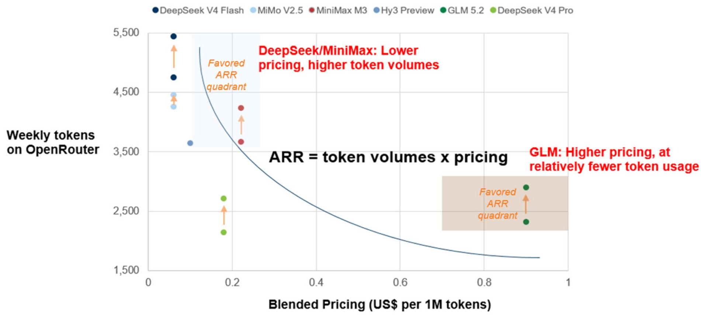  
Source: Company data, OpenRouter, GS Global Investment Research

## Related research

Americas Technology: Decoding the Agentic Economy - The Coming Inflection in AI Usage and Margins, 5 May 2026, by James Schneider, Eric Sheridan and team

Global Server: Raising both AI and General servers; better mix and higher memory costs drive CSP spending, 24 June 2026, by Allen Chang and team

Knowledge Atlas Technology (2513.HK): Initiate with Neutral at US\$110bn valuation; China's top enterprise/coding AI model, July 10, 2026

MiniMax Group (0100.HK): Key focuses post-share unlock; upside skew to risk-reward; Buy, July 10, 2026

## Comparing China's key LLM players

Performance: China LLM labs keep climbing up the Text Arena ranking, with flagship models hitting new high

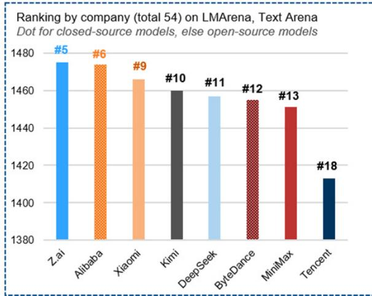

Two-tier price: premium pricing on model intelligence vs. low cost for price-sensitive demands  
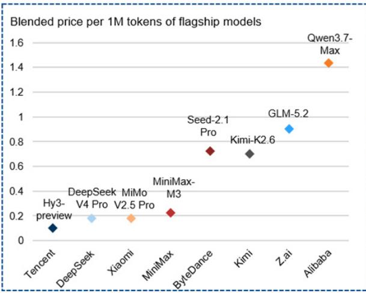  
Speed: first-party API performance to reflect inference efficiency and infra capabilities

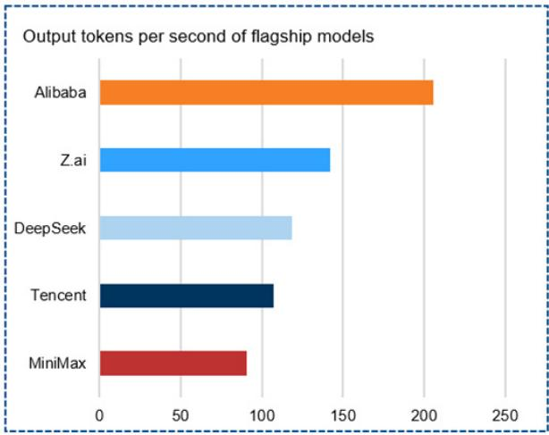

P&L: mega-caps AI funding from stable profits while independents still scaling in commercialization  
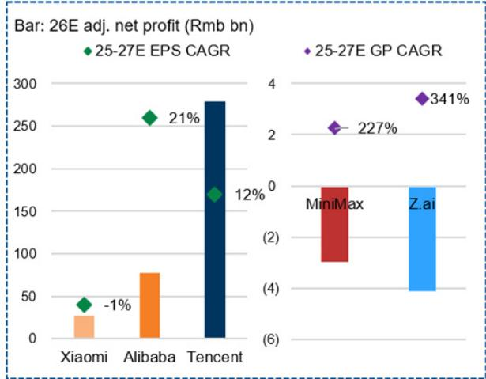  
Source: Company data, GS Global Investment Research, WSJ, Artificial Analysis

Valuation: latest market caps and reported private valuation for LLM players  
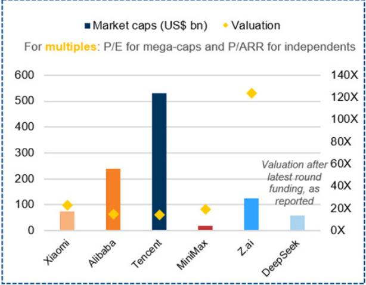

Model updates into 2026: faster iteration with rising intelligence level  
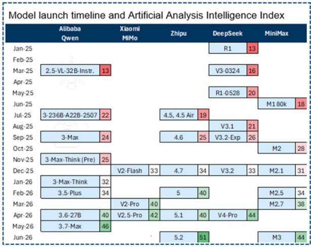

## Decoding China's AI model tokens & our forecasts on token/revenue share

By 2030, we estimate tokens generated by China AI model companies will be 25X higher than today  
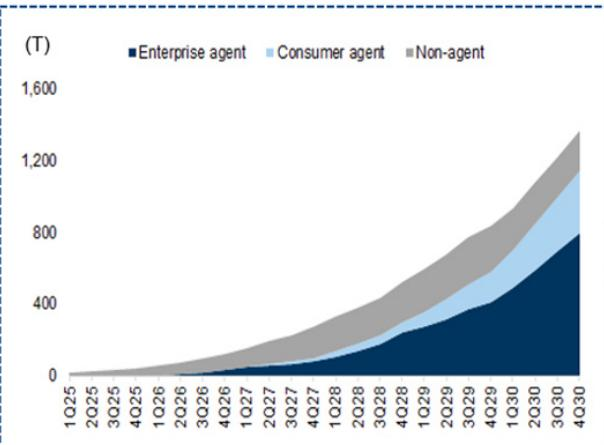  
We estimate overseas tokens generated by China AI model companies will reach $55\%$ of global tokens by 2030E

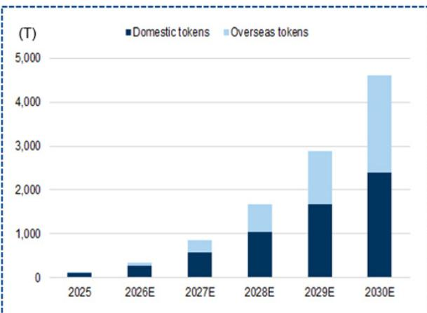

We expect ByteDance and DeepSeek to account for $80\%$ of tokens generated by China AI model companies by 2030E  
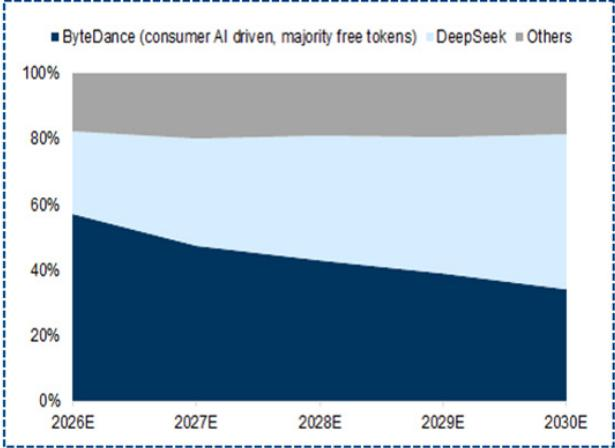

Our US research team estimates consumer and enterprise agents could push token consumption 24X above today's global capacity (ex-China)  
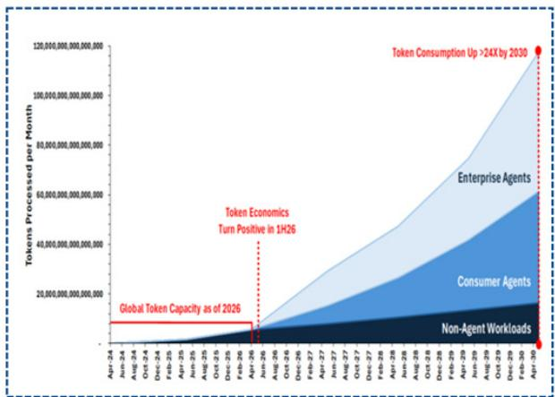

We estimate China AI API + subscription revenue pool to reach US\$125bn in 2030E  
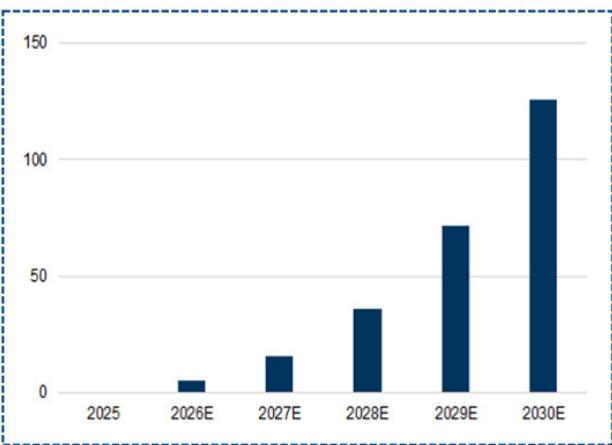

We expect Zhipu and DeepSeek to capture most of the incremental revenue pool  
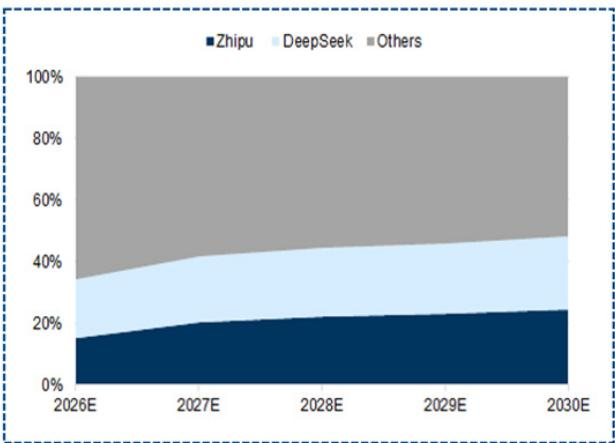  
DeepSeek/Bytedance/Zhipu's (Not Covered) relevant metrics (e.g. token consumption/revenue) are calculated by analyzing the industry and companies that we cover, and then extrapolating them to DeepSeek, Bytedance and Zhipu.  
Source: GS Global Investment Research

## How do Chinese models achieve competitive performance at low costs/tight computing resources?

## Smaller-sized parameters models for equivalent benchmark performances, Mixture-of-Expert and new architectural innovations

Compared with a year ago, Chinese models' coding and agentic capabilities have reached a critical level in being able to complete more coding and autonomous agentic tasks with higher success rates as context windows have been expanded to 1 million tokens. The smaller parameter model sizes of Chinese models (spanning from 200bn to 1.6T parameters, at 2-10% of leading SOTA models, due to constrained access to high-end computing), and highly efficient architectures (MoE, Sparse Attention, OCR etc., at 3-5% activated parameters only vs. total parameter sizes) all contribute to the much lower training and inference costs for Chinese models vs. leading US models. We would attribute the recent step improvement of Chinese models in coding according to Arena.ai to data curation, distillation techniques and reinforcement learning post training, despite their relatively small parameter model sizes (1.6T for DeepSeek V4 Pro, 0.7T for Zhipu's GLM5.2 and 0.4T for MiniMax's M3). On June 27, DeepSeek introduced DSpark, a speculative decoding framework that makes existing DeepSeek-V4 models serve faster. DSpark has already been deployed in DeepSeek-V4 Flash / Pro online serving, improving per-user DeepSeek-V4 generation 60-85% faster on V4-Flash and 57-78% faster on V4 Pro without changing the model's weights or output quality.

Chinese AI models bifurcating into two-tiered market (where performance and time to market are key to pricing power), with two 'ARR maximising' quadrants based on token adoption and pricing

We are seeing pricing power for the highest performing Chinese AI models, e.g. Zhipu's GLM5.2 model and Alibaba's Qwen3.7 Max models at around US\$1 per blended 1M tokens, at 5X that of low-end Chinese AI models. The reported tighter US processes in allowing most SOTA model access has also opened new arenas for China's top performing coding models for enterprises and SMEs. Smaller parameter and activated ratios allow China's top performing models to be priced at US\$1, 10-25% vs. US SOTA models at US\$4-8 per blended 1M tokens, while generating double digit 10-20% gross margins (GSe) that are lower than global SOTA models due to relatively lower pricing power.

In the lower end segment, agentic focused models are priced at US\$0.06-0.2 per blended 1M tokens, which are enabling these models to tap into new global TAMs for price sensitive SMEs and one-man companies. MiniMax generates 60-70% revenues from overseas.

We also note DeepSeek announced that its V4 official version is set for launch in mid-July, alongside the introduction of peak/off-peak API pricing to better allocate resources and improve service stability. V4 Pro/Flash non-peak pricing remains unchanged, while peak hour (9am-12pm/2pm-6pm China time) will be charged at 2X non-peak rates, implying blended

Baseline date for Text/WebDev (Coding) Arena ranking = 3/18/2026, and current date refers to latest date available, i.e. 6/16/2026 & 6/20/2026. Agent Arena ranking started at June 5, 2026, with current date = 6/30/2026

Source: LMArena, Data compiled by GS Global Investment Research pricing of US\$0.35/US\$0.12 per 1M tokens due to strong Chinese AI model demand that is increasingly causing significant compute tightness in work/productivity scenarios.

Positive flywheel is taking effect for top Chinese AI models from increasing actual real world coding adoption, with less reliance on model distillation ahead

Compared with learning and distillation tactics from global SOTA models in the past, we believe top Chinese models like GLM5 are reaching a critical stage of adoption by China's major enterprises and global users. As per LatePost, AI-generated code has increased to as high as 90% at some China mega-cap companies, up from 20-30% in 2H25, which we believe will enable a positive data flywheel effect of further improvements via reinforcement learning with actual user data (both successful and unsuccessful coding cases) and post training. We think these have underpinned the step improvements in GLM5.2 from GLM5.1 in just over the course of a few months in 2026, and we expect to see further step improvements to Chinese AI models over the next 6-12 months.

Exhibit 5: China's model count is rising in top rank bands across usage (text, coding and agent) LMArena ranking of Text, WebDev (Coding) and Agent Arena

<table><tr><td colspan="3">Text Arena</td><td colspan="3">Code Arena</td><td colspan="3">Agent Arena</td></tr><tr><td></td><td>3 months ago</td><td>Current</td><td></td><td>3 months ago</td><td>Current</td><td></td><td>early-June</td><td>Current</td></tr><tr><td>Top 10%</td><td rowspan="2">7</td><td rowspan="2">10 $\triangle 3$ </td><td>Top 10%</td><td rowspan="2">0</td><td rowspan="2">2 $\triangle 2$ </td><td>Top 30%</td><td rowspan="2">0</td><td rowspan="2">1GLM 5.2 at #7</td></tr><tr><td># of China model ranked within the top</td><td># of China model ranked within the top</td><td># of China model ranked within the top</td></tr><tr><td>Top 30%</td><td rowspan="2">43</td><td rowspan="2">49 $\triangle 9$ </td><td>Top 30%</td><td rowspan="2">6</td><td rowspan="2">11 $\triangle 5$ </td><td>Top 50%</td><td rowspan="2">1</td><td rowspan="2">3 $\triangle 2$ </td></tr><tr><td># of China model ranked within the top</td><td># of China model ranked within the top</td><td># of China model ranked within the top</td></tr><tr><td>Top 50%</td><td rowspan="2">70</td><td rowspan="2">83 $\triangle 13$ </td><td>Top 50%</td><td rowspan="2">9</td><td rowspan="2">20 $\triangle 11$ </td><td></td><td></td><td></td></tr><tr><td># of China model ranked within the top</td><td># of China model ranked within the top</td><td></td><td></td><td></td></tr><tr><td colspan="3">Leading China AI labsZHIPU·AI Zhipu GLM Alibaba Qwen Kimi ByteDance Seed DeepSeek Xiaomi MiMo MiniMax Tencent Huny uan</td><td></td><td colspan="2">Best China model rankGLM-5 ZHIPU·AI GLM-5.2 #9/56 → #2/90</td><td>Legal LegalBench Finance Agent v2</td><td>By agentic domainMINIMAX#9 #1 in open-source models#8</td><td>ZHIPU·AI#17#7 #1 in China models</td></tr></table>

Exhibit 6: Notably in coding/agentic tasks, Chinese players are reaching global top-tier positions As of Jun 20, 2026

Chinese AI models on Agentic benchmark ranking (52 models in total) GDPval-AA v2 - evaluating performance on real-world work tasks

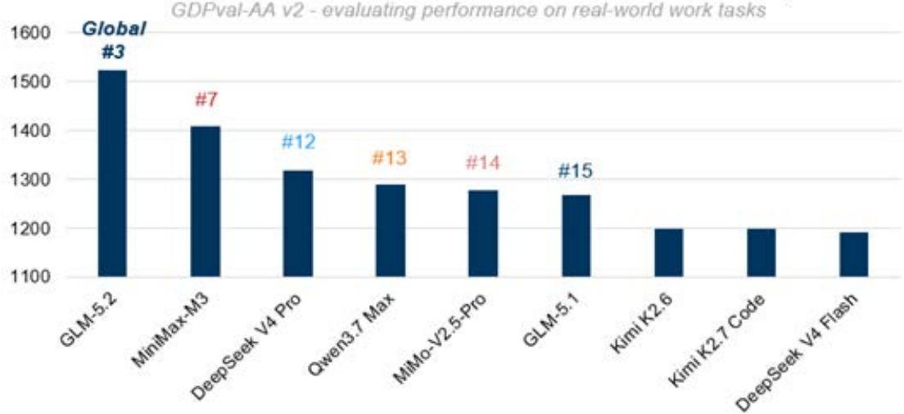

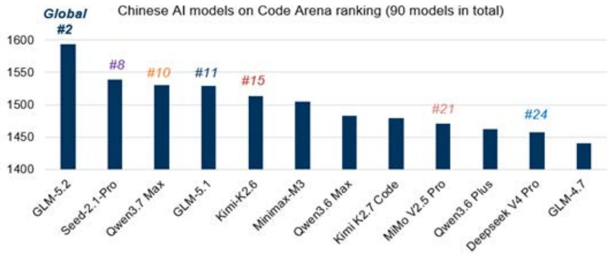  
Source: GDPval-AA, LMArena, Data compiled by GS Global Investment Research

Exhibit 7: Compared with global SOTA leading models of several tens of trillions, China open source models are mostly around or below 1 trillion parameter in size, and adopt a MoE structure, with low activated to total parameter ratios for higher inference efficiency

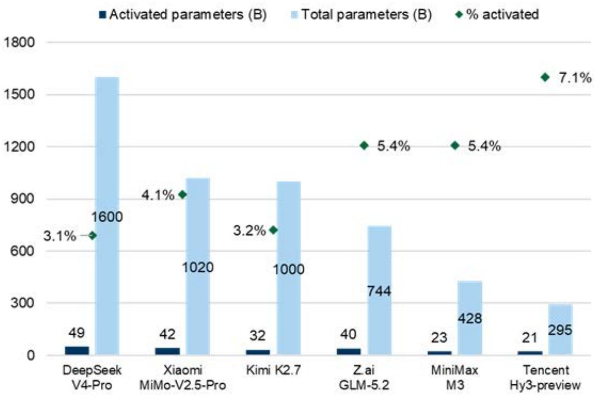  
A Mixture-of-Experts (MoE) structure is a sparsely activated neural architecture, where it dynamically selects a small subset of expert networks to process each input, allowing the model to increase its total capacity without activating all parameters during inference.

Exhibit 8: Blended LLM token price (SDLLMTK) has been declining since early June, potentially driven by rising adoption of cost effective China models
US\$ per 1M tokens  
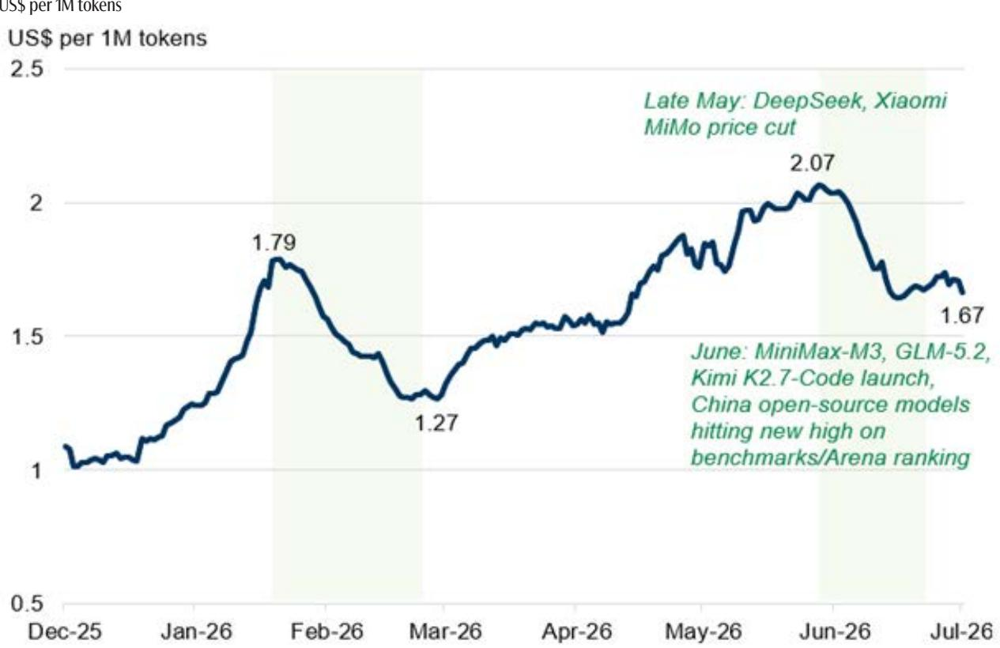  
Source: Silicon Data, Bloomberg, Data compiled by GS Global Investment Research  
The Silicon Data LLM Token Expenditure Index (SDLLMTK) is a daily blended measure of what the market actually pays to run LLM inference across frontier and open-weight models.

Exhibit 9: Historical and projected capex for major US & China cloud service providers
US\$bn

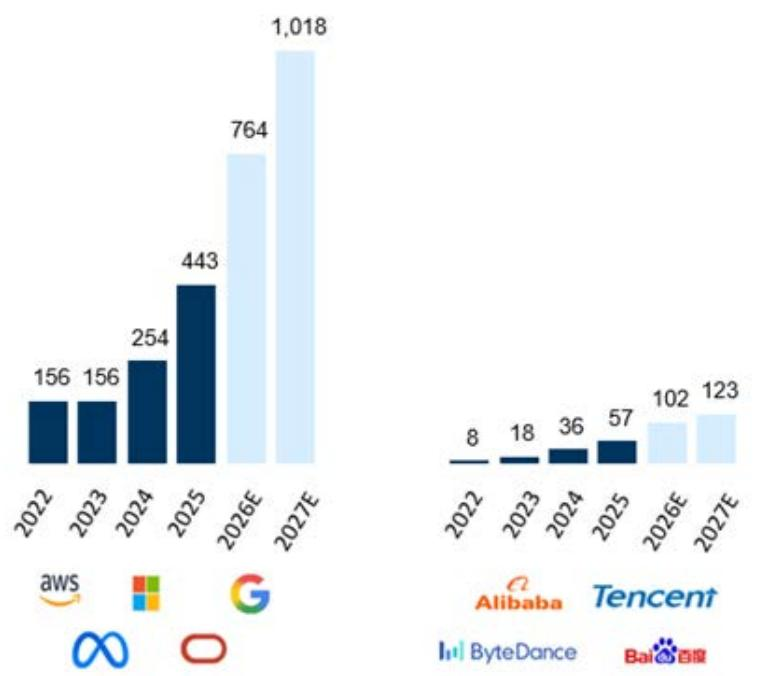  
Exhibit 10: Capex to operating cash flow ratio is still healthy for China hyperscalers

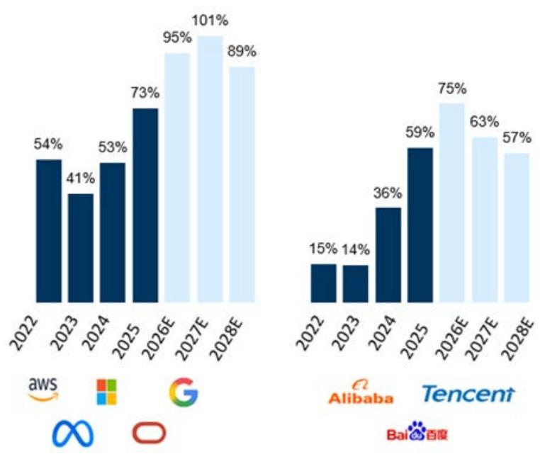  
We calculate Bytedance's (Not Covered) relevant operating metrics by analyzing the industry and companies that we cover, and then extrapolating them to Bytedance.  
Source: Company data, GS Global Investment Research  
Source: Company data, GS Global Investment Research

## Case study on Meituan's LongCat 2.0: A milestone for China's domestic AI infrastructure

Released on June 30, 2026, we believe Meituan's LongCat 2.0 marks a major milestone as China's first official 1.6 trillion-parameter open-source Mixture-of-Experts (MoE) model trained and deployed entirely on a 50,000-card domestic compute cluster. Purpose-built for agentic coding and complex software engineering workflows, the model features a native 1-million-token context window enabled by LongCat Sparse Attention (LSA) and dynamically activates an average of 48 billion parameters per token to optimize inference costs. Implications for a more self-sustainable China AI model outlook that is less reliant on foreign high-end chips for model training: The successful end-to-end pre-training and inference of a trillion-parameter class model on Chinese silicon (reportedly utilizing Huawei Atlas-950 SuperPods) fundamentally drives a more sustainable China's AI model development outlook, in our view. While previous Chinese flagship models, such as DeepSeek V4-pro, mentioned domestic chips for inference, LongCat 2.0's ability to overcome critical memory bottlenecks

and distributed stability challenges during the compute-heavy pre-training phase proves the viability of a wider and more localized hardware stack for AI model training in the future.

Exhibit 11: Alibaba capex-to-revenue conversion ratio vs. Amazon and Google Rolling 12m incremental cloud revenue/rolling 12m capex (lagged by 1 quarter)

Capex-to-revenue conversion  
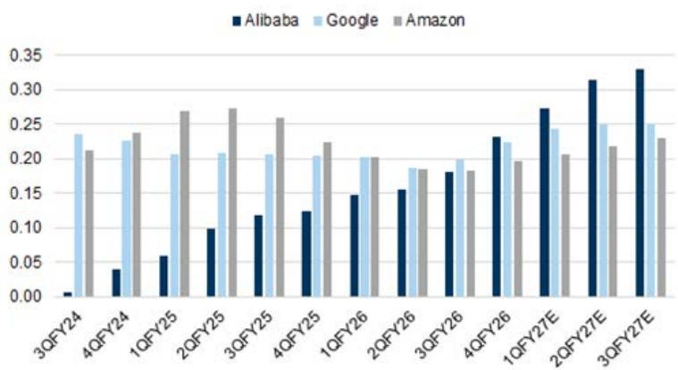  
We benchmark Alibaba external cloud revenue growth to Google and Amazon Cloud (lagged c.2 years)  
Source: Company data, GS Global Investment Research  
Exhibit 12: China Internet yearly capex forecast US\$mn

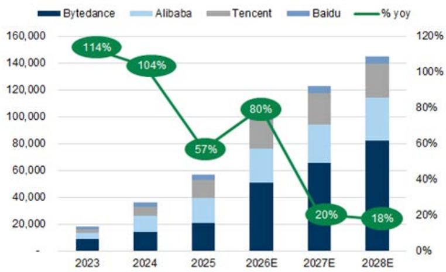  
For ByteDance (Not Covered), we impute capex based on industry trends.  
Source: Company data, GS Global Investment Research, Bloomberg

## Why are Chinese models pursuing an open source/open weight approach, and ways to monetize?

## Open source allows for higher flexibility in model training/deployment, and allows for the widest adoption and an open community

Alibaba's Qwen model family has long pursued an open source approach (before adopting a closed source for its largest and highest performing Qwen-Max models for better monetization), while other key Chinese AI model players have mostly pursued an open source/open weight approach including DeepSeek, Zhipu's GLM and MiniMax M3 series models with the exception of ByteDance's full closed proprietary approach for its Seed model. We believe the open source approach allows for the highest flexibility in terms of the locations of where models are trained (and thus where the models can be deployed both inside and outside of Mainland China after training). An open source approach also allows for the highest adoption
