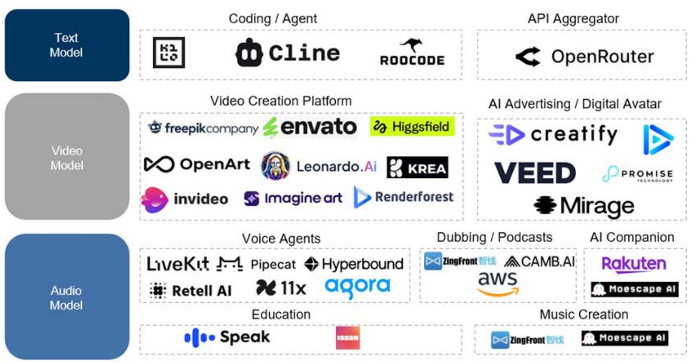
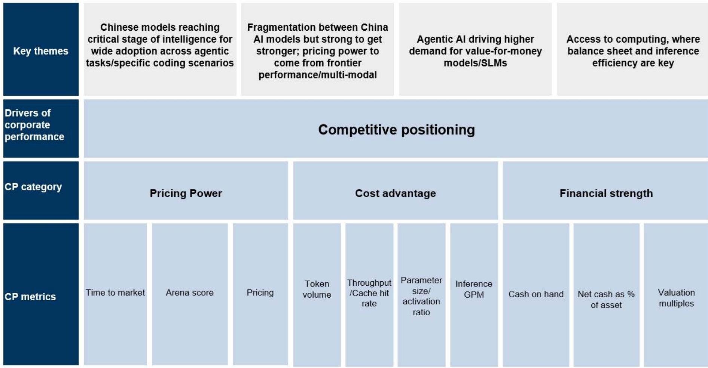

# 中国开源AI模型已跨越关键门槛，将重塑全球企业采用格局

围绕中国人工智能的叙事，已从追赶的故事转向成本效率的故事。如今，这个叙事已不完整。一个新阶段已经开始，其定义不是每Token的价格，而是一个更具决定性的指标：每参数的智能水平。中国开源权重模型已跨越一个性能门槛，使其不仅适用于实验性部署，更能用于关键任务的企业工作流程，特别是在智能体任务和专业编程场景中。这不是对未来能力的预测，而是对现状的描述。

使这一时刻与去年DeepSeek驱动的成本叙事有结构性不同的是，前沿领域出现了真正的竞争性智能。智谱的GLM系列在基准测试中展现出缩小与全球专有模型差距的性能，这种差距的缩小对实际部署具有重要意义。其直接影响是：全球那些出于好奇而试用中国模型的企业，现在应出于战略必要性来使用它们。成本论始终关乎效率，智能论则关乎可行性。当两者交汇，采用曲线将变得陡峭。

所涉及的规模不容小觑。行业估算显示，到2026财年末，中国AI模型行业可能产生约100亿美元的年度经常性收入，到2030财年这一数字可能达到1250亿美元。这些数字假设了一条依赖于持续性能提升、企业持续采用以及不限制访问的监管环境的轨迹。这些假设中的每一个都值得审视，但方向是明确的。市场是真实的，其增长速度超过了大多数西方企业在采购策略中的预期。

本报告评估了基于这一论点产生的四个问题。中国模型如何在计算资源更紧张的情况下实现有竞争力的性能？它们为何采用开源权重策略，又如何实现商业化？可寻址市场是什么，哪些细分领域提供了最具吸引力的风险回报特征？最后，哪些参与者最有可能成为长期赢家？答案指向一个分化、竞争激烈且比当前讨论所暗示的更具战略重要性的市场。

## 中国模型通过架构创新实现竞争性智能，而不仅仅是蒸馏

对中国模型性能的传统解释是蒸馏：在更大前沿模型的输出上训练更小的模型。这种解释越来越不充分。虽然蒸馏在早期模型中发挥了作用，但当前领先的中国模型已超越了这一阶段。证据在于它们的架构。这些模型通过使用相对于全球同行更少的参数数量，结合混合专家架构和新颖的注意力机制来最大化参数效率，从而实现了有竞争力的基准测试结果。

这一点很重要，因为它改变了推理的单位经济性。一个能以更少激活参数实现前沿性能的模型，拥有结构性成本优势，这种优势是依赖暴力扩展的竞争对手难以复制的。在智能体领域，中国模型每百万Token的成本已经是全球专有替代方案的一小部分，这种差距并非纯粹由补贴定价造成，而是内置于架构之中。

对企业采购者的影响是直接的。大规模部署中国模型的总拥有成本更低，不是因为暂时的价格战，而是因为底层模型是为效率而设计的。这种优势在高容量、低复杂度的智能体任务中最为显著，在这些任务中，模型更小的激活比率直接转化为更低的计算成本。对于每天运行数千或数百万次智能体查询的企业来说，节省的成本是实实在在且不断累积的。

## 开源权重策略创造了比封闭模型更广泛的采用面

中国AI公司采用开源权重分发，既有战略原因也有结构性原因。开源权重允许在部署上具有更大的灵活性，使企业客户能够进行定制，并建立一个通过实际使用数据为模型改进做出贡献的开发者社区。这些模型披露的ARR数字几乎肯定低估了总部署和收入潜力，因为它们只捕获了直接的API收入，而没有包括通过本地部署、微调服务和下游应用收入产生的价值。

战略考量正在演变。几家领先的中国模型开发者预计将从完全开源转向带有社区许可的开源权重，为企业使用设定商业条款。这是一个自然的演进。最初的开源阶段是为了采用和数据收集。下一阶段将是在不牺牲开放性生态系统效益的前提下实现商业化。对于企业采购者来说，这意味着免费或近乎免费访问前沿中国模型的窗口正在缩小，但部署这些模型的价值主张仍然具有吸引力。

商业化模式不仅限于API定价。最成熟的中国AI公司正在其模型之上构建工具和智能体应用层，将这些平台定位为企业客户的主要入口。智谱的ZCode、腾讯的Workbuddy和阿里巴巴的Qoder就是这种策略的例子。这些平台支持全套AI模型，旨在闭环捕获真实的编程和智能体数据。模型本身成为更高利润应用生态系统的引流产品。

## 可寻址市场分化为两个ARR最大化象限

并非中国AI模型市场的所有细分领域都同样具有吸引力。市场正在分化为两个层级。在前沿领域，在编程和多模态任务中表现强劲的模型享有溢价定价和健康的毛利率。在低端市场，智能体和通用模型的价格战正在进行，API定价被压缩到短期内意味着零或负毛利率的水平。

战略洞察在于，最具吸引力的ARR最大化位置位于两个极端：要么高定价伴随中等Token量，要么高Token量伴随中等定价。中间地带，即定价承压且Token量尚未规模化，是最不具吸引力的。这一框架表明，评估中国模型参与者不应基于其相对定价水平，而应基于其在2x2矩阵中的位置。

智能体领域尤其有趣，因为尽管定价低，但它正在推动爆炸性的需求增长。企业正在将这些模型用于客户服务自动化、内部工作流优化和代码生成，其使用量远超传统的LLM用例。单位经济性很薄，但量很大。能够通过架构创新在这一领域实现规模并保持成本效率的参与者，将处于有利位置，以在市场成熟时捕获长期价值。

## 竞争定位框架揭示了三个不同的赢家

基于定价能力、成本优势和财务实力对中国AI模型公司进行的系统评估，得出了一个清晰的层级。在基础模型类别中，智谱和DeepSeek成为定位较强的参与者。智谱的GLM系列在编程和智能体场景中领先，而DeepSeek的极致成本效率使其能够在有竞争力的定价下实现可持续的Token使用。两家公司都展示了在负利润率时期生存并成为长期赢家所必需的技术能力和财务资源组合。

在多模态领域，字节跳动的Seedance保持明显领先。该公司受益于强大的模型性能，以及深厚的生态系统和财务支持，使其能够快速采用和商业化。据报道，Seedance的毛利率一直健康，视频生成领域继续享有基于文本的基础模型市场已失去的定价能力。

该框架还突出了一个关键弱点。在这个市场中，财务实力并非可有可无。当前补贴定价和负毛利率的环境意味着，没有大量现金储备的公司将难以在整合阶段生存。估值倍数、净现金占总资产的比例以及计算资源的获取，不是次要考虑因素，而是长期生存能力的主要决定因素。

## 报告尚未完全回答的问题

分析留下了几个未解决的问题，这些问题将决定关于中国AI模型的看涨论点是否能按预期实现。最重要的是监管准入的轨迹。对海外访问中国最先进前沿模型的任何更严格限制，都将从根本上改变这些公司的可寻址市场。报告指出了这一风险，但未解决它，因为监管结果本质上是不确定的。

第二个未解决的问题涉及成本优势的可持续性。如果全球前沿模型采用类似的架构创新，效率差距可能会缩小。当前中国的优势是结构性的，但并非永久性的。双方的创新速度将决定差距是扩大还是缩小。

第三，报告没有完全解决来自小型语言模型和替代AI架构的竞争威胁。如果市场转向更小、更高效的专业化任务特定模型，当前中国的竞争定位可能会被颠覆。更大参数模型将继续主导的假设可能被证明是错误的。

## 企业采购者的决策框架

对于评估中国AI模型的企业技术领导者来说，从这一分析中得出的框架是三维的。首先，评估具体用例。对于高容量智能体任务和专业编程场景，中国模型提供了难以匹敌的具有竞争力的成本性能比。对于需要相对最高基准分数的前沿推理任务，全球专有模型仍具有优势。

其次，评估总拥有成本，而不仅仅是API定价。中国模型的架构效率意味着，即使在考虑定价差异之前，推理成本就已经更低。运行大规模部署的企业应针对不同模型架构的参数激活比率来建模其总计算需求。

第三，考虑生态系统风险。大规模部署中国模型会形成对可能变化的监管环境的依赖。企业应有包含替代模型提供商和本地部署选项的应急计划。中国模型的开源权重性质在这里是一个优势，因为它提供了封闭模型所不具备的可移植性。

最重要的决策是时机。等待监管明确或性能持平可能意味着错过最大成本优势的窗口。当前中国模型对大多数企业用例足够好且定价有显著折扣的时刻，不太可能无限期持续。现在行动的企业将同时获得成本效益和早期部署的学习优势。

## 加入社区阅读完整报告并查看原始图表

完整报告包括每个主要中国AI模型参与者的详细竞争定位评分、到2030年的Token量和收入份额专有估算，以及支撑看涨论点的单位经济性详细分析。它还包含映射两个ARR最大化象限的原始图表，以及识别较强长期赢家的竞争定位框架。对于需要就中国AI模型做出明智决策的企业采购者、读者和策略师来说，完整分析提供了本摘要仅能介绍的深度。

*仅供参考。部分内容可能基于源材料通过AI辅助生成、翻译、总结或编辑，可能包含遗漏或错误。请独立核实。这不是专业建议。*

仅供参考。部分内容可能基于源材料通过AI辅助生成、翻译、总结或编辑，可能包含遗漏或错误。请独立核实。这不是专业建议。

