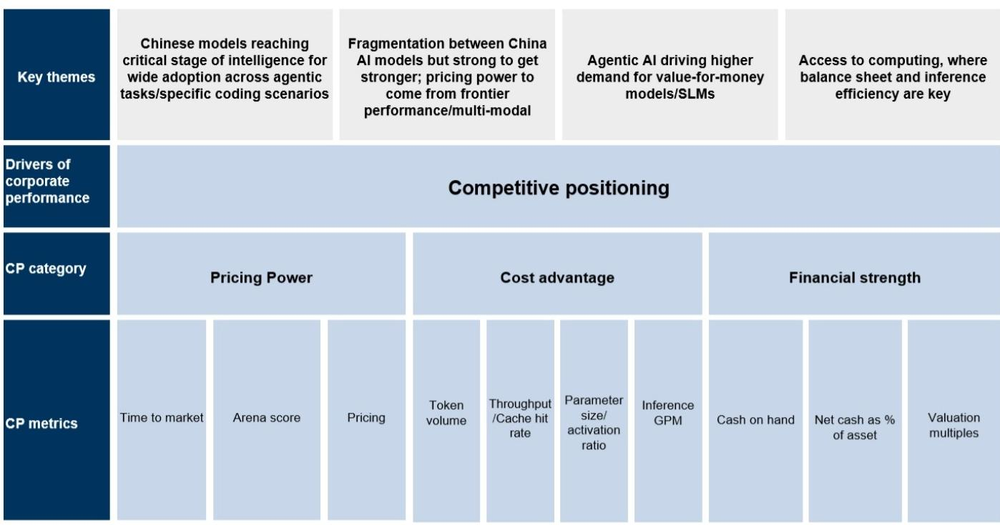
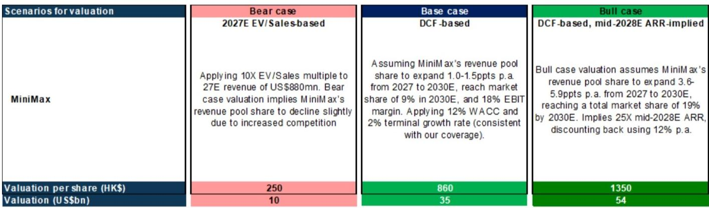
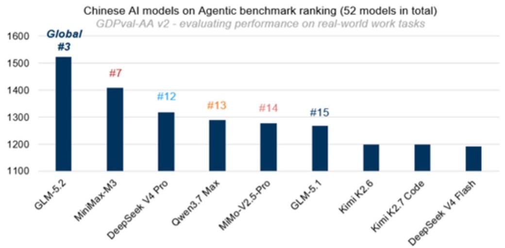

# GS：中国AI公司竞争格局中，MiniMax靠成本效率突围

MiniMax在6月发布M3模型后的报价表现，并没有完全反映这家公司的真实位置。GS在最新一份报告中给出了一个值得注意的判断：以13倍2026年末ARR估值，MiniMax在同类公司中属于明显偏低的一档。更关键的是，报告认为，这家公司的不确定性回报比正在向有利方向倾斜，而市场可能低估了两个即将落地的催化剂。

这并非一个简单的“估值修复”故事。GS的框架将中国AI模型公司置于一个竞争定位矩阵中，核心维度是成本效率与商业化能力。MiniMax脱颖而出的理由，恰恰是它用更小的参数量实现了与头部模型相近的性能——M3的0.4万亿参数模型，在多项基准上与DeepSeek V4 Pro的1.6万亿参数模型表现相当。这意味着，每token的成本优势，是它最硬的底牌。

## 1. 锁定期结束，市场焦点将从筹码转向基本面

7月9日，MiniMax的基石读者和Pre-IPO股东解禁。在此之前，市场对筹码供给的担忧一直是压制报价的因素之一。GS对比了智谱（Knowledge Atlas）的情况——智谱的Pre-IPO锁定期长达12个月，要到2027年1月才解禁，这在某种程度上造成了供需失衡。MiniMax的锁定期较短，解禁后反而将不确定性提前释放。

报告预计，从2026年下半年开始，读者将更关注公司基本面驱动因素，而非筹码结构。8月潜在的南向通纳入，也将为资金面提供增量支持。

> **KC评论：** 解禁不等于抛售。GS的逻辑是，在模型持续迭代的窗口期，基本面叙事会逐步盖过筹码叙事。完整报告里有一张催化剂时间表，把H3视频模型、M3大参数版本、南向通等节点逐一标出，值得细看。

## 2. 视频生成模型H3，可能是被低估的估值锚点

MiniMax即将发布的新一代视频生成模型H3，是报告中着墨最多的催化剂。相比上一代，H3在架构上有明显升级——将M3大语言模型的能力整合进DiT架构，用以增强对人体动作和物理关系的理解。公司还透露，已在引入专业人才，探索长剧和电影制作市场。

GS在这里做了一个有趣的估值对比：视频生成平台Kling AI最新一轮融资的投后估值已达180亿美元，而MiniMax当前市值仅约120亿美元，且包含了M3文本模型、H3视频模型，以及音乐、音频等多模态能力。换句话说，市场给MiniMax的估值，几乎只反映了文本模型的价值，视频和多模态部分可能被完全忽略。

## 3. 定价权之争，才是下一阶段的核心胜负手

GS对中国AI模型层的竞争格局有清晰的排序：DeepSeek和智谱在基础模型领域较强，字节跳动在多模态领域占优，而MiniMax的差异化优势集中在成本效率。但成本优势能否转化为定价权，是公司整体竞争定位能否提升的关键。

报告指出，M3.1（预计7月底8月发布）将通过后训练和强化学习进一步提升编程智能水平，而更大参数版本的M3模型（预计2026年下半年推出）将帮助MiniMax进入中国AI编程模型的高端定价区间。同时，H3视频模型的商业化能力，将是检验定价权能否落地的第一个真实场景。

> **KC评论：** GS反复强调的“定价权”，本质上是问一个问题：当你的模型性能不输对手、成本更低时，你能否把省下来的成本变成利润，而不是全部让利给客户？这需要看H3和M3.1的定价策略。报告里没有给出答案，但提出了观察框架。

## 4. 报告尚未完全回答的关键问题：盈利路径与资金耐力

GS对MiniMax的营收增长预期非常激进：2026年收入3亿美元，2027年8.8亿美元，2028年24.7亿美元。但EBITDA在2028年之前仍为负值。这意味着，公司需要在高速增长的同时，保持足够的资金耐力。

报告提到了MiniMax已宣布相关市场上市计划，这将是改善资本结构的重要一步。但GS也列出了明确的不确定性：模型竞争弱于预期、盈利路径慢于预期、商业化能力不足、知识产权与内容生成不确定性、现金消耗与自我造血能力，以及中美技术竞争下的地缘政治不确定性。

对于一家仍在亏损、但ARR从1亿美元快速攀升至4亿美元的公司而言，资金耐力与模型迭代速度之间的平衡，将决定它能否从“成本效率领先者”进化为“定价权拥有者”。而这，恰恰是报告留给读者自己去跟踪的问题。

For informational purposes only. Portions may be generated,translated,summarized,or edited with AI assistance based on source materials and may contain omissions or errors. Please verify independently. This is not investment,legal,tax,accounting,or other professional advice.

For informational purposes only. Portions may be generated,translated,summarized,or edited with AI assistance based on source materials and may contain omissions or errors. Please verify independently. This is not investment,legal,tax,accounting,or other professional advice.

