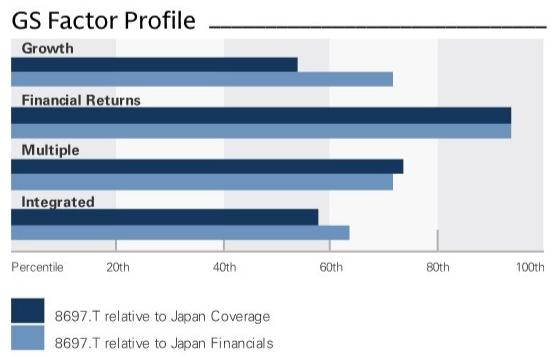
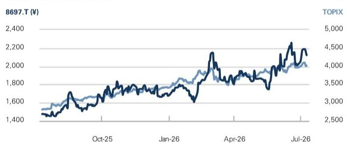

# Japan Exchange Group (8697.T)

Raising our target price on higher trading value and turnover; maintain Buy; trading value ex AI stocks also strong

8697.T

12m Price Target: ¥2,400

Price: ¥2,122

Upside: 13.1%

We adjust our earnings estimates and raise our target price by 23% for JPX, reflecting recent earnings, trading value trends, and changes in the interest rate environment. ADTV for April-June 2026 was ¥12.392 tn (domestic common stocks, ETFs/REITs), representing a +106% yoy increase, with strong growth of +63% yoy in April, +118% yoy in May, and +139% yoy in June. Turnover (trading value divided by market cap) is also up, reaching 193% in April, 244% in May, and 250% in June. Although AI-related stocks contributed significantly, ADTV excluding AI stocks (calculated by subtracting the trading value and market cap of AI-related stocks) also grew sharply by +49-137% yoy in April-June, with non-AI turnover also up substantially at 175% in April, 230% in May, and 244% in June. This expansion in trading activity could be attributed to increased trading by foreign and retail investors, possibly driven by expectations for corporate governance reforms.

We adjust our profit estimates for JPX using the past 12-month average adjusted turnover (excludes AI-related stocks from both the numerator and denominator for monthly turnover) to eliminate AI-related volatility. Even when excluding AI-related stocks, turnover remains high, and we therefore make upward adjustments to our ADTV estimates of +38% for FY3/27, +22% for FY3/28, and +26% for FY3/29. At the same time, factoring in capacity updates for the “arrowhead” equity order processing system and scope for general IT system investment, we also raise our operating expense estimates by +10%/+11%/+12%. As a result, we raise our EPS forecasts by +28%/+12%/+12%.

We raise our 12-month target price to ¥2,400 (+13% upside from the July 9 close; previous TP ¥1,950) reflecting the increase in our EPS estimates. Our TP is calculated by multiplying our FY3/28 EPS estimate by 5-year average 12-month forward P/E (25.19X). Key catalysts include a potential upward revision to full-year guidance reflecting upside in trading value (historically implemented in

Makoto Kuroda
+81(3)4587-9920 | makoto.kuroda@gs.com
GS Japan Co., Ltd.

Hibiki Takuma  
+81(3)4587-4935 | hibiki.takuma@gs.com  
GS Japan Co., Ltd.

Key Data

Market cap: ¥2.2tr / \$13.4bn  
3m ADTV: ¥8.1bn / \$50.8mn  
Japan  
Japan Financials  
M&A Rank: 3

GS Forecast

<table><tr><td></td><td>3/26</td><td>3/27E</td><td>3/28E</td><td>3/29E</td></tr><tr><td>Revenue (¥ bn) New</td><td>198.7</td><td>243.6</td><td>248.5</td><td>264.5</td></tr><tr><td>Revenue (¥ bn) Old</td><td>188.6</td><td>205.6</td><td>226.0</td><td>239.0</td></tr><tr><td>EPS (¥) New</td><td>76.8</td><td>98.1</td><td>95.3</td><td>103.3</td></tr><tr><td>EPS (¥) Old</td><td>70.7</td><td>76.5</td><td>85.1</td><td>91.8</td></tr><tr><td>P/E (X)</td><td>21.7</td><td>21.6</td><td>22.3</td><td>20.5</td></tr><tr><td>P/B (X)</td><td>5.0</td><td>6.2</td><td>6.0</td><td>5.5</td></tr><tr><td>ROE (%)</td><td>23.2</td><td>28.9</td><td>27.4</td><td>27.8</td></tr><tr><td>DPS (¥)</td><td>60.9</td><td>75.9</td><td>65.9</td><td>70.0</td></tr><tr><td>Dividend yield (%)</td><td>3.7</td><td>3.6</td><td>3.1</td><td>3.3</td></tr><tr><td></td><td>3/26</td><td>6/26E</td><td>9/26E</td><td>12/26E</td></tr><tr><td>EPS (¥)</td><td>23.5</td><td>28.8</td><td>21.4</td><td>22.9</td></tr></table>

GS Factor Profile

  
Source: Company data, GS estimates. See disclosures for details.

## Japan Exchange Group (8697.T)

Rating since Aug 14, 2025

Ratios & Valuation

<table><tr><td colspan="5">Ratios &amp; Valuation</td></tr><tr><td></td><td>3/26</td><td>3/27E</td><td>3/28E</td><td>3/29E</td></tr><tr><td>P/E (X)</td><td>21.7</td><td>21.6</td><td>22.3</td><td>20.5</td></tr><tr><td>P/B (X)</td><td>5.4</td><td>6.2</td><td>6.0</td><td>5.5</td></tr><tr><td>Dividend yield (%)</td><td>3.7</td><td>3.6</td><td>3.1</td><td>3.3</td></tr><tr><td>ROE (%)</td><td>23.2</td><td>28.9</td><td>27.4</td><td>27.8</td></tr><tr><td>Clearing house funds (¥ bn)</td><td>-</td><td>-</td><td>-</td><td>-</td></tr><tr><td>Margin funds (¥ bn)</td><td>-</td><td>-</td><td>-</td><td>-</td></tr><tr><td>Total client assets (¥ bn)</td><td>-</td><td>-</td><td>-</td><td>-</td></tr></table>

<table><tr><td colspan="5">Growth &amp; Margins (%)</td></tr><tr><td></td><td>3/26</td><td>3/27E</td><td>3/28E</td><td>3/29E</td></tr><tr><td>Total revenue growth</td><td>22.5</td><td>22.6</td><td>2.0</td><td>6.5</td></tr><tr><td>EPS growth</td><td>30.8</td><td>27.8</td><td>(2.9)</td><td>8.4</td></tr><tr><td>EBITDA margin</td><td>67.0</td><td>66.5</td><td>63.3</td><td>63.7</td></tr><tr><td>Op. profit margin</td><td>57.9</td><td>58.7</td><td>55.5</td><td>56.1</td></tr><tr><td>Pre-tax margin</td><td>59.0</td><td>59.9</td><td>56.7</td><td>57.3</td></tr><tr><td>Net margin</td><td>39.8</td><td>41.1</td><td>38.9</td><td>39.4</td></tr></table>

Price Performance  

<table><tr><td></td><td>3m</td><td>6m</td><td>12m</td></tr><tr><td>Absolute</td><td>10.5%</td><td>20.3%</td><td>41.8%</td></tr><tr><td>Rel. to the TOPIX</td><td>2.8%</td><td>5.1%</td><td>(0.3)%</td></tr></table>

Source: FactSet. Price as of 9 Jul 2026 close.

Income Statement (¥ bn)

<table><tr><td colspan="5">Income Statement (¥ bn)</td></tr><tr><td></td><td>3/26</td><td>3/27E</td><td>3/28E</td><td>3/29E</td></tr><tr><td>Equity trading &amp; clearing fees</td><td>-</td><td>-</td><td>-</td><td>-</td></tr><tr><td>Derivatives trading fees</td><td>-</td><td>-</td><td>-</td><td>-</td></tr><tr><td>Depository services</td><td>-</td><td>-</td><td>-</td><td>-</td></tr><tr><td>Market data</td><td>33.7</td><td>35.4</td><td>36.6</td><td>38.0</td></tr><tr><td>Listing fees</td><td>18.7</td><td>20.0</td><td>20.8</td><td>21.5</td></tr><tr><td>Investment income (operating)</td><td>-</td><td>-</td><td>-</td><td>-</td></tr><tr><td>Other revenue</td><td>14.8</td><td>15.7</td><td>16.5</td><td>17.3</td></tr><tr><td>Total revenue</td><td>198.7</td><td>243.6</td><td>248.5</td><td>264.5</td></tr><tr><td>Compensation &amp; benefits exp.</td><td>(24.3)</td><td>(25.8)</td><td>(27.2)</td><td>(28.5)</td></tr><tr><td>Technology &amp; comm. exp.</td><td>(20.8)</td><td>(22.6)</td><td>(23.3)</td><td>(24.4)</td></tr><tr><td>Depreciation &amp; amortization</td><td>(18.0)</td><td>(19.1)</td><td>(19.5)</td><td>(19.9)</td></tr><tr><td>Occupancy expense</td><td>(1.0)</td><td>(0.9)</td><td>(0.9)</td><td>(0.9)</td></tr><tr><td>Other costs</td><td>(19.4)</td><td>(32.3)</td><td>(39.8)</td><td>(42.2)</td></tr><tr><td>Total operating expense</td><td>(46.2)</td><td>(49.3)</td><td>(51.4)</td><td>(53.9)</td></tr><tr><td>Inv. inc. &amp; other (non-op.)</td><td>-</td><td>-</td><td>-</td><td>-</td></tr><tr><td>Income/(loss) from associates</td><td>-</td><td>-</td><td>-</td><td>-</td></tr><tr><td>Profit/(loss) on disposals</td><td>-</td><td>-</td><td>-</td><td>-</td></tr><tr><td>Total other net</td><td>2.1</td><td>2.9</td><td>3.0</td><td>3.2</td></tr><tr><td>Pre-tax profit</td><td>117.2</td><td>145.8</td><td>140.9</td><td>151.7</td></tr><tr><td>Provision for taxes</td><td>(35.5)</td><td>(43.4)</td><td>(42.0)</td><td>(45.2)</td></tr><tr><td>Tax rate (%)</td><td>30.3</td><td>29.8</td><td>29.8</td><td>29.8</td></tr><tr><td>Minorities, pref div &amp; others</td><td>-</td><td>-</td><td>-</td><td>-</td></tr><tr><td>Net inc. (post-exceptionals)</td><td>79.1</td><td>100.1</td><td>96.6</td><td>104.2</td></tr><tr><td>GS net income</td><td>--</td><td>--</td><td>--</td><td>--</td></tr><tr><td>GS EPS (¥)</td><td>--</td><td>--</td><td>--</td><td>--</td></tr><tr><td>DPS (¥)</td><td>60.9</td><td>75.9</td><td>65.9</td><td>70.0</td></tr><tr><td>Div. payout ratio (%)</td><td>78.9</td><td>77.4</td><td>69.2</td><td>67.8</td></tr><tr><td>Wtd avg shares out. (basic) (mn)</td><td>1,030.3</td><td>1,020.1</td><td>1,013.8</td><td>1,009.2</td></tr></table>

<table><tr><td colspan="5">Balance Sheet (¥ bn)</td></tr><tr><td></td><td>3/26</td><td>3/27E</td><td>3/28E</td><td>3/29E</td></tr><tr><td>Cash &amp; cash equivalents</td><td>274.5</td><td>245.7</td><td>254.9</td><td>287.3</td></tr><tr><td>Restricted cash</td><td>-</td><td>-</td><td>-</td><td>-</td></tr><tr><td>Investments</td><td>-</td><td>-</td><td>-</td><td>-</td></tr><tr><td>Accounts receivable</td><td>24.7</td><td>25.0</td><td>26.0</td><td>27.4</td></tr><tr><td>Other current assets</td><td>71,121.9</td><td>71,744.0</td><td>73,895.3</td><td>77,425.1</td></tr><tr><td>Total current assets</td><td>71,421.1</td><td>72,014.8</td><td>74,176.2</td><td>77,739.8</td></tr><tr><td>Net PP&amp;E</td><td>12.3</td><td>14.9</td><td>17.5</td><td>20.1</td></tr><tr><td>Intangible assets</td><td>30.3</td><td>30.3</td><td>30.3</td><td>30.3</td></tr><tr><td>Goodwill, net book value</td><td>69.4</td><td>65.9</td><td>62.5</td><td>59.0</td></tr><tr><td>Other long-term assets</td><td>66.6</td><td>67.0</td><td>68.0</td><td>69.7</td></tr><tr><td>Total assets</td><td>71,599.6</td><td>72,192.9</td><td>74,354.5</td><td>77,918.9</td></tr><tr><td>Accounts payable</td><td>8.7</td><td>8.7</td><td>8.7</td><td>8.7</td></tr><tr><td>Income tax payable</td><td>23.4</td><td>19.7</td><td>20.3</td><td>21.7</td></tr><tr><td>Short-term debt</td><td>52.5</td><td>52.5</td><td>52.5</td><td>52.5</td></tr><tr><td>Other current liabilities</td><td>71,145.5</td><td>71,740.0</td><td>73,891.1</td><td>77,420.6</td></tr><tr><td>Total current liabilities</td><td>71,230.0</td><td>71,820.8</td><td>73,972.6</td><td>77,503.5</td></tr><tr><td>Deferred revenue</td><td>-</td><td>-</td><td>-</td><td>-</td></tr><tr><td>Long-term debt</td><td>0.0</td><td>0.0</td><td>0.0</td><td>0.0</td></tr><tr><td>Other long-term liabilities</td><td>11.8</td><td>11.8</td><td>11.8</td><td>11.8</td></tr><tr><td>Total liabilities</td><td>71,242.0</td><td>71,832.6</td><td>73,984.4</td><td>77,515.3</td></tr><tr><td>Preferred shares</td><td>-</td><td>-</td><td>-</td><td>-</td></tr><tr><td>Total common equity</td><td>345.0</td><td>347.7</td><td>357.5</td><td>391.0</td></tr><tr><td>Minority interest</td><td>12.6</td><td>12.6</td><td>12.6</td><td>12.6</td></tr><tr><td>Total shareholders&#x27; equity</td><td>357.6</td><td>360.3</td><td>370.1</td><td>403.6</td></tr><tr><td>Total liabilities &amp; equity</td><td>71,599.6</td><td>72,192.9</td><td>74,354.5</td><td>77,918.9</td></tr></table>

Source: Company data, GS estimates.

September in recent years), a higher dividend to maintain the dividend payout ratio (we raise our FY3/27 DPS forecast from ¥57 to ¥76), the BOJ rate hike outlook (we estimate that collateral management income accounts for 6-10% of the bottom line), and derivative product growth and inorganic growth in the medium to long term. Downside risks include declines in stock market capitalization and turnover.

## Our estimates/target price

Reflecting trading value trends, FY3/27 guidance, and our economists' BOJ policy rate hike outlook, we raise our FY3/27-FY3/29 net profit estimates by 27%/11%/12%. Our 12-month target price of ¥2,400 (+23% vs. previous TP of ¥1,950) is based on a 12-month forward P/E (past 5-year average) of 25.19X and our FY3/28 EPS estimate of ¥95.3. We maintain our Buy rating.

Exhibit 1: Japan Exchange Group: Our new vs. old estimates

<table><tr><td></td><td>FY25</td><td>FY26E</td><td colspan="2">FY26E</td><td colspan="2">FY27E</td><td colspan="2">FY28E</td><td></td><td colspan="4">Chg (%)</td></tr><tr><td></td><td>3/26</td><td>3/27E</td><td colspan="2">3/27E</td><td colspan="2">3/28E</td><td colspan="2">3/29E</td><td></td><td>FY25</td><td>FY26E</td><td>FY27E</td><td>FY28E</td></tr><tr><td>(JPY bn)</td><td>Actual</td><td>CoE</td><td>Prior</td><td>Revised</td><td>Prior</td><td>Revised</td><td>Prior</td><td>Revised</td><td></td><td>3/26</td><td>3/27E</td><td>3/28E</td><td>3/29E</td></tr><tr><td>Trading fees</td><td>77.3</td><td></td><td>74.1</td><td>95.1</td><td>78.0</td><td>91.1</td><td>82.6</td><td>97.5</td><td></td><td>7%</td><td>28%</td><td>17%</td><td>18%</td></tr><tr><td>of which: cash equity</td><td>55.3</td><td></td><td>51.5</td><td>70.9</td><td>54.2</td><td>66.1</td><td>57.5</td><td>71.7</td><td></td><td>9%</td><td>38%</td><td>22%</td><td>25%</td></tr><tr><td>of which: derivatives</td><td>10.6</td><td></td><td>11.3</td><td>12.8</td><td>12.5</td><td>13.6</td><td>13.8</td><td>14.2</td><td></td><td>4%</td><td>13%</td><td>8%</td><td>3%</td></tr><tr><td>of which: other access</td><td>11.5</td><td></td><td>11.2</td><td>11.4</td><td>11.3</td><td>11.5</td><td>11.4</td><td>11.5</td><td></td><td>2%</td><td>1%</td><td>1%</td><td>1%</td></tr><tr><td>Income from securities settlement</td><td>54.2</td><td></td><td>61.9</td><td>77.3</td><td>75.1</td><td>83.5</td><td>79.8</td><td>90.1</td><td></td><td>7%</td><td>25%</td><td>11%</td><td>13%</td></tr><tr><td>Listing fees</td><td>18.7</td><td></td><td>19.5</td><td>20.0</td><td>20.2</td><td>20.8</td><td>20.9</td><td>21.5</td><td></td><td>3%</td><td>3%</td><td>3%</td><td>3%</td></tr><tr><td>Information income</td><td>33.7</td><td></td><td>34.4</td><td>35.4</td><td>36.2</td><td>36.6</td><td>38.3</td><td>38.0</td><td></td><td>2%</td><td>3%</td><td>1%</td><td>-1%</td></tr><tr><td>Other income</td><td>14.8</td><td></td><td>15.7</td><td>15.7</td><td>16.5</td><td>16.5</td><td>17.3</td><td>17.3</td><td></td><td>0%</td><td>0%</td><td>0%</td><td>0%</td></tr><tr><td>Total revenue</td><td>198.7</td><td>205.0</td><td>205.6</td><td>243.6</td><td>226.0</td><td>248.5</td><td>239.0</td><td>264.5</td><td></td><td>5%</td><td>18%</td><td>10%</td><td>11%</td></tr><tr><td>Transaction revenue</td><td>131.5</td><td></td><td>135.9</td><td>172.5</td><td>153.1</td><td>174.6</td><td>162.4</td><td>187.6</td><td></td><td>7%</td><td>27%</td><td>14%</td><td>16%</td></tr><tr><td>Non-transaction revenue</td><td>67.2</td><td></td><td>69.6</td><td>71.1</td><td>72.9</td><td>73.9</td><td>76.6</td><td>76.9</td><td></td><td>2%</td><td>2%</td><td>1%</td><td>0%</td></tr><tr><td>Other expenses</td><td>44.7</td><td></td><td>50.4</td><td>59.0</td><td>57.4</td><td>67.9</td><td>59.7</td><td>71.6</td><td></td><td>3%</td><td>17%</td><td>18%</td><td>20%</td></tr><tr><td>Other expenses (incl. cost of system development)</td><td>44.7</td><td></td><td>50.4</td><td>59.0</td><td>57.4</td><td>67.9</td><td>59.7</td><td>71.6</td><td></td><td>3%</td><td>17%</td><td>18%</td><td>20%</td></tr><tr><td>Total operating expenses</td><td>83.6</td><td>91.0</td><td>91.4</td><td>100.7</td><td>99.8</td><td>110.7</td><td>103.8</td><td>116.0</td><td></td><td>1%</td><td>10%</td><td>11%</td><td>12%</td></tr><tr><td>Systems expense</td><td>38.9</td><td></td><td>41.0</td><td>41.7</td><td>42.4</td><td>42.8</td><td>44.0</td><td>44.3</td><td></td><td>-1%</td><td>2%</td><td>1%</td><td>1%</td></tr><tr><td>Non-systems expense</td><td>44.7</td><td></td><td>50.4</td><td>59.0</td><td>57.4</td><td>67.9</td><td>59.8</td><td>71.7</td><td></td><td>3%</td><td>17%</td><td>18%</td><td>20%</td></tr><tr><td>Operating profit</td><td>115.1</td><td>115.0</td><td>114.2</td><td>142.9</td><td>126.2</td><td>137.8</td><td>135.2</td><td>148.5</td><td></td><td>9%</td><td>25%</td><td>9%</td><td>10%</td></tr><tr><td>Net non operating income</td><td>2.1</td><td></td><td>2.1</td><td>2.9</td><td>2.2</td><td>3.0</td><td>2.3</td><td>3.2</td><td></td><td>11%</td><td>41%</td><td>41%</td><td>41%</td></tr><tr><td>Ordinary income</td><td>117.2</td><td></td><td>116.3</td><td>145.8</td><td>128.3</td><td>140.9</td><td>137.4</td><td>151.7</td><td></td><td>9%</td><td>25%</td><td>10%</td><td>10%</td></tr><tr><td>Extraordinary gain / (loss)</td><td>-0.3</td><td></td><td>0.0</td><td>0.0</td><td>0.0</td><td>0.0</td><td>0.0</td><td>0.0</td><td></td><td>-228%</td><td>nm</td><td>nm</td><td>nm</td></tr><tr><td>Pretax profit</td><td>116.9</td><td>116.0</td><td>116.3</td><td>145.8</td><td>128.3</td><td>140.9</td><td>137.4</td><td>151.7</td><td></td><td>8%</td><td>25%</td><td>10%</td><td>10%</td></tr><tr><td>Taxes</td><td>35.5</td><td></td><td>35.6</td><td>43.4</td><td>39.3</td><td>42.0</td><td>42.1</td><td>45.2</td><td></td><td>7%</td><td>22%</td><td>7%</td><td>7%</td></tr><tr><td>PAT (post-exceptionals)</td><td>81.4</td><td>80.0</td><td>80.7</td><td>102.4</td><td>89.0</td><td>98.9</td><td>95.4</td><td>106.5</td><td></td><td>9%</td><td>27%</td><td>11%</td><td>12%</td></tr><tr><td>Minority interests</td><td>2.3</td><td></td><td>2.1</td><td>2.3</td><td>2.1</td><td>2.3</td><td>2.1</td><td>2.3</td><td></td><td>11%</td><td>11%</td><td>11%</td><td>11%</td></tr><tr><td>NPAT (post-exceptionals)</td><td>79.1</td><td>77.5</td><td>78.6</td><td>100.1</td><td>87.0</td><td>96.6</td><td>93.3</td><td>104.2</td><td></td><td>9%</td><td>27%</td><td>11%</td><td>12%</td></tr><tr><td>EPS (JPY)</td><td>76.8</td><td>75.4</td><td>76.5</td><td>98.1</td><td>85.1</td><td>95.3</td><td>91.8</td><td>103.3</td><td></td><td>9%</td><td>28%</td><td>12%</td><td>12%</td></tr><tr><td>DPS (JPY)</td><td>61</td><td>61</td><td>57</td><td>76</td><td>64</td><td>66</td><td>69</td><td>70</td><td></td><td>15%</td><td>32%</td><td>3%</td><td>2%</td></tr><tr><td colspan="9"></td><td colspan="5"></td></tr><tr><td>Average daily stock turnover (JPY bn)</td><td>7,522</td><td>7,500</td><td>7,197</td><td>9,959</td><td>7,563</td><td>9,201</td><td>8,024</td><td>10,073</td><td></td><td>9%</td><td>38%</td><td>22%</td><td>26%</td></tr><tr><td>TSE1 Average daily stock turnover (JPY bn)</td><td>6,700</td><td></td><td>6,432</td><td>9,154</td><td>6,759</td><td>8,475</td><td>7,171</td><td>9,278</td><td></td><td>9%</td><td>42%</td><td>25%</td><td>29%</td></tr><tr><td>Average daily derivatives volume (mn contracts)</td><td>1.80</td><td></td><td>1.97</td><td>2.09
