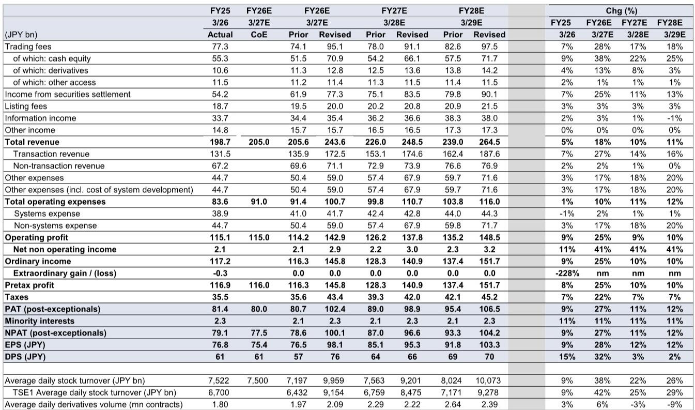
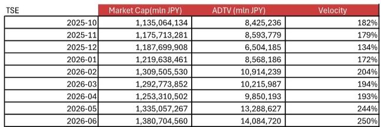
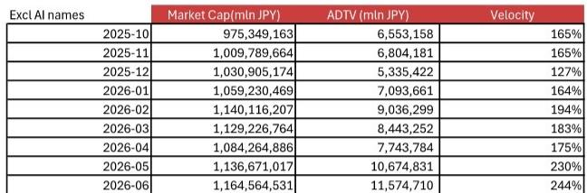

# GS：非AI公司换手率从175%涨至244%，GS称日本治理改革见效

日本市场的日均交易额在过去三个月同比增长超过100%，但背后驱动力可能比市场想象的更可持续。GS在7月发布的一份关于日本交易所集团(JPX)的研究报告中，做出了一个关键判断：即使剔除AI相关公司，交易活跃度的提升依然显著，且非AI公司的换手率也在大幅上升。这意味着，推动市场交易量激增的因素，除了技术主题的投机，还有更深层的结构性变化。

这份报告的结论挑战了一个普遍的怀疑：即日本市场近期的活跃完全由AI相关公司驱动，一旦主题降温，交易量就会迅速调整。GS的分析师通过拆解数据，给出了不同的叙事。

## 1. 非AI交易量的强劲增长揭示了治理改革的真实影响

报告中最引人注目的数据并非AI板块的贡献，而是剔除AI公司后的市场表现。根据研究报告中的计算，在4月至6月期间，剔除AI相关公司后的日均交易额同比增幅达到49%至137%。更关键的是，非AI公司的月均换手率（交易额除以市值）也显著提升，从4月的175%上升到6月的244%。这个数字在去年同期可能只有100%出头。

这意味着资金正在更广泛地参与日本市场，而非仅仅追逐少数热门标的。GS将这种扩大的交易活动归因于外国读者和散户读者的参与增加，而背后的催化剂很可能是市场对公司治理改革的期待。这与单纯的“AI概念炒作”有本质区别——前者是制度性红利带来的流动性改善，后者是主题性投机。对于关注日本市场的读者而言，区分这两者至关重要。

> **KC评论：** GS实际上在说，日本市场的“质量”变了。如果仅仅是AI股在涨，那是一个窄市场，不确定性高度集中。但治理改革驱动的交易量扩大，意味着市场深度在增加，这为更广泛的资金流入创造了条件。这份报告最值得细看的地方，是它如何计算“剔除AI公司后的换手率”这一指标，这决定了其结论的可靠性。

## 2. GS大幅上调盈利预期，但费用增长是值得关注的另一面

基于上述交易量的判断，GS对JPX的盈利预期进行了大幅上调。他们将对FY3/27（2026财年）的日均交易额预测上调了38%，并将FY3/27至FY3/29的每股盈利预测分别上调了28%、12%和12%。

但上调并非无代价。报告同时指出，随着交易系统“arrowhead”的容量升级以及整体IT系统研究的增加，运营费用也在同步上升。GS将FY3/27至FY3/29的运营费用预测分别上调了10%、11%和12%。这导致了一个有趣的现象：尽管收入预期大幅增长，但FY3/28的盈利增长预期反而出现小幅下滑（同比-2.9%），因为费用增长的节奏与交易量增长的节奏并不完全同步。

对于JPX这样的平台型公司，读者往往只关注交易量的“量价齐升”，而忽略了为维持高交易量所需的基础设施投入。这份报告提醒，费用端的扩张是评估其盈利可持续性的一个重要变量。

## 3. 报告尚未完全回答：这种交易活跃度能持续多久

尽管GS给出了乐观的预测，但其模型也揭示了一个核心的不确定性：当前的历史级换手率能否持续？GS在调整盈利预测时，使用了“过去12个月平均调整后的换手率”来剔除AI相关公司的波动性。这意味着，其预测的基准是当前的高位水平，而非一个回归到长期均值的假设。

报告并未深入讨论，如果企业治理改革的红利被一次性消化，或者全球宏观环境发生变化导致外资流入节奏变化，日本市场的换手率是否会回落。对于读者来说，这是一个需要自行判断的关键不确定性。基于的是25.19倍的五年平均远期市盈率。如果市场活跃度在2027财年之后出现周期性回落，当前的估值溢价是否合理，将是决定长期回报的核心问题。

> **KC评论：** 这份报告最有价值的部分，而是它提供了一个观察框架：如何区分日本市场交易活跃度的“主题性”部分和“结构性”部分。读者在阅读完整报告时，可以重点关注它对“非AI换手率”的月度拆解图，以及其对费用增长驱动因素的详细说明。这些细节比最终的盈利数字更能帮助判断这个逻辑是否成立。

For informational purposes only. Portions may be generated,translated,summarized,or edited with AI assistance based on source materials and may contain omissions or errors. Please verify independently. This is not investment,legal,tax,accounting,or other professional advice.

For informational purposes only. Portions may be generated,translated,summarized,or edited with AI assistance based on source materials and may contain omissions or errors. Please verify independently. This is not investment,legal,tax,accounting,or other professional advice.

