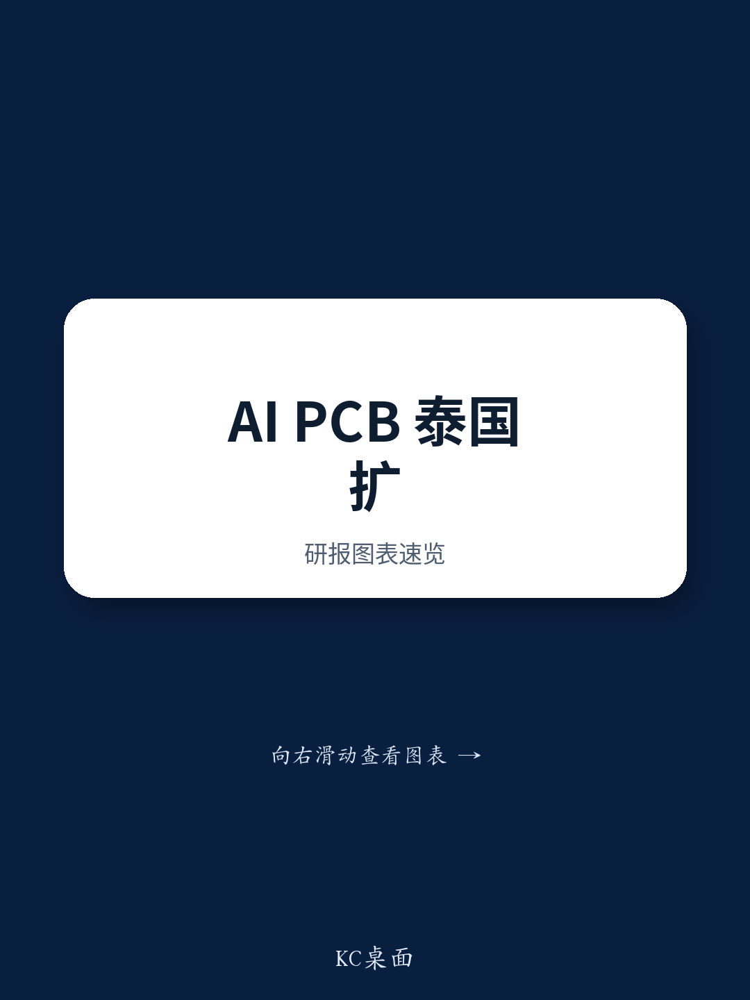

# Thailand's AI PCB Expansion Signals a Structural Shift, Not Just a Cyclical Upturn

The most revealing signal from Delton Technology’s Thailand factory tour is not the 85-95% net income growth forecast for the first half of 2026. That number, while striking, is a rearview mirror—reflecting utilization rate improvements already underway. The real strategic insight lies in where that growth is coming from: AI PCB production for overseas clients, at higher ASPs and margins than conventional PCB products, backed by an incremental USD 80 million investment in Thai capacity announced in April 2026. This is not a company simply riding a demand wave. It is a company restructuring its production geography and product mix simultaneously to capture a permanently higher value tier in the global PCB supply chain.

What Delton is doing in Thailand—building high-end AI PCB capacity for non-Chinese customers—represents a template that the entire China PCB ecosystem is now being forced to evaluate. The question is no longer whether AI will drive PCB demand. It will. The question is who captures that demand, where they manufacture, and at what margin structure. Delton’s Thailand strategy provides an early, concrete answer. For those tracking the China PCB and CCL supply chain, this factory visit offers something more valuable than a single company update: it provides a decision framework for distinguishing winners from laggards in an industry undergoing its most significant structural transformation in a decade.

## The Thailand Plant Is Not Just a Capacity Addition; It Is a Margin Transformation Engine

Delton’s Thailand factory is not a replica of its China operations. Management explicitly stated that this plant primarily serves overseas clients’ computing power-related high-end PCB demand, which carries higher ASP and profitability than conventional PCB products. This is a deliberate strategic choice, not a geographic arbitrage play. The plant is positioned to capture a specific demand segment—AI PCB for non-Chinese hyperscalers and enterprise customers—that is growing faster than the broader PCB market and commands structurally superior pricing.

The utilization rate improvement at the Thailand plant is the proximate cause of Delton’s 1H26 earnings surge. But the deeper story is that this utilization improvement is being driven by demand that is less price-sensitive and more specification-driven. AI server PCBs require higher layer counts, tighter tolerances, and more advanced materials than mainstream PCBs. Suppliers who can meet these specifications earn a margin premium that is not easily eroded by competition. Delton’s Thailand plant is proving that thesis in real time.

The USD 80 million investment announced in April 2026 is the follow-through. It signals management’s conviction that the current demand trajectory is sustainable and that further capacity expansion will be met by continued order flow from overseas clients. The investment is not defensive—it is offensive, aimed at enhancing global market competitiveness. For observers, the key metric to watch is not just revenue growth but the margin trajectory at the Thailand plant relative to Delton’s China operations. If the Thailand plant’s margins continue to diverge upward, it confirms that the AI PCB premium is real and durable.

## AI PCB Demand Is Driving a Specification Upgrade That Rewrites the Competitive Landscape

Delton’s positive outlook on AI PCB is not an isolated view. It echoes a broader thesis that applies across the China PCB and CCL supply chain. The report identifies four structural drivers: specification upgrades in AI servers and high-speed switches, rising dollar content per server for PCB and CCL, growing global demand for AI PCB, and the persistent ASP and margin advantage of AI PCB over mainstream products.

Each of these drivers has second-order implications that are worth unpacking. Specification upgrades mean that PCB manufacturers must invest in advanced manufacturing capabilities—higher-layer-count boards, HDI technology, and materials capable of handling higher signal integrity requirements. This raises the barrier to entry. Not every PCB manufacturer can make the transition. The winners will be those with the technical capability, the capital to invest, and the customer relationships to secure qualification.

Rising dollar content per server is a volume-independent growth driver. Even if server unit growth moderates, the value of PCB content per server continues to climb as board complexity increases. This creates a compounding effect: manufacturers who win AI PCB business benefit from both volume growth and value-per-unit growth. The combination is powerful and self-reinforcing.

The global demand growth for AI PCB is not evenly distributed. Demand from Chinese hyperscalers may follow a different trajectory than demand from non-Chinese customers, due to geopolitical considerations and supply chain diversification strategies. This is where Delton’s Thailand plant becomes strategically important. It positions the company to serve demand that might otherwise be inaccessible to China-based production. For other China PCB suppliers, the question is whether they can replicate this model or whether they will be confined to the domestic market.

## The Supply Chain Diversification Imperative Creates a New Strategic Calculus for China PCB Suppliers

The report’s coverage of Delton’s Thailand operations takes place within the context of a Thailand/Vietnam Technology Tour. That framing is not incidental. The tour’s theme—exploring the trend of diversified production—reflects a structural shift that is reshaping the global PCB industry. Customers, particularly large US and European technology companies, are increasingly demanding production outside of China. This is driven by a combination of tariff risk, geopolitical uncertainty, and supply chain resilience considerations.

For China-based PCB suppliers, this creates a strategic dilemma. Staying purely domestic risks losing access to the fastest-growing segment of the market—AI PCB for non-Chinese customers. Moving production overseas requires significant capital investment, operational complexity, and the challenge of building new customer relationships from a new base. Delton’s early mover advantage in Thailand is evident. But the question for the broader industry is whether this is a first-mover advantage that will persist or a trend that will be rapidly replicated by competitors.

The report’s observations on Victory Giant, WUS, Shengyi Tech, and Shennan Circuits suggest that the investment bank sees multiple winners in this transition. But the competitive dynamics will not be uniform. Suppliers with existing overseas production capacity, strong technical capabilities in high-end PCB, and established relationships with non-Chinese hyperscalers are better positioned. Suppliers focused on mainstream PCB production for the domestic market face a more uncertain outlook.

## What the Report Does Not Fully Answer: The Sustainability of the Margin Premium and the Pace of Capacity Ramp

For all the insight the report provides, several critical questions remain unanswered. The first concerns the sustainability of the AI PCB margin premium. As more PCB capacity comes online globally—not just from Chinese suppliers but also from Taiwanese, Japanese, and Korean competitors—will the premium persist? Delton’s current margins benefit from a supply-demand imbalance. That imbalance may narrow as capacity expands. The report does not provide a detailed supply-demand model for AI PCB capacity, leaving observers to assess the risk of margin compression over a 12-24 month horizon.

The second unanswered question is the pace of Delton’s Thailand capacity ramp. The USD 80 million investment is significant, but the timeline for bringing that capacity online, the qualification process with customers, and the expected utilization trajectory are not detailed. Observers need to assess whether the earnings growth trajectory implied by the 1H26 guidance is sustainable or whether it reflects a one-time utilization catch-up effect.

The third question is competitive response. Delton’s success in Thailand will not go unnoticed by other China PCB suppliers. How quickly can competitors replicate Delton’s Thailand model? The report does not address the competitive dynamics within the China PCB industry or the potential for capacity overbuild in Thailand specifically. These are meaningful open questions that would require deeper analysis of the competitive landscape and capital expenditure plans of other suppliers.

## A Decision Framework for Those Tracking the AI PCB Theme

For those looking to translate this report into actionable analysis, a structured decision framework is essential. The following questions can help differentiate between PCB suppliers that are positioned to benefit from the AI PCB shift and those that may be left behind.

First, assess production geography. Does the supplier have or is it building overseas production capacity capable of serving non-Chinese customers? Suppliers with existing or near-term overseas capacity are better positioned to capture AI PCB demand from global hyperscalers. Suppliers without such capacity face a structural growth ceiling.

Second, evaluate product mix. What percentage of the supplier’s revenue comes from high-end PCB products—defined as boards with 16+ layers, HDI, or advanced materials? Suppliers with a high exposure to mainstream PCB products face margin pressure and lower growth potential. The AI PCB premium is real, but only for those who can actually produce AI-grade boards.

Third, examine customer concentration. Does the supplier have existing relationships with major AI server customers, both Chinese and non-Chinese? Qualification cycles for AI PCB are long and rigorous. Suppliers who are already qualified with key customers have a meaningful competitive moat. New entrants face a multi-quarter uphill battle.

Fourth, analyze capital expenditure plans. Is the supplier investing in capacity expansion specifically for high-end PCB, or is capacity investment broad-based? The quality of capital expenditure matters as much as the quantity. Investment in advanced manufacturing capabilities signals strategic intent. Investment in conventional capacity may indicate a defensive posture.

Fifth, monitor margin trends. Are gross margins expanding or contracting? For suppliers successfully transitioning to AI PCB, margins should be expanding as the product mix shifts toward higher-value boards. Margin compression, particularly in the context of revenue growth, may indicate pricing pressure or an inability to capture the AI PCB premium.

## Join the Community to Read the Full Report and Review the Original Charts

The Delton Thailand factory tour offers a rare window into the operational realities of the AI PCB supply chain transformation. But one factory visit, one company, and one quarter of earnings guidance cannot tell the full story. The broader implications for the China PCB and CCL ecosystem—the competitive dynamics, the capacity investment decisions, the customer qualification cycles—require ongoing analysis that goes beyond what any single report can provide.

For those who want to track these developments as they unfold, to see the original charts and data from the factory tour, and to engage with a community of professionals analyzing the AI hardware supply chain, the full report is available to members. Join the community to read the full report and review the original charts.

*For informational purposes only. Portions may be generated, translated, summarized, or edited with AI assistance based on source materials and may contain omissions or errors. Please verify independently. This is not professional advice.*

For informational purposes only. Portions may be generated, translated, summarized, or edited with AI assistance based on source materials and may contain omissions or errors. Please verify independently. This is not professional advice.

