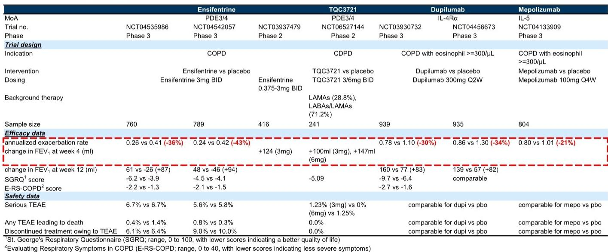
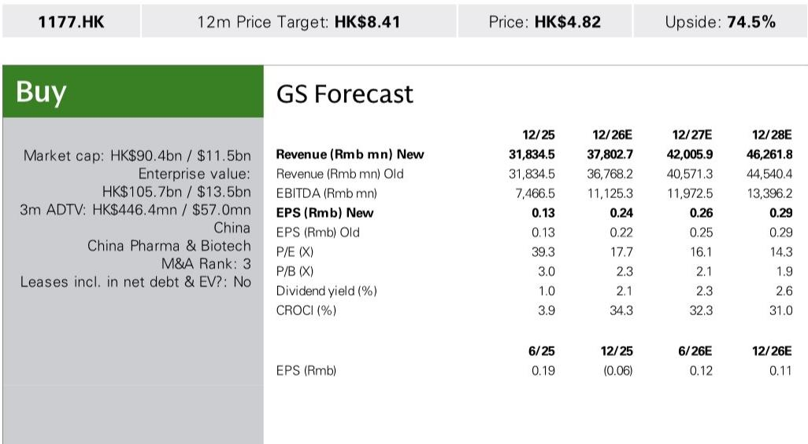
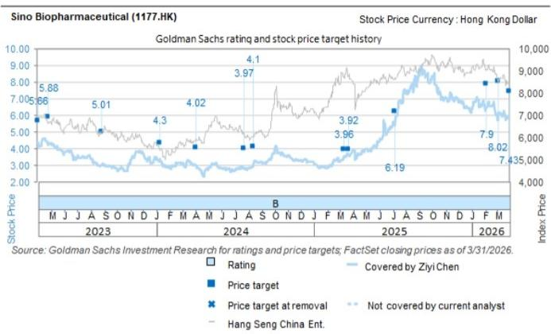

# GS：从PDE34抑制剂到干粉剂型，中国生物制药差异化竞争起步

中国生物制药（1177.HK）在2026年接连完成两笔与跨国药企的重磅交易，其呼吸领域管线正在从“内部研发”走向“全球授权”的新阶段。GS最新报告认为，这不仅是短期的收入催化，更标志着公司研发平台开始产出具有全球竞争力的资产。

这份报告的核心判断是：中国生物制药的呼吸管线已经形成“自有研发+外部引进”的双轮驱动模式。2026年与阿斯利康达成的PDE3/4抑制剂TQC3721对外授权交易，以及同步引入GSK的两款COPD产品，共同构建了一个从急性发作到维持治疗的完整产品矩阵。GS据此调整了公司2026-2028年盈利预期。

> **KC评论：** 过去市场对中国生物制药的认知更多集中在仿制药集采不确定性和创新药管线不确定性上。这份报告提供了一个新的观察角度——当一家公司的研发平台能连续产出被MNC认可的交易标的时，其估值逻辑可能从“仿制药企业”向“创新药平台”切换。

## 1. TQC3721的BD交易验证了平台价值，但差异化竞争才刚刚开始

TQC3721是第二款获得MNC合作的中国原研PDE3/4抑制剂，此前恒瑞医药已将同类产品授权给GSK。GS认为，这笔交易的价值不仅在于2亿美元首付款和最高17亿美元的里程碑付款，更在于它证明了中国生物制药内部研发体系具备持续输出全球竞争力资产的能力。

从临床数据看，TQC3721在二期试验中展现出与先发产品ensifentrine相当的疗效——3mg组和6mg组的FEV1改善分别为+100mL和+147mL。但真正的差异化在于剂型：TQC3721同时推进雾化和干粉吸入剂两种剂型，而ensifentrine目前仅有雾化剂型。如果干粉吸入剂在二期数据中表现良好，将显著提升患者依从性和市场渗透空间。

不过，竞争格局正在快速演变。阿斯利康的IL-33单抗tozorakimab已在三期试验中展现出覆盖广泛COPD人群的能力，可能削弱PDE3/4抑制剂在非嗜酸性粒细胞亚群中的差异化优势。更长期看，Keymed的TSLP/IL13双抗CM512正在探索3-6个月的给药间隔，有望进一步改变治疗范式。

## 2. 引入GSK成熟产品是短期业绩的确定性来源，但真正考验的是商业平台协同效应

中国生物制药从GSK引入了Trelegy和Anoro两款COPD产品，授权期5.5年。这两款产品2025年全球合计销售额接近50亿美元，但在中国市场的合计销售额尚不足10亿元人民币。GS预计，凭借公司2000多人的呼吸专线销售团队和覆盖9000多家医院的网络，这两款产品2026-2028年在中国可分别实现12亿、14亿和17亿元人民币的合计销售额。

这组数据背后有一个值得关注的逻辑：中国生物制药的呼吸商业平台正在从“卖自己的药”升级为“卖全球最好的药”。当一家公司拥有成熟的商业化基础设施时，引入外部成熟产品可以快速产生现金流，同时为自研管线的未来商业化积累经验和渠道资源。

> **KC评论：** 这笔交易的实质是“用渠道换时间”。中国生物制药用GSK的成熟产品填补了短期业绩缺口，同时为TQC3721等自研管线争取了临床和审批窗口。读者可以关注公司后续是否会在呼吸领域延续这种“引进+自研”的策略。

## 3. 报告未完全回答的关键问题：资源分配与研发转化效率

GS在观察提示中提到了一个核心隐忧：中国生物制药的子公司架构可能导致研发资源分配效率低下。公司旗下拥有多个子公司，各自独立运营研发项目，集团层面的资源统筹和优先级排序一直是个挑战。

从财务数据看，公司2025年研发费用占收入比重约为15%，在行业处于中等水平。但过去几年，公司多个创新药项目的临床进展和市场表现低于预期，这反映出从研发投入到商业化产出的转化效率仍有提升空间。

报告没有深入分析的是：公司是否有机制确保TQC3721等明星项目获得足够的资源倾斜？当子公司之间争夺研发预算时，集团如何做出取舍？这些问题的答案将直接影响公司长期价值的释放节奏。

## 4. 对读者的观察框架：从三个维度跟踪中国生物制药的估值切换

第一，关注BD交易的持续性。公司能否在未来12-18个月内再完成一笔类似规模的对外授权交易，这将是验证研发平台可持续性的关键信号。

第二，关注TQC3721干粉吸入剂的二期数据。如果疗效和安全性数据与现有产品相当或更优，将显著提升该资产的全球价值。

第三，关注呼吸业务商业平台的运营效率。Trelegy和Anoro的中国市场导入速度，以及公司能否将这一平台能力复制到其他治疗领域，是判断公司“平台化”战略能否成功的重要指标。

For informational purposes only. Portions may be generated,translated,summarized,or edited with AI assistance based on source materials and may contain omissions or errors. Please verify independently. This is not investment,legal,tax,accounting,or other professional advice.

For informational purposes only. Portions may be generated,translated,summarized,or edited with AI assistance based on source materials and may contain omissions or errors. Please verify independently. This is not investment,legal,tax,accounting,or other professional advice.

