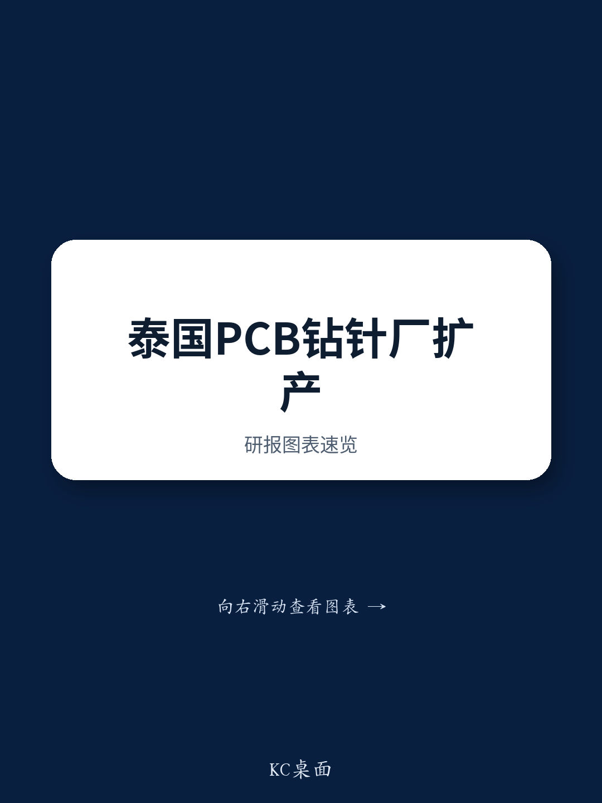

# GS：PCB钻针产能弹性较高背后，AI服务器才是真正的需求引擎

这份GS泰国科技之旅的调研笔记，表面看是围绕一家PCB钻针供应商的产能扩张，但真正值得关注的信号，是AI PCB需求正在从“预期”走向“可追踪的订单和扩产节奏”。DTech的泰国工厂月产能已达600万支，管理层对下半年出货增长保持乐观，并计划追加不超过3亿元增资泰国子公司。这些动作说明，AI带来的PCB规格升级和单机价值量提升，正在沿着产业链向上游工具厂商传导。

报告最核心的判断是：AI服务器和高频交换机对PCB的规格要求，正在推动PCB和覆铜板（CCL）的单价和利润率结构性上升。GS分析师明确看好这一趋势下的中国AI PCB和CCL供应商，并给出了积极的评级。对于关注电子产业链的读者，这份报告提供了一个难得的“从钻针看整机”的观察窗口。

## 1. 扩产节奏与客户海外产能同步，验证需求真实落地

DTech在泰国的产能扩张并非盲目。管理层明确表示，扩产节奏与主要客户的海外工厂实际生产计划以及泰国本地市场需求对齐。2026年4月，其泰国工厂月产能达到600万支，下半年还将继续爬坡。这种“跟着客户走”的产能布局，意味着下游需求并非库存回补或短期备货，而是由终端AI服务器和数据中心建设拉动的真实增量。

> **KC评论：** 对于读者而言，关键不在于DTech本身能否被覆盖，而在于其扩产节奏可以作为AI PCB产业链景气度的“先行指标”。如果钻针订单持续增长，意味着PCB厂商的产线利用率在提升，进而带动CCL和上游材料的需求。这份报告里提到的四家中国公司——胜宏科技、东山精密、生益科技、深南电路，正是这一逻辑的受益方。

## 2. AI PCB的“价量齐升”逻辑正在被产业链数据印证

报告没有停留在定性判断，而是给出了四个可验证的预期：AI服务器和高速交换机推动PCB规格升级；单台AI服务器的PCB和CCL价值量增加；全球AI PCB需求持续上升；AI PCB的单价和利润率显著高于主流PCB。这些判断并非空谈，DTech的扩产就是最直接的证据——如果AI PCB只是概念，上游工具厂商不会如此坚定地投入真金白银。

GS的分析师还注意到，DTech的客户覆盖了数据中心、汽车和消费电子三大领域，但管理层对“AI PCB”的正面表态尤为突出。这说明AI已经成为PCB行业增长的最核心驱动力，而汽车和消费电子更多是基本盘贡献。

## 3. 报告尚未完全回答的关键问题：产能消化速度与竞争格局变化

尽管DTech的扩产信号积极，但报告没有详细讨论两个关键不确定性。第一，扩产节奏是否可能快于需求释放？如果主要客户的海外工厂投产进度不及预期，600万支的月产能能否被充分消化？第二，PCB钻针市场的竞争格局是否正在变化？中国本土和东南亚其他地区的竞争对手是否也在同步扩产？这些问题需要读者在阅读完整报告时重点关注。

> **KC评论：** GS在这份报告中对四家中国公司的评级均为“观点偏积极”，但读者需要意识到，这更多是基于AI PCB长期结构性增长的判断，而非短期交易信号。完整的研报里包含这些公司的财务预测、估值水平和不确定性因素，是理解“观点偏积极”背后假设的必要信息。

## 4. 一个实用的观察框架：用上游工具订单追踪AI落地节奏

对于无法直接跟踪PCB厂商出货量的读者，DTech的案例提供了一个更早的观察窗口。钻针是PCB生产中的消耗品，其订单量变化往往比PCB出货量领先1-2个季度。如果后续有更多钻针或相关工具厂商的季度数据发布，可以将其与AI服务器出货量、数据中心资本开支进行交叉验证。这种“从工具看终端”的方法，比单纯跟踪整机厂商的财务数据更具前瞻性。

当然，这个框架的局限性也很明显——单一公司的数据可能受客户集中度、产品结构变化等因素干扰。更可靠的做法是跟踪多家工具厂商的产能和订单趋势，形成行业层面的判断。

For informational purposes only. Portions may be generated,translated,summarized,or edited with AI assistance based on source materials and may contain omissions or errors. Please verify independently. This is not investment,legal,tax,accounting,or other professional advice.

For informational purposes only. Portions may be generated,translated,summarized,or edited with AI assistance based on source materials and may contain omissions or errors. Please verify independently. This is not investment,legal,tax,accounting,or other professional advice.

