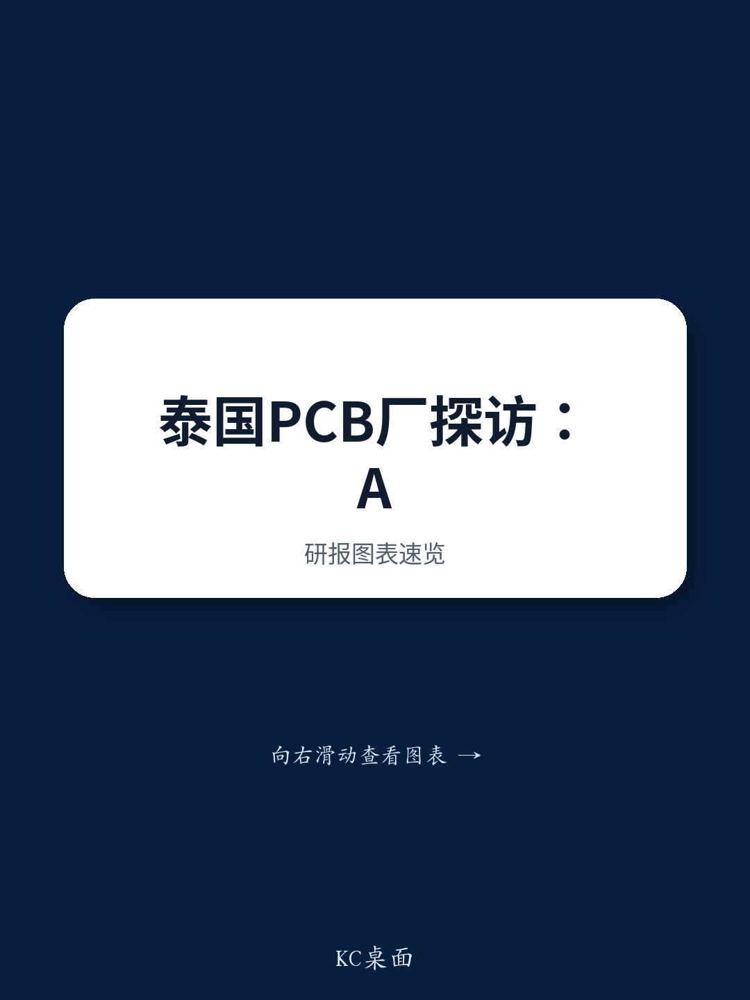

# GS：从消费电子到AI服务器，PCB厂商的利润修复路径在哪里

当多数市场参与者还在关注消费电子和汽车电子的周期性波动时，一份来自GS的泰国科技产业调研报告，揭示了一个更清晰的信号：中国PCB行业正借助AI需求的结构性增长，完成一次真正的产能升级和利润修复。这份报告基于对Dynamic Electronics（沪电股份，603175.SS）董事长及泰国工厂的实地走访，给出了一个值得产业链决策者仔细推敲的判断。

调研的核心发现是，该公司33亿元人民币的泰国研究计划，并非简单的产能复制，而是明确指向AI服务器和光模块的高端PCB产品。这意味着，过去几年困扰行业的“资本开支高、利润被折旧吞噬”的困境，正在被产品组合升级和规模效应所对冲。GS分析团队认为，全球AI PCB的市场规模到2027年有望达到183亿美元，2025-2027年间的复合年增长率高达140%。

> **KC评论：** 这个增速判断值得反复推敲。它不是预测一个成熟市场的线性增长，而是测算一个由技术迭代驱动的新市场从萌芽到爆发的陡峭曲线。对于任何身处电子产业链的决策者而言，这个数字背后是“不做AI PCB就失去未来五年最大增量”的战略抉择。

## 1. 泰国工厂的真正赌注不是低成本，而是避开单一供应链的不确定性敞口

报告明确指出，Dynamic Electronics在泰国的P5和P5A新工厂，主要用于AI服务器和汽车电子产品的生产。这并非简单的成本套利——泰国的原材料成本并不比中国低，新产能的爬坡初期还会拉低整体利润率。真正的战略意图在于：为全球头部客户提供一个“中国+1”的多元化生产选项，从而锁定那些对供应链韧性要求极高的AI订单。

对于读者而言，这一布局的价值不在于短期财务回报，而在于它构建了进入高端客户供应链的“入场券”。那些只在中国大陆拥有产能的PCB厂商，在争取某些国际云服务商的AI服务器订单时，可能会面临天然的壁垒。

## 2. 利润修复的路径：从“被折旧影响”到“被产品组合托举”

报告提到，Dynamic Electronics在1Q26的收入同比增长28%，但利润率因折旧成本上升而承压。这是一个典型的成长阵痛。然而，管理层预期随着规模扩大、产品组合向AI方向升级以及生产效率提升，盈利能力将逐步改善。这个逻辑链条在PCB行业具有普适性。

AI服务器所需的PCB，其层数、材料等级、加工精度要求远高于传统服务器或消费电子，单价往往是后者的数倍甚至数十倍。因此，即使总产能利用率暂时不高，只要高价值产品占比提升，就能有效对冲折旧不确定性。这解释了为什么许多PCB厂商宁愿承受短期利润下滑，也要加速AI产能的资本开支。

## 3. 报告尚未完全回答的关键问题：产能释放的节奏与需求的匹配度

尽管前景乐观，但报告也隐含着几个并未完全展开的不确定性。第一，33亿元的研究规模在行业内属于中高水平，产能从建设到满产通常需要18-24个月。如果AI服务器的需求增速在未来某个时间点出现阶段性节奏变化，这些新产能的折旧不确定性将重新成为利润的影响。第二，泰国当地的熟练技术工人供给、上游材料配套（如高端覆铜板）是否能够同步跟上，是决定良率和交付周期的重要因素。第三，地缘政治和政策环境的变化，可能影响“中国+1”战略的实际回报率。

> **KC评论：** 对于读者来说，这份报告最有价值的部分不是结论，而是它提供了一个观察框架：跟踪一家PCB公司，不能只看它投了多少钱、建了多少产能，更要看它的新产能中，有多少平方米是用于AI产品的，以及这些AI产品的单价是否在持续提升。这才是衡量研究效率的真实标尺。

---

For informational purposes only. Portions may be generated,translated,summarized,or edited with AI assistance based on source materials and may contain omissions or errors. Please verify independently. This is not investment,legal,tax,accounting,or other professional advice.

For informational purposes only. Portions may be generated,translated,summarized,or edited with AI assistance based on source materials and may contain omissions or errors. Please verify independently. This is not investment,legal,tax,accounting,or other professional advice.

