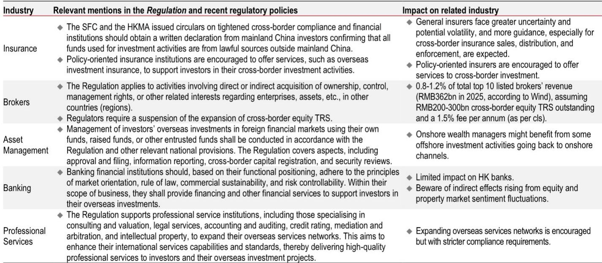
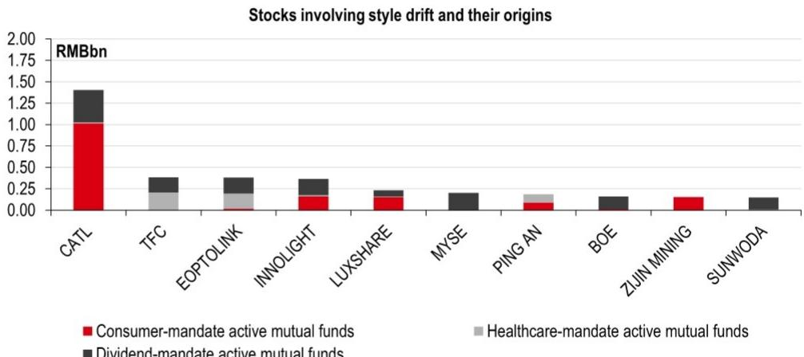
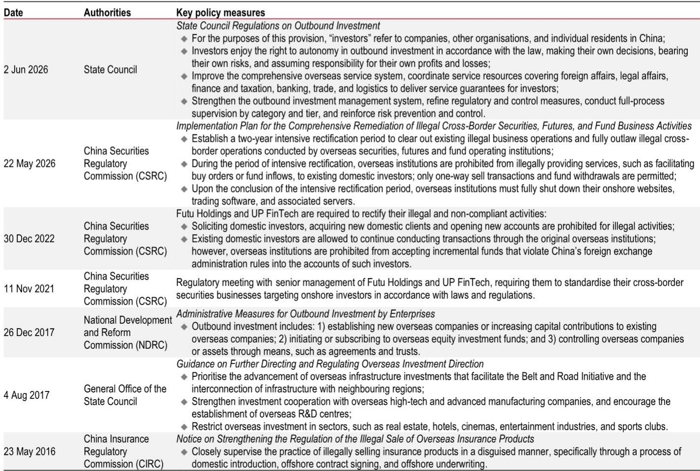

# HSBC：公募风格漂移规模仅116亿，监管纠偏不会引发系统性不确定性

**主判断：** HSBC最新报告指出，中国新一轮资本外流管控并非简单收紧，而是精准引导资金从灰色渠道转向合规通道，对相关市场构成结构性利好，尤其利好创业板和科创板。这与市场普遍预期的“全面打压”有本质区别。

这份2026年6月发布的研报，将2026年的新规定义为自2016年以来的第三轮资本外流限制周期。但与2016-2017年针对房地产和保险产品、2021-2022年针对互联网机构的直接堵截不同，本轮政策的底层逻辑是“疏堵结合”：一边清理非法跨境标的业务，一边扩大QDII额度、鼓励南向通。

报告的核心判断是，资金不会凭空消失，只会改道。从灰色渠道回流的资金，将优先进入合规的相关市场，尤其是代表“出海”和“科技自立”的成长板块。

> **KC评论：** HSBC这个判断的关键在于“通道切换”而非“总量缩减”。如果只看限制条款，容易误读为资本外流全面收紧。但报告同时点出，QDII额度在增加，南向通资金在持续流入。政策意图是让钱走正门，而不是不让钱出去。完整报告里Exhibit 4关于QDII额度与产品净值同步上升的图表，是理解这一逻辑的关键证据。

## 1. 对机构的冲击被高估，真正的赢家是境内财富管理机构

HSBC对各类机构的影响做了分层拆解。银行受影响最小，保险面临更严格的跨境销售合规要求，而机构因跨境股权总收益互换(TRS)暂停，收入影响预计在0.8%-1.2%之间，对头部上市机构而言约在29亿至43亿元人民币量级。

但报告真正想说的是，冲击的表象之下，格局在重塑。**境内财富管理机构将是本轮监管趋严的净受益者**。当离岸研究活动被迫回流，那些拥有合规境内渠道的机构将获得增量资金。这与2018年资管新规后，资金从表外回流表内、头部机构集中度提升的逻辑如出一辙。

## 2. 相关市场与相关市场的分化，本质是资金通道的切换

报告用一组数据揭示了一个关键信号：今年以来，相关市场科技指数（创业板指、科创50）与离岸科技指数（恒生科技、纳斯达克中国金龙指数）的走势出现显著背离。截至7月3日，创业板指2026年预期盈利上调5.7%，而恒生科技下调14.0%。

HSBC认为，这并非基本面差异的简单反映，而是资金通道切换的直接结果。**境内机构和个人研究海外市场的难度增加，迫使他们将目光转向相关市场。** 创业板指和科创50分别代表了“出海机会”和“技术自主”两个核心叙事，恰好承接了这部分回流资金。而H股短期承压后，随着资金通过南向通道重新流入，影响将趋于中性。

> **KC评论：** 这里有一个容易被忽略的细节。报告强调H股的影响“短期谨慎、中期中性”，前提是南向通持续通畅。如果读者想检验这个判断，建议关注报告Exhibit 2中南向资金在历次限制周期中的流入趋势图。它展示了一个规律：每次限制后，南向资金不仅没有减少，反而加速流入。

## 3. 公募产品风格漂移的规模远小于市场担忧

市场此前普遍担心，监管纠正公募产品“风格漂移”（如医药主题产品重仓AI）会引发大规模抛售。HSBC的量化分析给出了一个反直觉的结论：**涉及风格漂移的主动管理产品规模仅116亿元人民币，占主动管理产品总AUM的0.3%。**

这116亿中，消费、医药、红利三类主题产品各占一部分。HSBC进一步拆解发现，真正因风格漂移而观点偏积极AI标的的资金量更小，且主要集中在宁德时代、东方财富和中际旭创等少数公司上。这意味着，监管纠偏不会引发系统性不确定性，反而可能加速AI行情的扩散——当极端集中的持仓被纠正，资金将流向基本面改善的工业、材料、消费以及高股息板块。

## 4. 报告尚未完全回答的关键问题：合规通道的承载力

HSBC的逻辑链条是清晰的，但有一个关键变量没有充分展开：**合规通道（QDII、南向通）的容量能否承接所有回流资金？**

报告提到监管层有意愿继续分配QDII额度，但并未给出具体数字或时间表。如果灰色渠道的体量远超合规通道的扩容速度，那么资金可能不会如报告预期的那样顺畅流入相关市场，而是部分沉淀为银行存款或进入其他资产。这个“通道瓶颈”问题，是读者在参考报告判断时，需要独立跟踪的变量。

## 5. 留给读者的观察框架：三个信号判断逻辑是否成立

与其被动接受结论，不如建立自己的验证框架。HSBC这份报告提供了三个可追踪的信号

**第一，南向资金是否持续流入。** 这是报告判断H股中性、相关市场受益的前提条件。如果南向资金在政策落地后反而调整，逻辑需要重新审视。

**第二，创业板和科创板的盈利修正趋势。** 报告的核心论据之一是这两个板块盈利在上修，而离岸科技指数在下修。如果这一趋势逆转，资金回流的吸引力将大打折扣。

**第三，AI行情的扩散是否如报告预期。** HSBC认为AI行情将从硬件扩散到工业、材料、消费和高股息。如果扩散迟迟未到，说明市场对资金回流的定价可能已经过度。

> **KC评论：** HSBC这份报告的价值不在于给出一个确定的答案，而在于提供了一个“政策-资金-板块”的三层分析框架。它提醒读者，不要把监管文件读成孤立事件，而要放在资本流动的闭环里理解。至于报告里Exhibit 8对三大科技指数的估值、盈利增长和权重分布的详细对比，是判断哪条赛道性价比更高的第一手素材。

For informational purposes only. Portions may be generated,translated,summarized,or edited with AI assistance based on source materials and may contain omissions or errors. Please verify independently. This is not investment,legal,tax,accounting,or other professional advice.

For informational purposes only. Portions may be generated,translated,summarized,or edited with AI assistance based on source materials and may contain omissions or errors. Please verify independently. This is not investment,legal,tax,accounting,or other professional advice.

